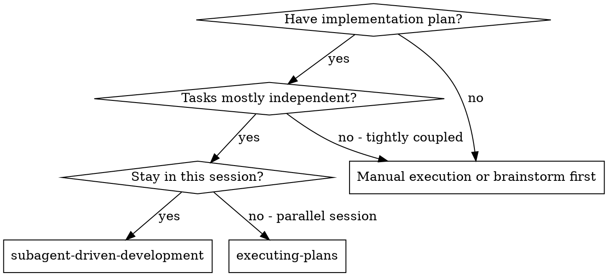
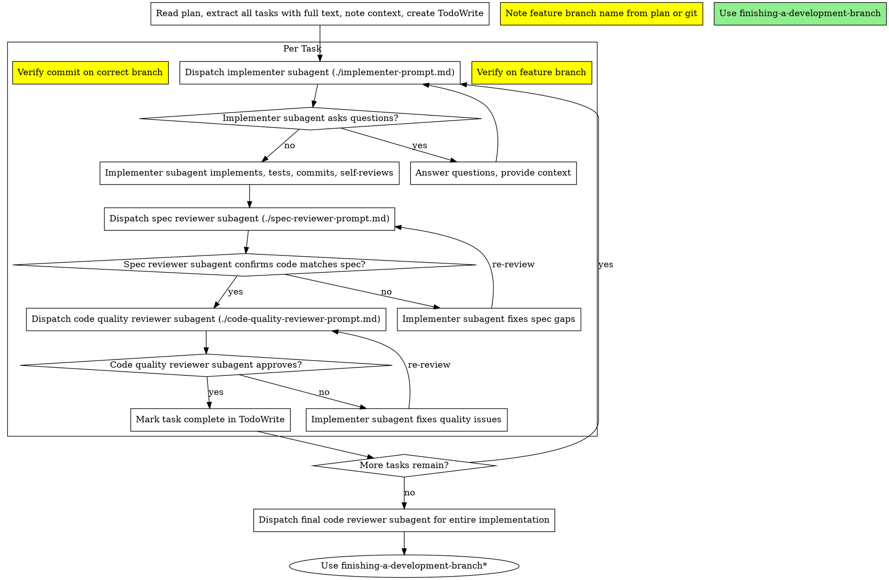

# Subagent-Driven Development

Execute plan by dispatching fresh subagent per task, with two-stage review after each: spec compliance review first, then code quality review.

**Core principle:** Fresh subagent per task + two-stage review (spec then quality) = high quality, fast iteration

**Headless mode:** When called from implement-issue, run fully autonomously. Answer subagent questions based on plan/issue context. Track all decisions for PR comments. Never prompt user.

## When to Use



**vs. Executing Plans (parallel session):**
- Same session (no context switch)
- Fresh subagent per task (no context pollution)
- Two-stage review after each task: spec compliance first, then code quality
- Faster iteration (no human-in-loop between tasks)

## The Process

**CRITICAL: Track the feature branch name.** Subagents have no memory of branch context. You must include the branch name in every implementer dispatch.



**\*finishing-a-development-branch note:** Skip this step if the calling skill has its own PR workflow (e.g., implement-issue handles steps 8-11 itself).

## Prompt Templates

- `./implementer-prompt.md` - Dispatch implementer subagent
- `./spec-reviewer-prompt.md` - Dispatch spec compliance reviewer subagent
- `./code-quality-reviewer-prompt.md` - Dispatch code quality reviewer subagent

## Agent Selection

Route tasks to the appropriate implementer agent based on task type:

| Task Type | Agent | Examples |
|-----------|-------|----------|
| **Backend** | `laravel-backend-developer` | PHP, Laravel controllers, services, models, middleware, API endpoints, database migrations, Eloquent queries, authentication, business logic |
| **Frontend** | `bulletproof-frontend-developer` | CSS, styling, responsive design, accessibility, Blade templates (layout focus), JavaScript, Alpine.js, design tokens, component CSS architecture |
| **Mixed** | Split into subtasks | If a task has both backend and frontend work, split it and dispatch sequentially to appropriate agents |

**Decision criteria:**
- Does the task primarily involve PHP/Laravel code? → `laravel-backend-developer`
- Does the task primarily involve styling, CSS, HTML structure, or JS interactions? → `bulletproof-frontend-developer`
- Does the task touch both? → Split it, backend first (data layer), then frontend (presentation layer)

## Example Workflow

```
You: I'm using Subagent-Driven Development to execute this plan.

[Read plan file once: docs/plans/feature-plan.md]
[Extract all 5 tasks with full text and context]
[Create TodoWrite with all tasks]

Task 1: Hook installation script

[Get Task 1 text and context (already extracted)]
[Dispatch implementation subagent with full task text + context]

Implementer: "Before I begin - should the hook be installed at user or system level?"

You: "Project level (.claude/hooks/)"

Implementer: "Got it. Implementing now..."
[Later] Implementer:
  - Implemented install-hook command
  - Added tests, 5/5 passing
  - Self-review: Found I missed --force flag, added it
  - Committed

[Dispatch spec compliance reviewer]
Spec reviewer: ✅ Spec compliant - all requirements met, nothing extra

[Get git SHAs, dispatch code quality reviewer]
Code reviewer: Strengths: Good test coverage, clean. Issues: None. Approved.

[Mark Task 1 complete]

Task 2: Recovery modes

[Get Task 2 text and context (already extracted)]
[Dispatch implementation subagent with full task text + context]

Implementer: [No questions, proceeds]
Implementer:
  - Added verify/repair modes
  - 8/8 tests passing
  - Self-review: All good
  - Committed

[Dispatch spec compliance reviewer]
Spec reviewer: ❌ Issues:
  - Missing: Progress reporting (spec says "report every 100 items")
  - Extra: Added --json flag (not requested)

[Implementer fixes issues]
Implementer: Removed --json flag, added progress reporting

[Spec reviewer reviews again]
Spec reviewer: ✅ Spec compliant now

[Dispatch code quality reviewer]
Code reviewer: Strengths: Solid. Issues (Important): Magic number (100)

[Implementer fixes]
Implementer: Extracted PROGRESS_INTERVAL constant

[Code reviewer reviews again]
Code reviewer: ✅ Approved

[Mark Task 2 complete]

...

[After all tasks]
[Dispatch final code-reviewer]
Final reviewer: All requirements met, ready to merge

Done!
```

## Advantages

**vs. Manual execution:**
- Subagents follow TDD naturally
- Fresh context per task (no confusion)
- Parallel-safe (subagents don't interfere)
- Subagent can ask questions (before AND during work)

**vs. Executing Plans:**
- Same session (no handoff)
- Continuous progress (no waiting)
- Review checkpoints automatic

**Efficiency gains:**
- No file reading overhead (controller provides full text)
- Controller curates exactly what context is needed
- Subagent gets complete information upfront
- Questions surfaced before work begins (not after)

**Quality gates:**
- Self-review catches issues before handoff
- Two-stage review: spec compliance, then code quality
- Review loops ensure fixes actually work
- Spec compliance prevents over/under-building
- Code quality ensures implementation is well-built

**Cost:**
- More subagent invocations (implementer + 2 reviewers per task)
- Controller does more prep work (extracting all tasks upfront)
- Review loops add iterations
- But catches issues early (cheaper than debugging later)

## Red Flags

**Never:**
- Skip or reorder reviews (spec compliance THEN code quality, both required)
- Proceed with unfixed issues or move to next task while reviews have open issues
- Run implementation subagents in parallel (conflicts)
- Make subagent read plan file (provide full text instead)
- **Forget branch name in prompts** (subagents have no memory - always specify)
- **Skip branch verification after each task** (`git branch --show-current`)

**Subagent questions:** Answer clearly. In headless mode, controller answers autonomously from plan/issue context. Track decision for PR comment.

**Review issues:** Implementer fixes, reviewer re-reviews. Repeat until approved. Never skip re-review.

**Task failure:** Dispatch fix subagent with specific instructions. Never fix manually (context pollution).

## Integration

**Required workflow skills:**
- **writing-plans** - Creates the plan this skill executes
- **requesting-code-review** - Code review template for reviewer subagents
- **finishing-a-development-branch** - Complete development after all tasks

**Subagents should use:**
- **test-driven-development** - Subagents follow TDD for each task

**Alternative workflow:**
- **executing-plans** - Use for parallel session instead of same-session execution

---
> Source: [aaddrick/claude-pipeline](https://github.com/aaddrick/claude-pipeline) — distributed by [TomeVault](https://tomevault.io).
<!-- tomevault:4.0:skill_md:2026-07-20 -->
