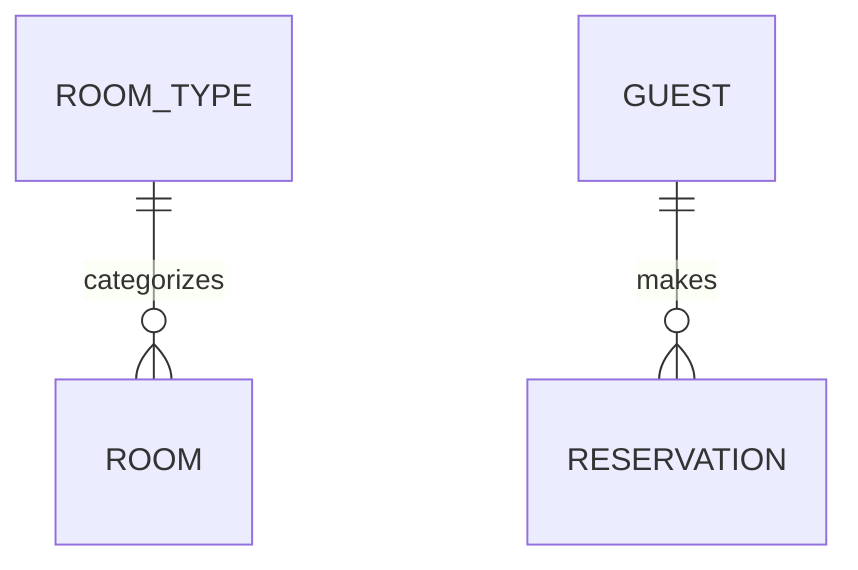

# Entity Model

## Instructions

Create or update the entity model at `docs/entity_model.md` based on `docs/requirements.md`.
The document contains an ER diagram and attribute tables.

## DO NOT

- Add attributes/columns to the Mermaid diagram
- Write prose descriptions like "Key attributes: name, email..."
- Create a "Relationships" table

## Document Structure

```markdown
# Entity Model

## Entity Relationship Diagram



### ENTITY_NAME

One sentence describing the entity.

| Attribute | Description | Data Type | Length/Precision | Validation Rules      |
|-----------|-------------|-----------|------------------|-----------------------|
| id        | ...         | Long      | 19               | Primary Key, Sequence |
| ...       | ...         | ...       | ...              | ...                   |

## Required Format for Each Entity

Every entity MUST have:

1. A ### heading with the entity name in UPPERCASE (UPPER_SNAKE_CASE, e.g. `### ROOM_TYPE` — never `### Room Type` or `## Entity: Room Type`)
2. One sentence description
3. An attribute table with exactly these 5 columns in this order: Attribute, Description, Data Type, Length/Precision, Validation Rules

### Example Entity

### ROOM_TYPE

Defines categories of rooms with shared characteristics.

| Attribute   | Description              | Data Type | Length/Precision | Validation Rules          |
|-------------|--------------------------|-----------|------------------|---------------------------|
| id          | Unique identifier        | Long      | 19               | Primary Key, Sequence     |
| name        | Name of the room type    | String    | 50               | Not Null, Unique          |
| description | Detailed description     | String    | 500              | Optional                  |
| capacity    | Maximum number of guests | Integer   | 10               | Not Null, Min: 1, Max: 10 |
| price       | Price per night in CHF   | Decimal   | 10,2             | Not Null, Min: 0          |

## Mermaid Diagram Rules

- Show entity names and relationships ONLY
- NO attributes inside entity blocks
- Use relationship syntax: `ENTITY_A ||--o{ ENTITY_B : "relationship"`

## Data Types (use only these)

The Data Type column must use exactly these values — never SQL or ORM types such as
VARCHAR, TEXT, CHAR, bigint, numeric, serial, smallint, UUID, Timestamp, or Enum:

| Data Type | Length/Precision | Usage                 |
|-----------|------------------|-----------------------|
| Long      | 19               | IDs, foreign keys     |
| String    | varies (50-500)  | Text fields           |
| Integer   | 10               | Whole numbers         |
| Decimal   | 10,2             | Currency, percentages |
| Boolean   | 1                | True/false flags      |
| Date      | -                | Date only             |
| DateTime  | -                | Date and time         |

The Length/Precision column holds the bare value (e.g. `10,2`) — never a type
expression like `DECIMAL(10,2)`.

## Validation Rules (use only these values)

Compose every Validation Rules cell from this vocabulary, using the exact wording —
never a prose description, and never an empty cell, dash, or "N/A":

| Attribute Type | Validation Rules Value           |
|----------------|----------------------------------|
| Primary key    | Primary Key, Sequence            |
| Required field | Not Null                         |
| Unique field   | Not Null, Unique                 |
| Foreign key    | Not Null, Foreign Key (TABLE.id) |
| Optional field | Optional                         |
| With range     | Not Null, Min: X, Max: Y         |
| With values    | Not Null, Values: A, B, C        |
| Email          | Not Null, Format: Email          |

Examples: an email attribute is `Not Null, Format: Email` — never "must be a valid
email address". A status attribute with a fixed set of states is
`Not Null, Values: Pending, Active, Completed, Cancelled` — never "must be one of
Pending, Active, Completed, Cancelled".

This table is a **closed set**: every Validation Rules cell is exactly one row
from it. Do not combine rows into new patterns (`Not Null, Unique, Format: Email`
is invalid — pick the one rule that matters most, here `Not Null, Format: Email`),
and never write `Min:` without its matching `Max:` (`Not Null, Min: 0` alone is
invalid — use `Not Null, Min: 0, Max: <upper bound>` or just `Not Null`).

The same tables are available in [references/REFERENCE.md](references/REFERENCE.md).

## Multi-Column Constraints

If validation spans multiple columns, add after the table:

**Constraints:** Check-out date must be after check-in date.

## Workflow

1. Read the requirements document
2. Use TodoWrite to create a task for each entity
3. Write the document header and ER diagram (relationships only)
4. For each entity:
    - Write ### heading
    - Write one sentence description
    - Write attribute table with 5 columns
    - Add constraints if needed
    - Mark todo complete
5. Validate the document:
    - Every entity in the ER diagram has a corresponding attribute table section
    - Every attribute table has exactly 5 columns
    - No attributes appear inside the Mermaid diagram entity blocks
    - All foreign keys reference existing entities
    - Every entity heading is `###` with the name in UPPERCASE
    - All Data Type values come from the Data Types table above (no SQL types anywhere)
    - All validation rules use values from the Validation Rules table above

---
> Source: [AI-Unified-Process/marketplace](https://github.com/AI-Unified-Process/marketplace) — distributed by [TomeVault](https://tomevault.io).
<!-- tomevault:4.0:skill_md:2026-07-20 -->
