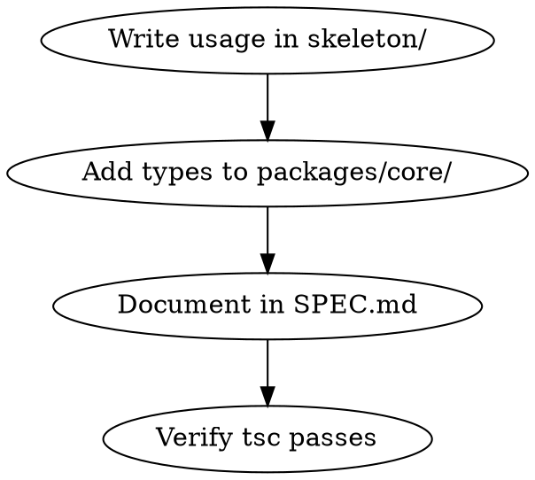

# Designing Kubit APIs

## Overview

Design APIs by starting with ideal usage in skeleton/, then codifying as types in packages/core/, then documenting in SPEC.md.

## When to Use

- Adding new method, decorator, or export to framework
- Modifying existing API signatures
- Defining types in packages/core/*.d.ts
- User asks "how should this API look?"

## API Design Flow

1. **Usage First**: Write the ideal developer experience in skeleton/
2. **Types Second**: Add ambient types to make it compile
3. **Spec Third**: Document with TypeScript signatures
4. **Verify**: Run `tsc --noEmit` in skeleton/

## Design Principles

| Principle | Application |
|-----------|-------------|
| DX First | How does this feel to use? Start from skeleton. |
| Type Safety | Can TypeScript catch mistakes at compile time? |
| Conventions | Follow Laravel/Rails patterns where sensible |
| Minimal API | Smallest surface that solves the problem |
| Extensibility | Can users extend without modifying core? |

## Patterns in Use

**Decorators:** `@column()`, `@before()`, `@property()`, `@use()` - metadata on classes/properties

**Method Chaining:** `router.get('/').name('home')` - fluent API for configuration

**Controller Tuples:** `[Controller, 'method']` - type-safe handler references

**Lazy Relations:** `@hasMany(() => Post)` - arrow function to avoid circular deps

**Static Dispatch:** `Job.dispatch({})`, `Mailable.send({})` - class-level entry points

## Type Definition Location

All public types go in `packages/core/`:

| File | Contents |
|------|----------|
| `kubit.d.ts` | `defineConfig`, `env`, `use` |
| `router.d.ts` | `router` object, handler types |
| `orm.d.ts` | `Model`, column decorators, relations |
| `queue.d.ts` | `Job`, `@property` |
| `mail.d.ts` | `Mailable` |
| `db.d.ts` | `Migration`, `schema` |
| `inertia.d.ts` | `view()` |
| `http.d.ts` | `HttpContext` |
| `hash.d.ts` | `hash()` |

## Checklist Before Adding API

- [ ] Usage example exists in skeleton/
- [ ] Types added to packages/core/
- [ ] `tsc --noEmit` passes in skeleton/
- [ ] SPEC.md updated with TypeScript signature
- [ ] Follows existing patterns (decorators, chaining, etc.)

---
> Converted and distributed by [TomeVault](https://tomevault.io/claim/aniftyco) — claim your Tome and manage your conversions.
<!-- tomevault:4.0:skill_md:2026-04-11 -->
