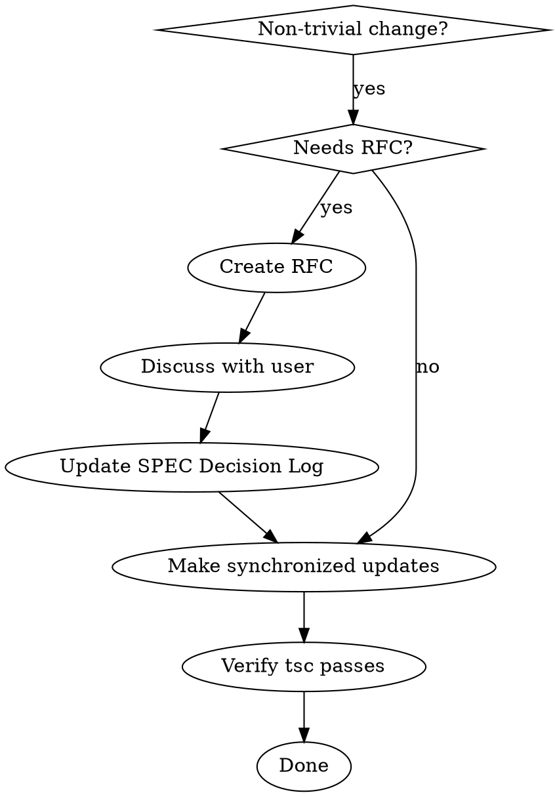

# Proposing Changes to Kubit

## Overview

Non-trivial changes require synchronized updates across types, spec, skeleton, and docs. Major changes need an RFC.

## When to Use

- Modifying public API
- Adding new subsystem or major feature
- Changes affecting multiple files
- Design decisions with trade-offs

## RFC Trigger

Create RFC in `docs/rfcs/` when:
- Adding new subsystem (Auth, Validation, etc.)
- Changing existing API signatures
- Architectural decisions with alternatives
- User explicitly requests design discussion

Skip RFC for:
- Bug fixes in types
- Adding examples to skeleton
- Documentation clarifications
- Internal refactoring

## RFC Template

Create `docs/rfcs/YYYY-MM-DD-slug.md`:

```markdown
# RFC: [Title]

## Summary
One paragraph overview.

## Motivation
Why is this needed? What problem does it solve?

## Public API Changes
TypeScript signatures for new/changed APIs.

## Example Usage
How it looks in skeleton/.

## Implementation Notes
Key considerations for future implementation.

## Alternatives Considered
What else was considered and why rejected.

## Test Plan
How to verify this works (mapped to skeleton/tests/).

## Required Updates
- [ ] packages/core/*.d.ts
- [ ] docs/SPEC.md
- [ ] skeleton/*
- [ ] CLAUDE.md (if docs changed)
```

## Synchronized Updates

**Any API change requires ALL of these:**

| File | Update |
|------|--------|
| `skeleton/*` | Usage example |
| `packages/core/*.d.ts` | Type definitions |
| `docs/SPEC.md` | API documentation |
| `.claude/CLAUDE.md` | If docs/ changed |

## Change Process



## Decision Log Entry

When decision is made, add to SPEC.md:

```markdown
### YYYY-MM-DD: [Decision Title]
**Context:** [What prompted this]
**Decision:** [What was decided]
**Rationale:** [Why]
**Alternatives rejected:** [What else was considered]
```

---
> Converted and distributed by [TomeVault](https://tomevault.io/claim/aniftyco) — claim your Tome and manage your conversions.
<!-- tomevault:4.0:skill_md:2026-04-11 -->
