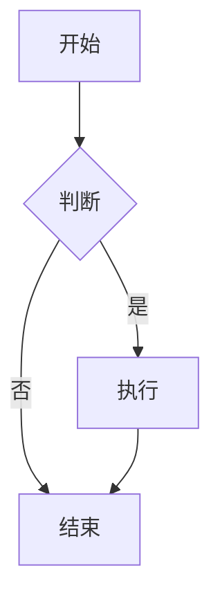

# Markdown 语法指导 Skill

当用户或 AI 需要生成可被 `@ant-design/agentic-ui` 的 `MarkdownEditor` / `MarkdownRenderer` 正确解析的内容时，使用本技能提供与代码实现严格对齐的语法指导。

> **核心原则（图表场景）**：先看「图表选型决策表」 → 命中内置 chartType 就用 HTML 注释 + 表格 → **实在没有合适 chartType 才回退 Mermaid 代码块**。

## Skill 激活场景

| 触发关键词 | 指导内容 |
|------------|----------|
| `表格`, `table` | 基础 Markdown 表格 + `chartType: "table"` 高级表格 + 图表化表格 |
| `视频`, `video` | HTML `<video>` 标签 + `` 图片式语法 |
| `图表`, `chart`, `柱状图`, `饼图`, `折线图`, `散点`, `雷达`, `漏斗`, `箱线`, `直方` | **优先**给 `chartType` HTML 注释 + 表格示例（见图表选型决策表）|
| `流程图`, `时序图`, `甘特图`, `mermaid` | **回退方案**：内置 chartType 无法表达流程关系时，才给 Mermaid 代码块 |
| `卡片`, `card`, `link-card` | 链接卡片语法（`{"type":"card", ...}` + 链接） |
| `提示块`, `alert`, `info`, `warning`, `success`, `error` | `:::` 容器语法 |
| `附件`, `attachment` | `` 语法 |
| `任务列表`, `task list` | GFM `- [x]` / `agentic-ui-task` 代码块 |
| `工具栏`, `tool use bar` | `agentic-ui-toolusebar` 代码块 |
| `文件列表`, `filemap` | `agentic-ui-filemap` 代码块 |
| `MDX`, `内嵌组件` | React 组件嵌入（依赖 MDX 渲染上下文）|
| `apaasify` | aPaaS Schema 代码块 |
| `怎么写`, `语法`, `格式` | 综合语法速查 |

## 语法速查表

### 1. 表格 (Tables)

**基础 Markdown 表格**

```markdown
| 标题 1 | 标题 2 | 标题 3 |
| :----- | :----: | -----: |
| 左对齐 |  居中  | 右对齐 |
| 内容   |  内容  |   内容 |
```

**高级表格**（通过 HTML 注释启用）

```markdown
<!-- {"chartType": "table"} -->

| 姓名 | 年龄 | 职业   |
| :--- | :--- | :----- |
| 张三 | 28   | 工程师 |
| 李四 | 32   | 设计师 |
```

**将表格渲染为图表**（柱状图、饼图、折线图等）

```markdown
<!-- {"chartType": "bar", "x": "产品", "y": "销量", "title": "销量对比"} -->

| 产品 | 销量 |
| :--- | :--- |
| A    | 100  |
| B    | 150  |
| C    | 80   |
```

支持的 `chartType`：`bar`（条形）、`column`（柱状）、`line`（折线）、`area`（面积）、`pie`（饼图）、`donut`（环形）、`radar`（雷达）、`scatter`（散点）、`funnel`（漏斗）、`table`（表格）、`descriptions`（定义列表）、`docCards`（卡片列表）、`quadrant`（四象限图）。

---

### 2. 视频 (Video)

**方式一：HTML video 标签**

```html
<video src="https://example.com/video.mp4" controls width="400"></video>
```

带完整属性：

```html
<video src="video.mp4" controls autoplay loop muted poster="poster.jpg" width="640" height="360"></video>
```

多格式源：

```html
<video controls width="600">
  <source src="https://example.com/video.mp4" type="video/mp4">
  <source src="https://example.com/video.webm" type="video/webm">
  Your browser does not support the video tag.
</video>
```

**方式二：图片式视频语法**（扩展 Markdown，类似图片写法）

```markdown

```

> `alt` 使用 `video:自定义名称` 格式，渲染时会识别为视频并嵌入播放器。

---

### 3. 图表 (Charts)

> **铁律**：先查"图表选型决策表"。命中内置 `chartType` 一律用 HTML 注释 + 表格；**仅当找不到任何合适的内置 chartType（典型如"流程图、时序图、状态机、甘特图、ER 图"等关系/流程类）时**，才回退 Mermaid。

#### 3.1 图表选型决策表

| 用户诉求 | 推荐 `chartType` | 是否需要 Mermaid |
|---|---|---|
| 类目对比（横向）| `bar` | ❌ |
| 类目对比（纵向）| `column` | ❌ |
| 趋势 / 时间序列 | `line` | ❌ |
| 累积趋势 / 占比堆叠 | `area` | ❌ |
| 占比 / 构成 | `pie` | ❌ |
| 占比（中间留空）| `donut` | ❌ |
| 多维能力对比 | `radar` | ❌ |
| 二维点分布 / 相关性 | `scatter` | ❌ |
| 转化漏斗 | `funnel` | ❌ |
| 数据分布（五数概括）| `boxplot` | ❌ |
| 频数分布 | `histogram` | ❌ |
| 仅展示原始表格（不画图）| `table` | ❌ |
| 键值对定义列表 | `descriptions` | ❌ |
| 文档/网站/工具的卡片栅格（标题 + URL + 简介 + 标签）| `docCards` | ❌ |
| 优先级矩阵 / 二维分类（四象限）| `quadrant` | ❌ |
| **流程图 / 决策树** | — | ✅ Mermaid `flowchart` |
| **时序图 / 调用链** | — | ✅ Mermaid `sequenceDiagram` |
| **甘特图 / 时间安排** | — | ✅ Mermaid `gantt` |
| **状态机** | — | ✅ Mermaid `stateDiagram` |
| **ER 图 / 类图** | — | ✅ Mermaid `erDiagram` / `classDiagram` |

#### 3.2 内置图表语法（首选）

在 Markdown 表格的**正上方**紧贴一行 HTML 注释，注释体是合法 JSON：

```markdown
<!-- {"chartType": "pie", "x": "类型", "y": "占比", "title": "类型分布"} -->

| 类型 | 占比 |
| :--- | ---: |
| A    | 30   |
| B    | 50   |
| C    | 20   |
```

**配置字段速查**：

| 字段 | 类型 | 说明 |
|---|---|---|
| `chartType` | `string` | 图表类型，必填，见上方决策表 |
| `x` | `string` | X 轴列名，对应表头 |
| `y` | `string` | Y 轴列名，对应表头 |
| `title` | `string` | 图表标题（可选）|
| `groupBy` | `string` | 分组列名，用于 `radar / scatter / funnel / boxplot / histogram` 多组对比 |
| `colorLegend` | `string` | 颜色图例列名（多系列染色）|
| `filterBy` | `string` | 过滤维度列名 |
| `height` | `number` | 图表高度，默认 `400` |

#### 3.3 多图表配置（一个表格画多种图）

注释体写成 JSON 数组：

```markdown
<!-- [{"chartType": "bar", "x": "产品", "y": "销量"}, {"chartType": "pie", "x": "产品", "y": "销量"}] -->

| 产品 | 销量 |
| :--- | ---: |
| A    | 100  |
| B    | 150  |
| C    | 80   |
```

> 🔸 当数组里**所有** `chartType` 都为 `"table"` 时，插件会跳过转换，保留原始表格渲染。

#### 3.3.1 卡片栅格（`docCards`）

当用户希望以「双列 / 单列卡片」呈现一组带 **标题、URL、简介、标签** 的条目时，使用
`chartType: "docCards"`。一行 Markdown 表格 = 一张卡片，与现有 chart 共用同一套契约。

```markdown
<!-- {"chartType": "docCards", "title": "推荐文档站", "cardColumns": 2} -->

| 名称              | 地址                          | 简介                       | 亮点                       |
| :---------------- | :---------------------------- | :------------------------- | :------------------------- |
| Tailwind CSS Docs | https://tailwindcss.com/docs  | 结构清晰、搜索与导航强     | 交互式示例, 深链, 暗色模式 |
| MDN               | https://developer.mozilla.org | 权威 Web 平台参考          | 多语言, 可折叠, 示例可编辑 |
```

- **表头别名（默认匹配）**：`名称` / `标题` / `name` / `title` → `title`；
  `地址` / `链接` / `URL` → `url`；`简介` / `描述` → `description`；
  `亮点` / `标签` → `tags`。同样支持「列名 = 逻辑名 + 中英文括号单位」的宽松匹配。
- **标签拆分**：`tags` 列允许半角逗号 `,`、分号 `;`、竖线 `|`、斜杠 `/` 与全角 `，` `；` `、` 分隔。
- **可选配置**：`cardColumns`（默认 `2`，传 `1` 即全宽列表）、`fieldMap`（显式覆盖列名映射）。
- **降级策略**：注释中无法定位主标题列时，整表会降级为普通 Markdown 表格，避免空白卡片栅格。

#### 3.4 内置 chart 的智能识别能力

当前实现已自动处理以下"用户书写不规范"的常见情况，**生成示例时无需提醒用户改写数据**：

- **列名模糊匹配**：注释里 `"y": "销售额"` 可自动匹配表头 `销售额(元)` / `销售额（元）`（忽略括号单位后缀）
- **数值自动识别**（表格单元格 → number）：
  - 千分位：`8,287.44` / `12,3456` / `1，234.5`（中英文逗号皆可，末段需 ≥ 3 位数字）
  - 百分比：`12.5%` / `-3%` / `+12,345.6%`（保留字面值，不做 `/100`）
  - 紧凑后缀：`1.2k` / `3M` / `-2.5B` / `1.5e3k`（k=1e3, m=1e6, b=1e9, t=1e12，大小写均可）
  - 科学计数法：`1.2e3` / `-3.14E+10` / `1e-5`（裸形式由 `Number()` 直接处理）
  - 中文金额：`1.5万` / `2亿`（由 `parseChineseCurrencyToNumber` 兜底）
  - 带正号：`+1,234` / `+3.14`

#### 3.5 完整示例

**柱状图（销量对比）**

```markdown
<!-- {"chartType": "column", "x": "品类", "y": "销售额", "title": "品类销售额排名"} -->

| 品类       | 销售额(元) |
| :--------- | ---------: |
| 休闲食品   |  29,337.76 |
| 酒水饮料   |  16,895.05 |
| 速冻日配   |  16,843.76 |
```

**折线图（趋势）**

```markdown
<!-- {"chartType": "line", "x": "时段", "y": "客单价", "title": "分时段客单价"} -->

| 时段  | 客单价(元) |
| :---- | ---------: |
| 8:00  |      56.76 |
| 9:00  |      87.94 |
| 10:00 |      78.35 |
```

**雷达图（多维对比）**

```markdown
<!-- {"chartType": "radar", "x": "维度", "y": "得分", "groupBy": "用户"} -->

| 用户 | 维度 | 得分 |
| :--- | :--- | ---: |
| 张三 | 性能 |   85 |
| 张三 | 体验 |   90 |
| 李四 | 性能 |   78 |
| 李四 | 体验 |   88 |
```

**漏斗图（转化）**

```markdown
<!-- {"chartType": "funnel", "x": "阶段", "y": "人数"} -->

| 阶段     |  人数 |
| :------- | ----: |
| 浏览     | 10000 |
| 加购     |  3500 |
| 下单     |  1800 |
| 支付完成 |  1500 |
```

**饼图 + 柱状图共存**

```markdown
<!-- [{"chartType": "pie", "x": "渠道", "y": "GMV"}, {"chartType": "bar", "x": "渠道", "y": "GMV"}] -->

| 渠道  |    GMV |
| :---- | -----: |
| 直营  | 12.5万 |
| 分销  |    3亿 |
| 跨境  |  1.2k  |
```

#### 3.6 兜底：Mermaid（仅在内置 chartType 都不适用时使用）

> 出现以下信号时才考虑 Mermaid：用户提到 `流程图 / 时序图 / 甘特图 / 状态机 / ER 图 / 类图`，或要表达"节点之间的关系/调用顺序"。

`mermaid` 语言代码块在 `MarkdownEditor` 中受支持（流式解析也对其特殊处理，见 `findMatchingClose.ts`），`MarkdownRenderer` 通过通用代码块渲染：

````markdown

````

> 💡 在 `MarkdownEditor` 中可用快捷键 `Cmd/Ctrl + Option/Alt + M` 直接插入 Mermaid 代码块。

**反例**（不应该用 Mermaid 的场景）：

| ❌ 错误用法 | ✅ 应该用 |
|---|---|
| 用 Mermaid `pie` 画占比 | 内置 `chartType: "pie"` |
| 用 Mermaid `xychart-beta` 画柱状/折线 | 内置 `chartType: "column"` / `"line"` |
| 用 Mermaid 画散点图 | 内置 `chartType: "scatter"` |

---

### 4. 卡片 (Cards)

**链接卡片**（Link Card）

格式：HTML 注释 `{"type": "card", ...}` + 紧接着的 Markdown 链接。

```markdown
<!-- {"type": "card", "icon": "https://example.com/icon.svg", "title": "卡片标题", "description": "卡片描述"} -->
[链接文本](https://example.com "悬停提示")
```

简化示例：

```markdown
<!-- {"type": "card", "title": "网易", "description": "Electronic Gaming & Multimedia"} -->
[网易](https://example.com/company/49 "公司信息")
```

> 注释必须与链接在同一段落内，且 `type` 必须为 `"card"`。

**内嵌 React 组件（MDX）**

```markdown
import { Card } from 'antd';

<Card title="卡片标题">
  卡片内容
</Card>
```

---

### 5. 提示块 (Alerts)

使用 `:::` 语法（兼容 markdown-it-container）。**注意**：`:::` 与内容之间需用空行分隔。

```markdown
:::info

这是信息提示块。

:::

:::warning

这是警告提示块。

:::

:::success

这是成功提示块。

:::

:::error

这是错误提示块。

:::
```

---

### 6. 附件 (Attachments)

```markdown

```

> `alt` 使用 `attachment:显示名称` 格式，渲染为可下载的附件链接。

---

### 7. 其他扩展

**任务列表**

```markdown
- [x] 已完成任务
- [ ] 未完成任务
```

**aPaaSify Schema 组件**

````markdown
```apaasify
{
  "type": "page",
  "body": [
    {
      "type": "button",
      "label": "点击我"
    }
  ]
}
```
````

**Agentic UI 嵌入块**（`@ant-design/agentic-ui` MarkdownEditor / MarkdownRenderer）

任务列表（渲染为 `TaskList`）：

````markdown
```agentic-ui-task
{
  "items": [
    { "key": "1", "title": "步骤", "content": "详情", "status": "loading" }
  ]
}
```
````

（默认 `variant` 为 `simple`；需完整任务链样式时在 JSON 根级增加 `"variant": "default"`。）

工具使用栏（渲染为 `ToolUseBar`）：

````markdown
```agentic-ui-toolusebar
{
  "tools": [
    { "id": "1", "toolName": "web_search", "toolTarget": "example.com", "status": "loading" }
  ]
}
```
````

文件列表（渲染为 `FileMapView`）：

````markdown
```agentic-ui-filemap
{
  "fileList": [
    { "uuid": "1", "name": "README.md", "size": 2048, "type": "text/markdown", "url": "https://example.com/README.md" },
    { "uuid": "2", "name": "package.json", "size": 512, "type": "application/json", "url": "https://example.com/package.json" }
  ]
}
```
````

支持字段：
- `fileList`（或别名 `files`）：文件对象数组
  - `name`：文件名（必填）
  - `uuid` / `id`：唯一标识（可选，缺省时自动生成）
  - `size`：文件大小（字节数，可选）
  - `type`：MIME 类型（可选，用于显示文件图标）
  - `url`：文件链接（可选）
  - `previewUrl`：预览链接（可选）
  - `status`：`"done"` / `"uploading"` / `"pending"` / `"error"`（可选）
  - `errorMessage`：错误说明（`status === "error"` 时显示，可选）
- `className`：自定义根元素类名（可选）

**3D 模型**（若项目支持）

````markdown
```model
format: glb
source: https://example.com/3d/model.glb
camera:
  position: [0, 2, 5]
  target: [0, 0, 0]
```
````

**音频**

````markdown
```audio
source: https://example.com/audio/note.mp3
title: 功能说明
```
````

---

## 指导原则

1. **优先给出可直接复制的示例**：用户通常需要「照着改」就能用，先示例后讲解。
2. **图表回复决策顺序**（**最重要**）：
   1. 先匹配「§3.1 图表选型决策表」→ 命中内置 `chartType` 直接给注释 + 表格
   2. 仅当落到决策表最后几行（流程图 / 时序图 / 甘特图 / 状态机 / ER 图 / 类图）时，才给 Mermaid 代码块
   3. **绝对不要**用 Mermaid 画饼图、柱状图、折线图、散点图等内置已支持的图——Mermaid 是兜底而非首选
3. **说明必须紧邻**：`chartType` 注释必须紧贴表格上方（中间不能有空行外的内容）；链接卡片的注释必须与链接在同一段落。
4. **字段名与表格列一致**：`x` / `y` / `groupBy` / `colorLegend` / `filterBy` 都对应表头列名。**列名模糊匹配已生效**——写 `"y": "销售额"` 能命中表头 `销售额(元)`，无需特意写完整。
5. **数值不需要预处理**：表格里的 `8,287.44` / `12.5%` / `1.2k` / `1.5万` / `1.5e3` / `+1,234` 都会自动转 number，**不要**让用户手工去掉单位/逗号/百分号。
6. **JSON 格式严格**：HTML 注释内的 JSON 不能有尾逗号、不能有注释、字符串必须双引号，否则解析失败保留原表格。
7. **多图共存用数组**：同一表格画多种图时，注释体写 `[{...}, {...}]`；如果数组里**全是** `chartType: "table"`，插件会跳过转换。
8. **Mermaid 使用门槛**：仅当用户明确要表达「节点之间的关系/调用顺序/状态变化」且没有任何内置 chartType 能表达时，才使用。
9. **流程表达的非 Mermaid 替代**：简单步骤优先用有序列表、`agentic-ui-task` 任务块；复杂关系才用 Mermaid。
10. **区分渲染环境**：MDX、`apaasify`、`model`、`audio` 等依赖具体项目配置，需说明「若项目支持」。

## 参考文档

| 文档 / 源码 | 内容 |
|------|------|
| `docs/utils/markdown-syntax.md` | 完整 Markdown 语法（中文） |
| `docs/utils/markdown-syntax.en-US.md` | 英文版语法 |
| `docs/utils/chart-config.md` | 图表配置详解 |
| `docs/demos-pages/video.md` | 视频支持说明 |
| `src/MarkdownRenderer/plugins/remarkChartFromComment.ts` | HTML 注释 → chart 代码块的 mdast 转换 |
| `src/Plugins/chart/ChartRender.tsx` | 11 种图表类型的运行时渲染 |
| `src/MarkdownRenderer/utils/chartAxisMatch.ts` | 列名模糊匹配（忽略括号单位）|
| `src/MarkdownRenderer/utils/astExtract.ts` | 表格单元格数值识别（千分位 / 百分比 / 紧凑后缀 / 科学计数）|
| `src/MarkdownEditor/editor/utils/findMatchingClose.ts` | Mermaid 代码块的流式完整性判断 |

## 快速回复模板

当用户问「怎么在 Markdown 里加表格/视频/图表/卡片」时，可复用上述对应章节的示例，并附带一句说明（如「将示例中的 URL、列名换成你的数据即可」）。

## 命令行速查（可选）

如需快速获取某类语法的代码片段，可运行：

```bash
# 查看所有可用关键词
python .cursor/skills/markdown-syntax-guide/scripts/lookup.py -l

# 获取表格语法
python .cursor/skills/markdown-syntax-guide/scripts/lookup.py table.advanced

# 获取柱状图语法
python .cursor/skills/markdown-syntax-guide/scripts/lookup.py chart.bar

# 获取视频语法
python .cursor/skills/markdown-syntax-guide/scripts/lookup.py video.html
```

语法片段数据位于 `data/syntax-snippets.json`。

---
> Source: [antdigital-ai/agentic-ui](https://github.com/antdigital-ai/agentic-ui) — distributed by [TomeVault](https://tomevault.io).
<!-- tomevault:4.0:skill_md:2026-07-19 -->
