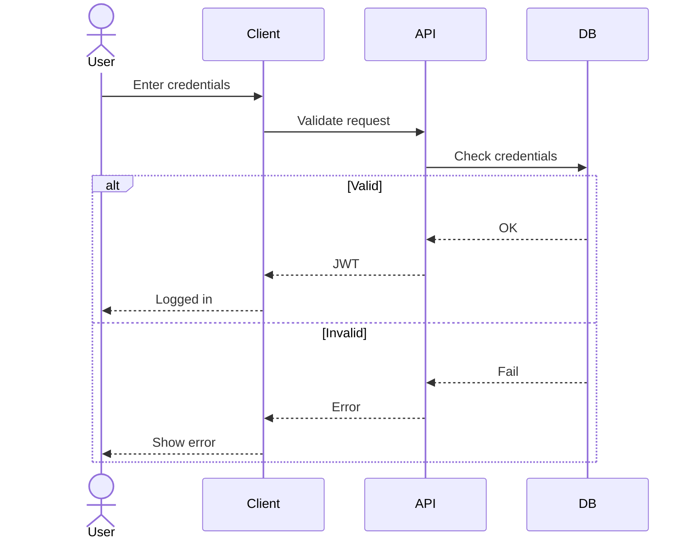
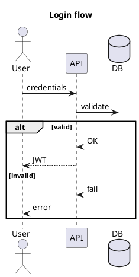

# UML Diagramming

Generate a single, correct Mermaid or PlantUML code block from a user's description. Output only the diagram script in one code block; no prose outside it.

## When to Use

- User asks for a diagram (UML, architecture, flow, process, etc.)
- User specifies or implies Mermaid or PlantUML (or "diagram code")
- Task is to produce diagram script for documentation, design, or for the `generate_uml` MCP tool

The `generate_uml` tool supports all Kroki diagram types via `diagram_type` (e.g. `mermaid`, `plantuml`, `d2`, `graphviz`, `blockdiag`, `bpmn`, `vegalite`, `wavedrom`, etc.). Use resource `uml://types` for the full list and `uml://templates` for starter code. For non-Mermaid/PlantUML types (D2, BlockDiag, BPMN, Bytefield, Vega, WaveDrom, etc.), see [references/DIAGRAM-TYPES.md](references/DIAGRAM-TYPES.md).

## Output Rules

- Emit **only one** code block; no explanatory text outside the block.
- Code block language: `mermaid` or `plantuml`.
- For PlantUML: script must start with `@startuml` and end with `@enduml`.
- You may use brief comments inside the block (Mermaid `%% ...` or PlantUML `' ...`) to note assumptions.

## Choosing Mermaid vs PlantUML

- If the user says **Mermaid** or **PlantUML**, use that.
- If unspecified:
  - Prefer **PlantUML** for: Use Case, Deployment, Object, WBS, Gantt, Wireframe.
  - Prefer **Mermaid** for: Markdown/GitHub-friendly docs, quick diagrams, and when there is no strong UML requirement.

## Parsing the Request

From the user's message or context, identify:

- **Diagram type**: Sequence, Use Case, Class, Activity, Component, State, Object, Deployment, Timing, Network, Gantt, MindMap, WBS, etc.
- **Purpose**: Communication, Planning, Design, Analysis, Modeling, Documentation, Implementation, Testing, Debugging.
- **Elements** (optional): Actors, Messages, Objects, Classes, Interfaces, Components, States, Nodes, Edges, etc.
- **Target language** for labels (e.g. English) if obvious.
- **Optional constraints** if mentioned: direction (LR/TB), detail level, max nodes, naming style, group_by.

## Mermaid Type Mapping

| Diagram Type | Mermaid syntax |
|--------------|----------------|
| Sequence | `sequenceDiagram` |
| Class | `classDiagram` |
| State | `stateDiagram-v2` |
| Activity | `flowchart` (TB) |
| Component, Deployment, Network | `flowchart` + subgraphs |
| Gantt | `gantt` |
| MindMap | `mindmap` |
| Use Case | `flowchart` (actors + use cases; no native use case in Mermaid) |
| Timing | `sequenceDiagram` with timing notes |
| Object | `classDiagram` (instances via notes) or `flowchart` |
| JSON/YAML | `flowchart` representing the structure (not raw JSON/YAML inside the block) |

Default direction: TB. Use LR for architecture/component/deployment when it improves readability.

## PlantUML Type Mapping

| Diagram Type | PlantUML |
|--------------|----------|
| Sequence | `sequence` diagram syntax |
| Use Case | `usecase` diagram syntax |
| Class | `class` diagram syntax |
| Activity | `activity` diagram syntax |
| Component | `component` diagram syntax |
| State | `state` diagram syntax |
| Object | `object` diagram syntax |
| Deployment | `deployment` diagram syntax |
| Timing | `timing` or sequence |
| Network | deployment/component (nodes + links) |
| Wireframe | `salt` (simple UI wireframes) |
| Gantt | `gantt` syntax |
| MindMap | `mindmap` syntax |
| WBS | `wbs` syntax |
| JSON/YAML | class/object or mindmap representing structure |

Use `left to right direction` for architecture-heavy diagrams when it helps. Add a short `title` in the target language.

## Quality Rules

- Choose the **minimal** diagram type that fits the purpose.
- Limit size: roughly &lt;25 nodes for Mermaid, &lt;30 for PlantUML.
- **Naming**: Consistent, short names; qualifiers in notes if needed.
- **Grouping**: Use subgraphs (Mermaid) or packages/frames (PlantUML): e.g. Client, API, Services, DB.
- **Sequence**: Show key messages only; use `alt`/`opt` for branches.
- **Class**: Include main attributes/methods; show relationships with multiplicities where known.
- **State**: Clear start and end; label transitions with events/guards.
- **Activity**: One start, one end; decisions as diamonds; label yes/no paths.
- If the request is ambiguous, make reasonable assumptions and note them in comments inside the diagram.

## Process

1. Parse the prompt: extract entities, actions, relationships, lifelines, states, modules.
2. Choose Mermaid or PlantUML (see "Choosing Mermaid vs PlantUML").
3. Select the diagram form from the type mapping tables above.
4. Apply direction: default TB; LR for architecture/component/deployment/network.
5. Emit a single code block with the diagram script.
6. If the MCP `generate_uml` tool is available, call it with the produced `diagram_type` and `code` (e.g. `diagram_type`: "mermaid", "class", "sequence", "activity", "usecase" as appropriate).

## Examples

**Example 1 (Mermaid – login flow)**

User request: "User login flow: enter credentials, API validates, DB check, return JWT or error."

**Example 2 (PlantUML – login sequence)**

User request: "Login: validate, DB check, JWT or error."

**Example 3 (Mermaid – API call sequence)**

User request: "Show me a Mermaid sequence diagram for an API call."

Use `sequenceDiagram` with participants such as Client, API, Auth, DB. Show request/response and optional `alt` for success/error. See resource `uml://mermaid-examples` (key `sequence_api`) or `uml://examples` (Mermaid) for examples. Then call `generate_uml("mermaid", code)`.

**Example 4 (Mermaid – Gantt)**

User request: "Generate a Gantt chart using Mermaid syntax."

Use a Mermaid `gantt` block with `title`, `dateFormat`, `section`, and tasks (with ids and durations or `after`). See resource `uml://mermaid-examples` (key `gantt`). Then call `generate_uml("mermaid", code)`.

**Convert class diagram to Mermaid**

When the user asks to convert a class diagram (PlantUML or prose) into Mermaid:
1. Map each class to `classDiagram` syntax: class name, then lines for attributes/methods with `+` `-` `#`.
2. Map relationships: inheritance `--|>`, composition `*--`, aggregation `o--`, association `--` with `: label`, dependency `..>`.
3. Emit one Mermaid code block and call `generate_uml("mermaid", code)`.

**BPMN process model**

When the user asks how to draw a BPMN process model:
- Describe core BPMN 2.0.2 elements: Start/End events, Task, Gateways (Exclusive, Parallel, Inclusive), Sequence Flow, Lanes, Pools.
- Point to resource `uml://bpmn-guide` for the structured guide and to `generate_bpmn_diagram` or `generate_uml("bpmn", ...)` for generating BPMN XML.

## Additional Resources

For full diagram-type mappings and optional constraints (direction, detail_level, max_nodes, naming_style, group_by), see [references/DIAGRAM-TYPES.md](references/DIAGRAM-TYPES.md).

---
> Converted and distributed by [TomeVault](https://tomevault.io/claim/antoinebou12) — claim your Tome and manage your conversions.
<!-- tomevault:4.0:skill_md:2026-04-11 -->
