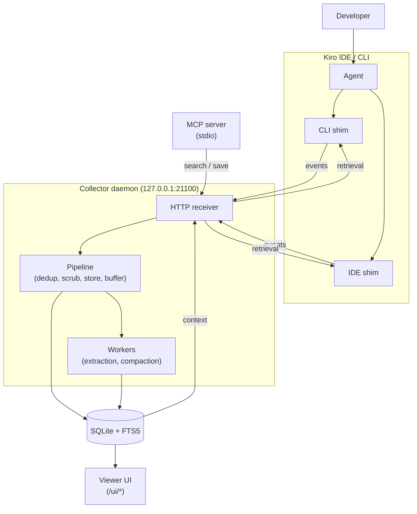

# kiro-learn

Continuous learning for Kiro agent sessions on AWS. Passively captures tool-use events from Kiro CLI and Kiro IDE hooks, extracts them into structured memory records via LLM, and injects relevant prior context into future sessions. Aligned with [Amazon Bedrock AgentCore Memory](https://docs.aws.amazon.com/bedrock-agentcore/latest/devguide/memory.html) vocabulary so a future migration is a field-mapping exercise.

Public docs: https://kiro-learn.mintlify.app — always the first place to look (and update) when working in this repo.

## Quick Reference

```bash
npm run build          # tsc -p tsconfig.build.json + vite build (UI) → dist/
npm run build:node     # tsc -p tsconfig.build.json → dist/ (no UI)
npm run build:ui       # vite build → dist/ui/
npm run typecheck      # tsc --noEmit against tsconfig.build.json + ui/tsconfig.json
npm run test           # vitest run — unit tests (test/unit/)
npm run test:integ     # vitest run — integration tests (test/integ/), needs kiro-cli + Bedrock
npm run test:all       # both suites sequentially
npm run lint           # eslint
npm run format:check   # prettier --check
npm run dev:ui         # vite dev server for UI (proxies /healthz + /v1 to collector)
```

**Node ≥ 22 required.** ESM-only (`"type": "module"`). All imports use explicit `.js` extensions even though the source is `.ts`. No third-party LLM SDKs — all AI work goes through `kiro-cli` → Amazon Bedrock. SQLite is `better-sqlite3`; the memory graph is `@cosmos.gl/graph`.

## Architecture



| Layer          | Location              | What it does                                                                                                                                                                                                     |
| -------------- | --------------------- | ---------------------------------------------------------------------------------------------------------------------------------------------------------------------------------------------------------------- |
| **Shim (CLI)** | `src/shim/cli-agent/` | Reads Kiro CLI hook stdin, builds `KiroMemEvent`, POSTs to collector, writes retrieval context to stdout. Exits 0 always.                                                                                        |
| **Shim (IDE)** | `src/shim/ide-hook/`  | Reads Kiro IDE hook event type from `argv[2]`, payload from `USER_PROMPT` env. Same POST/stdout pattern. Exits 0 always.                                                                                         |
| **Collector**  | `src/collector/`      | HTTP daemon. Pipeline: dedup → privacy scrub → storage → async extraction. Per-project NDJSON buffers with batch extraction and compaction. FTS5 retrieval with latency budget. Serves the viewer UI at `/ui/*`. |
| **MCP server** | `src/mcp/`            | Stdio MCP server: `search_memory`, `save_observation`, `save_session_summary`. Talks to the collector over HTTP.                                                                                                 |
| **Installer**  | `src/installer/`      | CLI (`init`/`start`/`stop`/`status`/`uninstall`). Bootstraps `~/.kiro-learn/`, writes agent configs, manages daemon, deploys UI assets.                                                                          |

## Non-negotiable constraints

These are constraints the agent cannot infer from the code alone. Violating them either breaks the build, fails guard tests, or corrupts the wire contract.

### TypeScript & ESM

- `exactOptionalPropertyTypes: true` — you cannot assign `undefined` to an optional field. Use `delete obj.field` or omit the key entirely.
- `noUncheckedIndexedAccess: true` — every `obj[key]` returns `T | undefined`. Narrow before use.
- `verbatimModuleSyntax: true` — use `import type { ... }` for type-only imports. The linter enforces this.
- All imports use `.js` extensions. Write `import { foo } from './bar.js'` even though the source is `bar.ts`.

### Modularity boundaries (enforced by guard tests)

These are real tests under `test/unit/no-*.test.ts`. Violations fail CI.

- `src/collector/pipeline/`, `receiver/`, `retrieval/`, `query/`, `buffer/` must NOT import from `src/collector/storage/sqlite/`. Only `src/collector/index.ts` knows the concrete backend.
- `src/collector/buffer/` and `src/collector/storage/` must NOT contain the string `<private>`. Privacy scrubbing belongs to the pipeline.
- XML pipeline modules (`acp-client.ts`, `xml-framer.ts`, `xml-parser.ts`) must NOT import from `src/collector/storage/`.
- `src/shim/` must NOT import from `src/collector/`, `src/collector/buffer/`, or `src/installer/`. The shim is a standalone HTTP client.
- `src/shim/shared/` must NOT import from `src/shim/cli-agent/` or `src/shim/ide-hook/`. Direction is `cli-agent → shared` and `ide-hook → shared` only.
- `src/shim/ide-hook/` must NOT import from `src/shim/cli-agent/`. The two shims are siblings.
- `src/installer/` must NOT import from `src/shim/`.
- `src/mcp/` must NOT import from `src/collector/`, `src/shim/`, or `src/installer/`. It's a standalone server that talks to the collector over HTTP.
- `ui/` must NOT import from `src/`, and `src/` must NOT import from `ui/`.

### Privacy scrubbing ownership

`<private>...</private>` spans in event bodies are replaced with `[REDACTED]` by the pipeline's scrub stage — handles nested tags (outermost pair wins) and unclosed tags (span runs to end of string). **Storage, buffer, and shim do NOT scrub.** The guard tests `no-private-scrub.test.ts` and `no-private-in-buffer.test.ts` enforce this.

### Event schema is a one-way door

`src/types/schemas.ts` is the wire contract. Breaking changes require a new `schema_version` and a coordinated migration. Key invariants: `schema_version` is the literal `1`; `event_id` and `record_id` are ULIDs in Crockford base32; `namespace` matches `/^\/actor\/[^/]+\/project\/[^/]+\/$/`; `body` is a discriminated union on `type` (`text` | `message` | `json`) capped at 1 MiB. Don't invent fields — add them to the Zod schema first, then a migration, then the generators.

### Shims exit 0 always

Both shims exit 0 regardless of internal failures. Every hook command in the installer also ends in `|| true`. The shim **never** blocks the agent. If you're tempted to `process.exit(1)` from a shim, you're in the wrong place — log to stderr and return.

## Docs are part of the contract

The Mintlify site under `docs/` (published at https://kiro-learn.mintlify.app) is the source of truth for externally observable behavior. **Any code change with externally visible effect must ship with a matching docs change in the same commit.** The guard is human review, not a test, so be deliberate.

- `docs/architecture/` — how each component works internally (collector, database, extraction, compaction, retrieval, shims, viewer, summarization)
- `docs/concepts/` — user-facing mental models (event types, event buffer, privacy, projects)
- `docs/getting-started/` — install and introduction

Common change → docs update mapping:

- Schema change → `docs/concepts/event-types.mdx`
- Storage / migration change → `docs/architecture/database.mdx`
- Pipeline or buffer change → `docs/architecture/collector.mdx`, `extraction.mdx`, or `compaction.mdx`
- Retrieval / FTS5 change → `docs/architecture/retrieval.mdx`
- Privacy behavior change → `docs/concepts/privacy.mdx`
- Viewer / UI change → `docs/architecture/viewer.mdx`
- New shim event or hook → `docs/architecture/kiro-cli-shim.mdx` or `kiro-ide-shim.mdx`

New diagrams use `mermaid` blocks matching the existing style — `flowchart LR`/`TD` for component relationships, `sequenceDiagram` for interactions. Run `mintlify dev` inside `docs/` to preview.

## How to extend the system

**Add a schema field.** Update `src/types/schemas.ts`. Add a migration under `src/collector/storage/sqlite/migrations/` with a monotonic numeric prefix (current highest is `0005`). Update `test/helpers/arbitrary.ts` fast-check generators. Update `docs/concepts/event-types.mdx`.

**Add an MCP tool.** Handler in `src/mcp/tools.ts`, registered in `src/mcp/index.ts`. Must talk to the collector over HTTP — no imports from `src/collector/`, `src/shim/`, or `src/installer/`. The namespace-derivation algorithm in `src/mcp/namespace.ts` is a deliberate duplication of the shim's algorithm and must stay in sync.

**Add a UI feature.** The UI is a standalone Vite app under `ui/` with its own `tsconfig.json`. No imports across the `src/` ↔ `ui/` boundary. The memory graph uses `@cosmos.gl/graph` with a pure transform in `ui/src/graph/transform.ts` (property-tested) and a React wrapper in `ui/src/components/CosmosGraph.tsx` that uploads data once per mount — refreshes happen via `key` remount, not buffer re-upload.

**Run integration tests.** `npm run test:integ`. These spawn real `kiro-cli acp` sessions and need Bedrock credentials; they skip gracefully when `kiro-cli` is unavailable.

## North Star

A portable continuous-learning memory for Kiro agents that starts local, scales to a team-wide shared knowledge base, and can migrate to [Amazon Bedrock AgentCore Memory](https://docs.aws.amazon.com/bedrock-agentcore/latest/devguide/memory.html) without semantic changes to events, memory records, or the retrieval surface.

Progress toward the north star:

- [x] Local baseline — CLI hooks, SQLite + FTS5, XML extraction via ACP, seed-then-merge agent configs
- [x] Kiro IDE hook shim — memory works in the IDE, not just `kiro-cli`
- [x] MCP tool wrappers — `search_memory`, `save_observation`, `save_session_summary`
- [x] Workspace buffer pipeline — per-project NDJSON buffers with batch extraction and LLM-driven compaction
- [x] Project path capture — upward marker walk + `source.project_path` field
- [x] Viewer UI — Cloudscape dashboard with cosmos.gl memory graph, event tail, metrics
- [x] FTS5 tokenized retrieval — OR-of-phrases with IDF term ranking
- [x] Public docs site at https://kiro-learn.mintlify.app
- [x] Hybrid search with local embeddings — MiniLM-L6-v2 (local ONNX) + BLOB + RRF (Reciprocal Rank Fusion)
- [ ] Remote knowledge-base sync — Aurora + pgvector or Bedrock AgentCore Memory as a drop-in `StorageBackend`
- [ ] Team-level shared memory — namespace-scoped access control on a shared KB
- [ ] Enhanced privacy — configurable redaction policies beyond `<private>` tags, PII detection, audit logging

The `v0`/`v1`/`v2`/etc. labels in git history and older spec docs are internal milestone names, not semver. The package stays on `0.x` until the public surface is stable.

## Gotchas

- **FTS5 queries** are tokenized on Unicode whitespace, deduplicated, IDF-ranked, capped at 32 terms, and joined with `OR` as quoted phrases. See `src/collector/storage/sqlite/fts5.ts`. Empty tokenization → empty result, not a parse error.
- **The compressor and compactor agents** (`kiro-learn-compressor.json`, `kiro-learn-compactor.json`) are hand-authored in `src/installer/index.ts` — they are NOT seeded from `kiro_default`. Only `kiro-learn.json` uses the seed-then-merge flow.
- **Session IDs** live at `/tmp/kiro-learn-session-<hash>` where hash is the first 16 hex chars of MD5 of resolved cwd.
- **`os.userInfo()` can throw** on some systems — the shim has a guarded fallback to `'unknown'`.
- **ACP is pinned** at `@agentclientprotocol/sdk@0.20.0` exact. Don't bump without coordinated testing against the compressor/compactor prompts.
- **`transaction_time`** is stamped by the storage layer on insert, not by the client. `valid_time` is client-supplied. These are reserved for future bi-temporal query support.

---
> Source: [brendangeck/kiro-learn](https://github.com/brendangeck/kiro-learn) — distributed by [TomeVault](https://tomevault.io).
<!-- tomevault:4.0:agents_md:2026-07-22 -->
