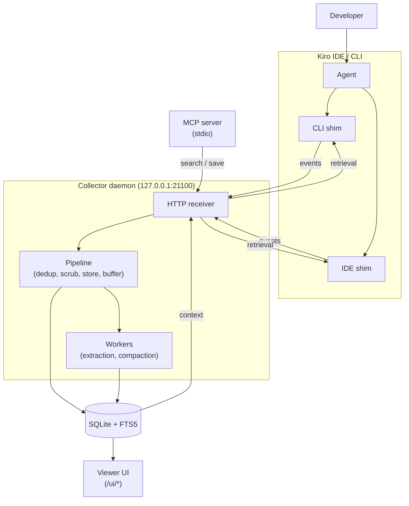

# kiro-learn

Continuous learning for Kiro agent sessions on AWS. Passively captures tool-use events from Kiro CLI and Kiro IDE hooks, extracts them into structured memory records via LLM, and injects relevant prior context into future sessions. Aligned with [Amazon Bedrock AgentCore Memory](https://docs.aws.amazon.com/bedrock-agentcore/latest/devguide/memory.html) vocabulary so a future migration is a field-mapping exercise.

Public docs: https://kiro-learn.mintlify.app — always the first place to look (and update) when working in this repo.

## Quick Reference

```bash
npm run build          # tsc -p tsconfig.build.json + vite build (UI) → dist/
npm run build:node     # tsc -p tsconfig.build.json → dist/ (no UI)
npm run build:ui       # vite build → dist/ui/
npm run typecheck      # tsc --noEmit against tsconfig.build.json + ui/tsconfig.json
npm run test           # vitest run — unit tests (test/unit/)
npm run test:integ     # vitest run — integration tests (test/integ/), needs kiro-cli + Bedrock
npm run test:all       # both suites sequentially
npm run lint           # eslint
npm run format:check   # prettier --check
npm run dev:ui         # vite dev server for UI (proxies /healthz + /v1 to collector)
```

**Node ≥ 22 required.** ESM-only (`"type": "module"`). All imports use explicit `.js` extensions even though the source is `.ts`. No third-party LLM SDKs — all AI work goes through `kiro-cli` → Amazon Bedrock. SQLite is `better-sqlite3`; the memory graph is `@cosmos.gl/graph`.

## Architecture



| Layer          | Location              | What it does                                                                                                                                                                                                     |
| -------------- | --------------------- | ---------------------------------------------------------------------------------------------------------------------------------------------------------------------------------------------------------------- |
| **Shim (CLI)** | `src/shim/cli-agent/` | Reads Kiro CLI hook stdin, builds `KiroMemEvent`, POSTs to collector, writes retrieval context to stdout. Exits 0 always.                                                                                        |
| **Shim (IDE)** | `src/shim/ide-hook/`  | Reads Kiro IDE hook event type from `argv[2]`, payload from `USER_PROMPT` env. Same POST/stdout pattern. Exits 0 always.                                                                                         |
| **Collector**  | `src/collector/`      | HTTP daemon. Pipeline: dedup → privacy scrub → storage → async extraction. Per-project NDJSON buffers with batch extraction and compaction. FTS5 retrieval with latency budget. Serves the viewer UI at `/ui/*`. |
| **MCP server** | `src/mcp/`            | Stdio MCP server: `search_memory`, `save_observation`, `save_session_summary`. Talks to the collector over HTTP.                                                                                                 |
| **Installer**  | `src/installer/`      | CLI (`init`/`start`/`stop`/`status`/`uninstall`). Bootstraps `~/.kiro-learn/`, writes agent configs, manages daemon, deploys UI assets.                                                                          |

## Non-negotiable constraints

These are constraints the agent cannot infer from the code alone. Violating them either breaks the build, fails guard tests, or corrupts the wire contract.

### TypeScript & ESM

- `exactOptionalPropertyTypes: true` — you cannot assign `undefined` to an optional field. Use `delete obj.field` or omit the key entirely.
- `noUncheckedIndexedAccess: true` — every `obj[key]` returns `T | undefined`. Narrow before use.
- `verbatimModuleSyntax: true` — use `import type { ... }` for type-only imports. The linter enforces this.
- All imports use `.js` extensions. Write `import { foo } from './bar.js'` even though the source is `bar.ts`.

### Modularity boundaries (enforced by guard tests)


<!-- Content truncated to meet Windsurf 6KB limit -->

---
> Source: [brendangeck/kiro-learn](https://github.com/brendangeck/kiro-learn) — distributed by [TomeVault](https://tomevault.io).
<!-- tomevault:4.0:windsurf_rules:2026-07-22 -->
