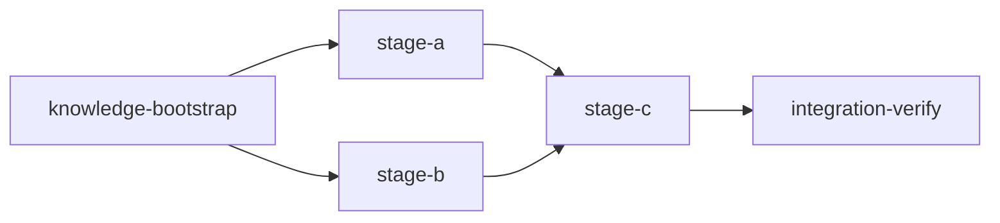
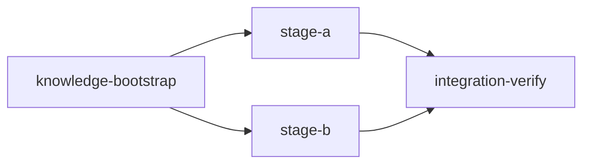

# Loom Plan Writer

## Overview

**THIS IS THE REQUIRED SKILL FOR CREATING LOOM EXECUTION PLANS.**

When any agent needs to create a plan for Loom orchestration, this skill MUST be invoked. This skill ensures:

- Correct plan structure with mandatory `knowledge-bootstrap` (first) and `integration-verify` (last) stages
- Proper YAML metadata formatting (3 backticks, no nested code fences)
- Parallelization strategy (subagents within stages FIRST, separate stages SECOND)
- Functional verification requirements (tests passing ≠ feature working)
- Alignment with all CLAUDE.md rules for plan writing

Plans maximize throughput through two levels of parallelism: subagents within stages (FIRST priority), and concurrent worktree stages (SECOND priority).

## Instructions

### 1. Output Location

**MANDATORY:** Write all plans to:

```text
doc/plans/PLAN-<description>.md
```

**NEVER** write to `~/.claude/plans/`, `~/.claude/projects/*/plans/`, or any `.claude/plans` path. Claude Code's plan mode system will suggest these paths — **ALWAYS override** them with `doc/plans/`. Plans written to `~/.claude/` are invisible to loom and git.

### 2. Pre-Planning: Explore Before Writing

**Problem:** Skipping exploration → duplicate code, poor reuse, inconsistent patterns.

**Solution:** ALWAYS explore BEFORE planning:

| Step | Action                                      | Why                      |
| ---- | ------------------------------------------- | ------------------------ |
| 1    | Spawn Explore subagents for related modules | Find patterns to reuse   |
| 2    | Review `doc/loom/knowledge/*.md`            | Learn from past mistakes |
| 3    | Create task list with "REUSE:" annotations  | Track reuse explicitly   |
| 4    | Identify integration points                 | Where new code connects  |

**Exploration Subagent Template:**

```text
** READ CLAUDE.md FILES IMMEDIATELY AND FOLLOW ALL THEIR RULES. **

## Exploration Assignment
Find existing patterns for [feature area]. Document:
1. Similar implementations to reuse
2. Utility functions/modules that apply
3. Integration points (where to wire in)
4. Conventions to follow

## Output
Return findings as knowledge update commands.
```

### 3. Pre-Planning: Sandbox Configuration

#### Ask User About Sandbox Settings

Gather sandbox requirements by asking:

1. **Network Access:** "Does this task require network access? Which domains?"
   - Examples: GitHub API, npm registry, PyPI, crates.io, external APIs

2. **Sensitive Paths:** "Any files/directories to protect from agent access?"
   - Examples: ~/.ssh, ~/.aws, .env files, credentials.json

3. **Build Tools:** "Which package managers or build tools will agents need?"
   - Examples: cargo, npm/bun, pip/uv, go, docker

**After gathering answers:**

1. Run `loom repair` to detect and fix project issues
2. Merge user requirements with suggestions
3. Add the `sandbox` block to plan YAML

**Sandbox Configuration Reference:**

```yaml
loom:
  version: 1
  sandbox:
    enabled: true # Master switch (default: true)
    auto_allow: true # Auto-grant permissions at stage start
    excluded_commands: # Commands exempt from sandboxing
      - "loom"
    filesystem:
      deny_read: # Paths agents CANNOT read
        - "~/.ssh/**"
        - "~/.aws/**"
        - "~/.config/gcloud/**"
        - "~/.gnupg/**"
      deny_write: # Paths agents CANNOT write
        - ".work/stages/**"
        - "doc/loom/knowledge/**" # Except knowledge/integration-verify stages
      allow_write: # Exceptions to deny rules
        - "src/**"
    network: # ⛔ MUST be struct, NOT string like "deny"
      allowed_domains: [] # Empty = deny all network (or list domains to allow)
      allow_local_binding: false
      allow_unix_sockets: []
```

**Per-Stage Overrides:**

```yaml
- id: my-stage
  sandbox:
    enabled: false # Disable for this stage only
    filesystem:
      allow_write:
        - "build/**" # Additional write access
```

**Special Stage Behavior:**

- `knowledge` and `integration-verify` stages automatically get write access to `doc/loom/knowledge/**`

### 4. Parallelization Strategy

```text
┌────────────────────────────────────────────────────────────────────┐
│  ⚠️  STAGES ARE EXPENSIVE                                         │
│                                                                    │
│  Each stage creates a git worktree, spawns a new session, and     │
│  costs significant time and tokens. STRONGLY prefer subagents      │
│  within one stage or agent teams over creating additional stages.  │
│                                                                    │
│  Only create a separate stage when:                                │
│  - Files overlap between tasks (merge conflicts)                   │
│  - Code dependency exists (B imports code A creates)               │
│  - Verification checkpoint needed (don't build on broken foundation)│
│                                                                    │
│  If tasks touch DIFFERENT files with no dependencies, use parallel │
│  subagents in ONE stage. This is always cheaper than separate      │
│  stages.                                                           │
└────────────────────────────────────────────────────────────────────┘
```

Maximize parallel execution at THREE levels:

```text
┌─────────────────────────────────────────────────────────────────────┐
│  PARALLELIZATION PRIORITY                                           │
│                                                                     │
│  1. AGENT TEAMS FIRST  - For wide-scope stages where inter-agent   │
│                          communication adds value (knowledge,       │
│                          review, verify)                            │
│                                                                     │
│  2. SUBAGENTS SECOND   - Within a stage, for concrete tasks with   │
│                          NO file overlap and clear assignments      │
│                                                                     │
│  3. STAGES THIRD       - Separate stages for tasks that touch      │
│                          same files or have code dependencies       │
│                          (loom merges branches)                     │
└─────────────────────────────────────────────────────────────────────┘
```

| Files Overlap? | Inter-agent Comms Needed? | Solution                       |
| -------------- | ------------------------- | ------------------------------ |
| NO             | NO                        | Same stage, parallel subagents |
| NO             | YES                       | Same stage, agent team         |
| YES            | Any                       | Separate stages, loom merges   |

#### SUBAGENT FILE EXCLUSIVITY (CRITICAL)

- **Each subagent MUST have EXCLUSIVE write access to its files**
- **Two subagents writing the same file = LOST WORK** (overwrites, conflicts)
- **Stage descriptions MUST include a file ownership table**
- If two tasks need to modify the same file, they MUST be in the same subagent OR handled sequentially by the main agent

**File Ownership Table Template:**

| Subagent | Files Owned (write) | Files Read-Only |
| -------- | ------------------- | --------------- |
| Subagent 1 — [role] | `src/auth/*.rs` | `src/config.rs` |
| Subagent 2 — [role] | `src/logging/*.rs` | `src/config.rs` |
| Subagent 3 — [role] | `tests/auth_test.rs` | `src/auth/*.rs` |

**Stage-Specific Defaults:**

- knowledge-bootstrap: Default to TEAM (coordinated exploration, researchers share discoveries that inform each other)
- standard (implementation): Default to SUBAGENTS (concrete file assignments, fire-and-forget). Use team only for wide/exploratory scope
- integration-verify: Default to TEAM (build + functional + code review + knowledge promotion tasks that may require iterative fixes)

### 4b. Stage Necessity Test (MANDATORY)

**BEFORE creating any stage beyond knowledge-bootstrap and integration-verify, evaluate:**

```text
┌─────────────────────────────────────────────────────────────────────┐
│  STAGE NECESSITY TEST - evaluate for EACH proposed stage:           │
│                                                                     │
│  Q1: Does this stage create code that another stage                 │
│      imports/calls/extends?                                         │
│      YES → Separate stages required (code dependency)               │
│      NO  → Continue to Q2                                           │
│                                                                     │
│  Q2: Does this stage write to files that another stage              │
│      also writes to?                                                │
│      YES → Separate stages required (file conflict)                 │
│      NO  → Continue to Q3                                           │
│                                                                     │
│  Q3: Does this stage need a verification checkpoint before          │
│      later work proceeds?                                           │
│      YES → Separate stage justified (quality gate)                  │
│      NO  → MERGE into one stage with parallel subagents             │
└─────────────────────────────────────────────────────────────────────┘
```

```text
┌─────────────────────────────────────────────────────────────────────┐
│  ⚠️  COMMON MISTAKE                                                  │
│                                                                     │
│  ❌ 4 stages editing independent config files:                       │
│     Stage 1: edit nginx.conf                                        │
│     Stage 2: edit docker-compose.yml                                │
│     Stage 3: edit .env.production                                   │
│     Stage 4: edit Caddyfile                                         │
│                                                                     │
│  ✅ 1 stage with 4 parallel subagents:                               │
│     Stage 1: edit all config files                                  │
│       Subagent A: nginx.conf                                        │
│       Subagent B: docker-compose.yml                                │
│       Subagent C: .env.production                                   │
│       Subagent D: Caddyfile                                         │
└─────────────────────────────────────────────────────────────────────┘
```

**WHEN STAGES ARE JUSTIFIED — concrete examples:**

| Scenario | Why Separate Stages |
| -------- | ------------------- |
| Data model stage → API stage | Code dependency: API imports model types |
| Same handler file modified by auth + logging | File conflict: both write to same file |
| Core library → multiple consumers | Verification checkpoint: consumers need stable base |

### 4c. Memory System (CRITICAL)

When agents work under loom orchestration, they MUST use loom's memory system exclusively:

- **USE:** `loom memory note`, `loom memory decision`, `loom memory question`, `loom memory change`
- **NEVER USE:** Claude Code's built-in auto-memory system (`~/.claude/projects/*/memory/`)
- **NEVER** call Write or Edit on files under `~/.claude/projects/*/memory/` or `~/.claude/plans/`

**Why this matters:** Loom memory is stage-scoped, embedded in agent signals, and curated into permanent knowledge during integration-verify. Claude Code's auto-memory is completely disconnected from loom orchestration — anything saved there is invisible to other stages, invisible to integration-verify, and will not be curated into project knowledge. It is effectively lost work.

**How auto-memory misuse manifests:** Claude Code has a built-in behavior to save "memories" by writing `.md` files to `~/.claude/projects/*/memory/`. When working under loom, this compulsion must be suppressed. If an agent wants to record an insight, decision, or mistake, it should use `loom memory note "..."` — not the Write tool targeting memory files.

Ensure stage descriptions remind agents of this when memory recording is expected. The subagent preamble (CLAUDE.md Rule 5) includes this guidance automatically.

### 5. Stage Description Requirement

**EVERY stage description MUST include this line:**

```text
Use parallel subagents and skills to maximize performance.
```

This ensures Claude Code instances spawn concurrent subagents for independent tasks.

**Stage descriptions using subagents MUST also include:**

- A `SUBAGENT FILE ASSIGNMENTS` block listing each subagent
- Each subagent's owned files and read-only files
- Explicit statement that NO file overlap exists between subagents

**Example in stage description:**

```yaml
description: |
  Implement auth, logging, and metrics modules.

  Use parallel subagents and skills to maximize performance.

  SUBAGENT FILE ASSIGNMENTS:
    Subagent 1 — Auth:
      Files Owned: src/auth/*.rs
      Files Read-Only: src/config.rs
    Subagent 2 — Logging:
      Files Owned: src/logging/*.rs
      Files Read-Only: src/config.rs
    Subagent 3 — Metrics:
      Files Owned: src/metrics/*.rs
      Files Read-Only: src/config.rs

  NO FILE OVERLAP between subagents confirmed.
```

IMPORTANT: Do NOT use triple backticks in YAML descriptions — use plain indented text instead.

### 6. Plan Structure

Every plan MUST follow this structure:

```text
┌─────────────────────────────────────────────────────────────────────┐
│  MANDATORY PLAN STRUCTURE                                           │
│                                                                     │
│  FIRST:  knowledge-bootstrap    (unless knowledge already exists)   │
│  MIDDLE: implementation stages  (parallelized where possible)       │
│  LAST:   integration-verify     (ALWAYS - reviews AND verifies)     │
└─────────────────────────────────────────────────────────────────────┘
```

Include a visual execution diagram using Mermaid:



Parallel stages are expressed using Mermaid's `&` operator (e.g., `A --> B & C` means A feeds both B and C concurrently).

### 7. Goal-Backward Verification (MANDATORY - VALIDATED)

```text
┌─────────────────────────────────────────────────────────────────────┐
│  ⚠️ STANDARD STAGES MUST HAVE VERIFICATION FIELDS                   │
│                                                                     │
│  Every stage with `stage_type: standard` MUST define at least ONE:  │
│                                                                     │
│  • truths     - Shell commands that return exit 0 if behavior works │
│  • artifacts  - Files that must exist with real implementation      │
│  • wiring     - Code patterns proving integration                   │
│                                                                     │
│  ⛔ `loom init` REJECTS plans that violate this requirement         │
│                                                                     │
│  Knowledge stages are EXEMPT.                                       │
└─────────────────────────────────────────────────────────────────────┘
```

**Why this is validated:** We have had MANY instances where tests pass but the feature is never wired up. These fields catch that.

**Quick Reference:**

| Field       | Purpose               | Example                                           |
| ----------- | --------------------- | ------------------------------------------------- |
| `truths`    | Observable behaviors  | `"myapp --help"`, `"curl -f localhost:8080"`      |
| `artifacts` | Files that must exist | `"src/feature.rs"`, `"tests/feature_test.rs"`     |
| `wiring`    | Integration patterns  | `source: "src/main.rs"`, `pattern: "mod feature"` |

### 8. Loom Metadata Format

Plans contain embedded YAML wrapped in HTML comments:

````markdown
<!-- loom METADATA -->

```yaml
loom:
  version: 1
  stages:
    - id: stage-id # Required: unique kebab-case identifier
      name: "Stage Name" # Required: human-readable display name
      description: | # Required: full task description for agent
        What this stage must accomplish.

        CRITICAL: Use parallel subagents and skills to maximize performance.

        Tasks:
        - Subtask 1 with requirements
        - Subtask 2 with requirements
      dependencies: [] # Required: array of stage IDs this depends on
      parallel_group: "grp" # Optional: concurrent execution grouping
      acceptance: # Required: verification commands
        - "cargo test"
        - "cargo clippy -- -D warnings"
      files: # Optional: target file globs for scope
        - "src/**/*.rs"
      working_dir: "." # Required: "." for worktree root, or subdirectory like "loom"
      execution_mode: team # Optional hint: single or team, agent decides
      # REQUIRED: At least ONE of truths/artifacts/wiring per stage
      truths: # Observable behaviors proving feature works
        - "myapp --help"
      artifacts: # Files that must exist with real implementation
        - "src/feature/*.rs"
      wiring: # Code patterns proving integration
        - source: "src/main.rs"
          pattern: "use feature"
          description: "Feature module is imported"
```

<!-- END loom METADATA -->
````

**YAML Formatting Rules:**

````text
┌─────────────────────────────────────────────────────────────────────┐
│  ⛔ NEVER PUT TRIPLE BACKTICKS INSIDE YAML DESCRIPTIONS             │
│                                                                     │
│  This BREAKS the YAML parser and causes validation to fail with    │
│  confusing errors (e.g., "missing truths/artifacts" when they      │
│  exist but weren't parsed).                                        │
│                                                                     │
│  ❌ WRONG:  description: |                                          │
│               Here's an example:                                    │
│               ```markdown                                           │
│               ## Title                                              │
│               ```                                                   │
│                                                                     │
│  ✅ CORRECT: description: |                                         │
│               Here's an example:                                    │
│                 ## Title                                            │
│                 Content here (plain indented text)                  │
└─────────────────────────────────────────────────────────────────────┘
````

| Rule                     | Correct                          | Incorrect               |
| ------------------------ | -------------------------------- | ----------------------- |
| Code fence               | 3 backticks                      | 4 backticks             |
| Nested code blocks       | NEVER in descriptions            | Breaks YAML parser      |
| Examples in descriptions | Use plain indented text          | Do NOT use ``` fences   |
| stage_type values        | lowercase/kebab-case             | PascalCase              |
| Path traversal           | NEVER use `../`                  | Causes validation error |
| network config           | `network: {allowed_domains: []}` | `network: deny`         |

#### Shell Command Escaping in YAML (CRITICAL)

Acceptance criteria, truths, and setup commands are shell commands inside YAML strings. **Most acceptance criteria failures are caused by YAML quoting/escaping issues, not incorrect commands.** The command itself may be perfectly valid shell, but YAML consumes or misinterprets characters before the shell ever sees them.

**THE GOLDEN RULES:**

1. **ALWAYS quote YAML string values** — never leave acceptance criteria unquoted
2. **Default to YAML single quotes** (`'...'`) for any command with double quotes, backslashes, or regex patterns — in YAML single quotes, NOTHING is special (no escape sequences)
3. **Use YAML double quotes** (`"..."`) only for simple commands or commands that contain literal single quotes
4. **Simplify commands** — prefer `grep -q`/`rg -q` over pipes; prefer `-F` for fixed strings over regex
5. **Never nest shell invocations** — loom already wraps commands with `sh -c`, so NEVER write `sh -c '...'` in acceptance criteria

**Why YAML single quotes are safer:** In YAML single-quoted strings, the ONLY special sequence is `''` (two single quotes = one literal single quote). Backslashes, double quotes, dollar signs, brackets — all literal. In YAML double-quoted strings, `\` is an escape character and `"` terminates the string.

**Common Escaping Failures and Fixes:**

```yaml
# ━━━ DOUBLE QUOTE CONFLICTS ━━━

# ❌ BREAKS: Inner double quotes terminate the YAML string
acceptance:
  - "grep -q "fn main" src/main.rs"
  # YAML sees: "grep -q " then fn main as bare text — parse error

# ✅ FIX: YAML single quotes make inner double quotes literal
acceptance:
  - 'grep -q "fn main" src/main.rs'

# ━━━ BACKSLASH CONSUMPTION ━━━

# ❌ BREAKS: YAML double quotes consume backslashes
truths:
  - "rg -q 'use\s+crate' src/lib.rs"
  # YAML turns \s into just s — shell sees 'uses+crate'

# ✅ FIX: YAML single quotes preserve backslashes
truths:
  - 'rg -q "use\s+crate" src/lib.rs'

# ━━━ NESTED SHELL QUOTING ━━━

# ❌ WRONG: Don't nest sh -c — loom already wraps with sh -c
acceptance:
  - "sh -c 'grep -q \"pattern\" file'"

# ✅ FIX: Write the command directly
acceptance:
  - 'grep -q "pattern" file'

# ━━━ COMPLEX PATTERNS ━━━

# ❌ FRAGILE: Mixed quotes and regex in YAML double quotes
acceptance:
  - "rg -q \"impl\\s+MyTrait\" src/lib.rs"

# ✅ ROBUST: YAML single quotes — everything is literal
acceptance:
  - 'rg -q "impl\s+MyTrait" src/lib.rs'

# ━━━ FIXED STRING MATCHING ━━━

# ❌ FRAGILE: Regex special chars in pattern
acceptance:
  - 'grep -q "Vec<String>" src/types.rs'
  # The < and > are regex metacharacters in some grep versions

# ✅ ROBUST: Use -F for fixed/literal string matching
acceptance:
  - 'grep -qF "Vec<String>" src/types.rs'
```

**YAML Quoting Decision Table:**

| Command Contains | Use YAML | Example |
|---|---|---|
| Nothing special | Either works | `"cargo test"` |
| Double quotes `"` | Single quotes | `'grep -q "pattern" file'` |
| Backslashes `\` | Single quotes | `'rg "\bword\b" file'` |
| Regex `[]{}()+*` | Single quotes | `'rg -q "fn\s+\w+" file'` |
| Single quotes `'` | Double quotes | `"grep -qF \"it's\" file"` |
| Both quote types | Double + escape `\"` | `"rg -qF \"it's a \\\"test\\\"\" file"` — or better: restructure the command |

**Prefer robust, simple commands:**

| Fragile Pattern | Robust Alternative |
|---|---|
| `grep "pattern" file \| wc -l \| grep -q "1"` | `grep -qc "pattern" file` or simply `grep -q "pattern" file` |
| `cat file \| grep "pattern"` | `grep -q "pattern" file` |
| `test "$(cmd)" = "value"` | `cmd \| grep -qxF "value"` |
| Regex with special chars | `grep -qF` or `rg -qF` for literal/fixed string matching |
| `echo "..." \| grep ...` | `rg -q "pattern" file` (search file directly) |

**Cross-Platform Compatibility (Linux + macOS):**

Loom runs on both Linux and macOS. Shell commands in acceptance criteria MUST work on both. Key differences:

| Tool/Feature | Linux | macOS | Safe Alternative |
|---|---|---|---|
| `grep` | GNU grep (supports `-P`) | BSD grep (NO `-P` flag) | Use `rg` instead of `grep` |
| `grep -P` (Perl regex) | Works | **FAILS** | `rg` natively supports Perl regex |
| `grep -oP` | Works | **FAILS** | `rg -o` |
| `readlink -f` | Works | **FAILS** | Avoid; use `test -f` or `test -d` |
| `sed -i` | `sed -i 's/...'` | `sed -i '' 's/...'` | Don't use `sed` in acceptance — use `rg` |
| `stat` format flags | `stat -c` | `stat -f` | Avoid `stat` in acceptance criteria |
| `sh -c` | POSIX sh (dash/bash) | POSIX sh (zsh backend) | Stick to POSIX features |

**Rules for cross-platform acceptance criteria:**

1. **Use `rg` instead of `grep`** — `rg` (ripgrep) behaves identically on both platforms
2. **Use `rg -qF` for fixed strings, `rg -q` for regex** — never rely on `grep -P`
3. **Use `test -f` / `test -d`** for file/directory existence checks — never `readlink`
4. **Stick to POSIX shell features** — no `[[ ]]`, no `echo -e`, no bash-specific syntax
5. **Prefer built-in loom verification fields** (`artifacts`, `wiring`) over shell commands for file existence and pattern checks

**When in doubt:** Use YAML single quotes and `rg -qF` for fixed string matching. This combination avoids YAML escaping issues, regex interpretation issues, AND cross-platform differences.

**stage_type Field (REQUIRED on every stage):**

| Value                | Use For                   | Special Behavior                         |
| -------------------- | ------------------------- | ---------------------------------------- |
| `knowledge`          | knowledge-bootstrap stage | Can write to doc/loom/knowledge/\*\*     |
| `standard`           | All implementation stages | Cannot write to knowledge files          |
| `integration-verify` | Final verification stage  | Can write to doc/loom/knowledge/\*\*, reviews |

**NEVER use PascalCase** (Knowledge, Standard, IntegrationVerify) - the parser rejects these.

**Example — CORRECT way to show code in descriptions:**

```yaml
description: |
  Create the config file with TOML format:
    [settings]
    key = "value"
```

**NEVER** put triple backticks inside YAML descriptions — they break parsing.

#### Working Directory Requirement

The `working_dir` field is **REQUIRED** on every stage. This forces explicit choice of where acceptance criteria run:

```yaml
working_dir: "."      # Run from worktree root
working_dir: "loom"   # Run from loom/ subdirectory
```

**Why required?** Prevents acceptance failures due to forgotten directory context. Every stage must consciously declare its execution directory.

**Path Resolution Formula:**

```text
EXECUTION_PATH = WORKTREE_ROOT / working_dir
```

All acceptance commands, truths, artifacts, and wiring paths resolve relative to `EXECUTION_PATH`. When you write an acceptance criterion, imagine you have `cd`-ed into `EXECUTION_PATH` first — that is where your command runs.

| `working_dir` | Worktree Root | Commands run from | `Cargo.toml` reference |
|---|---|---|---|
| `"."` | `.worktrees/my-stage/` | `.worktrees/my-stage/` | `Cargo.toml` (if at root) |
| `"loom"` | `.worktrees/my-stage/` | `.worktrees/my-stage/loom/` | `Cargo.toml` (NOT `loom/Cargo.toml`) |
| `"packages/core"` | `.worktrees/my-stage/` | `.worktrees/my-stage/packages/core/` | `Cargo.toml` (if it exists there) |

**Examples:**

```yaml
# Project with Cargo.toml at root
- id: build-check
  acceptance:
    - "cargo test"
  working_dir: "."

# Project with Cargo.toml in loom/ subdirectory
- id: build-check
  acceptance:
    - "cargo test"
  working_dir: "loom"
```

**Mixed directories?** Create separate stages instead of inline `cd`. Each stage = one working directory.

#### Pre-Flight Checklist for Acceptance Criteria (MANDATORY)

**Before writing ANY acceptance criterion, answer these three questions:**

```text
┌─────────────────────────────────────────────────────────────────────┐
│  PRE-FLIGHT: ANSWER BEFORE WRITING ACCEPTANCE CRITERIA              │
│                                                                     │
│  Q1: What is my working_dir?                                        │
│      → All commands execute from WORKTREE_ROOT / working_dir        │
│                                                                     │
│  Q2: Do the build files exist at that path?                          │
│      → If working_dir is "loom", Cargo.toml must be at loom/       │
│      → If working_dir is ".", Cargo.toml must be at repo root      │
│                                                                     │
│  Q3: Are ALL my paths relative to working_dir (not repo root)?      │
│      → If working_dir is "loom", use "src/main.rs" NOT "loom/src/"│
│      → If working_dir is ".", use "loom/src/main.rs" for files     │
│        inside the loom subdirectory                                 │
└─────────────────────────────────────────────────────────────────────┘
```

**Common Path Mistakes and Fixes:**

| Symptom | Cause | Fix |
|---|---|---|
| `could not find Cargo.toml` | `working_dir: "."` but Cargo.toml is in `loom/` | Set `working_dir: "loom"` |
| `No such file or directory` | Path not relative to `working_dir` | Remove redundant prefix |
| Double-path `loom/loom/src/...` | `working_dir: "loom"` with `loom/src/...` paths | Use `src/...` (already inside `loom/`) |
| Binary not found | Wrong path to compiled binary | Use path relative to `working_dir` |
| `rg` finds nothing | Searching from wrong directory | Check `working_dir` matches where files live |

**Binary path resolution:**

```yaml
# ❌ WRONG: Binary path ignores working_dir context
- id: test-cli
  working_dir: "loom"
  truths:
    - "loom/target/debug/myapp --help"  # Becomes loom/loom/target/debug/myapp

# ✅ CORRECT: Path relative to working_dir
- id: test-cli
  working_dir: "loom"
  truths:
    - "./target/debug/myapp --help"  # Becomes loom/target/debug/myapp

# ✅ ALSO CORRECT: Use installed binary name if on PATH
- id: test-cli
  working_dir: "loom"
  truths:
    - "myapp --help"  # Uses binary from PATH
```

#### Critical: All Paths are Relative to working_dir

This is a very common mistake. ALL path fields resolve relative to `working_dir`:

- `acceptance` commands execute with `working_dir` as CWD
- `artifacts` file paths are checked relative to `working_dir`
- `wiring` source paths are read relative to `working_dir`
- `truths` commands execute with `working_dir` as CWD

```yaml
# ❌ WRONG: working_dir is "loom" but paths redundantly include "loom/"
- id: implement-feature
  working_dir: "loom"
  artifacts:
    - "loom/src/feature.rs" # WRONG: becomes loom/loom/src/feature.rs
  wiring:
    - source: "loom/src/main.rs" # WRONG: becomes loom/loom/src/main.rs
      pattern: "mod feature"

# ✅ CORRECT: Paths relative to working_dir
- id: implement-feature
  working_dir: "loom"
  artifacts:
    - "src/feature.rs" # CORRECT: resolves to loom/src/feature.rs
  wiring:
    - source: "src/main.rs" # CORRECT: resolves to loom/src/main.rs
      pattern: "mod feature"
```

**Rule:** If `working_dir: "loom"`, write paths as if you're already IN `loom/`.

### 9. Goal-Backward Verification Details

**Every `standard` stage MUST have at least ONE of: truths, artifacts, or wiring.**

⛔ **This is VALIDATED by `loom init` — plans will be REJECTED if standard stages lack these fields.**

Knowledge stages are exempt (they have different purposes).

These fields verify the feature actually works, not just that tests pass:

| Field       | Purpose                                        | Example                                             |
| ----------- | ---------------------------------------------- | --------------------------------------------------- |
| `truths`    | Observable behaviors proving feature works     | `"myapp --help"`, `"curl -f localhost:8080/health"` |
| `artifacts` | Files that must exist with real implementation | `"src/auth/*.rs"`, `"tests/auth_test.rs"`           |
| `wiring`    | Code patterns proving integration              | source + pattern + description                      |

**Why required?** We have had MANY instances where tests pass but the feature is never wired up or functional. These fields catch that.

```yaml
# Example: CLI command stage
truths:
  - "myapp new-command --help" # Command is registered and callable
artifacts:
  - "src/commands/new_command.rs" # Implementation file exists
wiring:
  - source: "src/main.rs"
    pattern: "mod new_command"
    description: "Command module is imported in main"
  - source: "src/cli.rs"
    pattern: "NewCommand"
    description: "Command is registered in CLI"
```

**Minimum requirement:** At least ONE field with at least ONE entry. More is better for critical stages.

### 10. Knowledge Bootstrap Stage (First)

Captures codebase understanding before implementation:

```yaml
- id: knowledge-bootstrap
  name: "Bootstrap Knowledge Base"
  description: |
    MANDATORY first stage. Read existing doc/loom/knowledge AND .work/memory files!

    Use parallel subagents and skills to maximize performance.

    Step 0 - CHECK EXISTING KNOWLEDGE:
      Run: loom knowledge check
      Review output to identify gaps.

      IF coverage < 50% OR architecture shows INCOMPLETE:
        Run: loom map --deep
        This creates structural baseline without consuming your context.

    Step 1 - ARCHITECTURE MAPPING (if still needed after map):
      Before any other exploration, map the high-level architecture:
        - Core abstractions and their relationships
        - Data flow between major components
        - Module boundaries and dependencies
        - Extension points and plugin architecture
        - Write findings to architecture.md

    Step 2 - PARALLEL EXPLORATION (for semantic gaps):
      Based on loom knowledge check output, spawn Explore subagents:

      Subagent 1 - Entry Points:
        Assignment: Document CLI commands, API endpoints, event handlers
        Files owned: (read-only exploration)
        Output: loom knowledge update entry-points "..."

      Subagent 2 - Patterns:
        Assignment: Identify error handling, state management, data flow patterns
        Files owned: (read-only exploration)
        Output: loom knowledge update patterns "..."

      Subagent 3 - Conventions:
        Assignment: Document naming, file structure, testing patterns
        Files owned: (read-only exploration)
        Output: loom knowledge update conventions "..."

      IMPORTANT: Spawn these as parallel Task tool calls.

    CRITICAL: Use loom knowledge CLI commands, NOT Write/Edit tools.

    Commands to use:
      loom knowledge init              # If not initialized
      loom knowledge check             # Check existing coverage
      loom map --deep                  # If coverage < 50%
      loom knowledge update architecture "## Component\n\nRelationships..."
      loom knowledge update entry-points "## Section\n\nContent..."
      loom knowledge update patterns "## Pattern\n\nContent..."
      loom knowledge update conventions "## Convention\n\nContent..."

    For long content, use heredoc/stdin:
      loom knowledge update patterns - <<'EOF'
      ## Section Title
      Content here, can be as long as needed.
      EOF

    IMPORTANT: Before completing, review existing mistakes.md to avoid repeating errors.

    MEMORY RECORDING:
    - As you explore, record insights: loom memory note "observation"
    - Record decisions: loom memory decision "choice" --context "why"
    - Before completing: loom memory list (verify insights captured)
  dependencies: []
  acceptance:
    - "loom knowledge check --min-coverage 50"
    - 'rg -q "## " doc/loom/knowledge/architecture.md'
    - 'rg -q "## " doc/loom/knowledge/entry-points.md'
    - 'rg -q "## " doc/loom/knowledge/patterns.md'
    - 'rg -q "## " doc/loom/knowledge/conventions.md'
  files:
    - "doc/loom/knowledge/**"
  working_dir: "." # REQUIRED: "." for worktree root
  # REQUIRED: At least one verification field
  artifacts:
    - "doc/loom/knowledge/architecture.md"
    - "doc/loom/knowledge/entry-points.md"
```

**Skip ONLY if:** `doc/loom/knowledge/` already populated AND `loom knowledge check` shows coverage ≥ 50%.

### 11. Integration Verify Stage (Last)

Verifies all work integrates correctly after merges AND that the feature actually works:

```text
┌─────────────────────────────────────────────────────────────────────┐
│  ⚠️ CRITICAL: TESTS PASSING ≠ FEATURE WORKING                       │
│                                                                     │
│  We have had MANY instances where:                                  │
│  - All tests pass                                                   │
│  - Code compiles                                                    │
│  - But the feature is NEVER WIRED UP or FUNCTIONAL                  │
│                                                                     │
│  integration-verify MUST include FUNCTIONAL VERIFICATION:           │
│  - Can you actually USE the feature?                                │
│  - Is it wired into the application (routes, UI, CLI)?              │
│  - Does it produce the expected user-visible behavior?              │
└─────────────────────────────────────────────────────────────────────┘
```

```yaml
- id: integration-verify
  name: "Integration Verification"
  description: |
    Final integration verification - runs AFTER all feature stages complete.

    Use parallel subagents and skills to maximize performance.

    CRITICAL: This stage must verify FUNCTIONAL INTEGRATION, not just tests passing.
    Code that compiles and passes tests but is never wired up is USELESS.

    Tasks:
    1. Run full test suite (all tests, not just affected)
    2. Run linting with warnings as errors
    3. Verify build succeeds
    4. Check for unintended regressions

    CODE REVIEW (MANDATORY):
    5. Spawn PARALLEL specialized review subagents:
       - security-engineer: OWASP Top 10, auth flaws, input validation,
         secrets, credential management, dependency vulnerabilities
       - senior-software-engineer: code organization, design patterns,
         performance, documentation, maintainability
       - /loom-testing skill: unit test coverage, integration tests, edge cases
    6. Fix ALL issues found by reviewers - do not just report them
    7. Verify no code duplication, proper separation of concerns

    FUNCTIONAL VERIFICATION (MANDATORY):
    8. Verify the feature is actually WIRED INTO the application:
       - For CLI: Is the command registered and callable?
       - For API: Is the endpoint mounted and reachable?
       - For UI: Is the component rendered and interactive?
    9. Execute a manual smoke test of the PRIMARY USE CASE:
       - Run the actual feature end-to-end
       - Verify it produces expected output/behavior
       - Document the test steps and results
    10. Verify integration points with existing code:
        - Are callbacks/hooks connected?
        - Are events being published/subscribed?
        - Are dependencies injected correctly?

    KNOWLEDGE CURATION (MANDATORY):
    11. Read all stage memory: loom memory show --all
    12. Curate valuable insights to knowledge:
        - Mistakes worth avoiding → loom knowledge update mistakes "..."
        - Patterns worth reusing → loom knowledge update patterns "..."
        - Architectural decisions → loom knowledge update architecture "..."
    13. Update architecture.md if structure changed
    14. Record any lessons learned

    DOCUMENTATION UPDATE (MANDATORY):
    15. Review user-facing documentation files (README.md, CONTRIBUTING.md, etc.)
    16. Update documentation to reflect changes made by this plan:
        - New CLI commands, features, config options, workflows
        - Changed behavior or API surfaces
        - Removed functionality (remove stale references)
    17. Only update sections relevant to the changes — do NOT rewrite entire files
    18. If no user-facing behavior changed, skip but record WHY in memory
  dependencies: ["stage-a", "stage-b", "stage-c"] # ALL feature stages
  acceptance:
    - "cargo test"
    - "cargo clippy -- -D warnings"
    - "cargo build"
    # ADD FUNCTIONAL ACCEPTANCE CRITERIA - examples:
    # - 'myapp --help | rg -q "new-command"'  # CLI wired
    # - "curl -sf localhost:8080/api/new-endpoint"  # API wired
    # - 'rg -qF "NewComponent" src/app/routes.tsx'  # UI wired
  files:
    - "README.md"
    - "CONTRIBUTING.md"
    - "doc/**/*.md"
  working_dir: "." # REQUIRED: "." for worktree root, or subdirectory like "loom"
  # REQUIRED: At least one verification field
  truths:
    - "myapp new-command --help" # Feature is callable (adapt to YOUR feature)
  wiring:
    - source: "src/main.rs"
      pattern: "new_feature"
      description: "Feature is wired into main"
```

**Why integration-verify is mandatory:**

| Reason                  | Explanation                                        |
| ----------------------- | -------------------------------------------------- |
| Isolated worktrees      | Feature stages test locally, not globally          |
| Merge conflicts         | Individual tests pass but merged code may conflict |
| Cross-stage regressions | Stage A change may break Stage B functionality     |
| Single verification     | One authoritative pass/fail for entire plan        |
| **Wiring verification** | **Features must be connected to actually work**    |
| **Functional proof**    | **Smoke test proves the feature is usable**        |

### 12. Memory Recording in Stage Descriptions

**Every stage description should remind agents to record memory.** Memory persists insights across sessions and prevents repeated mistakes.

```text
┌─────────────────────────────────────────────────────────────────────┐
│  ⚠️  IMPLEMENTATION STAGES: Use `loom memory` ONLY                   │
│                                                                     │
│  Implementation stages must NEVER use `loom knowledge update`.      │
│  Only knowledge-bootstrap and integration-verify stages can write   │
│  to knowledge files directly.                                       │
│                                                                     │
│  Memory gets curated into knowledge during integration-verify.      │
└─────────────────────────────────────────────────────────────────────┘
```

Include a MEMORY RECORDING block in stage descriptions:

```yaml
description: |
  [Task description here]

  MEMORY RECORDING (use memory ONLY — never knowledge):
  Record IMMEDIATELY when these happen — not at stage end:
  - MISTAKE: tried X, failed → loom memory note "mistake: tried X, failed because Y, fixed by Z"
  - DECISION: chose X over Y → loom memory decision "chose X" --context "Y was worse because Z"
  - SURPRISE: unexpected behavior → loom memory note "found: description in file:line"
  - GOTCHA: trap for future agents → loom memory note "gotcha: X seems right but actually Y"
  Do NOT record: procedural actions, obvious outcomes, task restatements

  SUBAGENT MEMORY — subagents MUST also record memories:
  Include in every subagent Task prompt: "Record mistakes, decisions, and surprises
  using loom memory. Do NOT record procedural actions like 'read file' or 'ran tests'."
```

**Why this is mandatory:**

| Benefit                | Explanation                                                |
| ---------------------- | ---------------------------------------------------------- |
| Insight persistence    | Memory entries persist across sessions and context resets  |
| Mistake prevention     | Curated mistakes become knowledge that future agents read  |
| Decision documentation | Records WHY choices were made, not just what was done      |
| Learning transfer      | Memory → Knowledge curation makes lessons permanent        |

**Subagent Memory Recording:**

Subagents (spawned via Task tool) MUST also record memories. The subagent preamble in CLAUDE.md includes memory guidance, but stage descriptions should reinforce it:

```yaml
description: |
  [Task description]

  SUBAGENT FILE ASSIGNMENTS:
  ...

  SUBAGENT MEMORY — ALL subagents must record memories:
  - Mistakes and corrections: loom memory note "mistake: ..."
  - Non-obvious decisions: loom memory decision "..." --context "..."
  - Surprising discoveries: loom memory note "found: ..."
  - Do NOT record procedural actions ("read file", "ran tests", "spawned agents")
```

**Why subagent memory matters:**

- Subagent context is lost when the subagent completes — memory is the ONLY way to preserve insights
- Main agents cannot observe subagent mistakes — if the subagent doesn't record them, they're lost forever
- Integration-verify reads memory to curate knowledge — subagent insights are valuable input

### 13. Memory vs Knowledge Rules

**CRITICAL: Different stages have different recording permissions.**

| Stage Type            | `loom memory` | `loom knowledge`   |
| --------------------- | ------------- | ------------------ |
| knowledge-bootstrap   | YES           | YES                |
| Implementation stages | YES (ONLY)    | **FORBIDDEN**      |
| integration-verify    | YES           | YES (curate from memory) |

**Why this separation?**

- **Memory** is stage-scoped and temporary - captures all insights during work
- **Knowledge** is permanent and shared across all stages - only proven patterns belong here
- Only after full integration (integration-verify) do we know which insights are worth keeping permanently

**The Workflow:**

1. **knowledge-bootstrap**: Directly writes to knowledge files (architecture, patterns, conventions)
2. **Implementation stages**: Record EVERYTHING to memory, NEVER touch knowledge
3. **integration-verify**: Reads memory, curates valuable insights using `loom knowledge update`

**Implementation Stage Rule:**

During implementation stages, you MUST:

- Record insights with `loom memory note "..."`
- Record decisions with `loom memory decision "..." --context "..."`
- **NEVER** use `loom knowledge update` - this is FORBIDDEN

**Exception:** If you discover a CRITICAL MISTAKE that would block other stages, record it immediately with `loom knowledge update mistakes "..."` AND document why in your commit message.

### 14. Plan Document Structure

**Plans have TWO sections: human-readable content FIRST, YAML metadata LAST.**

```text
┌─────────────────────────────────────────────────────────────────────┐
│  PLAN DOCUMENT STRUCTURE                                            │
│                                                                     │
│  1. HUMAN-READABLE SECTION (TOP)                                    │
│     - Title, overview, goals                                        │
│     - Execution diagram                                             │
│     - Stage descriptions in plain language                          │
│     - Each stage: purpose, tasks, files, acceptance                 │
│                                                                     │
│  2. YAML METADATA (BOTTOM)                                          │
│     - Wrapped in <!-- loom METADATA --> comments                    │
│     - Machine-parseable stage definitions                           │
│     - Same information as above, in structured format               │
└─────────────────────────────────────────────────────────────────────┘
```

**Why this structure?**

| Benefit            | Explanation                                                |
| ------------------ | ---------------------------------------------------------- |
| Human review       | Users can quickly understand the plan without parsing YAML |
| Context for agents | Stage descriptions give agents fuller understanding        |
| Maintainability    | Humans can review/edit the readable section easily         |
| Machine processing | YAML at bottom still enables loom CLI parsing              |

### 15. After Writing Plan

1. Write plan to `doc/plans/PLAN-<name>.md`
2. **STOP** - Do NOT implement
3. Tell user:
   > Plan written to `doc/plans/PLAN-<name>.md`. Please review and run:
   > `loom init doc/plans/PLAN-<name>.md && loom run`
4. Wait for user feedback

**The plan file IS your deliverable.** Never proceed to implementation.

## Best Practices

1. **Subagents First**: Always maximize parallelism within stages before creating separate stages
2. **Explicit Dependencies**: Never create unnecessary sequential dependencies
3. **Clear File Scopes**: Define `files:` arrays to make overlap analysis explicit
4. **Actionable Descriptions**: Each description should be a complete task specification
5. **Testable Acceptance**: Every acceptance criterion must be a runnable command that works on BOTH Linux and macOS
6. **Bookend Compliance**: Always include knowledge-bootstrap first and integration-verify last
7. **Working Directory**: Every stage must declare its `working_dir` explicitly — run the pre-flight checklist before writing criteria
8. **Goal-Backward Verification**: Every `standard` stage MUST have at least one of `truths`, `artifacts`, or `wiring` (VALIDATED - plans will be REJECTED without this)
9. **YAML Single Quotes for Commands**: Default to YAML single quotes (`'...'`) for acceptance/truths commands containing double quotes, backslashes, or regex — prevents YAML escaping from mangling the command
10. **Use `rg` over `grep`**: `rg` (ripgrep) works identically on Linux and macOS; `grep` has BSD vs GNU differences that cause cross-platform failures

## Examples

### Example 1: Parallel Stages (No File Overlap)

```yaml
# Good - stages can run concurrently
stages:
  - id: add-auth
    dependencies: ["knowledge-bootstrap"]
    files: ["src/auth/**"]
    working_dir: "."
    artifacts: ["src/auth/mod.rs"]
  - id: add-logging
    dependencies: ["knowledge-bootstrap"]
    files: ["src/logging/**"]
    working_dir: "."
    artifacts: ["src/logging/mod.rs"]
  - id: integration-verify
    dependencies: ["add-auth", "add-logging"]
    working_dir: "."
    truths: ["myapp --help"]
```

### Example 2: Sequential Stages (Same Files)

```yaml
# Both touch src/api/handler.rs - must be sequential
stages:
  - id: add-auth-to-handler
    dependencies: ["knowledge-bootstrap"]
    files: ["src/api/handler.rs"]
    working_dir: "."
    wiring:
      - source: "src/api/handler.rs"
        pattern: "auth_middleware"
        description: "Auth middleware applied to handler"
  - id: add-logging-to-handler
    dependencies: ["add-auth-to-handler"] # Sequential
    files: ["src/api/handler.rs"]
    working_dir: "."
    wiring:
      - source: "src/api/handler.rs"
        pattern: "log_request"
        description: "Request logging added to handler"
  - id: integration-verify
    dependencies: ["add-logging-to-handler"]
    working_dir: "."
    truths: ["curl -f localhost:8080/api/health"]
```

### Example 3: Complete Plan Template

````markdown
# Plan: [Title]

## Overview

[2-3 sentence description of what this plan accomplishes and why.]

## Goals

- [Primary goal 1]
- [Primary goal 2]
- [Any constraints or non-goals]

## Execution Diagram



Parallel stages are expressed using Mermaid's `&` operator. Each node is a worktree stage.

---

## Stages

### 1. Knowledge Bootstrap

**Purpose:** Explore codebase and populate knowledge base before implementation.

**Tasks:**

- Map high-level architecture and component relationships
- Identify entry points (CLI commands, API endpoints, main modules)
- Document patterns (error handling, state management, idioms)
- Record conventions (naming, file structure, testing)

**Files:** `doc/loom/knowledge/**`

**Acceptance:** Knowledge files contain meaningful sections with `## ` headers.

---

### 2. Feature A

**Purpose:** [What Feature A accomplishes]

**Dependencies:** knowledge-bootstrap

**Tasks:**

- [Specific task 1 with clear requirements]
- [Specific task 2 with clear requirements]
- Use parallel subagents for independent subtasks

**Files:** `src/feature_a/**`

**Acceptance:** `cargo test` passes, feature module exists.

**Verification:** `src/feature_a/mod.rs` exists with implementation.

---

### 3. Feature B

**Purpose:** [What Feature B accomplishes]

**Dependencies:** knowledge-bootstrap (runs parallel with Feature A)

**Tasks:**

- [Specific task 1 with clear requirements]
- [Specific task 2 with clear requirements]
- Use parallel subagents for independent subtasks

**Files:** `src/feature_b/**`

**Acceptance:** `cargo test` passes, feature module exists.

**Verification:** `src/feature_b/mod.rs` exists with implementation.

---

### 4. Integration Verification

**Purpose:** Final verification that all features are wired up and functional, including code review.

**Dependencies:** stage-a, stage-b (all implementation stages)

**Tasks:**

_Build & Test:_

- Run full test suite (all tests, not just affected)
- Run linting with warnings as errors
- Verify build succeeds (debug and release)

_Code Review (MANDATORY):_

- Spawn parallel review subagents (security-engineer, senior-software-engineer, /loom-testing skill)
- Fix ALL issues found - do not just report them
- Verify no code duplication, proper separation of concerns

_Functional Verification (CRITICAL):_

- Verify features are WIRED INTO the application (not just compiled)
- Execute smoke test of primary use case end-to-end
- Confirm user-visible behavior works as expected

_Knowledge:_

- Read all stage memory and curate valuable insights to knowledge
- Update architecture.md if structure changed

_Documentation:_

- Update README.md, CONTRIBUTING.md, and other user-facing docs to reflect changes
- Add new sections for new features; update existing sections for changed behavior
- Remove references to removed functionality

**Files:** `README.md`, `CONTRIBUTING.md`, `doc/**/*.md` (documentation updates)

**Acceptance:** Build passes, tests pass, features callable via CLI/API.

**Verification:** `myapp --help` shows new features; `src/main.rs` imports feature modules.

---

<!-- loom METADATA -->

```yaml
loom:
  version: 1
  stages:
    - id: knowledge-bootstrap
      name: "Bootstrap Knowledge Base"
      stage_type: knowledge
      description: |
        Explore codebase and populate doc/loom/knowledge/.

        Use parallel subagents and skills to maximize performance.

        Tasks:
        - Identify entry points and main modules
        - Document patterns and conventions
      dependencies: []
      acceptance:
        - 'rg -q "## " doc/loom/knowledge/entry-points.md'
      files:
        - "doc/loom/knowledge/**"
      working_dir: "."
      artifacts:
        - "doc/loom/knowledge/architecture.md"
        - "doc/loom/knowledge/entry-points.md"

    - id: stage-a
      name: "Feature A"
      stage_type: standard
      description: |
        Implement feature A.

        Use parallel subagents and skills to maximize performance.

        Tasks:
        - Task 1
        - Task 2
      dependencies: ["knowledge-bootstrap"]
      acceptance:
        - "cargo test"
      files:
        - "src/feature_a/**"
      working_dir: "."
      artifacts:
        - "src/feature_a/mod.rs"

    - id: stage-b
      name: "Feature B"
      stage_type: standard
      description: |
        Implement feature B.

        Use parallel subagents and skills to maximize performance.

        Tasks:
        - Task 1
        - Task 2
      dependencies: ["knowledge-bootstrap"]
      acceptance:
        - "cargo test"
      files:
        - "src/feature_b/**"
      working_dir: "."
      artifacts:
        - "src/feature_b/mod.rs"

    - id: integration-verify
      name: "Integration Verification"
      stage_type: integration-verify
      description: |
        Final verification after all stages complete.

        Use parallel subagents and skills to maximize performance.

        CRITICAL: Verify FUNCTIONAL INTEGRATION, not just tests passing.

        Build/Test Tasks:
        - Full test suite
        - Linting
        - Build verification

        CODE REVIEW (MANDATORY):
        - Spawn parallel review subagents (security-engineer, senior-software-engineer, /loom-testing skill)
        - Fix ALL issues found - do not just report them
        - Verify no code duplication, proper separation of concerns

        FUNCTIONAL VERIFICATION (MANDATORY):
        - Verify features are WIRED into the application
        - Execute smoke test of primary use case
        - Confirm user-visible behavior works end-to-end

        DOCUMENTATION UPDATE (MANDATORY):
        - Review and update README.md, CONTRIBUTING.md, and other user-facing docs
        - Add new sections for new features; update existing for changed behavior
        - Remove references to removed functionality
        - If no user-facing behavior changed, skip but record WHY in memory
      dependencies: ["stage-a", "stage-b"]
      acceptance:
        - "cargo test"
        - "cargo clippy -- -D warnings"
        - "cargo build"
        # ADD: Functional acceptance criteria for YOUR feature
      files:
        - "README.md"
        - "CONTRIBUTING.md"
        - "doc/**/*.md"
      working_dir: "."
      truths:
        - "myapp --help" # Adapt to YOUR feature
      wiring:
        - source: "src/main.rs"
          pattern: "feature_a"
          description: "Feature A is wired into main"
```

<!-- END loom METADATA -->
````

### Example 4: Merged Stage with File Ownership (vs Wrong: Separate Stages)

```yaml
# ❌ WRONG: 3 separate stages for independent file changes
stages:
  - id: add-auth
    dependencies: ["knowledge-bootstrap"]
    files: ["src/auth/**"]
    working_dir: "."
    artifacts: ["src/auth/mod.rs"]
  - id: add-logging
    dependencies: ["knowledge-bootstrap"]
    files: ["src/logging/**"]
    working_dir: "."
    artifacts: ["src/logging/mod.rs"]
  - id: add-metrics
    dependencies: ["knowledge-bootstrap"]
    files: ["src/metrics/**"]
    working_dir: "."
    artifacts: ["src/metrics/mod.rs"]

# ✅ CORRECT: 1 stage with 3 parallel subagents and file ownership
stages:
  - id: implement-modules
    dependencies: ["knowledge-bootstrap"]
    description: |
      Implement auth, logging, and metrics modules.

      Use parallel subagents and skills to maximize performance.

      SUBAGENT FILE ASSIGNMENTS:
        Subagent 1 — Auth:
          Files Owned: src/auth/*.rs
          Files Read-Only: src/config.rs
        Subagent 2 — Logging:
          Files Owned: src/logging/*.rs
          Files Read-Only: src/config.rs
        Subagent 3 — Metrics:
          Files Owned: src/metrics/*.rs
          Files Read-Only: src/config.rs

      NO FILE OVERLAP between subagents confirmed.
    files: ["src/auth/**", "src/logging/**", "src/metrics/**"]
    working_dir: "."
    artifacts:
      - "src/auth/mod.rs"
      - "src/logging/mod.rs"
      - "src/metrics/mod.rs"
```

**Why this is better:**

| Aspect | 3 Stages | 1 Stage + 3 Subagents |
| ------ | -------- | --------------------- |
| Worktrees created | 3 | 1 |
| Sessions spawned | 3 | 1 (spawns 3 subagents) |
| Token cost | ~3x | ~1x |
| Merge operations | 3 | 1 |
| Risk of conflicts | Higher (3 merges) | None (exclusive files) |

---
> Converted and distributed by [TomeVault](https://tomevault.io/claim/cosmix) — claim your Tome and manage your conversions.
<!-- tomevault:4.0:skill_md:2026-04-11 -->
