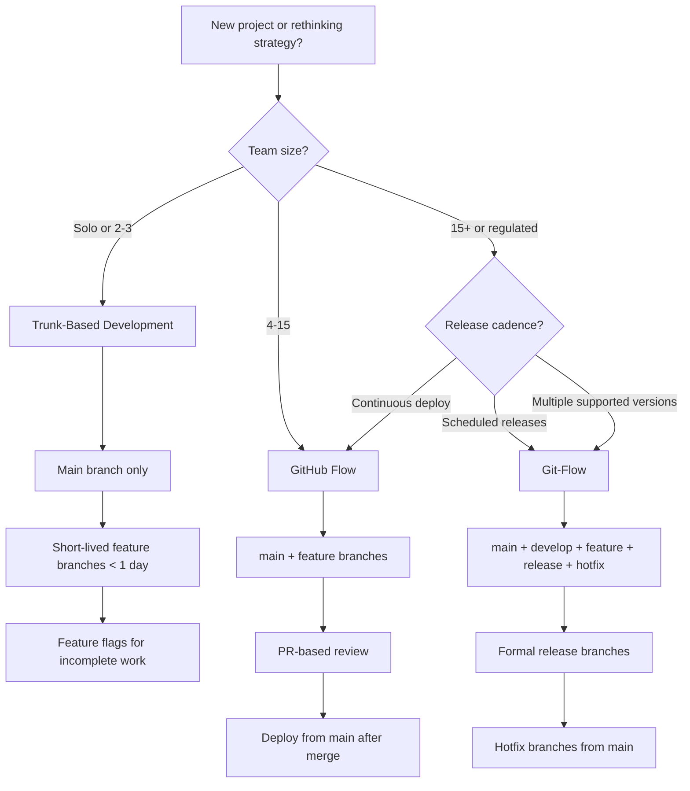
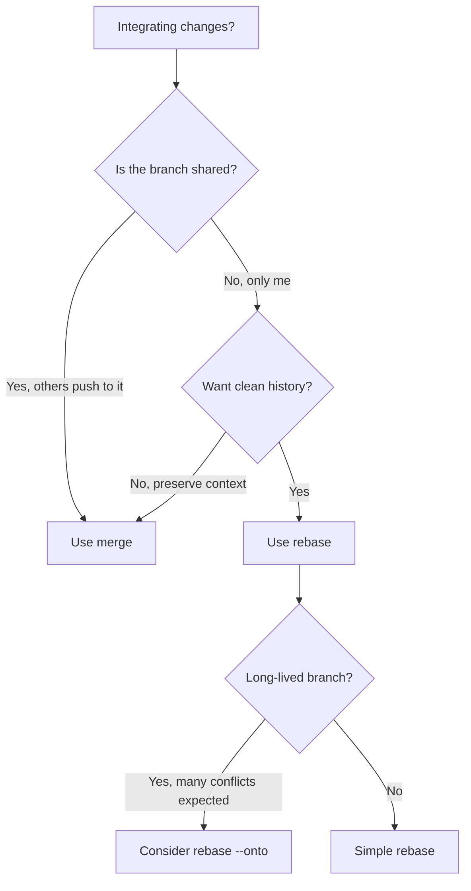

# Git Workflow Expert

Master git operations from daily workflow to disaster recovery. Covers branching strategies, merge vs rebase decisions, conflict resolution, monorepo patterns, and advanced operations that most developers never learn but desperately need.

## When to Use

**Use for**:
- Choosing a branching strategy for a project (trunk-based, GitHub Flow, git-flow)
- Resolving merge conflicts (especially complex multi-file conflicts)
- Rebase workflows (interactive rebase, rebase onto, autosquash)
- Cherry-picking across branches
- Using git bisect to find bug-introducing commits
- Recovering lost work with reflog
- Monorepo git patterns (sparse checkout, subtree, submodules)
- Cleaning up messy git history
- Setting up git hooks for quality gates
- Force push safety and shared branch protocols

**NOT for**:
- GitHub Actions / CI/CD pipelines (use `github-actions-pipeline-builder`)
- PR review process and checklists (use `code-review-checklist`)
- GitHub API / webhooks / repository management
- Git LFS setup (mention it, but not the core focus)

---

## Core Decision: Branching Strategy



### Strategy Comparison

| Dimension | Trunk-Based | GitHub Flow | Git-Flow |
|-----------|------------|-------------|----------|
| **Branch lifetime** | Hours | Days | Days-weeks |
| **Merge frequency** | Multiple/day | Daily | Per-sprint |
| **CI requirement** | Mandatory | Strong | Optional |
| **Rollback mechanism** | Feature flags | Revert commit | Release branch |
| **Best for** | High-trust teams | Most web projects | Versioned releases |
| **Worst for** | Junior-heavy teams | Multiple live versions | Fast iteration |

---

## Merge vs Rebase Decision



### Anti-Pattern: Rebase Shared Branches

**Novice**: "I'll rebase main into the shared feature branch to keep it clean."
**Expert**: Never rebase branches others are pushing to. Rebase rewrites commit SHAs — anyone who already pulled will get duplicate commits and merge hell. Use `merge` for shared branches, `rebase` for personal branches.
**Detection**: Multiple developers report "weird duplicate commits" after a pull.

### Anti-Pattern: Merge Commit Soup

**Novice**: "I'll just merge main into my feature branch every morning to stay current."
**Expert**: Daily merge commits from main create an unreadable history. Instead: `git rebase main` on your personal branch (one clean operation), or if you must merge, at least squash when merging back to main.
**Timeline**: Before 2020, merge was the default. Modern teams prefer rebase for feature branches, merge (or squash-merge) for PRs.

---

## Conflict Resolution

### The Calm Approach

```bash
# 1. Before resolving: understand what happened
git log --merge --oneline          # Show conflicting commits
git diff --name-only --diff-filter=U  # List conflicted files

# 2. For each file: understand both sides
git diff :2:file :3:file           # :2 = ours, :3 = theirs

# 3. Resolve, then verify
git add resolved-file.ts
git diff --cached                  # Review what you're about to commit

# 4. After all files resolved
git merge --continue               # or git rebase --continue
```

### Anti-Pattern: Accept Ours/Theirs Blindly

**Novice**: "This conflict is too complex, I'll just `git checkout --ours .` and be done."
**Expert**: Blindly accepting one side loses the other person's work. If a conflict is genuinely too complex, use a 3-way merge tool (`git mergetool`) to see base + ours + theirs simultaneously. For large-scale conflicts, consider `rerere` (reuse recorded resolution) to cache conflict solutions.
**Detection**: Features mysteriously disappear after merges.

---

## Advanced Operations

### Cherry-Pick Workflow

```bash
# Pick a specific commit from another branch
git cherry-pick abc123

# Pick a range (exclusive start, inclusive end)
git cherry-pick abc123..def456

# Cherry-pick without committing (stage only)
git cherry-pick --no-commit abc123

# If conflicts: resolve then
git cherry-pick --continue
```

**When to cherry-pick**: Hotfixes that need to go to multiple release branches. Bug fixes from a feature branch that's not ready to merge.

**When NOT to**: If you need many commits, merge or rebase instead. Cherry-pick creates duplicate commits with different SHAs.

### Git Bisect (Find Bug-Introducing Commit)

```bash
# Start bisect
git bisect start
git bisect bad                     # Current commit is broken
git bisect good v1.2.0             # This tag was working

# Git checks out a middle commit. Test it, then:
git bisect good                    # or: git bisect bad

# Repeat until git identifies the first bad commit

# Automated bisect with a test script:
git bisect start HEAD v1.2.0
git bisect run npm test            # Runs test at each step automatically
```

### Reflog Recovery (Undo Almost Anything)

```bash
# See recent HEAD positions
git reflog --oneline -20

# Recover a dropped stash
git stash list                     # Empty? Check reflog:
git fsck --no-reflogs | grep commit  # Find dangling commits
git show <sha>                     # Inspect to find your stash

# Undo a bad rebase
git reflog
# Find the SHA before the rebase started
git reset --hard HEAD@{5}          # Reset to that point

# Recover deleted branch
git reflog | grep "branch-name"
git checkout -b recovered-branch <sha>
```

### Interactive Rebase (Clean History)

```bash
# Rewrite last 5 commits
git rebase -i HEAD~5

# In the editor:
# pick   abc123 Add user model        ← keep as-is
# squash def456 Fix typo in user model ← squash into previous
# reword ghi789 Add auth              ← edit commit message
# drop   jkl012 WIP debugging         ← remove entirely
# edit   mno345 Add migration         ← pause to amend

# Autosquash: commits prefixed with "fixup!" or "squash!" auto-arrange
git commit --fixup abc123          # Creates "fixup! Add user model"
git rebase -i --autosquash HEAD~5  # Automatically squashes it
```

---

## Monorepo Git Patterns

### Sparse Checkout (Work on Subset)

```bash
# Enable sparse checkout
git sparse-checkout init --cone
git sparse-checkout set packages/core packages/cli

# Now only packages/core and packages/cli are checked out
# Other directories exist in git but aren't on disk
```

### Subtree (Embed Another Repo)

```bash
# Add a subtree
git subtree add --prefix=libs/shared https://github.com/org/shared.git main --squash

# Pull updates
git subtree pull --prefix=libs/shared https://github.com/org/shared.git main --squash

# Push changes back upstream
git subtree push --prefix=libs/shared https://github.com/org/shared.git feature-x
```

### Submodules vs Subtree

| Dimension | Submodules | Subtree |
|-----------|-----------|---------|
| **Model** | Pointer to external repo | Copy of external repo |
| **Clone** | Requires `--recurse-submodules` | Just works |
| **Update** | `git submodule update` | `git subtree pull` |
| **CI complexity** | Higher (need init step) | Lower |
| **Best for** | Large vendored deps | Small shared libs |
| **Footgun risk** | High (detached HEAD trap) | Low |

---

## Git Hooks for Quality

```bash
# .git/hooks/pre-commit (or use husky/lefthook)
#!/bin/sh
# Run linter on staged files only
npx lint-staged

# .git/hooks/commit-msg
#!/bin/sh
# Enforce conventional commits
if ! grep -qE "^(feat|fix|docs|style|refactor|test|chore)(\(.+\))?: .+" "$1"; then
  echo "Commit message must follow Conventional Commits format"
  exit 1
fi

# .git/hooks/pre-push
#!/bin/sh
# Run tests before push
npm test || exit 1
```

### Anti-Pattern: Skipping Hooks

**Novice**: "The pre-commit hook is slow, I'll just `--no-verify`."
**Expert**: If hooks are too slow, fix the hooks (use lint-staged for incremental linting, parallelize tests). `--no-verify` becomes a habit that defeats the purpose. If you truly need to skip once (emergency hotfix), document why in the commit message.

---

## Branching Strategy Selection Logic

When the user asks which branching strategy to use, apply these rules in order:

### Hard constraints (override everything)

1. **Multi-version library** (`hasMultipleVersions: true` AND `isLibrary: true`) → **git-flow**
   - Reasoning: Maintaining v2.x hotfixes while developing v3.x requires long-lived release branches. Trunk-based cannot serve two audiences.
   - Migration from trunk-based: Create `release/vN.x` branches from the last tag on each major. Backport via cherry-pick.

2. **Regulated industry** (`isRegulated: true`) → **git-flow**
   - Reasoning: Auditors expect named release branches with approval gates, a clear trail from commit to production, and the ability to point at a branch and say "this is what shipped." Trunk-based can technically satisfy this with tags, but the audit conversation is easier with git-flow.
   - Note: If CI maturity is high AND the compliance team is open to it, trunk-based with deploy tags + signed commits is superior. But assume the compliance team is not open to it.

### CI maturity gate

3. **Low CI maturity** (`ciMaturity: 'low'`) → **github-flow**
   - Reasoning: Trunk-based without comprehensive CI means broken code on main. GitHub Flow (feature branches + PR review + merge) provides a human safety net. Recommend investing in CI, then graduating to trunk-based.
   - Migration to trunk-based later: Shorten branch lifetimes to <1 day, add branch protection requiring green CI, then drop the requirement for PR approval on small changes.

### Default (most teams)

4. **Everything else** → **trunk-based**
   - Reasoning: Smallest feedback loops, least merge pain, forces good CI habits. Feature flags handle incomplete work. Short-lived branches (<1 day) are acceptable as a concession.
   - If team is >15 people: Consider trunk-based with short-lived feature branches (still trunk-based — the branch lives <24h and auto-deletes after merge).

### Migration paths

| From | To | Steps |
|------|----|-------|
| git-flow → trunk-based | 1. Merge `develop` into `main`. 2. Delete `develop`. 3. Set branch protection on `main` (require CI green). 4. Adopt feature flags for incomplete work. 5. Shorten branch lifetime target to <1 day. |
| git-flow → github-flow | 1. Merge `develop` into `main`. 2. Delete `develop` and all `release/*` branches. 3. PR directly to `main`. 4. Tag releases from `main`. |
| github-flow → trunk-based | 1. Reduce PR size to <200 lines. 2. Add comprehensive CI. 3. Allow direct push to `main` for trivial changes. 4. Keep PRs for larger changes but merge same-day. |

---

## Force Push Safety

```bash
# NEVER force push to main/master
# Use --force-with-lease instead of --force
git push --force-with-lease origin feature-branch

# --force-with-lease checks that remote hasn't been updated
# since your last fetch. Prevents overwriting others' work.

# Set as default (never use bare --force again):
git config --global alias.pushf "push --force-with-lease"
```

---

## References

- `references/advanced-rebase-patterns.md` — Consult for complex rebase scenarios: rebase --onto, interactive rebase strategies, handling rebase conflicts in long-lived branches
- `references/monorepo-git-strategies.md` — Consult for monorepo-specific patterns: sparse checkout optimization, CODEOWNERS, path-based CI triggers, large repo performance

---
> Converted and distributed by [TomeVault](https://tomevault.io/claim/curiositech) — claim your Tome and manage your conversions.
<!-- tomevault:4.0:skill_md:2026-04-16 -->
