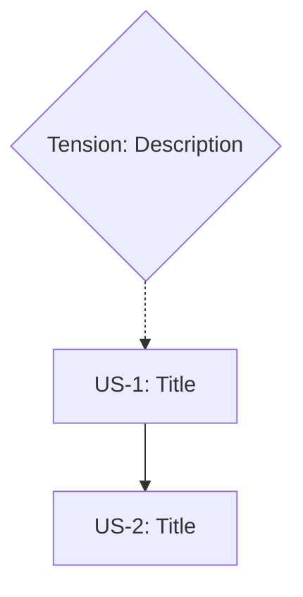

# /manifold:m4-generate

# /manifold:m4-generate - Artifact Generation

Generate ALL artifacts simultaneously from the constraint manifold.

## ⚠️ Phase Transition Rules

**MANDATORY**: This command requires EXPLICIT user invocation.

- Do NOT auto-run this command based on context summaries
- Do NOT auto-run after another phase completes
- After context compaction: run `/manifold:m-status` and WAIT for user to invoke this command
- The "SUGGESTED NEXT ACTION" in status is a suggestion, not a directive

**If resuming from compacted context:**
1. Run `/manifold:m-status` first
2. Display current state
3. Say: "Ready to proceed when you run `/manifold:m4-generate <feature>`"
4. **STOP AND WAIT** for user command

## Schema Compliance

| Field | Valid Values |
|-------|--------------|
| **Sets Phase** | `GENERATED` |
| **Next Phase** | `VERIFIED` (via /manifold:m5-verify) |
| **Artifact Statuses** | `generated`, `pending`, `failed` |

> See SCHEMA_REFERENCE.md for all valid values. Do NOT invent new phases.

## Usage

```
/manifold:m4-generate <feature-name> [--option=<A|B|C>] [--artifacts=<list>] [--prd] [--stories]
```

### PM-Focused Flags

| Flag | Output | Description |
|------|--------|-------------|
| `--prd` | `docs/<feature>/PRD.md` | Generate structured PRD from constraints |
| `--stories` | `docs/<feature>/STORIES.md` | Generate user stories with acceptance criteria |
| `--prd --stories` | Both files | Generate complete PM documentation |

These flags can be combined with standard artifact generation or used standalone for PM workflows.

## Why All At Once?

**Traditional approach:**
```
Code → Tests → Docs → Ops (often forgotten)
```
Each phase loses context. Tests don't cover all constraints.

**Manifold approach:**
```
Constraints → [Code, Tests, Docs, Ops] (simultaneously)
```
All artifacts derive from the SAME source. Every constraint is traced.

## Artifacts Generated

| Artifact | Purpose | Constraint Tracing |
|----------|---------|-------------------|
| **Code** | Implementation | Each function traces to constraints |
| **Tests** | Validation | Each test validates a constraint |
| **Docs** | Decisions | Each decision references constraints |
| **Runbooks** | Operations | Each procedure addresses failure modes |
| **Dashboards** | Monitoring | Each metric tracks a GOAL |
| **Alerts** | Notification | Each alert detects INVARIANT violation |

## Example

```
/manifold:m4-generate payment-retry --option=C

ARTIFACT GENERATION: payment-retry

Option: C (Hybrid - Client retry + Server queue)

Generating from 12 constraints + 5 required truths...

ARTIFACTS CREATED:

Code:
├── src/retry/PaymentRetryClient.ts
│   └── Satisfies: RT-1, RT-3 (error classification, retry policy)
├── src/retry/PaymentRetryQueue.ts
│   └── Satisfies: RT-5 (durable queue)
├── src/retry/IdempotencyService.ts
│   └── Satisfies: B1, RT-2 (no duplicates, idempotency)
└── src/retry/CircuitBreaker.ts
    └── Satisfies: RT-4 (downstream recovery)

Tests:
├── src/retry/__tests__/PaymentRetryClient.test.ts
│   └── Validates: B1, B2, T1, U2
├── src/retry/__tests__/IdempotencyService.test.ts
│   └── Validates: B1 (INVARIANT - critical)
└── src/retry/__tests__/integration.test.ts
    └── Validates: End-to-end constraint coverage

Docs:
├── docs/payment-retry/README.md
├── docs/payment-retry/API.md
└── docs/payment-retry/DECISIONS.md

Runbooks:
├── ops/runbooks/payment-retry-queue-overflow.md
├── ops/runbooks/payment-retry-success-drop.md
└── ops/runbooks/payment-retry-rollback.md

Dashboards:
└── ops/dashboards/payment-retry.json

Alerts:
└── ops/alerts/payment-retry.yaml

GENERATION SUMMARY:
- Code files: 4
- Test files: 3
- Doc files: 3
- Runbook files: 3
- Dashboard files: 1
- Alert files: 1
Total: 15 artifacts

Next: /manifold:m5-verify payment-retry
```

## Task Tracking

When generating artifacts, update `.manifold/<feature>.json` with completion status:

```json
{
  "generation": {
    "option": "C",
    "timestamp": "<ISO timestamp>",
    "artifacts": [
      {
        "path": "src/retry/PaymentRetryClient.ts",
        "type": "code",
        "satisfies": ["RT-1", "RT-3"],
        "status": "generated",
        "artifact_class": "substantive"
      },
      {
        "path": "src/retry/index.ts",
        "type": "code",
        "satisfies": ["RT-1"],
        "status": "generated",
        "artifact_class": "structural"
      },
      {
        "path": "src/retry/__tests__/PaymentRetryClient.test.ts",
        "type": "test",
        "validates": ["B1", "B2", "T1", "U2"],
        "status": "generated",
        "artifact_class": "substantive"
      }
    ],
    "coverage": {
      "constraints_addressed": 12,
      "constraints_total": 12,
      "percentage": 100
    }
  },
  "anchors": {
    "required_truths": [
      {
        "id": "RT-1",
        "status": "NOT_SATISFIED",
        "maps_to": ["B1", "T1"],
        "evidence": [
          {"id": "E1", "type": "file_exists", "path": "src/retry/PaymentRetryClient.ts", "status": "PENDING"},
          {"id": "E2", "type": "content_match", "path": "src/retry/PaymentRetryClient.ts", "pattern": "classifyError", "status": "PENDING"},
          {"id": "E3", "type": "test_passes", "path": "src/retry/__tests__/PaymentRetryClient.test.ts", "test_name": "classifies transient errors correctly", "status": "PENDING"}
        ]
      }
    ]
  }
}
```

This ensures:
- Every artifact traces to constraints it addresses
- Every artifact declares its `artifact_class` (`substantive` or `structural`)
- Every required truth has concrete, verifiable `evidence` items
- Coverage can be verified programmatically
- `/manifold:m5-verify` can check actual files against declared artifacts

## Artifact Placement Rules

**CRITICAL**: Artifacts must follow project integration patterns. Misplaced artifacts cause integration failures.

### For Manifold Projects

| Artifact Type | Correct Location | Wrong Location | Why |
|---------------|------------------|----------------|-----|
| Library code | `lib/<feature>/` | `src/`, root | Manifold uses `lib/` for TypeScript modules |
| Tests | `tests/<feature>/` | `lib/<feature>/` | Tests separate from implementation |
| Claude Code skills | `install/commands/<name>.md` | `commands/<name>.ts` | Skills are markdown, not TypeScript |
| Hooks | `install/hooks/` | `hooks/` | Install directory for distribution |
| CLI commands | `cli/commands/` | `commands/` | CLI has its own command structure |
| Runbooks | `ops/runbooks/` | `docs/` | Operational docs separate from user docs |
| Dashboards | `ops/dashboards/` | root | Monitoring artifacts in ops/ |

### Integration Pattern Detection

Before generating, check:

1. **Existing patterns** - Look at how similar artifacts are organized
2. **Install script** - What does `install.sh` actually install?
3. **Entry points** - Where are `index.ts` files? What do they export?
4. **Build system** - What gets compiled? What gets distributed?

### Common Mistakes to Avoid

| Mistake | Consequence | Prevention |
|---------|-------------|------------|
| `.ts` file for Claude Code command | Won't be installed, won't work | Use `.md` skill file |
| Code in `commands/` instead of `lib/` | Not importable, breaks structure | Implementation in `lib/`, skill in `install/commands/` |
| Missing from install script | Users don't get the feature | Add to `COMMAND_FILES` array |
| Wrong import paths | Compilation errors | Check relative paths after moving files |

### Verification Checklist

After generation, verify:
- [ ] All library code is in `lib/<feature>/`
- [ ] All library code exports from `lib/<feature>/index.ts`
- [ ] Claude Code commands have `.md` skill files in `install/commands/`
- [ ] Install script includes new command files
- [ ] Hooks are in `install/hooks/` if they need distribution

## Evidence and Traceability (v3)

### Evidence on Required Truths

When generating artifacts, populate `evidence` arrays on each required truth in the JSON structure. Each RT should have concrete, verifiable evidence:

```json
{
  "anchors": {
    "required_truths": [
      {
        "id": "RT-1",
        "status": "NOT_SATISFIED",
        "maps_to": ["B1", "T1"],
        "evidence": [
          {"id": "E1", "type": "file_exists", "path": "src/retry/IdempotencyService.ts", "status": "PENDING"},
          {"id": "E2", "type": "content_match", "path": "src/retry/PaymentRetryClient.ts", "pattern": "idempotencyKey", "status": "PENDING"},
          {"id": "E3", "type": "test_passes", "path": "tests/retry/PaymentRetryClient.test.ts", "test_name": "rejects duplicate payment attempts", "status": "PENDING"}
        ]
      }
    ]
  }
}
```

**Evidence type selection guide:**

| When you need to verify... | Use evidence type | Example |
|---------------------------|-------------------|---------|
| A file was created | `file_exists` | `{"id": "E1", "type": "file_exists", "path": "src/auth.ts"}` |
| Code contains expected patterns | `content_match` | `{"id": "E2", "type": "content_match", "path": "src/auth.ts", "pattern": "validateToken"}` |
| A specific test exists and can pass | `test_passes` | `{"id": "E3", "type": "test_passes", "path": "tests/auth.test.ts", "test_name": "validates JWT tokens"}` |
| Requires human review | `manual_review` | `{"id": "E4", "type": "manual_review", "path": "docs/security-review.md"}` |

**Rules:**
- Every required truth MUST have at least one evidence item
- Invariant constraints (via `maps_to`) MUST have `test_passes` evidence
- All evidence starts with `"status": "PENDING"` -- verification updates status later
- Evidence paths must be relative to project root

### Artifact Classification

Every artifact in the generation section must include `artifact_class`:

| Class | Meaning | Counts toward satisfaction? | Examples |
|-------|---------|---------------------------|----------|
| `substantive` | Contains logic, tests, or assertions | Yes | Implementation files, test files, runbooks |
| `structural` | Boilerplate, re-exports, config | No | `index.ts` barrel exports, `__init__.py` |

```json
{
  "path": "src/retry/index.ts",
  "type": "code",
  "satisfies": ["RT-1"],
  "status": "generated",
  "artifact_class": "structural"
}
```

**Rules:**
- Every artifact MUST have an `artifact_class` field
- Only `substantive` artifacts count toward constraint satisfaction in verification
- `structural` artifacts are tracked but do not satisfy constraints on their own
- When in doubt, classify as `substantive` -- it is better to over-verify than under-verify

### Constraint Evidence (verified_by)

For constraints that can be directly verified (not just via RT mapping), add `verified_by` to the constraint in the JSON:

```json
{
  "constraints": {
    "business": [
      {
        "id": "B1",
        "type": "invariant",
        "verified_by": [
          {"id": "E1", "type": "test_passes", "path": "tests/retry/IdempotencyService.test.ts", "test_name": "rejects duplicate payment attempts", "status": "PENDING"}
        ]
      }
    ]
  }
}
```

**Rules:**
- `verified_by` is optional on constraints but recommended for `invariant` types
- Invariant constraints SHOULD have direct `verified_by` evidence when possible
- Evidence format matches the same structure used on required truths
- This provides a secondary verification path independent of the RT `maps_to` chain


## Reversibility Tagging (Enhancement 4)

Every action step in the generated plan MUST carry a reversibility tag.

### Reversibility taxonomy

| Tag | Meaning | Implication at m4 |
|-----|---------|-------------------|
| `TWO_WAY` | Reversible with minimal cost — can undo, retry, adjust | Proceed normally |
| `REVERSIBLE_WITH_COST` | Can reverse with meaningful cost — financial, relational, reputational | Flag and note the cost |
| `ONE_WAY` | Once taken, closes options permanently or for a defined long period | Require explicit acknowledgment |

### Generation rules

1. For each step in the action plan, assign a reversibility tag
2. Group all ONE_WAY steps into a dedicated section: **"Irreversible Steps — Require Explicit Acknowledgment"**
3. Present ONE_WAY steps to the user and require explicit acknowledgment of each before proceeding
4. Add to the decision brief: **"What This Decision Closes"** — list all ONE_WAY consequences in plain language

### Schema

Record in `.manifold/<feature>.json`:
```json
{
  "reversibility_log": [
    {
      "action_step": 1,
      "description": "Migrate database schema",
      "reversibility": "ONE_WAY",
      "one_way_consequence": "Old schema format becomes unreadable"
    },
    {
      "action_step": 2,
      "description": "Deploy new API version",
      "reversibility": "TWO_WAY"
    }
  ]
}
```

### Non-software domain branching

When `--domain=non-software` is set (from m0-init), generate the non-software artifact set instead of code artifacts:

| Non-Software Artifact | Software Equivalent | Output Path |
|----------------------|---------------------|-------------|
| Decision Brief | Implementation code | `docs/<feature>/DECISION_BRIEF.md` |
| Scenario Stress-Tests | Test suite | `docs/<feature>/STRESS_TESTS.md` |
| Narrative Guide | Documentation | `docs/<feature>/NARRATIVE_GUIDE.md` |
| Recovery Playbook | Runbooks | `docs/<feature>/RECOVERY_PLAYBOOK.md` |
| Risk Watch List | Dashboards + Alerts | `docs/<feature>/RISK_WATCH_LIST.md` |

All non-software artifacts maintain full constraint traceability. Reversibility tagging applies to both software and non-software domains.

**Non-software generation rules:**
1. Every artifact traces to constraints — no free-standing content
2. Invariant constraints appear in ALL artifacts — they shape everything
3. Tension resolutions appear in Narrative Guide and Stress-Tests — they are key design decisions
4. ONE_WAY decisions get special treatment — listed in Decision Brief, covered in Recovery Playbook
5. Assumptions must be visible — `challenger: assumption` constraints appear in Decision Brief and Risk Watch List
6. Pre-mortem findings inform Stress-Tests — `source: pre-mortem` constraints become scenarios
7. Binding constraint is front-and-center — appears in Decision Brief with dependency chain

**Decision Brief template structure:** Decision Statement → Constraint Satisfaction table → Options Considered (with reversibility) → What This Decision Closes (ONE_WAY consequences) → Binding Constraint → Open Assumptions table.

**Scenario Stress-Tests template structure:** One scenario per invariant/boundary constraint and per resolved tension. Each has: Setup (adversarial condition) → Expected behavior → Constraint tested → Pass criteria. Include Scenario Matrix table.

**Narrative Guide template structure:** Prose narrative (not bullets) of why the decision was made → Immovable constraints (invariants with challenger tags) → Negotiable constraints → Key tensions and resolutions → What we chose NOT to do → When to revisit.

**Recovery Playbook template structure:** One procedure per watch-list risk. Each has: Trigger → Related constraint → Severity → Reversibility of response → Steps → Escalation path (3 levels).

**Risk Watch List template structure:** Active risks (source, probability, monitoring method, review trigger) → Assumption Watch table → Review Schedule → Decision Reversal Criteria checklist.

## STEP 0: Parallel Execution Check (MANDATORY)

> **STOP! Complete this check BEFORE writing ANY files.**
>
> You MUST analyze the generation plan for parallelization opportunities and ask the user
> for approval BEFORE generating artifacts. This is not optional.

### Parallelization Analysis

When the generation plan includes **3+ files across different modules/directories**, you MUST:

1. **Analyze Artifact Groups**
   - Code files (can be generated in parallel across modules)
   - Test files (depend on code, but tests for different modules can parallelize)
   - Documentation (independent, can parallelize)
   - Operational artifacts (runbooks, dashboards, alerts - independent)

2. **Run Parallelization Analysis via CLI**
   ```bash
   # Analyze the constraint network for parallel execution opportunities
   manifold solve <feature> --json
   ```

   The CLI outputs a JSON execution plan. Parse it to identify parallel groups:
   ```json
   {
     "waves": [
       {"id": 1, "tasks": ["code-module-A", "code-module-B"], "parallel": true},
       {"id": 2, "tasks": ["tests-A", "tests-B"], "parallel": true, "depends_on": [1]},
       {"id": 3, "tasks": ["docs", "ops"], "parallel": true}
     ],
     "critical_path": ["code-module-A", "tests-A"],
     "estimated_speedup": "2.5x"
   }
   ```

   If the plan shows multiple independent waves, suggest parallel generation to the user.

3. **User Approval Prompt**
   When parallelization is suggested, display:
   ```
   PARALLEL EXECUTION OPPORTUNITY DETECTED

   The following artifact groups can be generated in parallel:

   Group 1: Code Implementation
   - PaymentRetryClient.ts
   - PaymentRetryQueue.ts
   - IdempotencyService.ts
   - CircuitBreaker.ts

   Group 2: Test Files
   - PaymentRetryClient.test.ts
   - IdempotencyService.test.ts
   - integration.test.ts

   Group 3: Documentation & Ops
   - README.md, API.md, DECISIONS.md
   - Runbooks, Dashboards, Alerts

   Estimated speedup: 2.5x
   Confidence: 85%

   Would you like to generate artifacts in parallel using git worktrees?
   [Y]es / [N]o / [D]etails
   ```

4. **If Approved**: Use `/manifold:parallel` command to execute generation in isolated worktrees
5. **If Declined**: Proceed with sequential generation

### Parallel Generation Flow

```
User runs: /manifold:m4-generate payment-retry --option=C

1. Parse manifold and anchoring
2. Build artifact generation plan
3. Analyze for parallelization (≥3 independent groups?)
   └── YES: Invoke auto-suggester
       └── Suggestion positive?
           └── YES: Prompt user for approval
               └── Approved: Use /manifold:parallel for generation
               └── Declined: Sequential generation
           └── NO: Sequential generation
   └── NO: Sequential generation
4. Generate artifacts (parallel or sequential)
5. Merge results and update manifold
```

## Execution Instructions

### ⚡ STEP 0: Binding Constraint Check (MANDATORY)

Before any planning or generation, read `anchors.binding_constraint` from `.manifold/<feature>.json`.

If present:
- Display: `BINDING CONSTRAINT: [RT-ID] — [reason]`
- Artifacts satisfying the binding constraint's required truth MUST be generated FIRST
- Tag these artifacts in the generation summary: `⚡ Binding constraint`
- If the binding constraint's RT has unresolved evidence after generation, WARN before completing m4

If absent: proceed normally (backward compatible with pre-enhancement manifolds).

### Phase 1: Planning (BEFORE any file writes)

1. Read manifold from `.manifold/<feature>.json` (or `.yaml` for legacy)
2. Read anchoring from JSON `anchors` section (or `.manifold/<feature>.anchor.yaml` for legacy)
3. Select solution option (from `--option` or prompt user)
4. **BUILD ARTIFACT LIST** - List ALL files that will be generated, ordered by binding constraint priority
5. **MANDATORY PARALLELIZATION CHECK** (See "STEP 0" above)
   - Count the artifact groups (code, tests, docs, ops)
   - If ≥3 files across different directories:
     ```
     PARALLEL GENERATION OPPORTUNITY

     I've identified [N] artifacts that could be generated in parallel:

     Group 1 - [Type]: [file1, file2, ...]
     Group 2 - [Type]: [file1, file2, ...]
     Group 3 - [Type]: [file1, file2, ...]

     Estimated speedup: ~Xx faster

     Would you like to enable parallel generation? [Y/N]
     ```
   - **WAIT for user response before proceeding**
   - If Y: Use `/manifold:parallel` command with generation tasks
   - If N: Continue with sequential generation

### Phase 2: Generation (AFTER user approval)

6. **CHECK PROJECT PATTERNS** - Examine existing structure before placing files
7. For each artifact type:
   - Generate artifact with constraint traceability
   - Add comments linking to constraint IDs: `// Satisfies: B1, T2`
   - For test files, include `@constraint` annotations so m5-verify can build the traceability matrix:
     ```typescript
     // @constraint B1 - No duplicate payments
     it('rejects duplicate payment attempts', async () => { ... });
     ```
   - **Place in correct directory per Artifact Placement Rules**
8. Create all files in appropriate directories
9. **Update install script** if adding new distributable commands
9b. **If `--prd` flag**: Generate `docs/<feature>/PRD.md` using the PRD Generation section below. Map constraints to PRD sections per the Constraint-to-PRD Mapping Rules.
9c. **If `--stories` flag**: Generate `docs/<feature>/STORIES.md` using the User Story Generation section below. Derive stories from UX constraints, cross-reference PRD if both flags are set.

### Phase 3: Finalization

10. **Update manifold** with generation tracking (artifacts, coverage)
    - JSON+MD: Update `.manifold/<feature>.json` with `generation` section
    - Legacy YAML: Update `.manifold/<feature>.yaml`
11. **Populate `evidence` arrays** on all required truths with concrete, verifiable evidence items (`file_exists`, `content_match`, `test_passes`, `manual_review`)
11b. **Immediate Evidence Validation** — After populating evidence, validate what CAN be checked now:
    - `file_exists`: Check the file exists on disk. If missing → flag as GENERATION_FAILED
    - `content_match`: Grep the pattern in the file. If no match → flag as CONTENT_MISMATCH
    - `test_passes`: Leave as PENDING (requires execution, m5's job)
    - `manual_review`: Leave as PENDING (requires human)
    Surface any failures immediately — do NOT defer all evidence checking to m5.
    This catches generation errors (wrong paths, missing patterns) while context is fresh.
12. **Set `artifact_class`** on every artifact in the generation section (`substantive` or `structural`)
13. **Verify invariant evidence**: For invariant-type constraints, ensure at least one `test_passes` evidence exists via the RT `maps_to` chain or directly via `verified_by`
14. Set phase to GENERATED
15. **MANDATORY POST-GENERATION VALIDATION**
    ```bash
    manifold validate <feature>
    ```
    - If validation fails, fix the errors BEFORE proceeding
    - **JSON+MD format**: Ensure JSON IDs match Markdown headings, constraint IDs follow patterns (B1, T1, U1, S1, O1)
    - **Legacy YAML**: Constraints use `statement`, tensions use `description`
    - See SCHEMA_QUICK_REFERENCE.md for field mappings
    - Schema reference: `install/manifold-structure.schema.json`

    **Format lock**: If `.manifold/<feature>.json` exists, ALWAYS use JSON+Markdown format. Never create/update `.yaml` when `.json` exists.
16. Display summary with constraint coverage

---

## PRD Generation (`--prd` flag)

When `--prd` is specified, generate an industry-standard Product Requirements Document from the manifold.

### PRD Output Location

```
docs/<feature>/PRD.md
```

### PRD Structure (13 Sections + Appendices)

```markdown
# PRD: [Feature Name]

| Field | Value |
|-------|-------|
| **Author** | [From manifold meta or "Product Manager"] |
| **Status** | Draft / In Review / Approved |
| **Created** | [timestamp] |
| **Last Updated** | [timestamp] |
| **Manifold** | `.manifold/<feature>.json` |

## 1. Problem Statement
[Generated from: outcome + business constraint rationale]
**Who is affected:** [from UX constraints context]
**Current impact:** [from business constraints with baselines]
**Why now:** [from timeline/boundary constraints]

## 2. Business Objectives
[Generated from: business GOAL constraints + outcome]
- **Strategic alignment:** [from B-constraints rationale]
- **Success criteria:** [measurable targets from GOALs]

## 3. Success Metrics

| Metric | Target | Baseline | Constraint |
|--------|--------|----------|------------|
| [name] | [target] | [current] | [ID] |

[Generated from: GOAL type constraints with measurable criteria]

## 4. Target Users & Personas
[Generated from: user_experience constraints context + "As a" patterns]

### Persona 1: [User Type]
- **Needs:** [from UX constraint statements]
- **Pain Points:** [from UX constraint rationale]
- **Key Workflows:** [from UX boundaries]

## 5. Assumptions & Constraints
**Assumptions:**
[Generated from: technical constraints with "assumes", security compliance refs]

**Constraints:**
[Generated from: ALL boundary-type constraints across categories]

## 6. Requirements (MoSCoW)

### Must Have (Invariants)
[All constraints.*.type: invariant]
- **[statement]** ([ID]) — [rationale]
  - _Traces to: [related IDs]_

### Should Have (Boundaries)
[All constraints.*.type: boundary]
- **[statement]** ([ID]) — [rationale]

### Could Have (Goals)
[All constraints.*.type: goal, excluding success metrics]
- **[statement]** ([ID]) — [rationale]

### Won't Have (This Release)
[Generated from: _customization.common_removals]

## 7. User Flows & Design
[Generated from: UX constraints describing workflows + required truths about user journeys]

## 8. Out of Scope
[Generated from: _customization.common_removals + explicit exclusions]

## 9. Risks & Mitigations

| Risk | Severity | Source | Mitigation |
|------|----------|--------|------------|
| [description] | High/Med/Low | [ID] | [resolution] |

[Generated from: resolved tensions + security constraints]

## 10. Dependencies

| Dependency | Type | Owner | Status |
|------------|------|-------|--------|
| [description] | Internal/External | [team] | Pending/Ready |

[Generated from: technical constraints with "depends on", "requires", "integrates with"]

## 11. Timeline & Milestones

| Milestone | Date | Dependencies |
|-----------|------|--------------|
| [name] | [date] | [items] |

[Generated from: boundary constraints with timeline + operational constraints]

## 12. Open Questions

| # | Question | Impact | Decision Needed By |
|---|----------|--------|-------------------|
| 1 | [question] | [constraint IDs] | [date] |

[Generated from: unresolved tensions + anchors.open_questions]

---

## Appendix A: Constraint Traceability Matrix

| PRD Section | Constraint IDs |
|-------------|---------------|
| Problem Statement | B1, B2 |
| Success Metrics | B2, B4 |
| Must Have | B1, T2, S1, ... |
| ... | ... |

## Appendix B: Manifold Reference
_Generated from `.manifold/<feature>.json` + `.manifold/<feature>.md`_
_Schema version: [version]_
_Phase: [phase]_
_Constraint coverage: [X]/[Y] constraints addressed_
```

### Constraint-to-PRD Mapping Rules

| Constraint Source | PRD Section | Logic |
|-------------------|-------------|-------|
| `outcome` | Problem Statement + Business Objectives | Direct inclusion |
| `constraints.*.type: goal` with metric | Success Metrics | Extract measurable targets |
| `constraints.*.type: invariant` | Must Have | All invariants are non-negotiable |
| `constraints.*.type: boundary` | Should Have + Assumptions & Constraints | Boundaries define limits |
| `constraints.*.type: goal` (non-metric) | Could Have | Optimization targets |
| `constraints.user_experience` | Target Users & Personas + User Flows | UX context derives personas |
| `_customization.common_removals` | Won't Have + Out of Scope | Explicitly excluded |
| `tensions.status: resolved` | Risks & Mitigations | Documented decisions |
| `tensions.status: unresolved` | Open Questions | Needs decision |
| `constraints.security.*` | Assumptions & Constraints + Risks | Compliance requirements |
| `constraints.technical` with deps | Dependencies | Extract dependency refs |
| `constraints` with timeline | Timeline & Milestones | Date-bearing constraints |

### PRD Generation Example

Input manifold (JSON+MD):

**`.manifold/checkout-redesign.json`** (structure):
```json
{
  "constraints": {
    "business": [
      { "id": "B1", "type": "invariant" },
      { "id": "B2", "type": "goal" }
    ],
    "user_experience": [
      { "id": "U1", "type": "boundary" }
    ]
  },
  "tensions": [
    { "id": "TN1", "type": "trade_off", "between": ["B2", "T1"], "status": "resolved" }
  ]
}
```

**`.manifold/checkout-redesign.md`** (content):
```markdown
## Outcome
Increase checkout conversion by 15%

### Business
#### B1: Protect Existing Checkout
Must not disrupt existing checkout.
> **Rationale:** Revenue protection during transition.

#### B2: Conversion Target
Increase conversion by 15%.
> **Rationale:** Mobile is 60% of traffic.

### User Experience
#### U1: Checkout Steps
Maximum 3 clicks to complete.
> **Rationale:** Each step adds abandonment risk.

## Tensions
### TN1: Conversion Goal vs Capacity
> **Resolution:** Phased rollout.
```

Generated PRD excerpt:
```markdown
## 1. Problem Statement
Increase checkout conversion by 15% while maintaining existing checkout stability.
**Who is affected:** Mobile shoppers (60% of traffic)
**Why now:** Revenue protection during transition period

## 2. Business Objectives
- **Strategic alignment:** Maximize mobile conversion opportunity
- **Success criteria:** 15% improvement in checkout conversion rate

## 3. Success Metrics
| Metric | Target | Baseline | Constraint |
|--------|--------|----------|------------|
| Checkout conversion | +15% | Current rate | B2 |

## 6. Requirements (MoSCoW)

### Must Have (Invariants)
- **Must not disrupt existing checkout** (B1) — Revenue protection during transition
  - _Traces to: B1_

### Should Have (Boundaries)
- **Maximum 3 clicks to complete** (U1) — Each step adds abandonment risk
  - _Traces to: U1_

## 9. Risks & Mitigations
| Risk | Severity | Source | Mitigation |
|------|----------|--------|------------|
| Conversion goal vs capacity | Medium | TN1 | Phased rollout |
```

### PRD Artifact Tracking

After PRD generation, update `.manifold/<feature>.json`:

```json
{
  "generation": {
    "artifacts": [
      {
        "path": "docs/<feature>/PRD.md",
        "type": "prd",
        "satisfies": ["B1", "B2", "T1", "U1", "S1", "O1"],
        "status": "generated"
      }
    ]
  }
}
```

---

## User Story Generation (`--stories` flag)

When `--stories` is specified, generate user stories with acceptance criteria from the manifold.

### Stories Output Location

```
docs/<feature>/STORIES.md
```

### Stories Structure

```markdown
# User Stories: [Feature Name]

_See also: [PRD](PRD.md) for business context and full requirements_

## Epic: [Outcome statement]

### US-1: [Story title derived from U1 statement]
**As a** [user type - derived from PRD Section 4: Target Users & Personas]
**I want** [capability - action verb from constraint statement]
**So that** [value - from constraint rationale]

**Priority:** P0/P1/P2
**Estimate:** [story points placeholder - to be estimated by team]

**Acceptance Criteria:**
- [ ] [Derived from constraint statement]
- [ ] [Derived from related boundary constraint]
- [ ] [Derived from required truth if mapped]

**Traces to:** [constraint IDs]
**PRD Sections:** [cross-reference to relevant PRD section numbers]

---

### US-2: [Story title derived from U2]
...

---

## Story Map

| Priority | Story | Constraints | Dependencies | Estimate | Status |
|----------|-------|-------------|--------------|----------|--------|
| P0 | US-1 | U1, B2 | - | - | Ready |
| P1 | US-2 | U2, T3 | US-1 | - | Blocked |

## Dependencies Graph



---
_Generated from `.manifold/<feature>.json` + `.manifold/<feature>.md`_
_Cross-references: [PRD](PRD.md)_
```

### Constraint-to-Story Transformation Rules

| Source | Story Field | Transformation |
|--------|-------------|----------------|
| `constraints.user_experience` | One story per UX constraint | Primary source |
| Constraint statement | "I want" clause | Extract action verb, user-facing language |
| Constraint rationale | "So that" clause | Focus on value/outcome |
| PRD Section 4 (Personas) | "As a" clause | Use persona from PRD; fallback to constraint context or default "user" |
| Related constraints | Acceptance criteria | One criterion per related constraint |
| `anchors.required_truths` | Acceptance criteria | If maps_to_constraints includes this story's source |
| Boundary constraints | Acceptance criteria | Measurable thresholds |
| `tensions` | Dependencies | Tensions between story constraints |
| PRD Section numbers | PRD Sections field | Cross-reference to relevant PRD sections |

### Story Priority Rules

| Constraint Type | Default Priority | MoSCoW (PRD Section 6) |
|-----------------|------------------|------------------------|
| Invariant-related | P0 (must have) | Must Have |
| Boundary-related | P1 (should have) | Should Have |
| Goal-related | P2 (nice to have) | Could Have |

### Story Dependencies from Tensions

```json
{
  "tensions": [
    {
      "id": "TN1",
      "type": "trade_off",
      "between": ["U1", "U2"],
      "status": "resolved",
      "decision": "A"
    }
  ]
}
```

Then in `STORIES.md`, tension-driven dependencies become:
```markdown
| Priority | Story | Dependencies | Estimate |
|----------|-------|--------------|----------|
| P0 | US-1 (from U1) | - | - |
| P1 | US-2 (from U2) | US-1 | - |
```

### Stories Generation Example

Input manifold (JSON+MD):

**`.manifold/checkout-redesign.json`** (structure):
```json
{
  "constraints": {
    "user_experience": [
      { "id": "U1", "type": "boundary" },
      { "id": "U2", "type": "goal" }
    ],
    "business": [
      { "id": "B1", "type": "invariant" }
    ]
  },
  "anchors": {
    "required_truths": [
      { "id": "RT-1", "status": "NOT_SATISFIED", "maps_to": ["U1", "B1"] }
    ]
  }
}
```

**`.manifold/checkout-redesign.md`** (content):
```markdown
#### U1: Quick Checkout
User can complete checkout in 3 steps or fewer.
> **Rationale:** Simplicity drives conversion.

#### U2: Self-Service Success
First-time users succeed without help.
> **Rationale:** Self-service reduces support burden.

#### B1: No Conversion Regression
No conversion regression.

### RT-1: Error-Free Purchase
User completes purchase without errors.
```

Generated stories:
```markdown
### US-1: Quick Checkout Flow
**As a** mobile shopper _(from PRD Persona 1)_
**I want** to complete checkout in 3 steps or fewer
**So that** I can purchase quickly (simplicity drives conversion)

**Priority:** P1 (boundary)
**Estimate:** _To be estimated by team_

**Acceptance Criteria:**
- [ ] Checkout completes in ≤3 steps (U1)
- [ ] No conversion regression from baseline (B1)
- [ ] User completes purchase without errors (RT-1)

**Traces to:** U1, B1, RT-1
**PRD Sections:** 4 (Target Users), 6 (Requirements), 7 (User Flows)
```

### Combined Flag Support

When both `--prd` and `--stories` are specified:

```
/manifold:m4-generate payment-checkout --option=C --prd --stories
```

Generates:
- `docs/payment-checkout/PRD.md`
- `docs/payment-checkout/STORIES.md`

Both files cross-reference each other:
- PRD Section 6 (Requirements) links to stories for detailed user requirements
- Stories link back to PRD sections for business context, personas, and user flows

### Stories Artifact Tracking

After stories generation, update `.manifold/<feature>.json`:

```json
{
  "generation": {
    "artifacts": [
      {
        "path": "docs/<feature>/PRD.md",
        "type": "prd",
        "satisfies": ["B1", "B2", "T1", "U1", "S1", "O1"],
        "status": "generated"
      },
      {
        "path": "docs/<feature>/STORIES.md",
        "type": "stories",
        "satisfies": ["U1", "U2", "U3", "U4"],
        "status": "generated"
      }
    ]
  }
}
```


## Interaction Rules (MANDATORY)
<!-- Satisfies: RT-1 (next-step templates), RT-3 (structured input), U1 (suggest next), U2 (AskUserQuestion) -->

1. **Questions → AskUserQuestion**: When you need user input during this phase, use the `AskUserQuestion` tool with structured options. NEVER ask questions as plain text without options.
2. **Phase complete → Suggest next**: After completing this phase, ALWAYS include the concrete next command (`/manifold:mN-xxx <feature>`) and a one-line explanation of what the next phase does.
3. **Trade-offs → Labeled options**: When presenting alternatives, use `AskUserQuestion` with labeled choices (A, B, C) and descriptions.

---
> Converted and distributed by [TomeVault](https://tomevault.io/claim/dhanesh) — claim your Tome and manage your conversions.
<!-- tomevault:4.0:skill_md:2026-04-13 -->
