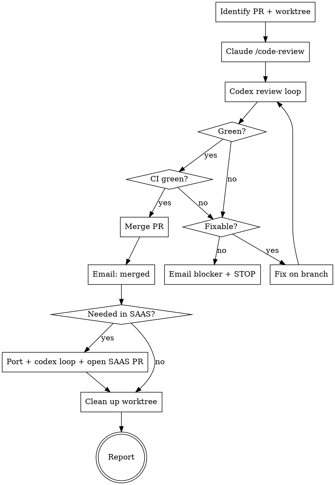

# Review, Merge, and Port a PR

## Overview

A pull request is not done when the code looks right. It is done when **both** reviewers
(Claude `/code-review` and Codex) report no blocking issues, CI is green, the PR is merged, the
user is notified, and - if the same change belongs in the SAAS repo - it has been ported there
and a PR opened.

This skill drives a PR end-to-end against the open-source `fluid-calendar` repo
(`git@github.com:dotnetfactory/fluid-calendar.git`), then decides whether the SAAS repo at
`~/src/fluid-calendar-saas` needs the same fix.

**Core principle:** Never merge over an unresolved blocker, and never lose the SAAS port.
When you cannot make it green yourself, escalate by email - do not merge anyway, and do not
silently give up. Do the review in a dedicated git worktree under `.claude/worktrees` so the
main checkout is untouched, and always clean the worktree up when done.

## Inputs

- A PR number or URL in the `dotnetfactory/fluid-calendar` repo. If only a branch was given,
  resolve the PR with `gh pr list --head <branch>`.

## When NOT to use

- The change is still being written and has no PR yet (write it first, then use this).
- The PR is in a different repo than `fluid-calendar` (the SAAS-port logic assumes this repo).

## Workflow



### 1. Identify the PR and set up a worktree

```bash
gh pr view <PR#> --json number,title,headRefName,baseRefName,mergeable,state,url
```

Do all review/fix work in a dedicated git worktree under `.claude/worktrees` so the main
checkout stays clean. **Always `git fetch origin` first** so you operate against the latest
`main` and PR branch. Create the worktree from the PR branch:

```bash
git fetch origin                                           # pull the latest main + PR branch
git worktree add .claude/worktrees/pr-<PR#> <headRefName>   # use the PR's headRefName
cd .claude/worktrees/pr-<PR#>
```

- Ensure `.claude/worktrees/` is git-ignored (add it to `.gitignore` if it is not) so the
  worktree never shows up as untracked changes in the PR.
- The branch in the worktree tracks the PR; fixes pushed from here update the PR.
- Remember the worktree path - you will remove it in step 10.
- **Bring the PR branch up to date with the latest `main` to minimize conflicts.** From inside
  the worktree, merge current `origin/main` into the PR branch before reviewing, so the review
  runs against what will actually merge:

```bash
git merge origin/main      # resolve + commit if needed, then `git push` to update the PR
```

  If `main` moved and this update changes the branch, push it so the PR reflects it. If the merge
  hits conflicts you cannot cleanly and safely resolve, treat it as a blocker (step 6) rather than
  forcing it.

### 2. Claude code-review

Run the regular Claude `/code-review` over the PR diff (from inside the worktree, where the
checked-out branch diffs against `main`):

- Invoke the `code-review` skill at a normal effort (e.g. `/code-review high`). Do **not** use
  the `ultra` cloud variant.
- `/code-review` reviews the current diff and reports findings inline in the session.

Treat each finding as a candidate issue to address in step 3/4 (classify blocking vs
non-blocking the same way as the Codex findings).

### 3. Codex review loop until green

Run Codex's built-in reviewer against the branch with `/codex:review`. Then loop:

1. Run `/codex:review`.
2. Read the findings. Classify each as **blocking** (correctness bug, security issue,
   regression, broken build/test) or **non-blocking** (style, nit, optional).
3. If there are blocking findings, go to step 4 (fix), then come back and re-run `/codex:review`.
4. Repeat until a review reports **no blocking findings** = green.

**Green** = the latest Codex review and the collected Claude `/code-review` findings have zero
unresolved blocking issues.

**Loop guard:** cap at 5 fix-and-review rounds. If still not green after 5 rounds, treat the
remaining findings as an unfixable blocker (step 6).

### 4. Address issues and re-review

For every blocking finding (from Claude `/code-review` or Codex):

- Fix it on the PR branch with the smallest correct change. Follow the repo conventions in
  `CLAUDE.md` (singleton `prisma`, `@/lib/date-utils`, `logger` with `LOG_SOURCE`,
  `requireAdmin`, SAAS file-extension rules, etc.).
- Run `npm run type-check` and `npm run lint` (CI requires zero warnings).
- Commit and `git push`.
- Re-run the **Codex review loop (step 3) until green again**. New fixes can introduce new
  findings, so always re-review after editing.

### 5. Merge

Only when **both** reviewers are green **and** CI checks pass:

```bash
gh pr checks <PR#>            # confirm required checks are green
gh pr merge <PR#> --squash --delete-branch
```

`gh pr merge --delete-branch` cannot delete a local branch that is still checked out in the
worktree. Run the merge from the **main checkout** (not from inside the worktree), or remove the
worktree first (step 10), so the branch deletion succeeds cleanly.

If `mergeable` is `false` (conflicts), rebase/merge `main`, re-run the codex loop, then merge.

### 6. Blocked path - email and STOP

If a blocking issue cannot be fixed by you - a design decision is required, requirements
conflict, infra/CI is broken outside the diff, or the loop guard (step 3) tripped - **do not
merge**. Send an email and stop.

- Send via `mgc` (Outlook / Microsoft Graph CLI) **to `emad@elitecoders.co`**. Follow the
  `mgc` instructions in `~/.claude/CLAUDE.md`, including the **mandatory pre-send identity
  check** (`~/bin/mgc users get --user-id me --select userPrincipalName` must return
  `emad@elitecoders.co` before any send - if not, ABORT and tell the user).
- Subject: `[PR #<N>] blocked - needs your input`
- Body (plain text, no markdown blockquotes): the PR title + URL, the exact blocking issue(s),
  what you tried, and the specific decision/help you need.

Then report the blocker to the user and stop. Do not proceed to merge or SAAS port.

### 7. Notify on merge

Immediately after a successful merge, send an email via `mgc` (Outlook / Microsoft Graph CLI)
**to `emad@elitecoders.co`** (run the mandatory pre-send identity check from `~/.claude/CLAUDE.md`
first):

- Subject: `[PR #<N>] merged`
- Body: PR title + URL, one-line summary of what shipped, and whether a SAAS port is coming
  (filled in after step 8).

### 8. Decide whether the SAAS repo needs the fix

The SAAS repo (`~/src/fluid-calendar-saas`) is the private superset; the public repo is
normally generated from it. Here the fix originated in the public repo, so decide by looking at
**what the diff actually touched**:

- **Needs porting** when the change touches shared/core code that also exists in the SAAS repo:
  files NOT marked `*.open.ts(x)` and NOT under `src/app/(open)/` - e.g. `src/lib/`,
  `src/services/`, `src/components/` shared files, `src/store/`, `prisma/schema.prisma`,
  API routes, config. Confirm by checking the same path exists in `~/src/fluid-calendar-saas`
  and lacks the fix.
- **Does NOT need porting** when the change is open-source-only: `*.open.ts(x)` files,
  `src/app/(open)/` route group, or anything gated to the OS build. The SAAS repo has its own
  `.saas` variant.
- Inspect the merged diff to decide:
  `gh pr diff <PR#> --name-only` then check each path against the rules above and against
  `~/src/fluid-calendar-saas`.

State your decision explicitly (port / no port) and why.

### 9. Port to SAAS (only if step 8 says yes)

**Do NOT run `scripts/sync-repos.sh`** - that regenerates the whole public repo and is the wrong
direction. Apply the change manually.

```bash
cd ~/src/fluid-calendar-saas
git fetch origin main && git checkout -b port/<short-name> origin/main
```

- Re-implement the equivalent change by hand on the corresponding SAAS files. Adapt for SAAS
  structure where it differs (`.saas` variants, `src/app/(saas)/`, feature gating via
  `isSaasEnabled`/`isFeatureEnabled`). Do not blindly copy if the file shape differs.
- Run `npm run type-check` and `npm run lint` (use `npm install --legacy-peer-deps` if needed).
- Run the **Codex review loop (step 3) until green** in the SAAS repo.
- Push and open a PR - **do not merge the SAAS PR**, just create it:
  `gh pr create --repo dotnetfactory/fluid-calendar-saas --fill`.
- Include the SAAS PR link in the merge notification email (step 7) or send a short follow-up.

### 10. Clean up the worktree and report

Remove the worktree created in step 1 once the work is done (merged, or stopped at a blocker):

```bash
cd <main checkout>                         # leave the worktree dir first
git worktree remove .claude/worktrees/pr-<PR#>
# if it refuses due to leftover state and you are sure: add --force
git worktree prune
```

Always clean up - even on the blocked/email path (step 6), the worktree should not be left
behind. (The SAAS port in step 9 happens in the separate `~/src/fluid-calendar-saas` repo and
is unaffected by this cleanup.)

Then report back to the user: Claude `/code-review` + Codex outcomes, that the PR merged (with
link), the SAAS decision (port or not, with reasoning), and the SAAS PR link if one was opened.

## Quick reference

| Step | Command / action |
|------|------------------|
| PR info | `gh pr view <N> --json title,headRefName,mergeable,state,url` |
| Worktree | `git worktree add .claude/worktrees/pr-<N> <headRefName>` |
| Claude review | `code-review` skill at normal effort (e.g. `/code-review high`) - NOT `ultra` |
| Codex review | `/codex:review` (loop until no blocking findings) |
| Gate checks | `npm run type-check`, `npm run lint` |
| CI status | `gh pr checks <N>` |
| Merge | `gh pr merge <N> --squash --delete-branch` (run from main checkout) |
| Worktree cleanup | `git worktree remove .claude/worktrees/pr-<N>` |
| Email | `mgc` (Outlook) to `emad@elitecoders.co` - run the pre-send identity check first |
| SAAS diff | `gh pr diff <N> --name-only` |
| SAAS PR | `gh pr create --repo dotnetfactory/fluid-calendar-saas --fill` (do not merge) |

## Common mistakes

- **Merging with unresolved blockers.** Green means zero blocking findings from *both*
  reviewers AND passing CI. A nit is not a blocker; a regression is.
- **Skipping the re-review after a fix.** Every code change re-opens the Codex loop. Re-run it.
- **Infinite loops.** Cap at 5 rounds; escalate by email if not green.
- **Running `scripts/sync-repos.sh` to port.** Wrong direction and clobbers the public repo.
  Port to SAAS by hand.
- **Merging the SAAS PR.** Step 9 only opens a SAAS PR; leave it for review.
- **Forgetting the SAAS decision.** Always state port / no-port with reasoning, even when the
  answer is no.
- **Not emailing.** Email on a true blocker (step 6) and on a successful merge (step 7) -
  both to `emad@elitecoders.co` via `mgc` (Outlook), after the pre-send identity check.
- **Treating open-only code as needing a port.** `*.open.*` and `(open)` route-group changes do
  not go to SAAS.
- **Leaving the worktree behind.** Always `git worktree remove .claude/worktrees/pr-<N>` when
  done (step 10), including on the blocked/email path. A stale worktree blocks the
  `--delete-branch` on merge and clutters the repo.
- **Running `/code-review ultra`.** This skill uses the regular `/code-review`, not the billed
  cloud `ultra` variant.

---
> Source: [dotnetfactory/fluid-calendar](https://github.com/dotnetfactory/fluid-calendar) — distributed by [TomeVault](https://tomevault.io).
<!-- tomevault:4.0:skill_md:2026-07-25 -->
