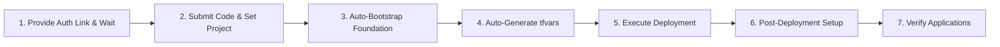

# Horizon SDV Deployment Skill

This skill provides an automated, streamlined procedure for deploying and managing the **Horizon SDV** platform on Google Kubernetes Engine (GKE) using Infrastructure as Code (Terraform) and GitOps (Argo CD).

---

## Minimal Input & Interactive Authentication Principle

> [!IMPORTANT]
> **Streamlined User Interaction & Proactive Authentication**:
> 1. **Proactive GCP Authentication Link**: At the very start of the workflow, generate and provide an interactive Google Cloud authentication link (`gcloud auth login --update-adc --no-launch-browser`) so the user can easily authenticate both `gcloud` and Application Default Credentials (ADC).
> 2. **Strict Wait for Authentication**: The agent **must pause and wait** for the user to paste the verification code before attempting any GCP project or infrastructure commands.
> 3. **Essential Parameters**: Prompt the user for target **GCP Project ID** (`sdv_gcp_project_id`) and **Root Domain** (`sdv_root_domain`, e.g., `example.com`).
>
> All other parameters, state bucket creation, passwords, and service account discovery are handled **automatically by the agent** using secure defaults:
> - **GCS State Bucket**: Automatically created as `gs://<GCP_PROJECT_ID>-horizon-tfstate` (with object versioning & uniform bucket access).
> - **GCE Default Service Account**: Automatically queried via `gcloud`.
> - **Environment Name / Subdomain**: Defaults to `dev` (`https://dev.<HORIZON_DOMAIN>`).
> - **GCP Region & Zone**: Defaults to `europe-west1` and `europe-west1-d`.
> - **Keycloak Admin Passwords**: Automatically generated as cryptographically strong random passwords (16+ alphanumeric + symbols).
> - **SCM Configuration**: Automatically detected from current Git repository remote and branch (defaults to `scm_auth_method = "none"`).
> - **Feature Flags**: Defaults to `sdv_dns_dnssec_enabled = true`, `sdv_enable_network_policies = true`, `sdv_enable_kms_encryption = false`.

---

## Deployment Workflow Overview



1. **[GCP Foundation & Bucket](./references/01_gcp_foundation.md)**: Launch background auth (`gcloud auth login --update-adc --no-launch-browser`), provide clickable link to user, **wait for verification code**, submit code via `manage_task(send_input)`, configure active project, auto-discover GCE Service Account, auto-create state bucket with versioning, and configure OAuth2 credentials.
2. **[Automated Terraform Configuration](./references/02_terraform_configuration.md)**: Generate secure random passwords and write `terraform/env/terraform.tfvars`.
3. **[Deployment Execution](./references/03_deployment_execution.md)**: Execute Google Cloud Build runner (`./.agents/plugins/horizon-ops/skills/horizon-deploy/scripts/cloud-deploy.sh`) for Terraform plan and apply with zero local machine dependencies.
4. **[Post-Deployment Setup](./references/04_post_deployment_setup.md)**: Configure DNS nameservers, connect to GKE via Connect Gateway, configure Keycloak Google SSO, and assign RBAC user groups.
5. **[Cluster Applications Verification](./references/05_cluster_applications.md)**: Verify Developer Portal, Argo CD, Keycloak, Gerrit, Jenkins, MTK Connect, Headlamp, Grafana, and MCP Gateway Registry.

---

## Pre-Configuration Workflow & Questionnaire

When triggering the deployment:
1. Immediately initiate GCP authentication by running `gcloud auth login --update-adc --no-launch-browser` as a background task.
2. Read the generated auth link from the task log and present it as a clickable link.
3. Prompt the user for essential parameters and **stop to wait for user input**:

> **To deploy Horizon SDV, please:**
> 1. **Authenticate Google Cloud**: Open the provided authentication link, sign in, and paste the authorization verification code back into this chat.
> 2. **GCP Project ID**: Target Google Cloud Project ID (e.g. `my-project-123`).
> 3. **Root Domain**: Target primary domain name (e.g. `your-domain.com`).
>
> *(The agent will wait for your verification code, complete the login, create the state bucket, discover the compute SA, generate secure admin passwords, and configure default region `europe-west1`)*.

---

## Step-by-Step Execution Guide

### Phase 1: Interactive Authentication & Foundation Bootstrap
1. **Generate authentication URL** via background task:
   ```bash
   gcloud auth login --update-adc --no-launch-browser
   ```
2. **Present Auth Link & Wait**: Extract the `https://accounts.google.com/o/oauth2/auth?...` link from task log, present it to the user in markdown, and **end turn / wait** for the user to provide the verification code.
3. **Submit Verification Code**: Once the user provides the code, use `manage_task` with action `send_input` to submit the code to the background task and verify success (`code 0`).
4. **Set active GCP project**:
   ```bash
   gcloud config set project <GCP_PROJECT_ID>
   ```
5. **Enable all required platform APIs upfront**:
   ```bash
   gcloud services enable \
     compute.googleapis.com \
     container.googleapis.com \
     dns.googleapis.com \
     secretmanager.googleapis.com \
     certificatemanager.googleapis.com \
     artifactregistry.googleapis.com \
     cloudbuild.googleapis.com \
     cloudresourcemanager.googleapis.com \
     orgpolicy.googleapis.com \
     serviceusage.googleapis.com \
     iam.googleapis.com \
     iamcredentials.googleapis.com \
     sts.googleapis.com \
     gkehub.googleapis.com \
     connectgateway.googleapis.com \
     monitoring.googleapis.com \
     oslogin.googleapis.com \
     autoscaling.googleapis.com \
     file.googleapis.com \
     iap.googleapis.com \
     networkconnectivity.googleapis.com \
     networkmanagement.googleapis.com \
     integrations.googleapis.com \
     aiplatform.googleapis.com \
     storage.googleapis.com \
     workstations.googleapis.com \
     spanner.googleapis.com \
     parametermanager.googleapis.com \
     --project=<GCP_PROJECT_ID>
   ```
6. **Early Organization Policy Pre-Flight Checks**:
   Check constraints that impact deployment before generating configuration:
   ```bash
   # 1. Check Service Account Key creation policy
   gcloud org-policies describe constraints/iam.disableServiceAccountKeyCreation --project=<GCP_PROJECT_ID>
   ```
   > [!IMPORTANT]
   > **User Prompt on Enforced Constraints**:
   > If `constraints/iam.disableServiceAccountKeyCreation` is enforced:
   > Explicitly inform the user: *"Your project enforces `constraints/iam.disableServiceAccountKeyCreation` (blocking SA key creation). Horizon SDV stores a key in Secret Manager for Jenkins dynamic GCE worker VM provisioning. Would you like to disable enforcement for this project, or proceed without dynamic GCE VM workers?"*
   > If the user approves, disable enforcement:
   > ```bash
   > gcloud resource-manager org-policies disable-enforce constraints/iam.disableServiceAccountKeyCreation --project=<GCP_PROJECT_ID>
   > ```

7. **Auto-discover default GCE compute service account and grant IAM roles**:
   ```bash
   # Discover SA and Project Number
   PROJECT_NUM=$(gcloud projects describe <GCP_PROJECT_ID> --format="value(projectNumber)")
   COMPUTE_SA=$(gcloud iam service-accounts list --project=<GCP_PROJECT_ID> \
     --filter="email ~ [0-9]+-compute@developer.gserviceaccount.com" \
     --format="value(email)")

   # Grant Cloud Build SA & Compute SA roles/owner for provisioning
   gcloud projects add-iam-policy-binding <GCP_PROJECT_ID> \
     --member="serviceAccount:${PROJECT_NUM}@cloudbuild.gserviceaccount.com" \
     --role="roles/owner"
   gcloud projects add-iam-policy-binding <GCP_PROJECT_ID> \
     --member="serviceAccount:${COMPUTE_SA}" \
     --role="roles/owner"
   ```
8. **Auto-create GCS remote state bucket** if it doesn't already exist:
   ```bash
   BUCKET_NAME="<GCP_PROJECT_ID>-horizon-tfstate"
   gcloud storage buckets create gs://$BUCKET_NAME --project=<GCP_PROJECT_ID> --location=europe-west1 --uniform-bucket-level-access || true
   gcloud storage buckets update gs://$BUCKET_NAME --project=<GCP_PROJECT_ID> --versioning || true
   ```
### Phase 2: Auto-Generate `terraform.tfvars` (Password-Free)
*Follow: [references/02_terraform_configuration.md](./references/02_terraform_configuration.md)*
1. Ensure `locals.tf` includes `s7` and `s13` in `secret_password_specs` for native auto-generation of Keycloak credentials.
2. Populate `terraform/env/terraform.tfvars` (containing zero plain passwords):
   - `sdv_gcp_project_id = "<GCP_PROJECT_ID>"`
   - `sdv_gcp_region = "europe-west1"`
   - `sdv_gcp_zone = "europe-west1-d"`
   - `sdv_gcp_compute_sa_email = "<DISCOVERED_SA>"`
   - `sdv_gcp_backend_bucket = "<BUCKET_NAME>"`
   - `sdv_env_name = "dev"`
   - `sdv_root_domain = "<ROOT_DOMAIN>"`
   - `scm_type = "github"`, `scm_auth_method = "none"`, `scm_repo_url = "<CURRENT_GIT_URL>"`, `scm_repo_branch = "main"`
   - `sdv_enable_network_policies = true`, `sdv_dns_dnssec_enabled = true`, `sdv_enable_kms_encryption = false`
3. All service credentials (Keycloak, Argo CD, Jenkins, Gerrit, Grafana, PostgreSQL, MCP Gateway) are generated directly by Terraform into **GCP Secret Manager**.

### Phase 3: Run Deployment (Google Cloud Build Runner)
*Follow: [references/03_deployment_execution.md](./references/03_deployment_execution.md)*
```bash
# 1. Plan preview on Google Cloud Build
./.agents/plugins/horizon-ops/skills/horizon-deploy/scripts/cloud-deploy.sh -p

# 2. Apply infrastructure on Google Cloud Build
./.agents/plugins/horizon-ops/skills/horizon-deploy/scripts/cloud-deploy.sh -a

# 3. View build history / status
./.agents/plugins/horizon-ops/skills/horizon-deploy/scripts/cloud-deploy.sh --status
```

### Phase 4: Post-Deployment Configuration & User Handoff
*Follow: [references/04_post_deployment_setup.md](./references/04_post_deployment_setup.md)*
1. **Present Only the Locally-Generated Keycloak Admin Passwords**:
   > [!IMPORTANT]
   > **Do NOT Proactively Output Terraform-Generated Service Passwords**:
   > Do **not** query or proactively display passwords generated natively by Terraform (such as Argo CD, Jenkins, Gerrit, Grafana, PostgreSQL, or MCP Gateway fallback admin passwords). All everyday user and administrator access is handled centrally via Keycloak Single Sign-On.
   >
   > Proactively show **only** the two locally-generated Keycloak administrator passwords (from `terraform.tfvars`):
   > - **Horizon Realm Admin** (`horizon-admin` / `sdv_keycloak_horizon_admin_password`)
   > - **Keycloak Root Superadmin** (`admin` / `sdv_keycloak_admin_password`)

2. **Present Clear Credentials & Usage Summary to User**:
   Provide the user with this explicit, clean breakdown:

   | Account | Username | Purpose & Where to Use |
   | :--- | :--- | :--- |
   | **Horizon SSO Admin** *(Recommended)* | `horizon-admin` | **Daily Single Sign-On across all platform tools**.<br>Use when clicking **"LOG IN VIA KEYCLOAK"** in Argo CD, Jenkins, Gerrit, Grafana, Headlamp, and Developer Portal, or at `/auth/admin/horizon/console/`. |
   | **Keycloak Root Superadmin** | `admin` | **Root Keycloak server administration only**.<br>Used at `/auth/admin/master/console/` to manage realms and server-wide settings. |

   *(Fallback local admin credentials for individual services are safely stored in GCP Secret Manager and can be queried on-demand only if specifically requested for emergency break-glass scenarios)*.

3. **Query & Display Live Cloud DNS Nameservers from Google Cloud**:
   > [!IMPORTANT]
   > **Always Query Live Nameservers from GCP Source**:
   > Never hardcode or assume nameserver values. Always query the definitive nameservers directly from the Terraform-managed Cloud DNS zone in Google Cloud:
   > ```bash
   > ZONE_NAME="<ENV_NAME>-horizon-sdv-com"
   > gcloud dns managed-zones describe $ZONE_NAME --project=<GCP_PROJECT_ID> --format="value(nameServers)"
   > ```
   > Present the exact 4 returned nameservers to the user:
   > ```text
   > <ENV_NAME>.<ROOT_DOMAIN>.   IN   NS   <ACTUAL_NS_1>.
   > <ENV_NAME>.<ROOT_DOMAIN>.   IN   NS   <ACTUAL_NS_2>.
   > <ENV_NAME>.<ROOT_DOMAIN>.   IN   NS   <ACTUAL_NS_3>.
   > <ENV_NAME>.<ROOT_DOMAIN>.   IN   NS   <ACTUAL_NS_4>.
   > ```
   > Instruct the user to configure these NS delegation records in their DNS provider.
4. Connect to GKE via Connect Gateway (`gcloud container fleet memberships get-credentials`).
5. **Inspect & Verify Argo CD Sync Waves (Wave 0 to Wave 7)**:
   Verify that all multi-wave components have synchronized:
   ```bash
   # Check overall application sync and health
   kubectl get applications -n argocd -o custom-columns=NAME:.metadata.name,HEALTH:.status.health.status,SYNC:.status.sync.status,MESSAGE:.status.operationState.message

   # If an application is OutOfSync / Sync Failed (e.g. max retries exceeded):
   kubectl patch application <APP_NAME> -n argocd --type merge -p '{"operation":{"sync":{"syncStrategy":{"hook":{"force":true}}}}}'
   ```
   * **Wave 0–2**: Namespaces, CRDs, ExternalSecrets, Storage, PostgreSQL.
   * **Wave 3–4**: Keycloak, Gerrit, Jenkins, Grafana, Headlamp, MTK Connect.
   * **Wave 5**: Post-install config jobs (`keycloak-post-*`) and Core Platform Gateway routes.
   * **Wave 6**: Backstage Developer Portal Application pod.
   * **Wave 7**: Developer Portal Ingress Gateway routes (`/` and `/developer-portal/`).
6. **Critical Post-Deployment Step: Assign Admin Users to `administrators` Group**:
   > [!IMPORTANT]
   > **Why Keycloak does not grant full admin rights automatically**:
   > By security design (Principle of Least Privilege), Keycloak provisions users (including `horizon-admin` and initial Google SSO users) with standard realm access, but does **not** grant cluster-wide write/sync permissions in Argo CD, Jenkins, or Grafana by default. Without joining the `administrators` group, Argo CD defaults to `role:readonly` (causing `permission denied: applications, sync`).
   >
   > **Required Action**:
   > In Keycloak Horizon Console (`/auth/admin/horizon/console/`), navigate to **Users** → Select `horizon-admin` (and your personal user) → **Groups** tab → **Join Group** → Select **`administrators`** → Click **Join**. Log out and log back into Argo CD / Jenkins.

7. Configure Keycloak Google Identity Provider, `broker link existing user` flow, and human admin user in the `horizon` realm.
8. Enable Developer Portal modules (`workloads-common`, `workloads-android`) and run Jenkins seed job.

---

## Detailed References

- [01_gcp_foundation.md](./references/01_gcp_foundation.md) — GCP IAM, GCS bucket auto-creation, and OAuth2 setup.
- [02_terraform_configuration.md](./references/02_terraform_configuration.md) — Automated variable generation, password generator, and tfvars template.
- [03_deployment_execution.md](./references/03_deployment_execution.md) — Container and native deployment commands.
- [04_post_deployment_setup.md](./references/04_post_deployment_setup.md) — DNS, Keycloak SSO, user groups, and workload modules.
- [05_cluster_applications.md](./references/05_cluster_applications.md) — Applications list and URL reference.
- [06_cloud_build_deployment.md](./references/06_cloud_build_deployment.md) — Cloud Build pipeline architecture and SCM configuration (replaces manual GitHub App setup).
- [07_troubleshooting.md](./references/07_troubleshooting.md) — Solutions for common deployment and runtime errors.
- [08_service_account_keys.md](./references/08_service_account_keys.md) — Service account keys architecture, Jenkins GCE plugin, and organization policy.

---
> Source: [GoogleCloudPlatform/horizon-sdv](https://github.com/GoogleCloudPlatform/horizon-sdv) — distributed by [TomeVault](https://tomevault.io).
<!-- tomevault:4.0:skill_md:2026-10-06 -->
