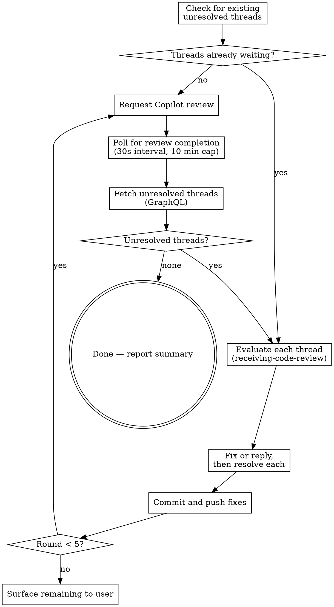

# Automating Copilot Reviews

Automate the Copilot review cycle on a PR: request review, wait for completion, handle every comment, re-request, repeat until clean.

**REQUIRED:** Apply superpowers:receiving-code-review when evaluating each comment. Do NOT bulk-resolve threads without reading and evaluating them first.

## The Loop



## Bot Identity

The bot login differs between APIs:

| API | Login |
|-----|-------|
| REST (`/pulls/{pr}/reviews`, `/pulls/{pr}/comments`) | `copilot-pull-request-reviewer[bot]` |
| GraphQL (`author.login` in review threads) | `copilot-pull-request-reviewer` |

Using the wrong login silently returns zero results. Always use the table above.

## Commands

**Request review:**
```bash
gh pr edit <PR> --add-reviewer @copilot
```

**Poll for completion** — compare latest Copilot review timestamp against when you requested:
```bash
gh api repos/{owner}/{repo}/pulls/{pr}/reviews \
  --jq '[.[] | select(.user.login == "copilot-pull-request-reviewer[bot]")] | sort_by(.submitted_at) | last | .submitted_at'
```

**Fetch unresolved threads:**
```bash
gh api graphql -f query='{
  repository(owner: "{owner}", name: "{repo}") {
    pullRequest(number: {pr}) {
      reviewThreads(first: 100) {
        nodes {
          id
          isResolved
          comments(first: 10) {
            nodes { databaseId author { login } body path line }
          }
        }
      }
    }
  }
}'
```
Filter: `isResolved == false` AND first comment author is `copilot-pull-request-reviewer`.

**Reply to a thread** (use thread root's `databaseId`):
```bash
gh api repos/{owner}/{repo}/pulls/{pr}/comments/{comment_id}/replies -f body="..."
```

**Resolve a thread:**
```bash
gh api graphql -f query='mutation { resolveReviewThread(input: {threadId: "{thread_node_id}"}) { thread { isResolved } } }'
```

## Step-by-Step

1. **Determine PR context**: Get `{owner}`, `{repo}`, `{pr}` from current branch (`gh pr view --json number,url`) or user input.

2. **Check for existing threads first**: Fetch unresolved threads (GraphQL). If threads already exist from a prior review, skip to step 6 — don't request a new review when comments are already waiting.

3. **Request review**: `gh pr edit <PR> --add-reviewer @copilot`. Record the current timestamp.

4. **Poll for completion**: Every 30 seconds, check the reviews endpoint. When the latest Copilot review has `submitted_at` newer than your recorded timestamp, proceed. Timeout after 10 minutes — tell the user Copilot hasn't responded.

5. **Fetch unresolved threads**: GraphQL query, filter for Copilot-authored and unresolved. If zero → **DONE.** Report a summary of what was fixed, pushed back on, and how many rounds it took.

6. **Evaluate EACH thread individually**: Read the comment body, check the referenced file and line in the codebase, apply the receiving-code-review pattern (verify before implementing, push back if wrong, fix if correct). This is where the actual work happens.

7. **For each thread**:
   - **Fix needed**: Implement the fix, `git add` the affected file.
   - **No fix needed**: Reply in the thread with technical reasoning.
   - **Either way**: Resolve the thread with the GraphQL mutation. Copilot never auto-resolves.

8. **Push**: Commit all fixes and `git push`.

9. **Loop**: Go to step 3. Cap at 5 total rounds.

## Edge Cases

**Re-raised comments**: Copilot may re-open resolved topics on re-review. Evaluate fresh — the fix may have introduced something new, or Copilot may be repeating itself. If repeating, reply explaining the prior resolution, resolve, and continue.

**Timeout**: If Copilot doesn't respond within 10 minutes, stop polling and tell the user. Don't silently retry.

**No PR on current branch**: If `gh pr view` fails, ask the user for the PR number. Don't guess.

## Common Mistakes

| Mistake | Fix |
|---------|-----|
| Bulk-resolve without reading | Evaluate each thread per receiving-code-review first |
| Wrong bot login | See Bot Identity table — REST and GraphQL differ |
| Push after re-requesting review | Push fixes BEFORE re-requesting |
| `gh pr comment` for thread replies | Use `pulls/{pr}/comments/{id}/replies` — `gh pr comment` posts top-level comments |
| No round cap | Cap at 5 rounds to prevent infinite loops from re-raised comments |
| Silent polling forever | Timeout at 10 min and surface to user |

---
> Source: [indexnetwork/index](https://github.com/indexnetwork/index) — distributed by [TomeVault](https://tomevault.io).
<!-- tomevault:4.0:skill_md:2026-07-19 -->
