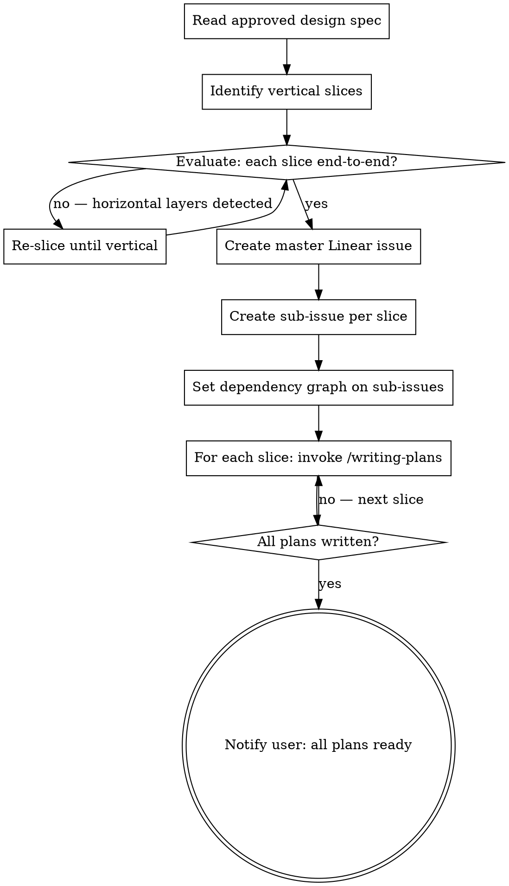

# Vertical Slice Planning

## Overview

Bridge the gap between an approved design and implementation plans. Decompose a design spec into vertical slices, track them as a master + sub-issues in Linear, then invoke /writing-plans for each slice. Every slice must be independently testable and deliverable end-to-end.

**Core principle:** A vertical slice cuts through all layers (schema, service, API, UI) to deliver one thin, working feature. A horizontal slice delivers one layer across all features — that is wrong.

## When to Use

- Design spec is approved and ready for implementation
- Feature spans multiple subsystems or phases
- Work needs Linear tracking before plans are written

**When NOT to use:**
- Feature is small enough for a single plan (one /writing-plans invocation covers it)
- No design spec exists yet (use brainstorming first)

## Process

## Step 1: Read the Design Spec

Read the full approved design. Understand all components, data flows, and dependencies. Note the spec path — you will reference it in Linear issues.

## Step 2: Identify Vertical Slices

**Do NOT map spec sections 1:1 as slices.** Spec sections are often organized by concept (schema, then logic, then API, then UI) — that is horizontal decomposition.

Instead, list every candidate slice and **explicitly apply the vertical slice test to each one.** Write out the evaluation — don't skip it because "it's obvious." The evaluation is the deliverable of this step.

For each candidate, ask: *"Can a user (or agent, or test) exercise this slice end-to-end without any other slice being implemented?"*

**Vertical slice test — all three must be true:**
1. The slice touches every layer it needs (schema + service + API + test) to be independently deployable
2. A developer can demo or test the slice in isolation after merging
3. Removing this slice from the plan does not break any other slice

**Horizontal slice red flags:**
- "All database work" / "All API endpoints" / "All UI components" as a single slice
- A slice that produces artifacts no other code can exercise yet
- A slice described as "infrastructure" or "foundation" with no user-facing behavior

**When the spec has pre-defined phases:** Evaluate whether each phase passes the vertical slice test. Phases that are purely additive DDL with no exercisable behavior are horizontal — combine them with the first slice that uses them, or add a minimal smoke test path.

## Step 3: Create Master Linear Issue

Create one master issue that describes the full feature. Include:
- Link to the design spec
- Summary of all slices (numbered list)
- Dependency graph between slices (text or ASCII)

Use the Linear MCP `save_issue` tool. The master issue title should match the feature name from the design spec.

## Step 4: Create Sub-Issues

For each vertical slice, create a sub-issue under the master issue using `parentId`. Each sub-issue should have:
- A clear title: `Slice N: [what this slice delivers]`
- Description: scope summary, key files, acceptance criteria
- Dependencies set via `blockedBy` where slices depend on each other

**Dependency rules:**
- Only set real dependencies — slices that literally cannot start until another merges
- Parallel-safe slices should have no dependency between them
- The dependency graph should be a DAG, not a chain (chains mean you sliced horizontally)

## Step 5: Write Plans per Slice

For each slice, invoke `/writing-plans` (the superpowers:writing-plans skill). Pass the slice scope, not the full design spec — the plan should be focused on that slice only.

Each plan is saved to `docs/superpowers/plans/` following the writing-plans convention.

After each plan is written, update the corresponding Linear sub-issue with a link to the plan file. Use `save_issue` with the sub-issue `id` and add the plan path via `links`.

**Do all plans in sequence.** Do not skip slices or defer "later" plans. The user asked for all plans — deliver all plans.

## Step 6: Notify User

When all plans are written, report:
- Total number of slices and plans created
- The master Linear issue identifier
- Which slices can run in parallel vs which are sequential
- Suggest execution approach (subagent-driven-development or executing-plans)

## Common Mistakes

| Mistake | Fix |
|---------|-----|
| Mapping spec sections 1:1 as slices | Apply the vertical slice test to each candidate |
| Skipping Linear tracking ("we'll do it later") | Linear tracking is step 3, before plans. Non-negotiable. |
| Creating flat issues instead of parent/child | Always create a master issue first, then sub-issues with `parentId` |
| Writing one monolith plan for the whole feature | One plan per slice. Each invokes /writing-plans separately. |
| Deferring later plans ("just-in-time") | Write ALL plans before reporting completion. |
| Chains of sequential dependencies | If every slice blocks the next, you probably sliced horizontally. Re-evaluate. |

## Rationalizations You Will Hear (Including From Yourself)

| Excuse | Reality |
|--------|---------|
| "The spec already carves the work into clean phases" | Spec phases are organized for readability, not deployability. Apply the test. |
| "Project tracking: none right now — we can do it later" | Linear tracking is Step 3. It takes 2 minutes. Do it now. |
| "Plans 3 and 4 can be written just-in-time as Plan 2 lands" | All plans are written before completion. No deferral. |
| "This is too small to need a master issue" | If it has 2+ slices, it needs a master. That's the threshold. |
| "I'll create one big plan and let the executor figure out the slices" | The whole point of this skill is that slicing happens before plans. |

## Red Flags — STOP and Re-Evaluate

- You are about to create a plan without a master Linear issue existing
- A slice has no testable behavior on its own
- All your slices must execute in strict sequence (1 → 2 → 3 → 4 → 5)
- You skipped the vertical slice test because "the spec already breaks it down"
- You are deferring Linear issues because the user said to move fast
- A slice is called "Schema" or "Infrastructure" or "Foundation" with no end-to-end path

**All of these mean: STOP. Go back to Step 2 and re-slice.**

---
> Source: [indexnetwork/index](https://github.com/indexnetwork/index) — distributed by [TomeVault](https://tomevault.io).
<!-- tomevault:4.0:skill_md:2026-07-19 -->
