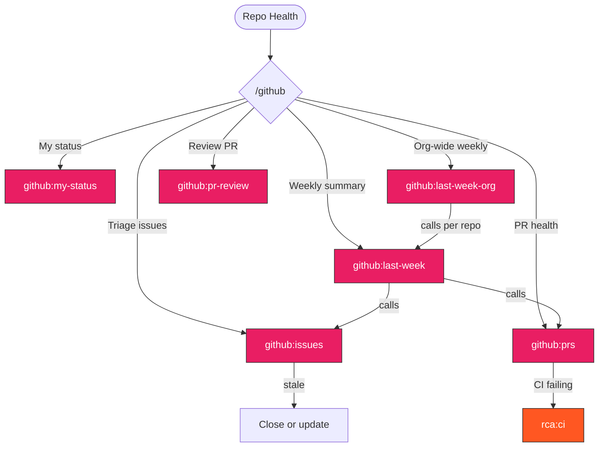

> Follow this diagram as the workflow.

# GitHub Skills

Repository health analysis, issue triage, and PR management.

## Auto-Select Sub-Skill

```
What do you need?
    │
    ├─ What needs my attention today?
    │   → github:my-status
    │
    ├─ Weekly summary (what happened last week?)
    │   ├─ Single repo (kagenti/kagenti)
    │   │   → github:last-week
    │   └─ Org-wide (all repos)
    │       → github:last-week-org
    │
    ├─ Analyze open issues (triage, stale, priority)
    │   → github:issues
    │
    ├─ Analyze open PRs (CI status, review needed)
    │   → github:prs
    │
    ├─ Review a specific PR (inline comments, conventions)
    │   → github:pr-review
    │
    └─ Create an issue with proper template
        → repo:issue
```

## Available Skills

| Skill | Purpose |
|-------|---------|
| `github:my-status` | Personal dashboard: your open PRs, pending reviews, assigned issues |
| `github:last-week` | Weekly report: merged PRs, new issues, CI health, priority analysis |
| `github:last-week-org` | Org-wide weekly report: all kagenti repos, proportional depth by activity |
| `github:issues` | Issue triage: stale, blocking, no attention, should-close |
| `github:pr-review` | Automated PR review: inline comments, conventions, security checks |
| `github:prs` | PR health: passing CI without review, stale, conflicts |

## Related Skills

- `repo:issue` - Issue template format
- `repo:pr` - PR template format
- `ci:status` - CI check details
- `ci:monitoring` - Monitor running CI

---
> Converted and distributed by [TomeVault](https://tomevault.io/claim/kagenti) — claim your Tome and manage your conversions.
<!-- tomevault:4.0:skill_md:2026-04-11 -->
