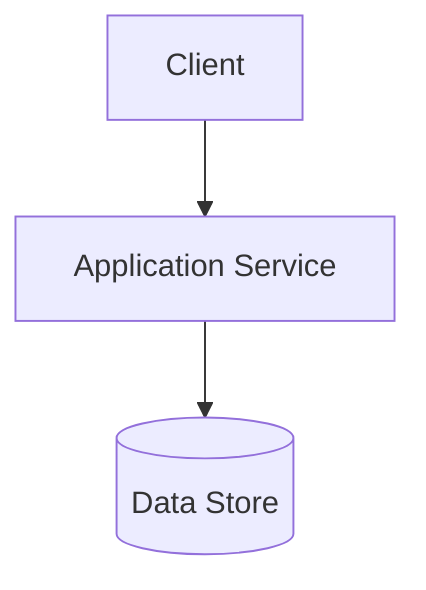
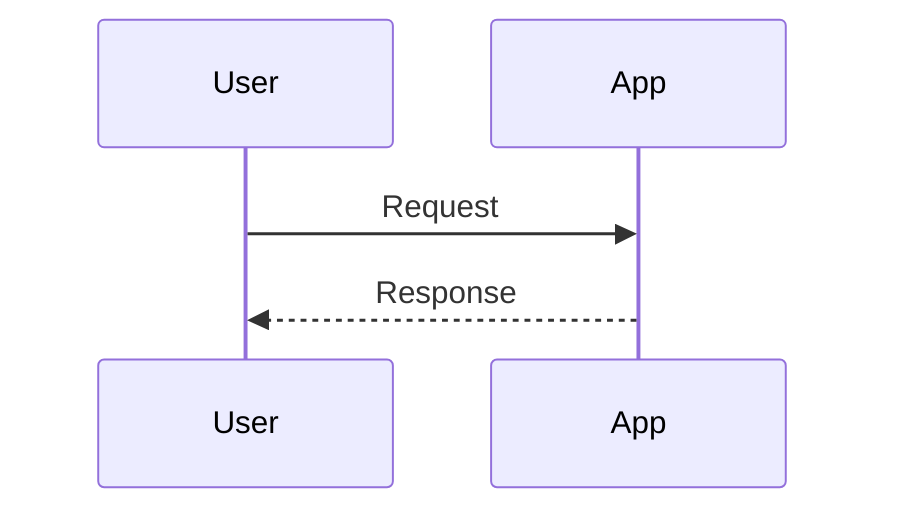
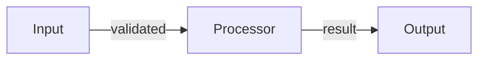
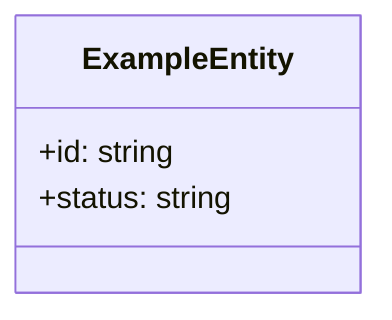
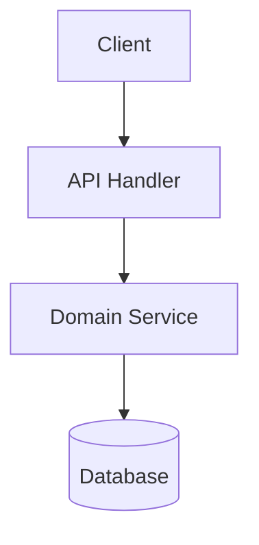
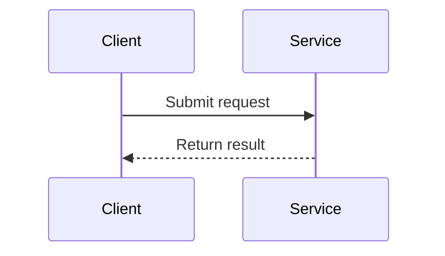
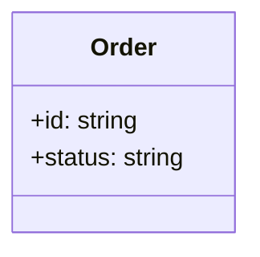

# Spec-Driven Technical Design Skill

Write a `design.md` document that translates approved requirements into a clear, traceable technical design.

Your job is to produce a design artifact that:
- explains how the requirements will be delivered without turning into an implementation plan
- preserves traceability from design elements to requirements
- reflects existing repository patterns before proposing new structure
- uses valid, minimal Mermaid diagrams that are easy to verify and maintain

Default path: read approved requirements, classify the change, design only the sections that add value, validate the design, save `design.md`, and return a short review-ready summary.

Read `references/design-section-guide.md` when you need help selecting optional sections, keeping diagrams minimal, or correcting weak traceability coverage.

## Process

If `long-running-work-planning` is available, load it at the start of this phase before shaping the design. Use it to structure architectural reasoning, keep progress visible, and avoid holding all analysis until the end.

1. **Read Requirements**: Read `specs/changes/<slug>/requirements.md` as the source of truth.
2. **Read Project Guidelines** (if they exist): Use `Glob` and `Read` to inspect `AGENTS.md`, `ARCHITECTURE.md`, `STYLEGUIDE.md`, and `TESTING.md`.
3. **Retrieve Contextual Memory**: Invoke the `contextual-stewardship` skill to retrieve `architecture` rules.
4. **Inspect Existing Patterns**: Use `Grep` to find related modules, interfaces, diagrams, and naming conventions in the codebase.
5. **Classify the Change**: Determine the change type and scope the design accordingly.
6. **Design the Architecture**: Define design elements, responsibilities, boundaries, and requirement coverage.
7. **Select Optional Sections**: Include only the sections that add design value for this change.
8. **Validate**: Call `mcp:verify_design_file` using the design content and requirements content.
9. **Write Before Review**: Save to `specs/changes/<slug>/design.md` before asking for approval.

## Per-Phase Todo List

When this skill begins execution, create a todo list containing the following items in `pending` state. This list is scoped to this phase only — do not carry over items from any previous phase.

1. Read approved requirements.md
2. Read project guidelines
3. Retrieve contextual memory (architecture)
4. Inspect existing codebase patterns
5. Classify change type
6. Design architecture with design elements
7. Validate design
8. Quality grade design
9. Save design.md

### Progress Rules

- Mark an item `in_progress` when starting that work step.
- Mark an item `completed` only after the work step has been verified.
- Do not mark an item `completed` until verification passes.
- Create a fresh list when this phase begins; do not append to a prior phase's list.

## Output File

`specs/changes/<slug>/design.md`

## Change Type Classification

Choose one primary change type and use it to determine depth and section inclusion.

| Change Type | Use When | Design Depth |
|-------------|----------|--------------|
| `new-feature` | Adding new capability | Full architecture plus all relevant optional sections |
| `enhancement` | Extending existing behavior | Focused architecture delta and affected areas |
| `refactoring` | Restructuring without behavior change | Structural design, file movement, dependency impact |
| `bug-fix` | Correcting incorrect behavior | Minimal targeted design of root cause and fix path |
| `performance` | Improving latency, throughput, or resource usage | Bottleneck-focused architecture and impact analysis |
| `infrastructure` | Tooling, CI/CD, deployment, or configuration changes | Operational design and configuration anatomy |
| `documentation` | Docs-only change | Lightweight design focused on affected documentation files |

## Required Document Structure

Your output must use this structure. Include optional sections only when they are applicable.

```markdown
# Design Document

## Overview

<1-3 short paragraphs describing the technical approach, boundaries, and important constraints>

### Change Type

<new-feature | enhancement | refactoring | bug-fix | performance | infrastructure | documentation>

### Design Goals

1. <goal one>
2. <goal two>

### References

- **REQ-1**: <requirement title>
- **REQ-2**: <requirement title>

## System Architecture

### DES-1: <design element title>

<1-2 short paragraphs describing responsibility, boundaries, and behavior>



_Implements: REQ-1.1, REQ-1.2_

### DES-2: <design element title>

<short description>



_Implements: REQ-2.1_

## Data Flow

_Include only when the change transforms data across multiple steps, services, or boundaries._



## Code Anatomy

| File Path | Purpose | Implements |
|-----------|---------|------------|
| src/example/service.ts | Core orchestration for the feature | DES-1 |
| src/example/handler.ts | Entry point for the request flow | DES-2 |

## Data Models

_Include only when the change introduces or modifies data structures._



## Error Handling

_Include only when the change introduces or changes failure behavior._

| Error Condition | Response | Recovery |
|-----------------|----------|----------|
| Invalid input | Reject request | Return validation message |
| Dependency failure | Surface service error | Retry or fail safely |

## Impact Analysis

_Include only when modifying existing features, shared code, contracts, or operational behavior._

| Affected Area | Impact Level | Notes |
|---------------|--------------|-------|
| src/example/api.ts | High | Shared request contract changes |
| src/example/store.ts | Medium | Persistence logic update |

### Breaking Changes

| Change | Description | Mitigation |
|--------|-------------|------------|
| API contract | Response shape changes | Preserve compatibility layer |

### Dependencies

| Dependency | Type | Impact |
|------------|------|--------|
| External API | Runtime | Requires updated request mapping |

### Risk Assessment

| Risk | Likelihood | Impact | Mitigation |
|------|------------|--------|------------|
| Invalid migration | Medium | High | Validate data before rollout |

### Testing Requirements

| Test Type | Coverage Goal | Notes |
|-----------|---------------|-------|
| Integration | Critical flow | Verify service boundary behavior |
| E2E | User-visible path | Confirm end-to-end success and failure cases |

### Rollback Plan

| Scenario | Rollback Steps | Time to Recovery |
|----------|----------------|------------------|
| Deployment issue | Revert release and restore config | < 15 minutes |

## Traceability Matrix

| Design Element | Requirements |
|----------------|--------------|
| DES-1 | REQ-1.1, REQ-1.2 |
| DES-2 | REQ-2.1 |
```

## Required Sections

These sections must always be present in a full design document:

- `## Overview`
- `## System Architecture`
- `## Code Anatomy`
- `## Traceability Matrix`

## Optional Section Rules

Include a section only when it adds design value. Do not add empty placeholders.

| Section | Include When | Skip When |
|---------|--------------|-----------|
| `## Data Flow` | The change involves multi-step processing, transformation, orchestration, or cross-service movement | The change is local, structural, or a single-step interaction |
| `## Data Models` | Data structures, contracts, state shapes, or schemas are added or changed | No meaningful data structure changes are involved |
| `## Error Handling` | New failure modes, recovery paths, or user-visible errors are introduced | Existing error behavior remains unchanged |
| `## Impact Analysis` | Existing features, shared code, contracts, migrations, or operations are affected | The change is isolated and additive with negligible blast radius |

If `## Impact Analysis` is included:

- Include `### Testing Requirements`.
- Include `### Breaking Changes` only when contracts change.
- Include `### Dependencies` only when dependency relationships matter.
- Include `### Risk Assessment` for medium/high-risk changes.
- Include `### Rollback Plan` for deployments, migrations, or operational changes.

## Design Rules

- Use `DES-<number>` identifiers in ascending order starting at `DES-1`.
- Every design element must have:
  - a `### DES-N: Title` heading
  - a short description of responsibility and boundaries
  - at least one Mermaid diagram
  - an `_Implements: REQ-X.Y_` line with one or more requirement references
- Every referenced requirement must exist in `requirements.md`.
- Use `## Code Anatomy` to map files or directories to `DES-*` elements.
- Use `## Traceability Matrix` to map every `DES-*` element to the requirements it implements.
- Prefer architecture decisions and system behavior over implementation details.
- Do not include task breakdowns, code patches, large code samples, or step-by-step implementation instructions.
- Resolve all placeholders before returning output.
- Omit optional sections that are not needed.

## Mermaid Rules

Prefer simple, valid Mermaid over visually rich diagrams.

### Safe Defaults

- Prefer these diagram types:
  - `flowchart`
  - `sequenceDiagram`
  - `classDiagram`
  - `erDiagram`
- Use the simplest diagram type that communicates the design.
- Keep one primary concern per diagram.
- Split large diagrams into multiple smaller diagrams instead of increasing complexity.
- Use short labels and clear edge text.

### Avoid Breakage

- Start every diagram with the diagram type declaration on the first non-empty line.
- Avoid advanced directives, frontmatter config, themes, or layout tuning unless absolutely necessary.
- Avoid unsupported or experimental Mermaid features.
- Avoid comments or stray text inside Mermaid blocks.
- Quote risky labels like `"End"` if used in flowcharts or sequence diagrams.
- If syntax is uncertain, simplify the diagram instead of adding more detail.

### Preferred Examples

Simple architecture diagram:



Simple interaction diagram:



Simple model diagram:



## Clarification Policy

Ask a clarifying question only if the ambiguity would materially change:

- system boundaries
- integration design
- security or compliance posture
- data model or contract design
- scaling or performance approach

### When to Ask

- External integration details are missing
- Security constraints materially affect architecture
- Data persistence or contract shape is unclear
- The requirements imply conflicting architectural directions
- The scope is too broad for one coherent design document

### When NOT to Ask

- Existing code patterns provide a reasonable default
- The ambiguity is implementation-level rather than architectural
- A low-risk assumption can be made and documented in the design

### How to Ask

- Ask no more than 3 focused questions at a time
- Explain why the answer affects the design
- Prefer specific, decision-oriented questions

## Validation and Recovery

### MCP Validation Failures

When `mcp:verify_design_file` returns errors:

1. Add any missing required sections.
2. Fix Mermaid syntax by simplifying diagrams first.
3. Add missing `DES-*` headings.
4. Add or fix `_Implements: REQ-X.Y_` links.
5. Ensure all referenced requirements exist in `requirements.md`.
6. Add or correct the `## Traceability Matrix`.

After 3 failed validation attempts:

1. Summarize the remaining errors.
2. Ask: "Should I proceed with best-effort corrections?"
3. If yes: make corrections and document assumptions in the design prose.
4. If no: request focused guidance on the blocking issues.

### Missing Guidelines Fallback

If project guideline files do not exist:

- infer conventions from nearby code and existing repository structure
- follow established naming and file placement patterns
- default to simpler architecture rather than introducing new abstractions
- treat `TESTING.md` as optional input, not a blocker for design work

### Design Revision

If revising an existing `design.md`:

1. Read the current document first.
2. Preserve valid sections that still match the requirements.
3. Update only the affected sections.
4. Re-run validation.
5. Reconfirm traceability consistency.

## Quality Bar (Self-Check)

Before returning the design, verify:

- [ ] Document starts with `# Design Document`
- [ ] `## Overview`, `## System Architecture`, `## Code Anatomy`, and `## Traceability Matrix` are present
- [ ] Every design element uses `### DES-N: Title`
- [ ] Every design element includes a Mermaid diagram
- [ ] Every design element includes `_Implements: REQ-X.Y_`
- [ ] All requirement references exist in `requirements.md`
- [ ] `## Code Anatomy` maps files/directories to `DES-*`
- [ ] `## Traceability Matrix` includes every `DES-*`
- [ ] Optional sections are included only when useful
- [ ] Mermaid diagrams are simple and syntactically safe
- [ ] No placeholders remain
- [ ] No implementation-task prose or code-patch instructions slipped in

## Output Requirements

- Write `specs/changes/<slug>/design.md` before requesting review
- Keep the design concise but complete enough for task decomposition
- Prefer validator-compatible structure over decorative formatting
- Return ordinary prose summary after the file is written; do not wrap the artifact in XML

## Response Behavior

If enough information is available, produce the full `design.md` content directly.

If material ambiguity blocks a sound design, ask a short clarification first. Do not produce a low-confidence architecture.

## Contextual Stewardship Integration

At the start of this phase, before shaping the design, invoke the `contextual-stewardship` skill to retrieve established architectural patterns:

```text
Invoke: contextual-stewardship skill
Action: retrieve
Query: architecture
```

This ensures the new design aligns with existing tech stack choices, design patterns, and tooling decisions.

## Quality Grading Integration

After completing design and before requesting approval, invoke the `quality-grading` skill to assess and improve design quality:

```
Invoke: quality-grading skill
Artifact: specs/changes/<slug>/design.md
Mode: grade-and-fix
```

This ensures the design document meets quality standards across:
- **Design Quality**: Architecture clarity, module boundaries, scalability patterns, diagram quality
- **Originality**: Domain-specific architecture vs generic templates
- **Craft**: Diagram clarity, consistent formatting, completeness
- **Functionality**: All requirements covered, feasibility, traceability matrix

The quality-grading skill will auto-fix issues scoring below 4 and provide actionable suggestions for remaining gaps.

---
> Converted and distributed by [TomeVault](https://tomevault.io/claim/lindoelio) — claim your Tome and manage your conversions.
<!-- tomevault:4.0:skill_md:2026-04-13 -->
