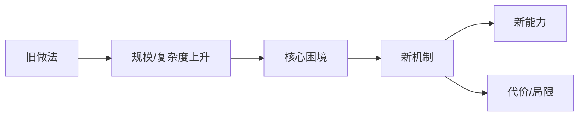

# 从问题到概念的心智模型

当用户问"这是什么"、"为什么存在"、"怎么理解它"时，用这个框架讲解。

## 核心原则

> **概念是压力催生的**。不从术语讲起，从"没有它的时候世界怎么运转"开始。

## 讲解格式

### 1. 没有它的时代：困境是什么？

- 旧方案是什么？
- 规模、复杂度或场景上升后，哪里**崩了**？
- 具体的失败代价是什么（时间、金钱、认知、可靠性……）？

> 不写"随着技术发展"这种空话。要具体：一个数字、一次事故、一个不可逾越的墙。

### 2. 它为何出现：解决什么具体问题？

- 它的**本职工作**一句话说清楚
- 核心机制对应解决第 1 步的哪个困境
- 它的**局限性**是什么？它不解决什么？

### 3. 跨领域类比：它的生态位是什么？

找一个不同领域的类比物，要求：

- 两者在各自领域里**扮演相同的角色**（不只是长得像）
- 明确标注类比的**相似边界**和**断裂点**

> 类比不是装饰品，是认知脚手架。如果找不到好的类比，宁可不要。

### 4. 底层原理与本质

- 最小的因果链：什么因 → 什么果
- 区分**机制**（怎么工作）和**本质**（引入了什么权衡/间接层/不变量）
- 用类比辅助理解，不要用更多术语

### 5. Mermaid 心智模型（可选）

如果概念有清晰的因果流向或层级关系，用 Mermaid 画出来。

- 节点 4-8 个，主路径单一
- 标签简短，细节放文字说明
- 不是架构图，是因果图

### 6. 一句话带走

用一句普通人能听懂的话总结。不出现原概念的术语。

---

## 规则

- **先困境，后概念**：逻辑链不能断
- **类比要有断裂点**：说明"但不同的是……"
- **不美化代价**：局限和代价必须讲
- **Mermaid 可选**：没有清晰流向就不画
- **跨领域通用**：技术、经济、自然科学、社会现象均可

## 示例

> 讲解：SQL JOIN

### 1. 没有它的时代

数据散在多张表里：用户表、订单表、商品表。想查"买了某商品的用户email"，得在代码里循环嵌套查——表越多循环越深，一次查询耗时从 1ms 变成 N³ 次数据库往返。

### 2. 它为何出现

**本职工作**：把分散的数据按关系"拼"成一张临时表，一次查询返回。
**局限**：大表 JOIN 容易变慢；JOIN 顺序不同性能天差地别；它不负责优化。

### 3. 类比：Excel 的 VLOOKUP

想象两张表用人肉 VLOOKUP 拼——JOIN 就是数据库替你自动做这件事，而且是一次性完成不是循环查。
**断裂点**：VLOOKUP 只能向右查，JOIN 可以任意方向；VLOOKUP 靠人肉复制，JOIN 是数据库内部计算。

### 4. 底层原理

JOIN 的本质是**笛卡尔积 + 过滤**：先做所有行的组合，再按条件筛选。优化器决定先筛哪边、用哪个索引。

### 5. Mermaid

### 6. 一句话

JOIN 就是数据库帮你省掉手写循环查表的功夫，一次性把有关联的数据拼回来。

---

## 适用场景

- 框架/库的核心理念
- 分布式/系统概念（Raft、超时重试、幂等……）
- 经济/商业概念（套利、杠杆、流动性……）
- 自然科学概念（熵、负反馈……）
- 任何"听起来抽象但解决了实际问题"的概念

---
> Source: [lucy971326/EDITH](https://github.com/lucy971326/EDITH) — distributed by [TomeVault](https://tomevault.io).
<!-- tomevault:4.0:skill_md:2026-09-13 -->
