```mermaid
architecture-beta
  service api(logos:dotnet)[API service]
  service frontend(aspire:blazor)[Blazor front end]

  frontend:L --> R:api
```

# Documentation Writer Skill

This skill provides guidelines for AI coding agents to help maintainers produce accurate and easy-to-maintain documentation for the Aspire project. The aspire.dev repository is the official documentation site for Aspire, and this skill helps ensure consistent, high-quality documentation.

## Documentation Overview

### Site Structure

**Location**: `src/frontend/src/content/docs/`  
**Audience**: Developers using Aspire for cloud-native application development  
**Format**: Astro with MDX files  
**Build System**: Astro (static site generator with Starlight theme)

### Documentation Categories

```
src/frontend/src/content/docs/
├── index.mdx                    # Landing page
├── get-started/                 # Getting started guides
│   ├── prerequisites.mdx
│   ├── install-cli.mdx
│   ├── first-app.mdx
│   └── ...
├── app-host/                    # AppHost documentation
├── architecture/                # Architecture concepts
├── dashboard/                   # Aspire Dashboard docs
├── deployment/                  # Deployment guides
├── diagnostics/                 # Diagnostics and telemetry
├── extensibility/               # Extensibility guides
├── fundamentals/                # Core concepts
├── integrations/                # Integration documentation
│   ├── ai/                      # AI integrations
│   ├── caching/                 # Caching integrations
│   ├── cloud/                   # Cloud integrations
│   ├── compute/                 # Compute integrations
│   ├── databases/               # Database integrations
│   ├── frameworks/              # Framework integrations
│   ├── messaging/               # Messaging integrations
│   ├── observability/           # Observability integrations
│   ├── reverse-proxies/         # Reverse proxy integrations
│   └── security/                # Security integrations
├── reference/                   # API reference
├── testing/                     # Testing guides
└── whats-new/                   # Release notes
```

### Localization and Sidebar Labels

When adding, moving, or renaming localized docs pages, keep the sidebar topic config in sync under `src/frontend/config/sidebar/*.topics.ts`. Topic labels and item `translations` should include entries for the supported Starlight locale codes used by the site, such as `pt-BR` and `zh-CN`; do not add obsolete or generic locale keys like `pt` or `pt-PT` unless they are explicitly present in `src/frontend/config/locales.ts`.

Route path segments can be lowercase (`pt-br`, `zh-cn`), but sidebar translation keys follow the locale codes consumed by Starlight. API reference docs under `src/content/docs/reference/api/` are intentionally not localized and should stay excluded from localization/sidebar translation work.

## Astro and MDX Conventions

When calling `pnpm dev` or `aspire run` to test documentation in the context of CI/CD, or from an LLM, call `astro telemetry disable` to disable telemetry.

### Frontmatter

Every documentation file requires frontmatter:

```yaml
---
title: Page Title
description: A brief summary of the page content (required for SEO)
---
```

Optional frontmatter fields:

- `next: false` - Disable "Next page" link for terminal pages
- `seoTitle` - Override the page's `og:title` / `twitter:title` only,
  without touching the visible H1 or sidebar label. Use this **only**
  when the natural H1 must stay short (commands, terse labels). When
  set, the value is emitted verbatim — no `· Aspire` suffix is appended.
- Custom metadata as needed by Starlight theme

#### SEO length targets

The site uses Open Graph metadata to render social cards and feed SEO
tooling. To keep previews scannable on every social network and to
avoid the "title too short / description too long" lints that surface
on Yoast, LinkedIn, and the search-console reports, follow these
length targets when authoring frontmatter:

| Field         | Composed length target | Hard limit |
| ------------- | ---------------------: | ---------: |
| `title`       | 41-51 characters       | 70 characters |
| `seoTitle`    | 50-60 characters       | 70 characters |
| `description` | 110-160 characters     | 200 characters (auto-truncated) |

`title` becomes `og:title` composed as `${title} · Aspire`, so the
target window leaves room for the 9-character suffix. `seoTitle`
overrides the composition outright — write the full string yourself.

Surface keywords from the article body itself in the description
(verbs, integration names, API surfaces). The CI guard at
`tests/unit/seo-lengths.vitest.test.ts` fails when any English page
strays outside the wider 30-65 / 80-200 character guard ranges, so a
draft can land slightly off-target and tighten in follow-ups.

### Required Imports

Import Starlight components at the top of your MDX file, or custom components as needed:

```tsx
import {
  CardGrid,
  LinkCard,
  Steps,
  Tabs,
  TabItem,
  Icon,
} from "@astrojs/starlight/components";
import FileTree from "starlight-plugin-icons/components/FileTree.astro";
```

Additional commonly used imports:

```tsx
import { Kbd } from "starlight-kbd/components";
import LearnMore from "@components/LearnMore.astro";
import OsAwareTabs from "@components/OsAwareTabs.astro";
import PivotSelector from "@components/PivotSelector.astro";
import Pivot from "@components/Pivot.astro";
import ThemeImage from "@components/ThemeImage.astro";
import InstallPackage from "@components/InstallPackage.astro";
import InstallDotNetPackage from "@components/InstallDotNetPackage.astro";
import AsciinemaPlayer from "@components/AsciinemaPlayer.astro";
import Badge from "@astrojs/starlight/components/Badge.astro";
import Image from "astro:assets";
```

### Component Usage

Prefer existing components in `src/frontend/src/components/` over bespoke MDX markup when the site already has a reusable pattern for the content. This keeps docs consistent and reduces duplicated styling, accessibility fixes, and behavior logic.

When you introduce or change a custom component that is used by docs pages:

- Keep the public props intentional and typed so MDX authors get statement completion and editor help.
- Reuse existing aliases such as `@components/*` and `@assets/*` rather than deep relative imports.
- Prefer moving heavier shared logic into colocated `.ts` helpers when the `.astro` frontmatter becomes large or is duplicated across components.
- Treat user-visible behavior, accessibility, and responsive behavior as part of the documentation contract, not as optional polish.

### Common Markdown syntax

Use the rendered examples in `src/frontend/src/content/docs/community/contributor-guide.mdx` as the canonical reference for common Markdown syntax. When adding tables, use padded pipes, a separator row with at least three hyphens per cell, and blank lines before and after the table:

```md
| Feature | Description | Status |
| ------- | ----------- | ------ |
| Dashboard | Web-based monitoring | Available |
```

Do not replace standard Markdown with ad hoc HTML unless a component or layout requirement cannot be expressed clearly in Markdown.

#### Aside (Callouts)

Prefer fenced `:::` callouts for tips, notes, cautions, and warnings. Use the `Aside` component only when a JSX-only composition pattern is required.

```mdx
:::tip[Pro Tip]
This is a helpful tip for users.
:::

:::note
Important information users should be aware of.
:::

:::caution
Proceed with care - this may have unexpected consequences.
:::

:::danger
Critical warning - this could cause data loss or security issues.
:::
```

#### Steps

Use for sequential instructions:

````mdx
<Steps>

1. First step with explanation

   ```bash title="Run this command"
   aspire new aspire-starter
   ```

2. Second step

3. Third step

</Steps>
````

#### Tabs/TabItem

Use for language or platform-specific content:

````mdx
<Tabs syncKey="cli-commands">
<TabItem label="CLI">

```bash
aspire run
```
````

</TabItem>
<TabItem label="Visual Studio">

Press F5 to start debugging.

</TabItem>
</Tabs>
```

If a heading should appear in the **On this page** table of contents, keep that heading outside the `Tabs` component. Headings placed inside `TabItem` content may be skipped by the generated TOC.

#### OsAwareTabs (Bash and PowerShell)

When the **only** tab options are **Bash** and **PowerShell**, **always** use the `OsAwareTabs` custom component instead of bare `<Tabs>` / `<TabItem>`. `OsAwareTabs` wraps Starlight's synced `Tabs` and adds OS-aware behavior:

- Detects the reader's operating system and defaults the active tab to **PowerShell** on Windows and **Bash** everywhere else.
- Uses the canonical `seti:shell` and `seti:powershell` icons so the labels render consistently across the site.
- Persists the reader's choice across pages via the standard Starlight `syncKey`. Use `syncKey="terminal"` so all OS-aware terminal blocks stay in sync.
- Exposes two named slots — `unix` and `windows` — that contain the Bash and PowerShell content respectively.

````mdx
import OsAwareTabs from "@components/OsAwareTabs.astro";

<OsAwareTabs syncKey="terminal">
<div slot="unix">

```bash
az group create --name my-group --location westus3
```

</div>
<div slot="windows">

```powershell
az group create --name my-group --location westus3
```

</div>
</OsAwareTabs>
````

A few rules to follow:

- Do **not** wrap a Bash + PowerShell pairing in bare `<Tabs syncKey="shell-lang">` — convert it to `OsAwareTabs` instead. This is the canonical pattern used across the dashboard, install-cli, container-networking, and AKS deployment guides.
- Always set `syncKey="terminal"` unless there is a specific reason to scope the persistence differently. The site-wide convention is a single shared key so a reader who picks PowerShell once continues to see PowerShell on every page that offers the choice.
- Keep the leading and trailing blank lines around the inner code fences (as shown above). MDX requires the blank lines so the fenced code block is parsed correctly inside the slotted `<div>`.
- `OsAwareTabs` is **only** for the Bash + PowerShell pairing. Continue to use bare `<Tabs>` / `<TabItem>` for non-OS choices such as C#/TypeScript AppHost samples (`syncKey='aspire-lang'`), CLI vs IDE, deployment targets, or package managers.

#### Pivot/PivotSelector

Use `Pivot` and `PivotSelector` sparingly, only for **key landing-page-style articles** where the choice should persist across page navigations and where sharing the page through a URL should land the reader on a specific variant. Pivots support query string values to set the selected option (for example, `?aspire-lang=typescript`). Examples in use today include the [Build your first Aspire app](/get-started/first-app/) and [Deploy your first Aspire app](/get-started/deploy-first-app/) tutorials.

For most pages — including AppHost C# and TypeScript code samples within a guide — prefer synced `Tabs` / `TabItem` blocks at the snippet level instead. See [AppHost Language Parity (C# and TypeScript)](#apphost-language-parity-c-and-typescript).

```mdx
<PivotSelector
  title="Select your programming language"
  key="lang"
  options={[
    { id: "csharp", title: "C#" },
    { id: "python", title: "Python" },
  ]}
/>

<Pivot id="csharp">C# specific content here.</Pivot>

<Pivot id="python">Python specific content here.</Pivot>
```

If a heading needs to appear in the **On this page** table of contents, keep the heading outside the `Pivot` content and put only the variant-specific body content inside each `Pivot`.

#### On this page and "Overview" headings

When a page shows the **On this page** table of contents (the default behavior unless `tableOfContents: false` is set), do **not** add an `Overview` heading at any level (`##`, `###`, etc.). The docs site already provides an implicit overview link to the top of the page, so an explicit `Overview` heading becomes redundant.

If your opening section is truly introductory, keep it as body copy without an `Overview` heading. If that section has a more specific purpose, use a descriptive heading such as `Key concepts`, `Prerequisites`, or another topic-specific label.

For Aspire AppHost code examples, use synced `Tabs` / `TabItem` blocks with `syncKey='aspire-lang'` at each code snippet. Do **not** add a page-level `PivotSelector` just to switch AppHost code samples between C# and TypeScript. Readers should be able to switch the language at the specific snippet they are reading.

```mdx
<Tabs syncKey='aspire-lang'>
<TabItem id='csharp' label='C#'>
C# example content here.
</TabItem>

<TabItem id='typescript' label='TypeScript'>
TypeScript example content here.
</TabItem>
</Tabs>
```

#### CardGrid and LinkCard

Use for navigation and feature highlights:

```mdx
<CardGrid>
  <LinkCard
    title="Getting Started"
    description="Build your first Aspire app"
    href="/get-started/first-app/"
  />
  <LinkCard
    title="Integrations"
    description="Explore available integrations"
    href="/integrations/"
  />
</CardGrid>
```

#### Kbd (Keyboard Shortcuts)

Use the `Kbd` component from `starlight-kbd` to display keyboard shortcuts with OS-specific variants. This renders styled `<kbd>` elements and automatically shows the correct shortcut for the reader's operating system.

```mdx
import { Kbd } from "starlight-kbd/components";

Open the Command Palette (<Kbd windows="Ctrl+Shift+P" mac="Cmd+Shift+P" />)
```

**Props**:

- `windows` — The shortcut for Windows (also used as the default/Linux fallback)
- `mac` — The shortcut for macOS
- `linux` — (optional) The shortcut for Linux, if different from Windows

You can specify just `windows` when the shortcut is the same on all platforms (e.g., `<Kbd windows="F5" />`), or provide OS-specific values when they differ:

```mdx
Open a terminal (<Kbd windows="Ctrl+`" mac="⌘+`" linux="Ctrl+`" />)
```

Always prefer the `Kbd` component over the raw HTML `<kbd>` element, even for simple keys that don't vary by OS. This ensures consistent styling and behavior across the site:

```mdx
Press <Kbd windows="F5" /> to start debugging.
```

#### LearnMore

Use the `LearnMore` component to add a styled "learn more" link with an open-book icon. It provides a consistent visual pattern for directing readers to related documentation.

```mdx
import LearnMore from "@components/LearnMore.astro";

<LearnMore>
  For more information, see [Service Defaults](/fundamentals/service-defaults/).
</LearnMore>
```

The component renders an open-book icon alongside the provided content. Place it after a section or code example to point readers to deeper documentation. It works well inside fenced `:::` callouts or after `<Steps>`:

````mdx
:::tip[Feature flag]
Enable polyglot support by running:

```bash
aspire config set features:polyglotSupportEnabled true --global
```

<LearnMore>
  For more information, see [aspire config command
  reference](/reference/cli/commands/aspire-config-set/)
</LearnMore>
:::
````

#### Aspire Custom Components

Use Aspire's custom components when they express a documentation pattern more clearly than raw Markdown or ad hoc HTML. Common examples include `LearnMore`, `PivotSelector`, `Pivot`, `ThemeImage`, `InstallPackage`, `InstallDotNetPackage`, `AsciinemaPlayer`, and the other components in `src/frontend/src/components/`.

Before introducing a new custom component for docs:

- Check whether an existing component already solves the layout or interaction.
- Prefer extending an existing component when the semantics stay clear.
- Only add a new component when the pattern will be reused or the behavior is complex enough to justify a shared abstraction.

If you add or change a custom component, also update the relevant tests so documentation behavior stays covered.

### Code Blocks

Always include a descriptive title:

````mdx
```csharp title="AppHost.cs"
var builder = DistributedApplication.CreateBuilder(args);

var api = builder.AddProject<Projects.Api>("api");

// After adding all resources, run the app...
builder.Build().Run();
```
````

````mdx
```typescript title="apphost.mts"
import { createBuilder } from "./.aspire/modules/aspire.mjs";

const builder = await createBuilder();

const api = await builder.addProject("api", "../Api/Api.csproj");

await builder.build().run();
```
````

For JSON configuration:

````mdx
```json title="JSON — appsettings.json"
{
  "ConnectionStrings": {
    "mydb": "Host=localhost;Database=mydb"
  }
}
```
````

### Package Installation Components

For hosting packages:

```mdx
<InstallPackage package="Aspire.Hosting.Redis" />
```

For client/library packages:

```mdx
<InstallDotNetPackage package="Aspire.StackExchange.Redis" />
```

## AppHost Language Parity (C# and TypeScript)

Aspire supports both **C# AppHosts** (`AppHost.cs`) and **TypeScript AppHosts** (`apphost.mts`). Documentation must treat both languages as first-class citizens. **Always show both C# and TypeScript code samples for AppHost code unless the feature is genuinely language-specific or TypeScript support does not exist yet.** Never write AppHost or hosting-integration documentation with a C#-only bias.

### Core Principles

1. **Always show both languages**: Every AppHost-focused example, walkthrough, and AppHost code sample must include both C# and TypeScript variants unless the feature is genuinely language-specific.
2. **Use neutral framing**: Write prose that applies to both languages. Say "In your AppHost" not "In your C# project". Say "Add a Redis resource" not "Call `builder.AddRedis()`".
3. **Neither language is the default**: Don't present C# first as the "real" example and TypeScript as an afterthought. Both tabs are equal peers.
4. **Verify TypeScript APIs exist**: Before writing a TypeScript example, confirm the API exists in the TypeScript AppHost SDK. Do not invent TypeScript samples — if you are unsure whether an API is available, flag it for review.

### AppHost tabs pattern for AppHost content

Use synced `Tabs` for AppHost-specific content that changes between C# and TypeScript. Each AppHost code snippet should provide its own language tabs and use `syncKey='aspire-lang'` so the user's language choice stays synchronized across snippets on the page.

````mdx
import { Tabs, TabItem } from "@astrojs/starlight/components";

<Tabs syncKey='aspire-lang'>
<TabItem id='csharp' label='C#'>

```csharp title="AppHost.cs"
var builder = DistributedApplication.CreateBuilder(args);

var cache = builder.AddRedis("cache");

builder.AddProject<Projects.Api>("api")
    .WithReference(cache);

builder.Build().Run();
```

</TabItem>
<TabItem id='typescript' label='TypeScript'>

```typescript title="apphost.mts"
import { createBuilder } from "./.aspire/modules/aspire.mjs";

const builder = await createBuilder();

const cache = await builder.addRedis("cache");

const api = await builder.addProject("api", "../Api/Api.csproj");
await api.withReference(cache);

await builder.build().run();
```

</TabItem>
</Tabs>
````

Use the same synced tabs pattern for more than code blocks when needed. Entire paragraphs, lists, asides, or multi-step sections can live inside the `csharp` and `typescript` tab items when the workflows differ.

Use different `syncKey` values for other concerns such as CLI vs IDE, deployment targets, platform choices, or package managers. For AppHost language tabs, use exactly `syncKey='aspire-lang'`.

If a section heading should appear in the **On this page** table of contents, keep that heading outside `Tabs`. Headings inside `TabItem` content may be skipped by the TOC generator, so the recommended pattern is a shared heading followed by tabs containing only the language-specific body content.

### Conventions

| Aspect           | C#                                              | TypeScript                                                                                                          |
| ---------------- | ----------------------------------------------- | ------------------------------------------------------------------------------------------------------------------- |
| File title       | `title="AppHost.cs"`                            | `title="apphost.mts"`                                                                                                |
| Tab wrapper      | Shared `<Tabs syncKey='aspire-lang'>` container | Shared `<Tabs syncKey='aspire-lang'>` container                                                                     |
| Tab item         | `<TabItem id='csharp' label='C#'>`              | `<TabItem id='typescript' label='TypeScript'>`                                                                      |
| Builder creation | `DistributedApplication.CreateBuilder(args)`    | `import { createBuilder } from './.aspire/modules/aspire.mjs';` then newline for space followed by `await createBuilder();` |
| Method casing    | PascalCase (`AddRedis`)                         | camelCase (`addRedis`)                                                                                              |
| Async pattern    | Synchronous fluent calls                        | `await` each builder call                                                                                           |
| Build & run      | `builder.Build().Run()`                         | `await builder.build().run()`                                                                                       |

### Prose Guidelines

When writing narrative text around AppHost examples:

- ✅ "Add a Redis resource to your AppHost"
- ✅ "The following example shows how to configure a PostgreSQL resource"
- ❌ "Call `builder.AddRedis()` in your _Program.cs_" (C#-specific)
- ❌ "Add the following C# code to your AppHost" (when both languages should be shown)

When a concept differs between languages (e.g., configuration files, async patterns), explain both within the AppHost language tabs or in language-neutral prose above the tabs.

### When TypeScript Is Not Yet Supported

If a hosting integration does not yet have TypeScript AppHost support, show only the C# example without language tabs and add a note:

```mdx
<Aside type="note">
  TypeScript AppHost support for this integration is not yet available.
</Aside>
```

Do **not** wrap a single language in a single-language `<Tabs>` component — that creates a misleading UI suggesting another option exists.

## Integration Documentation

### File Location

Place integration docs in the appropriate category folder under `src/frontend/src/content/docs/integrations/`:

| Category        | Folder             | Examples                        |
| --------------- | ------------------ | ------------------------------- |
| AI/ML           | `ai/`              | Ollama, Azure OpenAI            |
| Caching         | `caching/`         | Redis, Garnet, Valkey           |
| Cloud           | `cloud/`           | Azure, AWS services             |
| Compute         | `compute/`         | Docker, Kubernetes              |
| Databases       | `databases/`       | PostgreSQL, SQL Server, MongoDB |
| Frameworks      | `frameworks/`      | Python, Rust, Orleans           |
| Messaging       | `messaging/`       | RabbitMQ, Kafka                 |
| Observability   | `observability/`   | OpenTelemetry, Prometheus       |
| Reverse Proxies | `reverse-proxies/` | YARP                            |
| Security        | `security/`        | Keycloak                        |

### Integration Documentation Structure

#### For Hosting-Only Integrations

````mdx
---
title: [Technology] integration
description: Learn how to use the [Technology] integration with Aspire.
---

import { Aside, Tabs, TabItem } from "@astrojs/starlight/components";
import InstallPackage from "@components/InstallPackage.astro";
import Image from "astro:assets";

import techIcon from "@assets/icons/technology.svg";

<Image
  src={techIcon}
  alt="Technology logo"
  width={100}
  height={100}
  style="float: left; margin-right: 1rem;"
  data-zoom-off
/>

Brief description of the technology and what the integration enables.

## Hosting integration

<InstallPackage packageName="Aspire.Hosting.Technology" />

### Add [Technology] resource

<Tabs syncKey='aspire-lang'>
<TabItem id='csharp' label='C#'>

```csharp title="AppHost.cs"
var builder = DistributedApplication.CreateBuilder(args);

var tech = builder.AddTechnology("tech");

// After adding all resources, run the app...
builder.Build().Run();
```

</TabItem>
<TabItem id='typescript' label='TypeScript'>

```typescript title="apphost.mts"
import { createBuilder } from "./.aspire/modules/aspire.mjs";

const builder = await createBuilder();

const tech = await builder.addTechnology("tech");

await builder.build().run();
```

</TabItem>
</Tabs>

### Configuration options

Describe available configuration methods and options.

## See also

- [Official Technology documentation](https://...)
- [Related Aspire documentation](/path/to/related/)
````

#### For Hosting + Client Integrations

Include both hosting and client sections:

````mdx
## Hosting integration

<InstallPackage packageName="Aspire.Hosting.Technology" />

### Add [Technology] resource

<Tabs syncKey='aspire-lang'>
<TabItem id='csharp' label='C#'>

```csharp title="AppHost.cs"
var builder = DistributedApplication.CreateBuilder(args);

var tech = builder.AddTechnology("tech");

builder.AddProject<Projects.Api>("api")
    .WithReference(tech);

builder.Build().Run();
```

</TabItem>
<TabItem id='typescript' label='TypeScript'>

```typescript title="apphost.mts"
import { createBuilder } from "./.aspire/modules/aspire.mjs";

const builder = await createBuilder();

const tech = await builder.addTechnology("tech");

const api = await builder.addProject("api", "../Api/Api.csproj");
await api.withReference(tech);

await builder.build().run();
```

</TabItem>
</Tabs>

### Hosting integration health checks

[Health check information if applicable...]

## Client integration

<InstallDotNetPackage packageName="Aspire.Technology" />

### Add [Technology] client

```csharp title="C# — Program.cs"
builder.AddTechnologyClient("tech");
```

### Add keyed [Technology] client

```csharp title="C# — Program.cs"
builder.AddKeyedTechnologyClient("tech");
```

For more information, see [.NET dependency injection: Keyed services](https://learn.microsoft.com/dotnet/core/extensions/dependency-injection#keyed-services).

### Configuration

#### Connection strings

The connection name must match the resource name defined in the AppHost.

#### Configuration providers

```json title="JSON — appsettings.json"
{
  "Aspire": {
    "Technology": {
      "myconnection": {
        "Option1": "value"
      }
    }
  }
}
```

### Client integration health checks

[Health check information...]

### Observability and telemetry

[Logging and tracing information...]

## See also

- [Official documentation](https://...)
````

### Community Toolkit Integrations

For integrations from the [Aspire Community Toolkit](https://github.com/CommunityToolkit/Aspire), add the badge at the top:

```mdx
import Badge from "@astrojs/starlight/components/Badge.astro";

<Badge text="⭐ Community Toolkit" variant="tip" size="large" />
```

## Updating Navigation

After creating documentation, update the sidebar configuration:

### Location

Edit `src/frontend/config/sidebar/sidebar.topics.ts` (or the appropriate topic file)

### Adding Entries

Add entries to the appropriate section in alphabetical order:

```typescript
{ label: "Technology Name", slug: "integrations/category/technology" }
```

For collapsed sections with children:

```typescript
{
  label: "Technology Name",
  collapsed: true,
  items: [
    { label: "Overview", slug: "integrations/category/technology" },
    { label: "Advanced", slug: "integrations/category/technology-advanced" },
  ]
}
```

### Update Integration Links

After adding integration documentation, run the update-integrations prompt to ensure the integration is indexed:

```
.github/prompts/update-integrations.prompt.md
```

## Writing Style Guidelines

### Voice and Tone

- Use **second person** ("you") when addressing the reader
- Use **active voice** ("Create a resource" not "A resource is created")
- Use **imperative mood** for instructions ("Call the method" not "You should call the method")
- Be concise but complete
- Be professional but approachable

### Terminology

Use consistent terminology throughout:

| Preferred   | Avoid                                         |
| ----------- | --------------------------------------------- |
| Aspire      | .NET Aspire (except in formal/legal contexts) |
| AppHost     | App Host, app host                            |
| resource    | component (for AppHost resources)             |
| integration | connector, plugin                             |

### Inclusive Language

- Use inclusive, accessible language
- Avoid assumptions about the reader's background
- Use gender-neutral pronouns (they/them) or rewrite to avoid pronouns
- Avoid ableist language (e.g., "blind to", "crippled by")
- Use people-first language when discussing disabilities
- Do **not** frame `.NET` as the default and everything else as an exception. Avoid phrases such as `non-.NET`, `other languages`, or wording that treats Python, JavaScript, Go, or container-based apps as secondary scenarios.
- When a section is really about a capability or execution model, name that directly instead of contrasting it with `.NET`. For example, prefer headings such as `Pass connection information to app resources` or `Run applications directly on the host` over `.NET` vs. `non-.NET` framing.
- If specific runtimes matter, name them because the product behavior differs for them—not just as a find-and-replace for `non-.NET`. Otherwise, use positive, capability-based language such as `multi-language apps`, `app resources`, `services built from Dockerfiles`, or `apps that consume environment variables directly`.

### International Considerations

- Write dates as "January 15, 2025" not "1/15/25"
- Specify time zones when referencing specific times
- Use diverse, international examples
- Avoid idioms and culturally-specific references

## Icons and Images

### Icon Location

Place icons in `src/frontend/src/assets/icons/`

### Icon Usage

```mdx
import Image from "astro:assets";
import techIcon from "@assets/icons/technology.svg";

<Image
  src={techIcon}
  alt="Technology logo"
  width={100}
  height={100}
  style="float: left; margin-right: 1rem;"
  data-zoom-off
/>
```

For light/dark theme variants:

```mdx
import ThemeImage from "@components/ThemeImage.astro";

<ThemeImage
  lightSrc={techIconLight}
  darkSrc={techIconDark}
  alt="Technology logo"
  width={100}
  height={100}
/>
```

### Terminal Recordings (Asciinema)

For details on terminal recordings, including how to create and embed them, see the [terminal-recordings skill reference](./references/terminal-recordings.md).

## Testing Your Documentation

Before submitting documentation:

1. **Preview locally**: Run the site locally to verify rendering and content flow
2. **Check links**: Ensure all internal and external links work
3. **Validate code**: Test all code examples compile and run using `aspire run`
4. **Review formatting**: Verify components render correctly
5. **Run relevant tests**: Do not consider documentation or component work done until the affected tests pass
6. **Check navigation**: Confirm sidebar entries are correct

### Documentation Validation Strategy

Use the smallest set of checks that proves the change is correct:

- For MDX copy, structure, and navigation changes, verify the page locally and check the edited links.
- For custom component usage changes, run the component render tests that cover the affected behavior.
- For component prop surface changes, update and run the prop-contract coverage so editor completions and consumer typings stay intact.
- For interactive behavior changes, run targeted Playwright coverage for the scenario you changed rather than relying on unrelated broad suites.
- For browser-based local verification, use `playwright-cli` (`playwright-cli open <frontend-url>`, `playwright-cli snapshot`, `playwright-cli click <ref>`) instead of Playwright MCP tools.
- For accessibility-sensitive changes, validate both the rendered page and any focused accessibility tests that exercise the affected interaction.

### Custom Component and Test Expectations

If a documentation change adds, removes, or materially changes a custom component, you should usually update one or more of these test layers:

- `src/frontend/tests/unit/custom-components.vitest.test.ts` for runtime render coverage of custom Astro components.
- `src/frontend/tests/typecheck/component-props.contracts.ts` when component props change and the public prop contract should remain typed for MDX and other consumers.
- `src/frontend/tests/e2e/*.spec.ts` for user-visible interactions that depend on hydration, persistence, navigation, or accessibility behavior.

Examples of scenarios that often merit targeted tests:

- query-string or local-storage persistence
- cookie-consent or preference-driven behavior
- responsive behavior that changes across desktop, tablet, and mobile
- keyboard navigation, focus management, or screen-reader labeling
- repeated code examples that need distinct accessible labels or titles
- RSS, analytics, or other generated/static asset behaviors exposed through docs pages

### Recommended Frontend Test Commands

Prefer targeted validation over the slowest possible full-site build when the change does not require it.

```bash
pnpm --dir ./src/frontend run test:unit:components
pnpm --dir ./src/frontend run test:unit:contracts
pnpm --dir ./src/frontend exec playwright test tests/e2e/<relevant-spec>.ts
```

If you changed custom components, docs interactions, or accessibility behavior, make sure the relevant targeted tests pass before submitting the work.

### Installing the Aspire CLI

Ensure you have the appropriate version of the Aspire CLI installed for testing. The version depends on what you're documenting:

#### GA/Stable Builds (Default)

For documenting released features:

```bash
# Linux/macOS
curl -sSL https://aspire.dev/install.sh | bash

# Windows (PowerShell)
irm https://aspire.dev/install.ps1 | iex
```

For complete installation instructions, see [Install Aspire CLI](https://aspire.dev/get-started/install-cli/).

#### Nightly/Dev Builds

For documenting features on the main branch that haven't been released yet:

```bash
# Linux/macOS
curl -sSL https://aspire.dev/install.sh | bash -s -- --quality dev

# Windows (PowerShell)
iex "& { $(irm https://aspire.dev/install.ps1) } -Quality 'dev'"
```

You can also access this via the download icon on aspire.dev and selecting "Dev" from the Channel selector.

#### PR Builds

For documenting features in specific pull requests before they merge:

1. Go to the PR in [microsoft/aspire](https://github.com/microsoft/aspire)
2. Find the build artifacts in the Checks/Actions section
3. Download and install the CLI from the PR artifacts

This is useful for getting an early start on documentation for upcoming features.

#### Staging Builds

For prerelease builds from the current release branch:

```bash
# Linux/macOS
curl -sSL https://aspire.dev/install.sh | bash -s -- --quality staging

# Windows (PowerShell)
iex "& { $(irm https://aspire.dev/install.ps1) } -Quality 'staging'"
```

### Running Locally

The documentation site can be run locally using the Aspire CLI:

```bash
aspire run
```

<Aside type="tip">
When testing code examples that add integration packages, use `aspire add <package-name>` rather than `dotnet add package`. The Aspire CLI automatically adds packages to the correct project.
</Aside>

Use the Aspire CLI output or dashboard resource list to find the `frontend` endpoint, then open it with `playwright-cli`:

```bash
playwright-cli open <frontend-url>
playwright-cli snapshot
```

Use snapshot refs with `playwright-cli click <ref>` for page interactions.

## Cross-Referencing

### Link to Related Documentation

Use standard Markdown links with absolute paths from the docs root:

```markdown
For more information, see [Service Defaults](/fundamentals/service-defaults/).
```

### Reference NuGet Packages

Use the 📦 emoji with links:

```markdown
Install the [📦 Aspire.Hosting.Redis](https://nuget.org/packages/Aspire.Hosting.Redis) package.
```

### See Also Sections

End pages with a "See also" section linking to:

- Official technology documentation
- Related Aspire documentation
- NuGet package pages
- GitHub repositories (when applicable)

## Localization

The aspire.dev site supports multiple languages. When creating new content:

1. Create content in the default (English) location first
2. Localized versions are managed separately in their respective folders (e.g., `fr/`, `de/`, `ja/`)
3. Do not manually translate content - follow the project's localization workflow

## Common Patterns

### Prerequisites Notes

```mdx
<Aside type="note" title="Prerequisites">
  Before continuing, ensure you have: - [Installed the Aspire
  CLI](/get-started/install-cli/) - [Completed the
  prerequisites](/get-started/prerequisites/)
</Aside>
```

### Version-Specific Information

```mdx
<Aside type="caution">This feature requires Aspire version 9.0 or later.</Aside>
```

### Feature Flags or Experimental Features

```mdx
<Aside type="danger" title="Experimental">
  This feature is experimental and may change in future releases.
</Aside>
```

## Mermaid Diagrams

The site supports Mermaid diagrams for architecture visualization:

````mdx

````

Use the `architecture-beta` diagram type for service architecture diagrams.

## Common Documentation Issues (From PR Feedback)

The following rules are derived from common feedback patterns in documentation PRs. Following these rules will help avoid common mistakes.

### General Writing Rules

1. **Remove unnecessary commas**: Don't write "Now, that you have..." - write "Now that you have..."
2. **Avoid casual language**: Don't include phrases like "treat yourself to a coffee" or other informal asides in documentation
3. **Remove unused imports**: Don't import components that aren't used in the document
4. **Verify all internal links**: Links must point to pages that actually exist. Common mistakes:
   - Linking to `/get-started/setup-and-tooling/` instead of `/get-started/prerequisites/`
   - Linking to `/reference/cli/` for CLI installation instead of `/get-started/install-cli/`
5. **Add redirects when restructuring**: When moving or renaming documentation pages, add redirect entries in `src/frontend/config/redirects.mjs`

### Code Example Rules

1. **Use standard indentation**: For fluent APIs on newlines, use standard 4-space indentation, NOT alignment with the method call above

   ✅ Correct:

   ```csharp
   builder.AddProject<Projects.Api>("api")
       .WithReference(redis)
       .WithExternalHttpEndpoints();
   ```

   ❌ Incorrect (aligned indentation):

   ```csharp
   builder.AddProject<Projects.Api>("api")
          .WithReference(redis)
          .WithExternalHttpEndpoints();
   ```

2. **Code block language identifiers**: Use only one language identifier, not duplicates like `csharp csharp`

3. **Verify code syntax**: Check for typos in code:
   - `main:app` not `main.app` (Python uvicorn module:app format)
   - Verify package/module names are correct

4. **Accurate technical descriptions**:
   - `process.env` is an **object**, not a method
   - `express` is NOT used to access environment variables (that's `process.env`)
   - Don't claim libraries do things they don't do

5. **Connection string environment variables**:
   - For C#/.NET: Use `ConnectionStrings:resourcename` (colon separator)
   - For Python/JavaScript: Use `ConnectionStrings__resourcename` (double underscore separator)
   - Use the standard `ConnectionStrings__<resourcename>` pattern, not custom variable names like `ELASTICSEARCH_ENDPOINT`

6. **Don't document deprecated APIs as primary examples**: If an API is deprecated, don't use it as the first or main example. Use current, recommended APIs.

7. **Avoid insecure defaults in examples**: Don't include `TrustServerCertificate=true` in connection strings without noting it's for development only

### Component Usage Rules

1. **Match Pivot components to their PivotSelector**: When using nested Pivot components, ensure they reference the correct parent PivotSelector with the `key` attribute

2. **Keep LinkCard descriptions concise**: Card descriptions should be short enough to not squeeze the UI. Prefer "Configure persistence..." over "Discover how to configure persistence..."

3. **Avoid redundant Asides**: Don't have two Asides saying similar things near each other

### Cross-Language Documentation

When documenting integrations that support multiple languages (C#, Python, JavaScript):

1. **Show complete, working examples** for each language
2. **Ensure variable names are defined** before they're used in code examples
3. **Verify the same resource name** is used consistently across language examples
4. **Don't remove code that defines variables** that are used later in the document

---
> Source: [microsoft/aspire.dev](https://github.com/microsoft/aspire.dev) — distributed by [TomeVault](https://tomevault.io).
<!-- tomevault:4.0:skill_md:2026-07-19 -->
