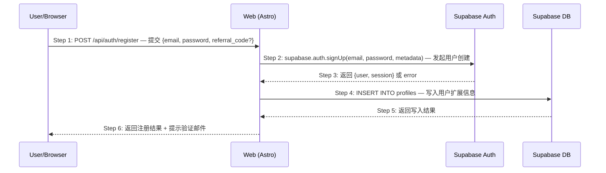

# Skill: Scenario Architect

> 将 Phase 1/2 已定义的业务场景展开为技术时序图，让 API 设计自然浮现，并设计完整的异常用例。场景编号沿用 Phase 1 定义。

## 触发条件

- 用户要求画时序图、设计业务场景或进行场景建模
- 用户提到 "Phase 3 Step 1"、"场景驱动"、"技术方案设计"
- 已有需求文档和产品设计文档（含场景定义），需要开始技术实现
- 用户指定某个场景编号（如 S01）需要展开为时序图

## 核心能力

1. 读取 Phase 1/2 的场景定义和验收条件，作为时序图的输入
2. 为每个场景绘制 Mermaid 时序图（严格遵循编号规范）
3. 为关键步骤撰写说明文字（解释"为什么"而非"做什么"）
4. 识别每个步骤的异常情况，设计结构化的异常用例
5. 生成场景概览文档（场景地图 + 场景索引）

## 与 Phase 1/2 的衔接

**Phase 3 不再从零识别场景。** 场景在 Phase 1 已定义（`S01`, `S02`...），Phase 2 已细化交互流程，Step 0 已确定技术架构和选型。Phase 3 Step 1 的工作是将同一个场景从"交互视角"展开为"技术视角"，时序图的参与方应与架构图中的系统组件一致：

| 输入（来自 Phase 1/2） | 输出（Phase 3） |
|------------------------|----------------|
| 场景编号和名称 | 时序图标题保留编号 |
| 触发条件 | 时序图的起始箭头 |
| 主路径描述 | 时序图的 Step 序列 |
| GIVEN/WHEN/THEN（业务级） | 时序图步骤的行为描述 |
| 异常验收条件 | EX 异常用例（技术级） |
| 涉及的页面和交互（Phase 2） | 参与方识别 |

## 执行步骤

### Step 1: 加载场景上下文

读取 Phase 1 需求文档、Phase 2 产品设计文档和 Phase 3 Step 0 技术架构概要中的场景定义。**不要重新发明场景**——直接沿用已有编号和描述。参与方命名应与架构图中的系统组件保持一致。

**场景粒度前置检查（绘制时序图之前必须执行）：**

在继续之前，先验证 Phase 1 中的场景定义是否粒度合理。检查以下反模式：

- **单 API 场景**：如果一个场景的主路径只有 1-2 个步骤（如"创建任务"= 仅 `POST /api/tasks`），粒度过细
- **CRUD 碎片化**：如果场景列表中对同一实体出现了独立的"创建X"、"查询X"、"更新X"、"删除X"场景，应合并为目标导向的场景
- **缺少业务目标**：如果场景的结果只是"数据被写入/读取了"，说明缺少真正的用户目标

**如果检测到以上任何反模式**：停止绘制时序图，建议回到 Phase 1 按业务目标重新组织场景。为粒度过细的场景绘制时序图会将问题传导到 API 设计、测试用例和代码实现。

确认每个场景的：
- **场景编号**：沿用 Phase 1 的 `S01`, `S02`...（或 Phase 2 的子场景 `S01.1`）
- **参与方**：从 Phase 2 的交互流程中识别涉及哪些系统组件
- **主路径**：从 Phase 1/2 的验收条件中提取正常流程
- **已知异常**：从 Phase 1/2 的异常验收条件中提取

### Step 2: 绘制时序图

为每个场景绘制 Mermaid 时序图，**严格遵循以下规范**：

**编号规范**：
- 每个箭头必须带 `Step N:` 编号前缀
- 编号从 1 开始连续递增
- 每个箭头附一行行为描述：`HTTP方法 /api/路径 — 一句话说明`

**参与方规范**：
- 使用短别名：`U`（User/Browser）、`W`（Web/Frontend）、`SB`（Supabase）、`DB`（Database）
- 每个参与方的全名在 `participant` 声明中注明

**场景编号规范**：
- 文档标题格式：`S01: 邮箱注册 — 时序图`
- 一个场景一个文件，编号对应 Phase 1

**格式示例**：



### Step 3: 撰写步骤叙事

在时序图之后，用**连续编号列表**将所有步骤逐一写出来，形成人类可以从头到尾流畅阅读的线性叙事。

**格式规范**：

1. **每一步都必须写出来**——不跳步，不省略。简单步骤一行带过，复杂步骤在下方用 `>` blockquote 补充说明
2. **每一步必须有明确的主语**——读者不需要猜"这是谁做的"。主语使用参与方表中的别名或全名
3. **编号与时序图的 Step N 严格对应**
4. **正常流程和异常用例分开写**——正常流程在前，异常用例在后。正常流程中只在触发异常的步骤后标注 `→ 见 EX-N.M` 引用，不展开异常内容

**正常流程格式示例**：

````markdown
## 步骤说明

1. **开发者**在终端输入 `openlogos init my-project`。
2. **CLI** 检查 `logos/logos.config.json` 是否已存在。如果已存在 → 见 EX-2.1。
3. **CLI** 在终端显示语言选择菜单（1. English / 2. 中文）。如果终端为非 TTY → 见 EX-3.1。

> 语言选择放在 `init` 阶段（而非全局配置），因为这是用户与 OpenLogos 的第一次接触，此时确认语言最自然。

4. **开发者**选择语言（输入 1 或 2）。
5. **CLI** 从 `package.json` / `Cargo.toml` / `pyproject.toml` / 目录名中探测项目名。如果用户传入的 name 与配置文件名不一致 → 见 EX-5.1。

> 优先级链：命令行参数 > package.json > Cargo.toml > pyproject.toml > 目录名。scoped name 自动去掉 `@org/` 前缀。

6. **CLI** 依次创建 11 个目录（`logos/resources/prd/...` 等），每个目录写入 `.gitkeep`。
7. **CLI** 写入 `logos/logos.config.json`（含 locale + 5 个文档模块定义）。
8. **CLI** 写入 `logos/logos-project.yaml`（含空 tech_stack + conventions）。
9. **CLI** 写入 `AGENTS.md` 和 `CLAUDE.md`（含 Phase detection logic）。
10. **CLI** 在终端输出创建的文件清单和下一步建议。
````

**异常用例格式示例**：

````markdown
## 异常用例

### EX-2.1: 项目已初始化

- **触发条件**：Step 2 检测到 `logos/logos.config.json` 已存在
- **期望响应**：stderr 输出 `Error: logos/logos.config.json already exists in current directory.`，exit(1)
- **副作用**：不创建任何文件，不覆盖已有配置

### EX-3.1: 非 TTY 环境

- **触发条件**：Step 3 检测到 `process.stdin.isTTY` 为 false（CI 管道 / 管道输入）
- **期望响应**：跳过语言选择交互，默认 `locale = 'en'`
- **副作用**：无，流程直接进入 Step 5

### EX-5.1: 项目名冲突

- **触发条件**：Step 5 中用户传入的 `name` 与 `package.json`（或其他配置文件）中的名称不一致
- **期望响应**：显示两个选项让用户选择，非 TTY 环境自动使用用户传入的名称
- **副作用**：无，选择后继续 Step 6
````

**叙事原则**：
- **不跳步**：哪怕一个步骤只值一行（如"CLI 写入文件"），也要写出来，保持编号连续
- **主语先行**：每一步以粗体主语开头，让读者一眼看到"谁在做"
- **补充说明用 blockquote**：需要解释"为什么"或设计决策时，在步骤下方用 `>` blockquote 展开，不打断阅读节奏
- **异常用例独立成段**：正常流程中只放 `→ 见 EX-N.M` 引用，异常的触发条件、期望响应、副作用在文档下方的「异常用例」章节展开

### Step 4: 设计异常用例

将 Phase 1/2 中已识别的异常验收条件展开为技术级异常用例，并补充 Phase 1/2 未覆盖的技术异常（如服务不可用、数据库写入失败等）：

```markdown
#### 异常用例

##### EX-2.1: 邮箱已注册（← Phase 1 S01 异常验收条件）
- **触发条件**：提交的 email 已存在于 auth.users 表
- **期望响应**：HTTP 409 `{ code: "EMAIL_EXISTS", message: "邮箱已注册" }`
- **副作用**：不创建任何记录，不发送邮件

##### EX-2.2: Supabase Auth 服务不可用（技术异常，Phase 1 未覆盖）
- **触发条件**：Supabase Auth 服务超时或返回 5xx
- **期望响应**：HTTP 503 `{ code: "AUTH_SERVICE_UNAVAILABLE", message: "认证服务暂时不可用" }`
- **副作用**：记录错误日志，触发告警

##### EX-4.1: profiles 写入失败（技术异常，Phase 1 未覆盖）
- **触发条件**：INSERT INTO profiles 违反唯一约束或 RLS 拒绝
- **期望响应**：HTTP 500 `{ code: "PROFILE_CREATE_FAILED", message: "用户配置创建失败" }`
- **副作用**：auth.users 中的记录已创建但 profiles 未创建（需要补偿机制）
```

**异常用例编号规则**：`EX-{步骤编号}.{序号}`

### Step 5: 生成场景概览文档

汇总所有场景的技术实现状态：

```markdown
# 业务场景概览（技术实现）

## 场景地图
| 编号 | 场景名称 | Phase 1 | Phase 2 | Phase 3 时序图 | API | 编排 | 状态 |
|------|---------|---------|---------|--------------|-----|------|------|
| S01  | 邮箱注册 | ✅ | ✅ | ✅ | ✅ | 🔲 | 进行中 |
| S02  | 密码登录 | ✅ | ✅ | 🔲 | 🔲 | 🔲 | 待开始 |

## 场景依赖关系
[说明场景之间的前置/后置关系]

## 场景索引
[每个场景的文件链接，贯穿三个 Phase]
```

## 输出规范

- **场景概览**：`logos/resources/prd/3-technical-plan/2-scenario-implementation/00-scenario-overview.md`
- **场景文档**：`logos/resources/prd/3-technical-plan/2-scenario-implementation/{场景编号}-{场景名}.md`
- 时序图使用 Mermaid 格式（可在 Markdown 中直接渲染）
- 异常用例使用 `EX-N.M` 编号，全局唯一
- 每个场景文档包含：时序图 + 步骤说明 + 异常用例
- **场景编号必须与 Phase 1/2 一致**

## 实践经验

- **不要从零识别场景**：Phase 3 的场景来自 Phase 1 的需求文档。如果发现了 Phase 1 没有的场景，应该回到 Phase 1 补充
- **Phase 1/2 的异常是输入**：Phase 1 写的"异常：邮箱已注册"，在 Phase 3 要展开为带 HTTP 状态码和响应体的技术规格
- **先画主路径再补异常**：不要试图在第一遍就画出所有分支，先把主路径画清楚
- **异常用例的覆盖策略**：每个涉及外部调用（数据库、第三方服务）的步骤至少 1 个异常用例
- **步骤编号维护**：当需要在中间插入步骤时，重新编号所有后续步骤，并同步更新所有 EX 引用
- **参与方粒度**：在微服务架构中，每个服务是一个参与方；在单体应用中，按逻辑层划分（Web、Auth、DB）
- **时序图是 API 的来源**：时序图中跨系统边界的箭头就是需要设计的 API——如果一个 API 在时序图中找不到出处，它很可能不应该存在

## 推荐提示词

以下提示词可以直接复制给 AI 使用：

- `帮我画 S01 的时序图`
- `帮我对所有 P0 场景做场景建模`
- `帮我给 S03 补充异常用例的时序图`
- `基于产品设计，帮我做技术场景建模`

---
> Source: [miniidealab/openlogos](https://github.com/miniidealab/openlogos) — distributed by [TomeVault](https://tomevault.io).
<!-- tomevault:4.0:skill_md:2026-07-20 -->
