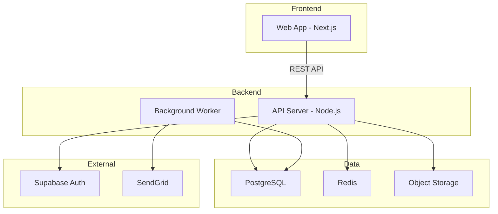

# Skill: Architecture Designer

> Before diving into per-scenario technical implementation, establish the project's technical global view — system architecture, technology selection, deployment topology, and non-functional constraints. Ensure that subsequent sequence diagrams, API designs, and code generation all proceed under consistent architectural constraints.

## Trigger Conditions

- User requests designing technical architecture, making technology selections, or planning system architecture
- User mentions "Phase 3 Step 0", "architecture design", "technical plan"
- Phase 2 product design documents are complete, and Phase 3 needs to begin
- User wants to determine the tech stack or deployment strategy

## Core Capabilities

1. Read Phase 1 requirements documents and Phase 2 product design documents to understand the full product picture
2. Based on product complexity and scenario characteristics, recommend suitable system architectures
3. Provide selection rationale and alternative comparisons for each technology choice
4. Draw system architecture diagrams (Mermaid) and deployment topology diagrams
5. Update the `tech_stack` field in `logos-project.yaml`

## Integration with Phase 1/2

Architecture design is the bridge from Phase 2 (product design) to Phase 3 (technical implementation). Its inputs come from Phase 1/2, and its outputs influence all subsequent steps in Phase 3:

| Input (from Phase 1/2) | Output (influences subsequent Phase 3 steps) |
|------------------------|------------------------------|
| Scenario list and complexity | System boundary definition → sequence diagram participants |
| Non-functional requirements (performance, security) | Technology selection constraints → API design decisions |
| Product interaction type (Web/Mobile/API) | Frontend tech stack → prototype implementation approach |
| Data volume and access patterns | Database selection → DB design |
| Third-party service dependencies (payment, email, etc.) | Integration approach → external participants in sequence diagrams |

## Execution Steps

### Step 1: Understand the Full Product Picture

Read the following documents to build an overall understanding of the project:

- **Requirements Document** (Phase 1): Product positioning, core scenarios, constraints and boundaries
- **Product Design Document** (Phase 2): Information architecture, page structure, interaction complexity
- **Existing `logos-project.yaml`**: Whether there are initial selections in the current `tech_stack`

Key points to extract:
- Number and complexity of core scenarios
- Whether there are real-time requirements (WebSocket, SSE)
- Whether there are background tasks (scheduled tasks, message queues)
- List of third-party service dependencies
- Expected user scale

### Step 2: Determine System Architecture

Choose an architecture pattern based on product complexity:

**Simple Projects** (personal SaaS, utility products):
- Monolithic architecture + single database
- Architecture overview can be a paragraph of text + a simple diagram

**Medium Projects** (team SaaS, multi-role systems):
- Frontend-backend separation + monolithic backend + single database
- May need auxiliary services like object storage, caching, etc.

**Complex Projects** (multi-service, high-concurrency, multi-platform):
- Microservices / modular monolith
- Requires detailed Architecture Decision Records (ADR)

**⚠️ Mermaid flowchart / graph syntax safety (required)**:
- Use `ID["label"]` for node labels by default, especially when labels contain `/`, `(`, `)`, `<`, `>`, `:`, `#`, `{}`, `[]`, spaces, Chinese text, API paths, ports, technology stacks, or `<br/>`.
- Correct: `PROXY["/voice/api proxy"]`, `API["API Server<br/>Node.js"]`, `DB["PostgreSQL :5432"]`.
- Incorrect: `PROXY[/voice/api proxy]`, because `[/` is Mermaid shape syntax and labels containing additional `/` can break rendering.
- For multi-line labels, use `<br/>` inside the same quoted label: `API["HTTP API<br/>/voice/api"]`.
- Quote subgraph names that contain spaces or symbols: `subgraph "Voice Service"`.
- Only use Mermaid shape syntax such as `ID[(Database)]` or `ID[/Input/]` when the shape itself is intentional; do not use shape syntax for ordinary text labels.

Draw system architecture diagram using Mermaid:



### Step 3: Technology Selection

Provide selection and rationale for each technology dimension:

```markdown
| Dimension | Selection | Rationale | Alternatives |
|-----------|-----------|-----------|-------------|
| Language | TypeScript | Unified frontend/backend, type safety | Go (when performance is priority) |
| Frontend Framework | Next.js 15 | SSR + RSC, mature ecosystem | Astro (content sites), Nuxt (Vue ecosystem) |
| Backend Framework | Hono | Lightweight, edge-first, native TS | Express (ecosystem), Fastify (performance) |
| Database | PostgreSQL | Feature-rich, JSONB, RLS | MySQL (simple scenarios) |
| Authentication | Supabase Auth | Out-of-the-box, RLS integration | NextAuth (self-hosted) |
| Deployment | Vercel + Supabase | Zero-ops, auto-scaling | AWS (full control) |
```

**Selection Principles**:
- Prefer technologies the team is already familiar with
- When there is no significant difference, choose the option with the larger community
- Selection rationale must be linked to specific product requirements or constraints

### Step 4: Non-Functional Constraints

Define key non-functional requirements:

- **Performance Targets**: Core API response time, page load time
- **Security Requirements**: Authentication method, data encryption, CORS policy
- **Scalability**: Expected user scale, data growth estimates
- **Observability**: Logging, monitoring, alerting strategy
- **Developer Experience**: Local development environment, CI/CD pipeline

### Step 5: External Dependencies and Test Strategies

Catalog all external service dependencies for the project and determine the isolation strategy for each dependency during orchestration testing. The output of this step directly impacts whether Phase 3 Step 3 (orchestration testing) can be executed smoothly.

1. Identify external dependencies from the architecture diagram and sequence diagram participants (email, SMS, verification codes, payment, OAuth, etc.)
2. Confirm the test strategy for each dependency with the user

Available test strategies:

| Strategy | Description | Typical Scenario |
|----------|-------------|-----------------|
| `test-api` | Test environment provides a backdoor API | Email/SMS verification codes |
| `fixed-value` | Specific test data uses fixed values | Fixed verification code for test phone numbers |
| `env-disable` | Environment variable disables the feature | CAPTCHA, slider verification |
| `mock-callback` | Orchestration actively calls a simulated callback | Payment callbacks, Webhooks |
| `mock-service` | Local mock service as replacement | OAuth Provider |

If the project has no external service dependencies (e.g., a pure CLI tool), this step can be skipped.

### Step 6: Update logos-project.yaml

Write the confirmed technology selections into the `tech_stack` field of `logos-project.yaml`, and write external dependencies and test strategies into the `external_dependencies` field, ensuring that all subsequent Skills and AI tools can read the unified tech stack and testing conventions.

```yaml
external_dependencies:
  - name: "Email Service"
    provider: "SendGrid"
    used_in: ["S01-User Registration", "S03-Forgot Password"]
    test_strategy: "test-api"
    test_config: "GET /api/test/latest-email?to={email}"
```

## Output Specification

- Architecture overview document: `logos/resources/prd/3-technical-plan/1-architecture/01-architecture-overview.md`
- Architecture diagrams use Mermaid format
- Technology selections use table format, each item must include rationale
- Update the `tech_stack` and `external_dependencies` fields in `logos-project.yaml`
- Simple projects are allowed to have streamlined output (not all sections are mandatory)

## Best Practices

- **Don't over-engineer**: For a solo developer building SaaS, monolith + PostgreSQL + Vercel is sufficient — don't jump straight to microservices
- **Selection rationale matters more than the selection itself**: Documenting "why X was chosen" is more valuable than "X was chosen", because rationale needs to be re-evaluated as the project evolves
- **Architecture diagrams are prerequisites for sequence diagrams**: System components in the architecture diagram become participants in subsequent sequence diagrams — the two must be consistent
- **tech_stack is the AI's anchor**: Subsequent AI code generation reads `tech_stack` from `logos-project.yaml` — inaccurate selections will result in unusable generated code
- **Start loose with non-functional constraints, tighten later**: Don't set overly strict performance targets initially; tighten them as real data becomes available
- **Test strategies must be decided during the architecture phase**: If test approaches for verification codes, payments, and other external dependencies are left until orchestration testing, you'll often find that no backdoor APIs were provisioned, making fully automated orchestration tests impossible

## Recommended Prompts

The following prompts can be copied directly for use with AI:

- `Help me design the technical architecture`
- `Based on the product design, help me make technology selections`
- `Help me draw the system architecture diagram`
- `Help me determine the tech stack and update logos-project.yaml`

---
> Source: [miniidealab/openlogos](https://github.com/miniidealab/openlogos) — distributed by [TomeVault](https://tomevault.io).
<!-- tomevault:4.0:skill_md:2026-07-20 -->
