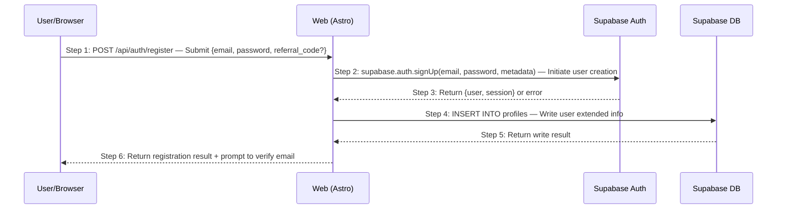

# Skill: Scenario Architect

> Expand business scenarios defined in Phase 1/2 into technical sequence diagrams, letting API design emerge naturally, and design comprehensive exception cases. Scenario numbering follows Phase 1 definitions.

## Trigger Conditions

- User requests drawing sequence diagrams, designing business scenarios, or performing scenario modeling
- User mentions "Phase 3 Step 1", "scenario-driven", "technical plan design"
- Requirements documents and product design documents (with scenario definitions) already exist, ready to begin technical implementation
- User specifies a particular scenario number (e.g., S01) to be expanded into a sequence diagram

## Core Capabilities

1. Read scenario definitions and acceptance criteria from Phase 1/2 as input for sequence diagrams
2. Draw Mermaid sequence diagrams for each scenario (strictly following numbering conventions)
3. Write explanatory notes for key steps (explaining "why" rather than "what")
4. Identify exception conditions for each step and design structured exception cases
5. Generate scenario overview documents (scenario map + scenario index)

## Linking with Phase 1/2

**Phase 3 does not identify scenarios from scratch.** Scenarios are defined in Phase 1 (`S01`, `S02`...), interaction flows are refined in Phase 2, and technical architecture and technology choices are established in Step 0. The job of Phase 3 Step 1 is to expand the same scenario from an "interaction perspective" into a "technical perspective". The participants in the sequence diagram should align with the system components in the architecture diagram:

| Input (from Phase 1/2) | Output (Phase 3) |
|------------------------|----------------|
| Scenario number and name | Sequence diagram title retains the number |
| Trigger conditions | Starting arrow of the sequence diagram |
| Main path description | Step sequence in the sequence diagram |
| GIVEN/WHEN/THEN (business level) | Behavior description of sequence diagram steps |
| Exception acceptance criteria | EX exception cases (technical level) |
| Pages and interactions involved (Phase 2) | Participant identification |

## Execution Steps

### Step 1: Load Scenario Context

Read scenario definitions from the Phase 1 requirements document, Phase 2 product design document, and Phase 3 Step 0 technical architecture summary. **Do not reinvent scenarios**—directly reuse existing numbers and descriptions. Participant naming should be consistent with the system components in the architecture diagram.

**Scenario Granularity Pre-Check (before drawing any sequence diagram):**

Before proceeding, verify that the scenario definitions from Phase 1 have proper granularity. Check for these anti-patterns:

- **One-API scenarios**: If a scenario's main path only has 1-2 steps (e.g., "Create Task" = just `POST /api/tasks`), it is too fine-grained
- **CRUD fragmentation**: If the scenario list contains separate "Create X", "Read X", "Update X", "Delete X" scenarios for the same entity, they should be merged into goal-driven scenarios
- **No business goal**: If a scenario's outcome is just "data was written/read", it lacks a real user goal

**If any anti-pattern is detected**: Stop and recommend returning to Phase 1 to re-organize scenarios by business goals before drawing sequence diagrams. Drawing sequence diagrams for overly fine-grained scenarios will propagate the problem to API design, test cases, and code.

Confirm the following for each scenario:
- **Scenario number**: Reuse Phase 1's `S01`, `S02`... (or Phase 2 sub-scenarios `S01.1`)
- **Participants**: Identify which system components are involved from Phase 2's interaction flows
- **Main path**: Extract the normal flow from Phase 1/2 acceptance criteria
- **Known exceptions**: Extract from Phase 1/2 exception acceptance criteria

### Step 2: Draw Sequence Diagrams

Draw Mermaid sequence diagrams for each scenario, **strictly following these conventions**:

**Numbering conventions**:
- Every arrow must have a `Step N:` number prefix
- Numbering starts at 1 and increments consecutively
- Each arrow includes a one-line behavior description: `HTTP_METHOD /api/path — brief explanation`

**⚠️ Single-line constraint (required)**:
- The full content of every arrow (`->>` or `-->>`) must stay on one line; do not insert line breaks inside the message text.
- If a message is too long, shorten it instead of splitting it across lines.
- Details such as UI button names, side effects, JSON bodies, or error payloads belong in the step narrative below the diagram, not inside arrow lines.
- Violating this rule can make Mermaid parsing fail and break Markdown rendering.

**⚠️ Mermaid sequenceDiagram syntax safety (required)**:
- Participant aliases must be short ASCII identifiers such as `U`, `W`, `API`, or `DB`; do not put `/`, spaces, parentheses, or Chinese text in aliases.
- Keep `participant <alias> as <display name>` display names short. Put complex technology stacks, ports, API paths, and extra explanations in the step narrative below the diagram.
- Arrow messages must stay on one line. `POST /api/path` is fine, but multi-line JSON, long error bodies, HTML, Markdown tables, or deeply nested parentheses should not appear in Mermaid messages.
- JSON examples, error-code lists, field explanations, and side-effect notes must go into "Step Descriptions" or "Exception Cases", not Mermaid message lines.
- When unsure, simplify diagram messages so the diagram shows call order and the prose carries detail.

**Participant conventions**:
- Use short aliases: `U` (User/Browser), `W` (Web/Frontend), `SB` (Supabase), `DB` (Database)
- Full name for each participant is noted in the `participant` declaration

**Scenario numbering conventions**:
- Document title format: `S01: Email Registration — Sequence Diagram`
- One scenario per file, numbered to correspond with Phase 1

**Format example**:



### Step 3: Write Step Narratives

After the sequence diagram, use a **consecutively numbered list** to write out all steps one by one, forming a linear narrative that humans can read fluently from start to finish.

**Format conventions**:

1. **Every step must be written out**—no skipping, no omitting. Simple steps can be covered in one line; complex steps are elaborated below using `>` blockquote
2. **Every step must have a clear subject**—the reader should never have to guess "who is doing this". Use the alias or full name from the participant table as the subject
3. **Numbering strictly corresponds to the Step N in the sequence diagram**
4. **Normal flow and exception cases are written separately**—normal flow comes first, exception cases follow. In the normal flow, only add `→ see EX-N.M` references after steps that trigger exceptions; do not expand exception content inline

**Normal flow format example**:

````markdown
## Step Descriptions

1. **Developer** enters `openlogos init my-project` in the terminal.
2. **CLI** checks whether `logos/logos.config.json` already exists. If it exists → see EX-2.1.
3. **CLI** displays a language selection menu in the terminal (1. English / 2. 中文). If the terminal is non-TTY → see EX-3.1.

> Language selection is placed in the `init` phase (rather than global configuration) because this is the user's first interaction with OpenLogos, making it the most natural moment to confirm language preference.

4. **Developer** selects a language (enters 1 or 2).
5. **CLI** detects the project name from `package.json` / `Cargo.toml` / `pyproject.toml` / directory name. If the user-provided name conflicts with the config file name → see EX-5.1.

> Priority chain: CLI argument > package.json > Cargo.toml > pyproject.toml > directory name. Scoped names automatically strip the `@org/` prefix.

6. **CLI** creates 11 directories in sequence (`logos/resources/prd/...` etc.), writing `.gitkeep` to each.
7. **CLI** writes `logos/logos.config.json` (containing locale + 5 document module definitions).
8. **CLI** writes `logos/logos-project.yaml` (containing empty tech_stack + conventions).
9. **CLI** writes `AGENTS.md` and `CLAUDE.md` (containing Phase detection logic).
10. **CLI** outputs the list of created files and next-step suggestions in the terminal.
````

**Exception case format example**:

````markdown
## Exception Cases

### EX-2.1: Project Already Initialized

- **Trigger condition**: Step 2 detects that `logos/logos.config.json` already exists
- **Expected response**: stderr outputs `Error: logos/logos.config.json already exists in current directory.`, exit(1)
- **Side effects**: No files created, existing configuration not overwritten

### EX-3.1: Non-TTY Environment

- **Trigger condition**: Step 3 detects that `process.stdin.isTTY` is false (CI pipeline / piped input)
- **Expected response**: Skip language selection interaction, default to `locale = 'en'`
- **Side effects**: None, flow proceeds directly to Step 5

### EX-5.1: Project Name Conflict

- **Trigger condition**: In Step 5, the user-provided `name` differs from the name in `package.json` (or other config files)
- **Expected response**: Display two options for the user to choose from; in non-TTY environments, automatically use the user-provided name
- **Side effects**: None, flow continues to Step 6 after selection
````

**Narrative principles**:
- **No skipping steps**: Even if a step is worth only one line (e.g., "CLI writes file"), it must still be written out to maintain consecutive numbering
- **Subject first**: Each step begins with a bold subject, so the reader can immediately see "who is acting"
- **Use blockquotes for supplementary notes**: When you need to explain "why" or document a design decision, expand below the step using `>` blockquote without disrupting reading flow
- **Exception cases as separate sections**: Normal flow only contains `→ see EX-N.M` references; the trigger conditions, expected responses, and side effects of exceptions are expanded in the "Exception Cases" section at the bottom of the document

### Step 4: Design Exception Cases

Expand exception acceptance criteria identified in Phase 1/2 into technical-level exception cases, and supplement with technical exceptions not covered in Phase 1/2 (e.g., service unavailable, database write failure):

```markdown
#### Exception Cases

##### EX-2.1: Email Already Registered (← Phase 1 S01 exception acceptance criteria)
- **Trigger condition**: Submitted email already exists in the auth.users table
- **Expected response**: HTTP 409 `{ code: "EMAIL_EXISTS", message: "Email already registered" }`
- **Side effects**: No records created, no emails sent

##### EX-2.2: Supabase Auth Service Unavailable (technical exception, not covered in Phase 1)
- **Trigger condition**: Supabase Auth service times out or returns 5xx
- **Expected response**: HTTP 503 `{ code: "AUTH_SERVICE_UNAVAILABLE", message: "Authentication service temporarily unavailable" }`
- **Side effects**: Error logged, alert triggered

##### EX-4.1: Profile Write Failure (technical exception, not covered in Phase 1)
- **Trigger condition**: INSERT INTO profiles violates unique constraint or RLS denies access
- **Expected response**: HTTP 500 `{ code: "PROFILE_CREATE_FAILED", message: "User profile creation failed" }`
- **Side effects**: Record in auth.users already created but profiles not created (compensation mechanism needed)
```

**Exception case numbering rule**: `EX-{step number}.{sequence number}`

### Step 5: Generate Scenario Overview Document

Summarize the technical implementation status of all scenarios:

```markdown
# Business Scenario Overview (Technical Implementation)

## Scenario Map
| Number | Scenario Name | Phase 1 | Phase 2 | Phase 3 Sequence Diagram | API | Orchestration | Status |
|--------|--------------|---------|---------|--------------------------|-----|---------------|--------|
| S01    | Email Registration | ✅ | ✅ | ✅ | ✅ | 🔲 | In Progress |
| S02    | Password Login | ✅ | ✅ | 🔲 | 🔲 | 🔲 | Not Started |

## Scenario Dependencies
[Describe prerequisite/follow-up relationships between scenarios]

## Scenario Index
[File links for each scenario, spanning all three Phases]
```

## Output Specification

- **Scenario overview**: `logos/resources/prd/3-technical-plan/2-scenario-implementation/00-scenario-overview.md`
- **Scenario documents**: `logos/resources/prd/3-technical-plan/2-scenario-implementation/{scenario-number}-{scenario-name}.md`
- Sequence diagrams use Mermaid format (renderable directly in Markdown)
- Exception cases use `EX-N.M` numbering, globally unique
- Each scenario document contains: sequence diagram + step descriptions + exception cases
- **Scenario numbers must be consistent with Phase 1/2**

## Best Practices

- **Do not identify scenarios from scratch**: Phase 3 scenarios come from Phase 1 requirements documents. If a scenario not present in Phase 1 is discovered, go back to Phase 1 to add it
- **Phase 1/2 exceptions are inputs**: Phase 1's "exception: email already registered" should be expanded in Phase 3 into a technical specification with HTTP status codes and response bodies
- **Draw the main path first, then add exceptions**: Do not try to draw all branches in the first pass; get the main path clear first
- **Exception case coverage strategy**: Every step involving an external call (database, third-party service) should have at least 1 exception case
- **Step numbering maintenance**: When inserting a step in the middle, renumber all subsequent steps and update all EX references accordingly
- **Participant granularity**: In microservice architectures, each service is a participant; in monolithic applications, divide by logical layers (Web, Auth, DB)
- **Sequence diagrams are the source of APIs**: Cross-system-boundary arrows in sequence diagrams are the APIs that need to be designed—if an API cannot be traced back to a sequence diagram, it probably should not exist

## Recommended Prompts

The following prompts can be copied directly for AI use:

- `Help me draw the sequence diagram for S01`
- `Help me do scenario modeling for all P0 scenarios`
- `Help me add exception case sequence diagrams for S03`
- `Based on the product design, help me do technical scenario modeling`

---
> Source: [miniidealab/openlogos](https://github.com/miniidealab/openlogos) — distributed by [TomeVault](https://tomevault.io).
<!-- tomevault:4.0:skill_md:2026-07-20 -->
