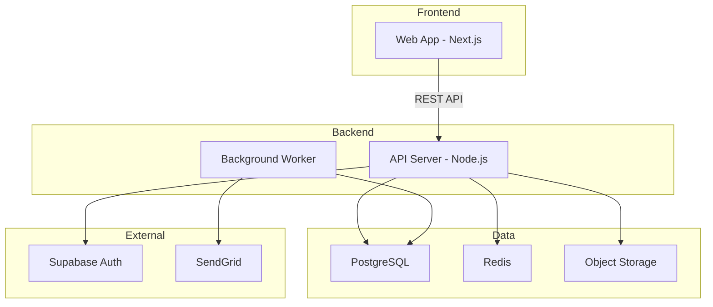

# Skill: Architecture Designer

> 在逐场景的技术实现之前，建立项目的技术全局视图：系统架构、技术选型、部署约束和非功能性约束。完整部署方案由 `deployment-designer` Skill 在 Phase 3 Step 3 产出。

## 触发条件

- 用户要求设计技术架构、做技术选型或规划系统架构
- 用户提到 "Phase 3 Step 0"、"架构设计"、"技术方案"
- Phase 2 产品设计文档已完成，需要开始 Phase 3
- 用户想要确定技术栈或部署约束

## 核心能力

1. 读取 Phase 1 需求文档和 Phase 2 产品设计文档，理解产品全貌
2. 基于产品复杂度和场景特征，推荐适合的系统架构
3. 为每项技术选型提供选型理由和替代方案对比
4. 绘制系统架构图（Mermaid）和部署约束图
5. 明确部署方案的输入边界：运行环境、依赖服务、部署目标、外部服务测试策略
6. 更新 `logos-project.yaml` 的 `tech_stack` 字段

## 与 Phase 1/2 的衔接

架构设计是 Phase 2（产品设计）到 Phase 3（技术实现）的桥梁。它的输入来自 Phase 1/2，输出影响 Phase 3 所有后续步骤：

| 输入（来自 Phase 1/2） | 输出（影响 Phase 3 后续步骤） |
|------------------------|------------------------------|
| 场景清单和复杂度 | 系统边界划分 → 时序图的参与方 |
| 非功能性需求（性能、安全） | 技术选型约束 → API 设计决策 |
| 产品交互方式（Web/Mobile/API） | 前端技术栈 → 原型实现方式 |
| 数据量和访问模式 | 数据库选型 → DB 设计 |
| 第三方服务依赖（支付、邮件等） | 集成方式 → 时序图中的外部参与方 |

## 执行步骤

### Step 1: 理解产品全貌

读取以下文档，建立对项目的整体认知：

- **需求文档**（Phase 1）：产品定位、核心场景、约束与边界
- **产品设计文档**（Phase 2）：信息架构、页面结构、交互复杂度
- **已有的 `logos-project.yaml`**：当前 `tech_stack` 中是否已有初始选型

重点提取：
- 核心场景数量和复杂度
- 是否有实时性需求（WebSocket、SSE）
- 是否有后台任务（定时任务、消息队列）
- 第三方服务依赖清单
- 用户规模预期

### Step 2: 确定系统架构

根据产品复杂度选择架构模式：

**简单项目**（个人 SaaS、工具类产品）：
- 单体架构 + 单数据库
- 架构概要可以用一段文字 + 一张简图

**中等项目**（团队 SaaS、多角色系统）：
- 前后端分离 + 单体后端 + 单数据库
- 可能需要对象存储、缓存等辅助服务

**复杂项目**（多服务、高并发、多端）：
- 微服务 / 模块化单体
- 需要详细的架构决策记录（ADR）

**⚠️ Mermaid flowchart / graph 语法安全（强制）**：
- 节点标签默认使用 `ID["标签文本"]`，尤其是标签包含 `/`、`(`、`)`、`<`、`>`、`:`、`#`、`{}`、`[]`、空格、中文、API 路径、端口、技术栈组合或 `<br/>` 时。
- 正确：`PROXY["/voice/api 代理"]`、`API["API Server<br/>Node.js"]`、`DB["PostgreSQL :5432"]`。
- 错误：`PROXY[/voice/api 代理]`，因为 `[/` 会被 Mermaid 解析为平行四边形形状语法，标签内再出现 `/` 时容易导致解析失败。
- 多行标签使用 `<br/>`，整段文本仍放在同一对双引号内：`API["HTTP API<br/>/voice/api"]`。
- 子图名称含空格、中文或特殊字符时必须加引号：`subgraph "Voice Service"`。
- 只有明确需要 Mermaid 形状语义时才使用 `ID[(Database)]`、`ID[/Input/]` 等形状语法；普通说明文本不要借用形状语法。

用 Mermaid 绘制系统架构图：



### Step 3: 技术选型

为每个技术维度给出选型和理由：

```markdown
| 维度 | 选型 | 理由 | 备选方案 |
|------|------|------|---------|
| 语言 | TypeScript | 前后端统一、类型安全 | Go（性能优先时） |
| 前端框架 | Next.js 15 | SSR + RSC、生态成熟 | Astro（内容站）、Nuxt（Vue 生态） |
| 后端框架 | Hono | 轻量、边缘优先、TS 原生 | Express（生态）、Fastify（性能） |
| 数据库 | PostgreSQL | 功能丰富、JSONB、RLS | MySQL（简单场景） |
| 认证 | Supabase Auth | 开箱即用、RLS 集成 | NextAuth（自托管） |
| 部署约束 | Vercel + Supabase | 零运维、自动扩容 | AWS（自主控制） |
```

**注意**：本步骤只定义部署约束和部署目标，不写完整发布步骤。完整部署方案必须由 `deployment-designer` 输出到 `logos/resources/prd/3-technical-plan/3-deployment/`。

**选型原则**：
- 优先选择团队已熟悉的技术
- 在无明显差异时，选择社区更大的方案
- 选型理由必须关联到具体的产品需求或约束

### Step 4: 非功能性约束

明确关键的非功能性要求：

- **性能目标**：核心 API 响应时间、页面加载时间
- **安全要求**：认证方式、数据加密、CORS 策略
- **可扩展性**：预期用户规模、数据增长估算
- **可观测性**：日志、监控、告警方案
- **开发体验**：本地开发环境、CI/CD 流程

### Step 5: 外部依赖与测试策略

梳理项目的所有外部服务依赖，为每个依赖确定编排测试阶段的隔离策略。此步骤的产出直接影响 Phase 3 Step 3（编排测试）能否顺利执行。

1. 从架构图和时序图参与方中识别外部依赖（邮件、短信、验证码、支付、OAuth 等）
2. 与用户确认每个依赖的测试策略

可选的测试策略：

| 策略 | 说明 | 典型场景 |
|------|------|---------|
| `test-api` | 测试环境提供后门 API | 邮件/短信验证码 |
| `fixed-value` | 特定测试数据使用固定值 | 测试手机号固定验证码 |
| `env-disable` | 环境变量关闭该功能 | 图形验证码、滑块 |
| `mock-callback` | 编排中主动调用模拟回调 | 支付回调、Webhook |
| `mock-service` | 本地 mock 服务替代 | OAuth Provider |

如果项目没有外部服务依赖（如纯 CLI 工具），可跳过此步骤。

### Step 6: 更新 logos-project.yaml

将确认的技术选型写入 `logos-project.yaml` 的 `tech_stack` 字段，将外部依赖和测试策略写入 `external_dependencies` 字段，确保后续所有 Skill 和 AI 工具都能读取到统一的技术栈和测试约定。

```yaml
external_dependencies:
  - name: "邮件服务"
    provider: "SendGrid"
    used_in: ["S01-用户注册", "S03-忘记密码"]
    test_strategy: "test-api"
    test_config: "GET /api/test/latest-email?to={email}"
```

**同时根据技术选型填写 `skip_phases`**，告知 phase 检测逻辑跳过本模块不需要的阶段：

| 项目类型 | 建议 skip_phases |
|---------|----------------|
| 标准 Web / API 项目 | 不填（全走） |
| 有本地数据库、无 HTTP API（SQLite 桌面应用、Electron） | `[api, scenario]` |
| 无数据库、无 HTTP API（CLI 工具、前端库、纯计算工具） | `[api, database, scenario]` |
| 有 HTTP API、无数据库（无状态代理服务） | `[database]` |

```yaml
modules:
  - id: core
    name: 核心功能
    lifecycle: initial
    skip_phases: [api, scenario]   # 根据实际技术选型填写，无需跳过时删除此行
```

**判断依据**：
- 无 HTTP API → skip `api` 和 `scenario`（API 编排测试依赖 HTTP API）
- 无任何数据库 → skip `database`
- 有 SQLite / 本地数据库 → 保留 `database`（仍需设计 schema）

### Step 7: 交接部署方案设计

架构设计完成后，必须向后续 `deployment-designer` Skill 交接以下信息：

- 技术栈：语言、框架、数据库、运行时、包管理器
- 部署目标：本地、测试、预发、生产中的哪些环境需要覆盖
- 运行依赖：数据库、缓存、对象存储、第三方服务、消息队列
- 配置与密钥来源：环境变量、密钥管理方式、不可提交配置
- 数据迁移方式：迁移工具、初始化数据、回滚要求
- 健康检查入口：页面、API、CLI 命令或进程检查方式
- smoke 设计输入：部署后必须验证的最小核心链路

交接完成后，建议下一步提示：

```text
继续进入 Phase 3 Step 3：使用 deployment-designer 输出部署方案和 smoke 测试方案。
```

## 输出规范

- 架构概要文档：`logos/resources/prd/3-technical-plan/1-architecture/core-01-architecture-overview.md`（架构文件全局唯一，后续修改始终在此文件上更新，不新建文件）
- 架构图使用 Mermaid 格式
- 技术选型使用表格格式，每项必须有理由
- 更新 `logos-project.yaml` 的 `tech_stack` 和 `external_dependencies` 字段
- 如项目确定无需部署，必须在架构文档中说明原因，并建议在 `logos-project.yaml` 中设置对应模块的 `deployment_required: false`
- 简单项目允许精简输出（不强制所有章节）

## 实践经验

- **不要过度设计**：独立开发者做 SaaS，单体 + PostgreSQL + Vercel 够用就行，不要上来就微服务
- **选型理由比选型本身重要**：写清楚"为什么选 X"比"选了 X"更有价值，因为项目演进时需要重新评估
- **架构图是时序图的前提**：架构图中的系统组件就是后续时序图的参与方，两者必须一致
- **tech_stack 是 AI 的锚**：后续 AI 生成代码时会读取 `logos-project.yaml` 的 `tech_stack`，选型不准确会导致生成的代码无法使用
- **非功能性约束宁可先宽后紧**：初期不要定太严格的性能目标，随着实际数据再收紧
- **测试策略必须在架构阶段决定**：验证码、支付等外部依赖的测试方案如果等到编排测试时才想，往往发现没有预留后门 API，导致编排测试无法全自动执行

## 推荐提示词

以下提示词可以直接复制给 AI 使用：

- `帮我设计技术架构`
- `基于产品设计帮我做技术选型`
- `帮我画系统架构图`
- `帮我确定技术栈并更新 logos-project.yaml`

## ⚠️ 收尾步骤（强制）：更新 resource_index

完成本 Skill 的所有文档产出后，**必须**：

1. 将架构文档追加写入 `logos/logos-project.yaml` 的 `resource_index`：

```yaml
resource_index:
  # ...已有条目...
  - path: logos/resources/prd/3-technical-plan/1-architecture/<文件名>.md
    desc: 系统架构概要。涉及技术栈选型、系统组件划分、非功能性约束时必读。
```

2. 同步更新 `logos/logos-project.yaml` 的 `tech_stack` 和 `external_dependencies` 字段（这是本 Skill 的核心产出之一）。

3. **（强制）梳理并预写入场景清单**：

   根据架构文档、需求文档和产品设计文档，整理出本项目的完整核心业务场景列表，向用户逐一确认后，将其写入 `logos/logos-project.yaml` 的 `scenarios` 字段：

   ```yaml
   scenarios:
     - id: S01
       name: <场景名称>
     - id: S02
       name: <场景名称>
     # ...
   ```

   **确认要点**：
   - 场景清单是否覆盖了所有核心用户旅程？
   - 是否有遗漏的边界场景或管理后台场景？
   - 场景编号是否按业务优先级排序？

   此步骤产出的 `scenarios` 字段将作为 `scenario-architect` Skill 的输入基础，直接影响后续阶段的完成判断。**若此步骤跳过，`scenario-architect` Skill 开始时将强制要求补填。**

**不执行收尾步骤将导致后续 AI 在场景建模和代码生成时无法读取架构决策，产生技术栈不一致的代码。**

---
> Source: [miniidealab/openlogos](https://github.com/miniidealab/openlogos) — distributed by [TomeVault](https://tomevault.io).
<!-- tomevault:4.0:skill_md:2026-07-20 -->
