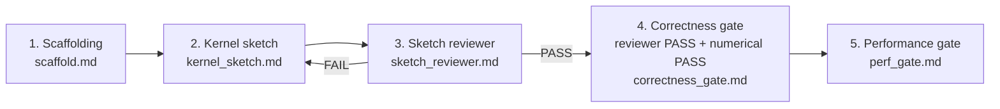

# TIRx Kernel Porting

## 1. Goal

### WHAT YOU SHOULD DO

Use this skill to port performance kernels from CUDA, CuTeDSL, Gluon, or Triton to TIRx while preserving the source implementation trace. The goal is to carry over the source kernel's implementation structure, optimization strategy, and low-level techniques, not to replace it with a functional reference kernel.

You are the main writer agent using this skill. Perform the writer-owned work and
orchestration in the main session so the user can observe it, except for the two
subagent-owned reviews required below. Your expected on-disk output is the target
implementation plus the stage artifacts.

There are exactly three agent roles:

- `writer`: the main agent using this skill. Never start a writer subagent.
- `sketch_reviewer`: one actual subagent that independently verifies the kernel
  sketch against the source implementation.
- `correctness_reviewer`: one actual subagent that verifies the concrete TIRx
  implementation against the reviewer-approved sketch during the correctness gate.

The user explicitly authorizes starting both reviewer subagents. The writer MUST
start an actual subagent for each review. The writer MUST NOT perform, simulate,
or self-approve either review in the main-agent session. If the environment cannot
start a required reviewer, report that review gate as blocked; do not silently
replace the reviewer with main-agent work and do not claim PASS.

The sketch reviewer is a one-time gate for the initial kernel sketch. Repeat the
kernel-sketch/reviewer loop only until that initial sketch first passes. After
the first reviewer PASS, treat the sketch as a completed initial design artifact:
do not edit it, do not start the sketch reviewer again, and do not return to
either stage from correctness or performance work. The separate correctness
reviewer checks whether the initial concrete TIRx implementation realizes the
approved sketch; it does not reopen or re-review the sketch itself.

You should exactly follow the following stages in order:

1. `scaffolding`: [references/scaffold.md](references/scaffold.md)
2. `kernel sketch`: [references/kernel_sketch.md](references/kernel_sketch.md)
3. `sketch reviewer`: [references/sketch_reviewer.md](references/sketch_reviewer.md)
4. `correctness gate`: [references/correctness_gate.md](references/correctness_gate.md)
5. `performance gate`: [references/perf_gate.md](references/perf_gate.md)

For kernels under `tirx-kernels`, also use the TIRx kernel integration skill:
[../tirx-kernel-integration/SKILL.md](../tirx-kernel-integration/SKILL.md).
During the performance gate, obey the target checkout's repo-local instructions.
Before making the kinds of low-level performance changes they route to
`.agents/skills/tirx-codegen-diagnostics/SKILL.md`, read and apply that checkout's
copy; do not substitute a copied or cached version.

Before starting agents, identify `TARGET_REPO_ROOT` as the absolute path of the repo that will receive the target implementation. Choose one fixed absolute `PORT_DIR` under that repo root:

- If the user gives a target module path, use `<TARGET_REPO_ROOT>/.porting/<target-file-stem>`.
- Otherwise use `<TARGET_REPO_ROOT>/.porting/<sanitized-host-entry-or-kernel-name>`.

TBD.

### WHAT YOU MUST NOT DO

WE ARE NOT IMPLEMENTING A MATHEMATICALLY EQUIVALENT KERNEL WHERE THE SAME INPUTS PRODUCE THE SAME OUTPUTS. WE ARE FAITHFULLY AND MECHANICALLY TRANSCOMPILING THE SOURCE IMPLEMENTATION INTO TIRX. THE TARGET KERNEL MUST REPLICATE THE SOURCE KERNEL'S IMPLEMENTATION DETAILS, OPTIMIZATION DETAILS, TECHNICAL TRICKS, AND PERFORMANCE STRUCTURE SO THAT ITS GENERATED PTX/SASS AND PERFORMANCE CAN CONVERGE WITH THE SOURCE KERNEL. EVERY SOURCE OPTIMIZATION DETAIL IS PART OF THE PORTING TARGET AND MUST BE COPIED IN TIRX UNLESS THE SOURCE IMPLEMENTATION ITSELF MAKES IT IRRELEVANT. THAT IS WHY WE BUILD A COMPLETE BIDIRECTIONAL SEMANTIC MAPPING BETWEEN SOURCE REGIONS AND SKETCH OPERATIONS.

- Do not write a scalar, naive, reference, mathematical, or "verifiable first" implementation in place of the CUDA implementation.
- Do not flatten CUDA CTA/warp/thread roles into a generic output-element loop unless the CUDA source itself does that.
- Do not replace smem, tmem, TMA, MMA, barrier, pipeline, or inline PTX behavior with ordinary scalar loops or a different algorithm.
- Do not move work across CTA/warp/thread boundaries, change producer/consumer roles, or change instruction shape merely because tests still pass.
- Do not use tile primitives: any `TilePrimitiveCall`, `tirx.tile.*` operation,
  or operation categorized as `tile_primitive` violates the overall porting
  contract. This is a global implementation constraint, not a correctness-gate
  metric.
- Do not use any first-class layout in either the kernel sketch or the final TIRx
  kernel. A layout object, layout value, layout annotation, or `layout=` argument
  attached to a tensor, tile, buffer, view, alias, register fragment, TMEM object,
  or operation is forbidden, regardless of whether it is spelled `Layout`,
  `T.Layout`, or through another helper API. Source layouts, swizzles, transposes,
  and fragment mappings must instead be documented and realized with explicit
  scalar index/byte-offset arithmetic plus the required instruction descriptors,
  strides, swizzle immediates, or local PTX operands.
- Every SMEM tensor in the sketch and final TIRx kernel must be a one-dimensional
  linear allocation with no attached layout or swizzle metadata. Express logical
  multidimensional coordinates, stage offsets, aliases, and source swizzles as
  explicit indices into that linear storage. Hardware descriptor fields and
  instruction immediates are allowed; they are not first-class layouts.
- For targets in `tirx-kernels`, do not add test files, test modules, or test
  cases anywhere in the repository, and do not modify existing tests to add
  coverage. Keep correctness validation in the target kernel module's
  `run_test` and the repository's existing harness and bench-suite configuration.
- Workflow-stage terminology belongs only in workflow artifacts. Do not copy
  stage labels or artifact status into target kernel comments, docstrings, names,
  or errors. Describe the source implementation and actual kernel semantics
  directly.
- Correctness-gate PASS alone is not completion of the whole porting workflow.

## 2. Steps

YOU MUST FOLLOW THESE STAGES EXACTLY IN THE ORDER SHOWN. YOU MUST NOT CHANGE THE
STAGE ORDER ON YOUR OWN UNDER ANY CIRCUMSTANCES. DO NOT SKIP, REORDER, MERGE, OR
SUBSTITUTE ANY STAGE, AND DO NOT START WORK FROM A LATER STAGE EARLY. The only
permitted backward transition is reviewer FAIL returning to kernel sketch before
the first reviewer PASS.

At the start of every stage, read its corresponding Markdown instructions before
doing that stage's work. Follow that file exactly for the work, artifacts, gate
conditions, and transition rules. Do not replace the documented process with your
own workflow, even if another approach appears faster or equivalent.

DO NOT ADVANCE UNTIL THE CURRENT STAGE'S INSTRUCTIONS SAY ITS GATE HAS PASSED. If
the initial sketch review does not pass, return to kernel sketch and repeat the
review. After its first PASS, proceed only forward through correctness and
performance; neither stage may reopen the kernel-sketch or sketch-reviewer stage.

1. **Scaffolding**: Read and follow
   [scaffold.md](references/scaffold.md). Create the target-module scaffold and
   record the source, launch, tensor, and config facts without implementing the kernel.
2. **Kernel sketch**: Read and follow
   [kernel_sketch.md](references/kernel_sketch.md). Study the current upstream
   sketch/kernel pairs, then write a concise copy/compute-dominated execution
   skeleton with necessary roles, storage, control flow, synchronization, and
   instruction selection on key copy, compute, and sync/async operations.
3. **Sketch reviewer**: Start an actual reviewer subagent and require it to read
   and follow [sketch_reviewer.md](references/sketch_reviewer.md). It validates the
   sketch against source and line-info PTX; on FAIL, return to kernel sketch and
   repeat this loop until the initial sketch first passes. That PASS permanently
   closes both sketch stages; the main writer must not perform or rerun the review.
4. **Correctness gate**: Read and follow
   [correctness_gate.md](references/correctness_gate.md). First realize the
   reviewer-approved sketch as a concrete plain-TIRx/PTX kernel, then start the
   actual correctness reviewer subagent to check the implementation against that
   sketch. This gate passes only when both the implementation review and every
   required numerical correctness case pass. Do not edit or re-review the approved
   sketch itself.
5. **Performance gate**: Read and follow
   [perf_gate.md](references/perf_gate.md). First complete its mandatory
   preparation report with paired source/TIRx NCU reports for several of the
   worst-performing required configs. Then run an evidence-driven investigation
   loop: choose a promising direction, investigate it deeply, make focused
   changes, measure them with the bench-suite, and record every result in the
   global ledger. Memory behavior, dynamic SASS opcode differences, and launch,
   resource-constraint, and ptxas configuration sweeps are the strongly
   recommended starting points; NCU, the repo-local codegen database, and
   source/PTX/SASS comparisons may guide further work. The correctness reviewer
   is closed and must not be rerun during this stage. Only a complete bench-suite
   run with every shape above `0.99x` source passes.

---
> Source: [mlc-ai/TIRx-kernels](https://github.com/mlc-ai/TIRx-kernels) — distributed by [TomeVault](https://tomevault.io).
<!-- tomevault:4.0:skill_md:2026-09-20 -->
