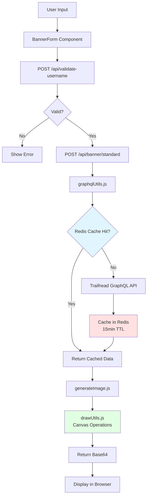

# Claude Code Context - Trailhead Banner

## Quick Start

**IMPORTANT: This project uses `pnpm`, NOT `npm` or `yarn`.**

```bash
pnpm install # Install dependencies
pnpm dev     # Start dev server (uses turbopack)
pnpm build   # Production build
```

## Tech Stack

- **Framework**: Next.js 16 (App Router + Pages API hybrid)
- **React**: v19
- **Styling**: Tailwind CSS v4
- **Canvas**: @napi-rs/canvas (for image generation)
- **Deployment**: Vercel
- **Caching**: Upstash Redis (15min TTL for GraphQL)
- **Asset Cache**: Vercel Blob (certification logo images cached server-side)
- **Analytics DB**: Supabase (tracks banner/rewind generations and errors)

## Project Purpose

Generates LinkedIn banner images from Trailhead user data (badges, certifications, rank, MVP status).

## Critical Files (Read These First)

| File                                     | Purpose                      |
| ---------------------------------------- | ---------------------------- |
| `src/banner/renderers/standardBanner.js` | Standard banner renderer     |
| `src/banner/api/shared.js`               | Shared API utilities         |
| `src/utils/graphqlUtils.js`              | Trailhead API integration    |
| `src/pages/api/banner/standard.js`       | Standard banner API endpoint |
| `src/data/banners.json`                  | Background image metadata    |
| `src/components/BannerForm.js`           | Main user interface          |

## Architecture Patterns

### Data Flow



**Key Points:**

- All GraphQL queries cached for 15min to reduce Trailhead API load
- Canvas rendering happens server-side using @napi-rs/canvas
- API responses (`/api/banner/**`) return the generated banner as base64 for direct browser display
- Vercel Blob is used internally as an asset cache for certification logo images (`src/utils/blobUtils.js`, `src/utils/cacheUtils.js`); it is not used to store or share generated banners

### GraphQL Queries

- All queries in `src/graphql/queries/`
- Cached via `redisCacheUtils.js`
- Error handling in `graphqlUtils.js`

### Image Generation

1. Fetch user data from Trailhead API
2. Validate with `usernameValidation.js` and `imageValidation.js`
3. Draw on canvas using `drawUtils.js`
4. Return base64 and display in browser

### Directory Structure

```text
src/
├── app/              # Next.js App Router pages
├── pages/api/        # API routes (Pages Router)
├── components/       # React components
├── utils/            # Business logic & helpers
├── graphql/queries/  # GraphQL query definitions
└── data/             # Static data (banners.json)
```

## Code Style & Conventions

- **Formatting**: Prettier + Stylelint (enforced by husky pre-commit)
- **Commits**: Conventional commits `type(scope): description`
  - Common types: `feat, fix, docs, style, refactor, perf, build, chore`
  - Common scopes: `core, deps, ui, config, util, release`
- **Format Code**: Use `/format` to check or `/format-fix` to auto-fix (token-optimized)

## Common Tasks

### Create or Edit a Page

When creating a new page or editing an existing one, always add or update the `export const metadata` block at the top of the `page.js` file. Every page must have:

- `title` — unique, descriptive, under 60 characters
- `description` — unique, 1–2 sentences summarising the page content
- `alternates.canonical` — absolute URL of the page
- `openGraph` — title, description, url, siteName (`'Trailhead Banner'`), type (`'website'`), images (always include `{ url: '/og-image.png', width: 1200, height: 630, alt: '...' }`)
- `twitter` — card (`'summary_large_image'`), title, description, images (`['/og-image.png']`)

**OG images:** most pages use `/og-image.png` (default, 1200×630px). Exceptions:

- `/rewind` uses `/og-image-rewind.png` — distinct seasonal identity

> **Important:** page-level `openGraph` replaces (not merges) the layout default — always repeat the `images` array or the OG image will be lost.

See any existing page (e.g. `src/app/examples/page.js`) as a reference.

When **adding** a new page, also update:

1. `src/app/sitemap.js` — add an entry with appropriate `priority` and `changeFrequency`
2. `public/llms.txt` — add a line under `## Pages` with the URL and a one-line description
3. `public/llms-full.txt` — add the page under `## Pages` and update any relevant sections (API, features, etc.)

When **removing** a page, remove it from both files as well.

### Add New Background Image

1. Add to `public/assets/background-library/`
2. Update `src/data/banners.json` with metadata
3. Verify in background library page

### Modify Banner Layout

- Edit `src/utils/drawUtils.js` for positioning

<!-- Content truncated to meet Windsurf 6KB limit -->

---
> Source: [nabondance/Trailhead-Banner](https://github.com/nabondance/Trailhead-Banner) — distributed by [TomeVault](https://tomevault.io).
<!-- tomevault:4.0:windsurf_rules:2026-05-20 -->
