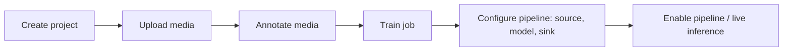

# Using the Geti pipeline (application)

The Geti application is a FastAPI server (`application/backend/`, the `geti`
package) that exposes a REST API for the full computer-vision workflow: create a
**project**, upload and **annotate** media, **train** a model as an async job,
then configure and **enable** a live inference **pipeline** (source → model →
sink). This skill is about _using_ that API; to change backend code use the
`geti-backend-dev` skill instead.

Start the server from `application/backend/` with `just run-server` (default
`https://localhost:7860`). The full endpoint reference is
`application/docs/api.md`; interactive docs are the generated OpenAPI spec.

## End-to-end pipeline

1. **Create a project** with a task type and labels.
   - `POST /api/projects` (name, task, labels) → project info.
   - Done when: `GET /api/projects/<id>` returns the project with its labels.
2. **Upload media** (images/videos) to the project dataset.
   - `POST /api/projects/<id>/dataset/media` (binary) → media info.
   - Done when: `GET /api/projects/<id>/dataset/media` lists the uploaded item.
3. **Annotate media** so the dataset is trainable.
   - `POST /api/projects/<id>/dataset/media/<media_id>/annotations` (annotation
     info).
   - Done when: `GET .../annotations` returns the saved annotation.
   - (Optional) import an existing dataset instead via the dataset jobs below.
4. **Train a model** as an async job.
   - `POST /api/jobs` with job type `train` → job id.
   - Track it: `GET /api/jobs/<id>`, stream `GET /api/jobs/<id>/status` and
     `GET /api/jobs/<id>/logs`; cancel with `POST /api/jobs/<id>:cancel`.
   - Done when: the job reaches a finished state and
     `GET /api/projects/<id>/models` lists the new model.
5. **(Optional) Quantize** the trained model for faster inference.
   - `POST /api/jobs` with job type `quantize`.
   - Done when: the quantized model variant appears under the project's models.
6. **Configure the inference pipeline** — bind a source, the model, and a sink.
   - Sources: `POST /api/sources`; sinks: `POST /api/sinks`.
   - `PATCH /api/projects/<id>/pipeline` with the ids of source, sink, and model.
   - Done when: `GET /api/projects/<id>/pipeline` shows the wired components.
7. **Enable live inference** and monitor it.
   - `POST /api/projects/<id>/pipeline:enable` (disable with `:disable`).
   - Metrics: `GET /api/projects/<id>/pipeline/metrics` (latency, throughput).
   - `POST /api/projects/<id>/pipeline:capture` collects the next frame into the
     dataset for continued annotation/retraining.
   - Done when: the pipeline reports active and metrics update.

## The async job model

Long-running work runs as **jobs** (`POST /api/jobs`), keeping the API
responsive. Job types: `train`, `quantize`, `prepare_dataset_for_import`,
`import_dataset_to_existing_project`, `import_dataset_as_new_project`,
`export_dataset`, `stage_dataset`. Poll `GET /api/jobs/<id>` or stream
`/status` and `/logs`; jobs are cancelable.

## Datasets: import instead of manual annotation

To bring in an existing dataset rather than annotating from scratch:

- Upload an archive to staging: `POST /api/staged_datasets`.
- Then submit an import job (`import_dataset_as_new_project` or
  `import_dataset_to_existing_project`) via `POST /api/jobs`.
- Export a project's dataset with the `export_dataset` job.

## Notes

- Training and quantization jobs run out-of-process and call into the `getitune`
  library; the underlying capabilities map to the `getitune-training-a-model`
  and `getitune-optimizing-a-model` skills.
- This skill covers API usage; endpoint paths and payloads are the contract in
  `application/docs/api.md`. To add or change endpoints, use `geti-backend-dev`
  and `geti-openapi-sync`.

## Related skills

- `getitune-training-a-model` / `getitune-optimizing-a-model` — the library
  capabilities behind the `train` and `quantize` jobs.
- `geti-backend-dev` — change the backend/API itself.
- `geti-ui-dev` — the web UI that drives this same API.

---
> Source: [open-edge-platform/training_extensions](https://github.com/open-edge-platform/training_extensions) — distributed by [TomeVault](https://tomevault.io).
<!-- tomevault:4.0:skill_md:2026-07-25 -->
