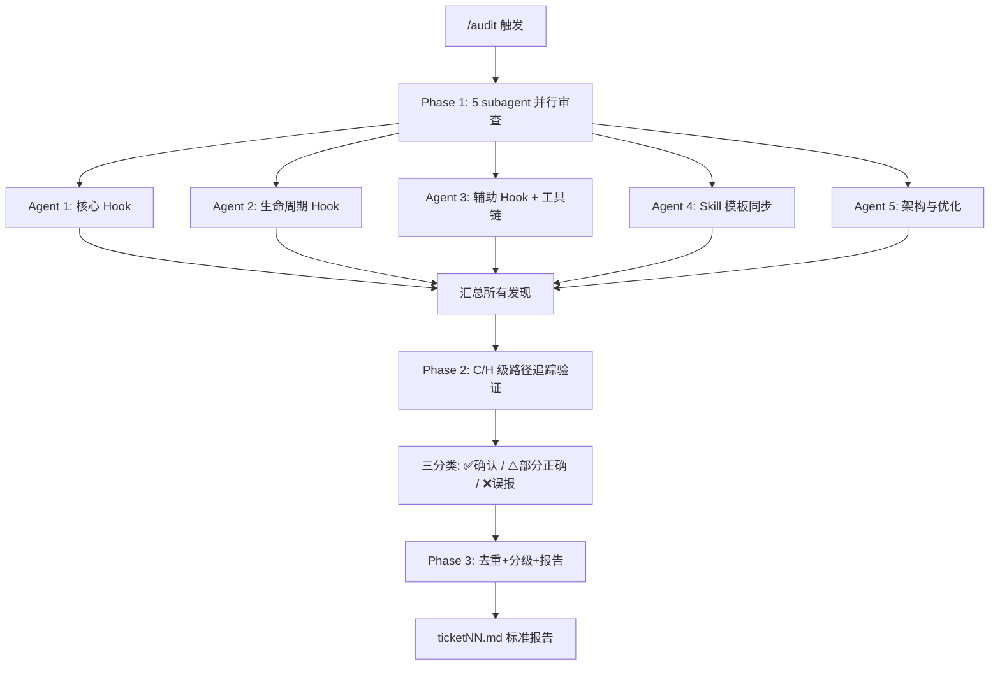

# PACEflow 全面审查

> 内部资料：该流程只用于 PaceFlow 仓库自身审计，不随 marketplace 插件发布，也不是用户项目工作流 skill。

## 触发场景

- 用户说"完整分析"、"全面审查"、"全面检查"
- 用户调用 `/audit`
- 版本发布前的质量门控

## 审查原则

> 本 skill 的核心价值是**独立发现问题**，不是照 guidebook/action-plan/README 打勾。

> **方法论内核见可发布通用版** [`review-methodology.md`](../../../plugin/skills/pace-workflow/references/review-methodology.md)（独立发现 / 证据优先级 / 报告全部再验证 / 三件武器 / 严重度纪律 / 误报防御七条 / 记录基线）。本内部 skill 不重复方法论本体，只在其上**叠加 PaceFlow 专用靶子**——下面的证据优先级具体路径、审查范围 Glob、五维度并行划分、v7 审计基线。两处共用同一套方法论，避免漂移。

证据优先级：

1. 当前代码与配置：`plugin/hooks/**`、`plugin/agents/**`、`plugin/agent-references/**`、`plugin/skills/**`、`plugin/.claude-plugin/**`、`.claude-plugin/**`
2. 当前测试与 fixture：`tests/**`、`tests/agent-tests/**`
3. 真实运行证据：`plugin/hooks/pace-hooks.log`、Claude Code session JSONL、production smoke 产物
4. 用户面/内部文档：`README.md`、`REFERENCE.md`、`CLAUDE.md`、`docs/**`

文档只能用于发现候选矛盾或设计意图，不能单独作为 bug 证据。任何 C/H 级问题都必须从代码路径、配置注册、测试缺口或真实日志中独立证明。

输出范围：

1. Phase 1 报告所有可疑发现，不按“看起来低优先级”提前丢弃；严重度只做标注。
2. Phase 2 再做证据验证、去重、降级和误报剔除。
3. 最终报告必须包含：确认发现、部分正确/有意设计、误报分析、验证矩阵、证据来源、剩余风险。
4. 每个发现都写清：文件:行号、触发路径或证据、影响、建议修复；没有代码/测试/日志证据时写成候选或文档问题。

长 diff / stall 防御：

- 大文件或大区间审计时，先用 `git log --stat <range> -- <file>` 定位相关 commit，再用 `git show <sha> -- <file>` 逐个查看。
- 不要一次性对 `pace-utils.js`、`pre-tool-use.js`、长文档或整个大区间跑无界 `git diff`。
- 长文件读取优先用 `rg` 定位函数/标题，再 `sed -n` 读取小范围。

当前 v7 审计基线：

- marketplace `source` 指向 `./plugin`；发布面是 4 个用户 skill + `artifact-writer` agent + hooks/agent-references/migrate；`internal/skills/audit/`、docs、tests、tickets 不随 marketplace 发布
- v7 `changes/**` 详情模型；v5 活跃流程只允许迁移/桥接，不继续兼容
- artifact root 可为 local/vault/custom，真实 git worktree 沿用宿主项目 `.pace/artifact-root`
- `artifact-writer` 是唯一 artifact 写入者；主 session 不得直写 C/V/R 标记（含 `<!-- REVIEWED -->` 与 frontmatter `reviewed-date`）
- 项目级 `artifact-writer.lock` 串行化 shared artifact 写入；Bash 不得修改该锁
- `approve-and-start` 与 `close-chg` 是主路径合并操作；验证证据由主 session 运行并读取
- review gate 与 V 阶段同构：R 阶段标志 `<!-- REVIEWED -->` / `reviewed-date` 与 VERIFIED / `verified-date` 平行（`action=review` ↔ `action=verify`），`close-chg` 折叠 VERIFIED 时同样折叠 REVIEWED；`agent-lifecycle-guard.js` 对 `close-chg` 与 `action=review` 强制 `review-confirmed` / `review-source` / `review-findings`（缺则 hard-deny），`stop.js` 对“已 verified 但未 reviewed”给软门提醒；review gate 只记录审计步骤发生+记录，不裁决质量
- `SubagentStop` 报告标题问题是观察/恢复提示，不是 artifact 功能阻断

## 审查范围

> Agent 必须**动态发现**文件，不依赖预设数量。使用 Glob 扫描。

| 类别 | Glob 模式 |
|------|-----------|
| Hook 脚本 | `plugin/hooks/*.js` |
| Hook 配置 | `plugin/hooks/hooks.json` |
| Hook 模板 | `plugin/hooks/templates/*.md` |
| 用户 Skill | `plugin/skills/*/SKILL.md` + `plugin/skills/*/references/*.md` + `plugin/skills/*/templates/*.md` |
| 内部 Skill | `internal/skills/**/*.md` |
| Agent | `plugin/agents/**/*.md` + `plugin/agent-references/**/*.md` |
| Plugin 元数据 | `plugin/.claude-plugin/plugin.json` + `.claude-plugin/marketplace.json` |
| 迁移工具 | `plugin/migrate/**/*.js` |
| 本地工具 | `install.js` + `verify.js`（仅本地验证，不是正式安装路径） |
| 测试 | `tests/**/*.js` + `tests/agent-tests/**/*.yaml` |
| 文档（被审计对象） | `CLAUDE.md` + `README.md` + `REFERENCE.md` + `docs/**/*.md` |

---

## 严重度标准

| 级别 | 定义 | C 级门槛 |
|------|------|---------|
| **C** Critical | 功能错误、数据丢失、流程阻塞 | 必须证明**具体触发路径** |
| **H** High | 影响可靠性但不阻塞 | — |
| **W** Warning | 代码质量、文档过时 | — |
| **I** Info | 优化建议、风格改进 | — |

每个发现必须包含：文件名:行号、问题描述、建议修复。

---

## Phase 1：五维度并行审查

启动 5 个 subagent **并行**执行（Agent 工具，subagent_type: `general-purpose`）。

| Agent | 审查目标 | 关注维度 |
|-------|---------|---------|
| 1. 代码质量 | 核心 Hook（公共模块 + Write/Edit hook） | Bug/正则/路径/异常/I/O 协议 |
| 2. 流程完整性 | 生命周期 Hook（SessionStart/Stop/PreCompact） | stdin 解析/防循环/快照/降级 |
| 3. 一致性 | 辅助 Hook + Plugin + Agent 发布资产 | hooks.json/plugin/agents 一致性 |
| 4. Skill 模板 | 用户 Skill + 内部 audit + 模板 | v7 口径/交叉引用/格式/正则兼容 |
| 5. 架构优化 | 测试 + 文档 + 整体架构 | agent contract 覆盖度/文档准确性/流程缺口 |

> 每个 agent 的完整 prompt 和共享审查纪律见 [references/agent-prompts.md](references/agent-prompts.md)。

每个 Phase 1 agent 的输出必须包含：

- `Findings`：所有发现，按 C/H/W/I/N 标注，不预筛选。
- `Evidence`：每条发现引用的源码、测试、日志或 session 路径。
- `Tests Checked`：读过或运行过的测试。
- `Open Questions`：需要主 session 或 Phase 2 继续验证的点。
- `Health Score`：1-10 分和最紧迫 3 项。

---

## Phase 2：验证筛选

> 历史误报率 50-80%，验证是流程核心。

对 **C/H 级**发现启动验证 subagent：

| 验证方法 | 适用场景 |
|---------|---------|
| 路径追踪 | 逻辑错误 — 从问题行追踪到入口确认可达 |
| 实际 diff | 不一致声称 — 逐行对比两个文件 |
| 设计意图查证 | 可能有意设计 — 检查 CLAUDE.md + 注释 |
| 最小复现 | 可构造触发条件 — E2E 测试验证 |
| 真实证据复核 | production smoke / hook log / session JSONL — 确认是否真实发生 |

结果三分类：✅ 确认 / ⚠️ 部分正确 / ❌ 误报

W/I 级快速扫描去重合并，不逐一验证。

---

## Phase 3：汇总报告

1. **去重**：同文件+同行号+同性质 → 合并
2. **分级**：P0 必修（C+高影响H）→ P1 建议（W）→ P2 文档 → P3 延后（I → 派 `record-finding`）
3. **建议后续变更**：每个 P0/P1 问题推荐对应 CHG-ID 或归入现有 CHG
4. **审查输入版本记录**：记录 git HEAD、工作区 diff 状态、动态发现的关键文件数量和可用日志/session 证据
5. **生成 ticketNN.md**

> 报告模板和误报防御策略见 [references/audit-procedures.md](references/audit-procedures.md)。

---

## 快速参考

---
> Source: [paceaitian/paceflow](https://github.com/paceaitian/paceflow) — distributed by [TomeVault](https://tomevault.io).
<!-- tomevault:4.0:skill_md:2026-07-19 -->
