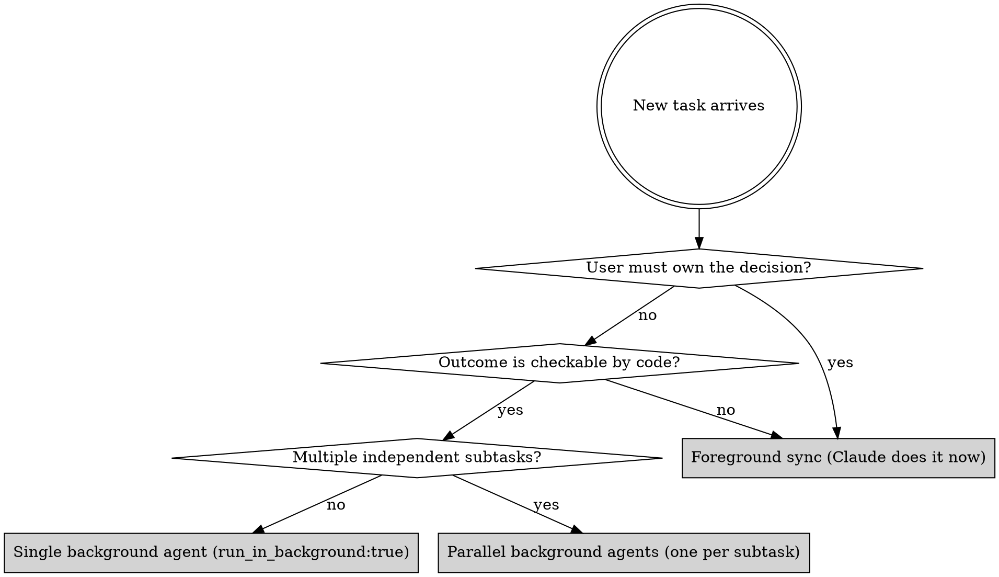

# Agentic Orchestration (Experimental Working-Model Protocol)

> **Status — experimental, instrumented, validation in progress.** This
> skill is shipped to begin collecting evidence about whether a structured
> verifiability-router protocol changes Claude's behavior in ways that
> measurably help users. `memesh patterns` exposes a local counter so you
> can see how often the banner is injected and how often
> `verify_agent_work` is invoked in your real usage. None of that data
> ever leaves your machine.

> **The roles, suggested:**
> - **User = CTO / PM.** Owns understanding, strategy, product taste, "what is worth building."
> - **Claude = Orchestrator / engineering manager.** Routes work, dispatches agents, reviews diffs, surfaces decisions, never the bottleneck.
> - **Background agents = engineering interns.** Execute high-verifiability technical work in parallel.

The hypothesis behind this skill: Claude as a single-threaded synchronous
coding partner spends a meaningful portion of the user's time on work
that could run in the background. If that hypothesis holds, this skill
should noticeably reduce wall-clock time on multi-step technical tasks.
We do not yet have field data either way.

**Announce at start:** "Using agentic-orchestration (experimental protocol) to route this work."

---

## Why this ships with memesh

memesh is a local memory layer **and** a working-model activator. Three
parts compose:

1. **This skill** — the protocol document. Loaded by Claude Code's skill
   system when memesh is installed. Discoverable on its own.
2. **The SessionStart banner hook** — injects the working model into
   Claude's context at session start so it sticks. **Opt-in: set
   `MEMESH_ENABLE_AGENTIC_ORCHESTRATION=1`.**
3. **The PreToolUse Bash nudge hook** — advisory reminder when Claude is
   about to run a high-verifiability bash command synchronously,
   suggesting `run_in_background: true` instead. **Opt-in: same flag.**

Default is OFF for parts 2 and 3 — the core memory features (parts that
are not "the protocol") work without setting any flag. Opt in to the
flag if you want to participate in the experiment; doing so also enables
local-only telemetry (`memesh patterns`) so the protocol's effectiveness
can later be validated with real usage data.

Plus: memesh's self-improving lessons + the `agent_pattern` entity type
(record what dispatch patterns worked) close the loop — the longer you
use memesh, the better Claude gets at orchestrating *your* team's
specific kinds of work.

Memory is the substrate. Operating model is what makes Claude Code feel
different on day one.

---

## The Verifiability Router

Before doing any task, classify it. This decides whether Claude does it
foreground or dispatches it as a background agent.



### Three Tiers — be explicit about which one applies

| Tier | What it is | Verification cost | Dispatch verdict |
|---|---|---|---|
| **Tier 1 — Machine-verifiable** | tsc, vitest, lint, build, migrate, benchmark, gh run watch | seconds, deterministic | **Background, parallel OK** |
| **Tier 2 — Review-verifiable** | API shape, schema, public types, generated docs, code review against checklist | minutes, semi-automated | **Background OK + auto-trigger code-review after** |
| **Tier 3 — Judgment-required** | UX, naming, architecture, strategy, public-facing copy | hours, human only | **Foreground only — do not dispatch** |

Operating principle: **anything Tier 1 or Tier 2 should be agentic; verifying it is the bottleneck, not doing it.** If verification of an agent's claim takes longer than the work itself, the dispatch is a net negative — design verification first, then dispatch.

### High verifiability (→ background agent)

The agent can self-verify because the goal is mechanically checkable.

- Build / typecheck / lint passes
- Test suite passes (unit, integration, e2e)
- Migration applies cleanly to fresh DB
- Benchmark reaches a threshold
- Refactor preserves behaviour (regression tests)
- Code review of a diff against a checklist
- Documentation generated from code matches actual signatures
- Deploy succeeds and a smoke test passes
- Schema diff between two states is empty
- "Make CI green" — the agent can loop until green

### Low verifiability (→ foreground, user owns)

No mechanical check exists. The user's *understanding* is the
verification.

- Strategy, positioning, pricing, audience choice
- Product feature/scope decisions
- Naming, taglines, copywriting that represents the brand
- Whether a result is "publishable" for marketing
- Whether a proposed direction matches the user's long-term plan
- Trade-off calls (do A and lose B)
- Reviewing the *first* surface a user touches
- Anything that, if Claude got wrong, would damage reputation
  irrecoverably

If unsure: **default to foreground**. The cost of a wrong delegation on
strategic work is much higher than the cost of one extra synchronous
turn.

---

## Dispatch Patterns

### Pattern A — Single background agent (most common)

For one self-contained verifiable task that takes ≥10 minutes.

```
Task tool:
  subagent_type: general-purpose (or domain-specific)
  description: 3-5 word summary
  prompt: Self-contained brief. Include: goal, context the agent needs,
          what to produce, what NOT to do (e.g. "do not push to remote",
          "do not modify production code"), how to verify success.
  isolation: "worktree"            ← if it touches files
  mode: "acceptEdits"              ← so the agent can edit existing files
                                     without permission prompts
  run_in_background: true          ← always for ≥10min work
```

After dispatch:
1. Tell user one sentence: "Dispatched [agent name] in background, will report back."
2. **Continue with other work** — do NOT poll, do NOT sleep.
3. When the system delivers a completion notification, surface results.
4. Trust but verify: read the agent's actual diff, do not just trust its summary.

### Pattern B — Parallel background agents

For 2+ independent verifiable subtasks. Send all of them in **one
message with multiple Task tool calls**, not sequentially. Then continue
with foreground work (e.g. discussing strategy with the user) while
they run.

### Pattern C — Foreground iteration

For low-verifiability work where the user must stay in the loop. Stop
generating long monologues. Send shorter messages. Ask one focused
question at a time when blocked. Do not make strategic decisions that
the user did not authorize.

### Pattern D — Hybrid (recommended for big tasks)

Most real work is mixed. Run them in the right shape:
- Foreground: "what is the goal, what is in scope, what does success look like"
- Branch off: dispatch background agents for each verifiable subgoal
- Foreground: review their outputs, decide what to keep, iterate

---

## The Verification Gate (mandatory post-agent procedure)

**An agent's summary is not evidence. The diff is. Tests passing locally are.**

Before reporting any agent's work as "done" — to the user, to memory, in a commit message, anywhere — the orchestrator MUST run the verification gate. No exceptions for "this agent is reliable" or "I read the prompt carefully." The discipline is mechanical because human trust scales worse than agents do.

### Gate sequence (run in order, stop on first failure)

```
1. Reality check — did the claimed changes actually happen?
   git -C <agent_workdir> diff --stat <base>..HEAD
   → compare against agent's claim of "files changed"
   → if mismatch: agent fabricated. Discard, do not commit.

2. Hard verification — do the deterministic checks pass?
   npm run typecheck          # tsc --noEmit
   npm test -- --run          # full suite, not "the new tests"
   npm run lint  (if exists)
   npm run build (if changes touch build output)
   → if any fail: agent's work is incomplete. Fix-then-dispatch
     a follow-up, or take over foreground. Do NOT commit broken state.

3. Cross-check — do the numbers in the agent's summary match reality?
   "added 5 tests"            → grep -c "^\s*it\(" <new test files>
   "77/77 pass"               → re-run test count, verify
   "R@5 = 95.40%"             → spot-check one or two of the result rows
   → numbers that match by accident are still verified;
     numbers that the agent calculated must be re-derived independently.

4. Independent review (Tier 2 only) — does an outside reviewer see issues?
   Spawn a fresh-context code-review subagent with no memory of the
   original work. Have it review only the diff against the project's
   standards. Surface any non-overlapping findings.
```

### What the gate is NOT

- Not a replacement for tests written by the agent — it CHECKS that they pass
- Not "vibes-based" review — every step is a command with deterministic output
- Not skippable when "I'm in a hurry" — speed comes from parallel dispatch, not from skipping verification

### Recursive trust problem (do not fall in)

The verification gate's steps must be **deterministic commands**, not LLM judgment. An "LLM that verifies an LLM" is the same risk class as no verification — both can fabricate. The only safe verifiers are:

- Compilers and linters
- Test runners with assertions
- Diff tools and `git status`
- File existence + content hash checks
- HTTP probes that assert response codes/shapes
- Schema validators (Zod, JSON Schema, Prisma)

LLM-as-reviewer is useful for **opinion** ("does this look idiomatic?"), useless for **fact** ("did the test actually run?"). Use it as Tier 2 augmentation, never as Tier 1 substitute.

### When verification reveals the agent fabricated

Treat as a debugging signal, not a personal failure. Record it:
1. Stash the agent's diff (don't lose it, in case there is salvage)
2. Note what it claimed vs what the gate found
3. Save to memesh as a `lesson_learned`: "When dispatching <pattern>, verification at step <N> caught <fabrication-type>"
4. Decide: re-dispatch with sharper prompt, or take over foreground

This is how the orchestrator learns which dispatch shapes are reliable for the user's stack.

---

## Known limitation — file creation in worktree-isolated agents

In current Claude Code (as of memesh 4.1), background agents launched
with `isolation: "worktree"` can **edit existing files freely** but
sometimes **cannot create new files** even with `mode: "acceptEdits"`.
The user's permission system blocks fresh `Write` calls inside the
isolated worktree.

Implication: if a task requires creating multiple new source files
(e.g., a new module with new tests), foreground that work or use
`isolation` other than `"worktree"`. For pure-edit tasks (refactors,
fixes, doc updates) and for benchmark/test tasks that only touch
existing files plus a `results/` directory, background dispatch works.

When in doubt: dispatch one tiny "smoke test" agent that just creates a
new empty file. If that succeeds, the larger task is safe to dispatch.

---

## The Orchestrator's Discipline

1. **Surface results, not progress.** When an agent finishes, report
   numbers and decisions, not "I'm running step 12 of 17". The user
   does not need a progress bar.

2. **Review every agent's actual diff before reporting "done".** Agents
   summarise what they intended; only the diff shows what they did. This
   is the orchestrator's last line of defence against fabricated
   progress.

3. **Keep agent prompts self-contained.** Brief them like a smart
   colleague who just walked into the room. Include goal, constraints,
   success criteria, and explicit "do NOT" lines.

4. **Do not be afraid of `isolation: "worktree"`.** Agent work in an
   isolated copy is automatically discarded if it produces no useful
   change, and merge-able if it does. There is no downside.

5. **Spike → land or drop, same day.** Per CONTRIBUTING.md branch
   lifecycle discipline: a spike that lives past its verdict becomes
   technical debt. Dispatch, review, decide, close.

6. **Bias toward delete.** A discarded agent worktree is reflog-recoverable.
   An undeleted speculation accumulates and blocks attention.

---

## What This Replaces

| Old habit (single-thread Claude) | New habit (orchestrator Claude) |
|---|---|
| Read 8 files sequentially in foreground | Dispatch one agent: "read these 8 files and summarise X" |
| Write a migration in foreground, watch user wait | Dispatch background agent with verification criteria |
| Run lint/typecheck/tests one at a time | Dispatch one agent with a self-loop until all green |
| Wait for CI, polling every 30s | `gh run watch` once OR launch a background watcher agent |
| Sequential PR cleanups, one at a time | Parallel agents, one per PR, dispatched together |
| Long synchronous "let me read all of memesh-cloud" tour | One Explore agent with focused questions |

---

## Things That Are NOT Background Agent Work

Background agents are not a panacea. The following must stay foreground:

- **First-time user-facing changes** (a real human will see this; the
  user must approve before deploy)
- **Anything visible on the public website** (positioning, copy, prices,
  legal text)
- **Destructive ops without rollback** (rm, drop database, force-push,
  delete remote branch — these need the user to say yes per action)
- **Decisions about *what* to build** (only *how* to build can be
  delegated)
- **Reading the user's emotional state** — if the user is frustrated, an
  agent will not notice; Claude must

---

## The Daily Question

Every time Claude is about to do a 10+ minute task in foreground, it
must ask:

> "Is this task verifiable? If yes, why am I doing it synchronously
> instead of dispatching an agent and freeing the user?"

If the honest answer is "no good reason — habit / fear of dispatch
failure / wanting to look responsive" → **dispatch the agent**. The
user gets their time back.

The user's time is the bottleneck. Claude's time is not. Optimise for
the user's time.

---

## Checklist Before Starting Any Multi-Step Task

- [ ] Have I classified each subtask as Tier 1 / 2 / 3?
- [ ] For Tier 1 / 2 subtasks, have I dispatched them as background
      agents (parallel where independent)?
- [ ] Did I include `mode: "acceptEdits"` so the agent can act without
      permission prompts?
- [ ] For Tier 3 subtasks, am I keeping the user in the loop with
      short, focused exchanges?
- [ ] Am I writing self-contained prompts that the agent can act on
      without further clarification?
- [ ] Do my prompts include the agent's **own self-verification step**
      ("after writing the code, run `npm test -- --run` and report the
      result")?
- [ ] Do my prompts include explicit "do NOT" boundaries (no push to
      remote, no production-touching changes, no public-surface edits
      without approval)?
- [ ] Have I told the user, in one sentence, what is running in the
      background and what is foreground?

## Checklist Before Reporting Any Agent's Work As "Done"

- [ ] Did I run the **Verification Gate** (the four steps above), not
      just read the agent's summary?
- [ ] Does `git diff --stat` actually show the changes the agent
      claimed?
- [ ] Did `npm run typecheck && npm test -- --run` pass on my machine,
      not just inside the agent's worktree?
- [ ] If the agent reported numbers (test count, benchmark score),
      did I re-derive at least one of them independently?
- [ ] For Tier 2 work, did I run a fresh-context code-review pass
      against the diff?
- [ ] If the gate failed: did I record the failure mode to memesh as
      a lesson_learned so the next dispatch is sharper?

---

## When This Skill Is Wrong For The Moment

- **Trivial single-step tasks** (read one file, answer one question, run
  one command). Just do it.
- **The user is teaching/exploring with you** and explicitly wants to
  see the work happen step by step.
- **The user has said "do this yourself, don't dispatch."**
- **High-stakes irreversible operations** where every step needs user
  confirmation.

In these cases, announce that you are not using agent dispatch and why.

---

## See Also

- The `memesh` skill (sibling) — manages the memory layer that records
  agent_patterns, lesson_learned, and project decisions over time. Use
  it together with this one.
- `CONTRIBUTING.md` Branch Lifecycle Discipline — the three-rule policy
  on dev checkpoints, pivots, and spikes that keeps git tidy as a
  side-effect of agentic orchestration.

---
> Source: [PCIRCLE-AI/claude-code-buddy](https://github.com/PCIRCLE-AI/claude-code-buddy) — distributed by [TomeVault](https://tomevault.io).
<!-- tomevault:4.0:skill_md:2026-06-18 -->
