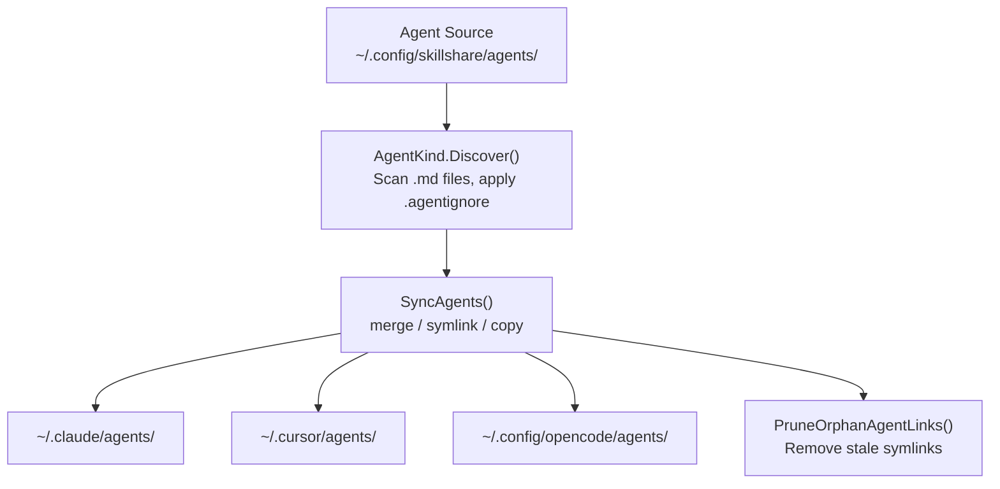

## skillshare

> Single-file `.md` resources managed alongside skills — same sync, audit, and lifecycle, different shape.


# Agents

Single-file `.md` resources managed alongside skills — same sync, audit, and lifecycle, different shape.

:::tip When does this matter?
Some AI CLIs (Claude Code, Cursor, OpenCode, Augment, Copilot CLI, Droid) distinguish between **skills** (directories with `SKILL.md`) and **agents** (standalone `.md` files). If your targets support agents, skillshare can manage both from a single source of truth.
:::

## Skills vs Agents

| | Skill | Agent |
|---|---|---|
| **Shape** | Directory containing `SKILL.md` + optional files | Single `.md` file |
| **Name resolution** | `SKILL.md` frontmatter `name` field | Filename (e.g. `tutor.md` = "tutor"), optional frontmatter `name` override |
| **Source directory** | `~/.config/skillshare/skills/` | `~/.config/skillshare/agents/` (customizable via `agents_source`) |
| **Project source** | `.skillshare/skills/` | `.skillshare/agents/` |
| **Ignore file** | `.skillignore` | `.agentignore` |
| **Sync unit** | Directory symlink (merge), whole-dir symlink (symlink), directory copy (copy) | File symlink (merge), whole-dir symlink (symlink), file copy (copy) |
| **Nested support** | `path/to/skill` flattens to `path__to__skill` | `dir/file.md` flattens to `dir__file.md` |
| **Tracking** | Supported | Supported |
| **Audit** | Supported | Supported |
| **Collect** | Supported | Supported |

---

## Directory Structure

### Global

```
~/.config/skillshare/
├── skills/              # Skill source (directories)
│   ├── my-skill/
│   │   └── SKILL.md
│   └── .skillignore
├── agents/              # Agent source (files)
│   ├── tutor.md
│   ├── reviewer.md
│   └── .agentignore
└── config.yaml
```

### Project

```
.skillshare/
├── skills/
│   └── api-conventions/
│       └── SKILL.md
├── agents/
│   ├── onboarding.md
│   └── .agentignore
└── config.yaml
```

### Custom Source Directory

In global mode, the agent source defaults to `~/.config/skillshare/agents/`. To use a custom location, set `agents_source` in `config.yaml`:

```yaml
agents_source: ~/my-agents
```

Project mode always uses `.skillshare/agents/` and does not support `agents_source`.

See [Configuration — agents_source](/docs/reference/targets/configuration#agents-source) for details.

---

## Agent File Format

An agent is a plain `.md` file. Frontmatter is optional:

```markdown
---
name: math-tutor
description: Helps with math problems step by step
---

# Math Tutor

You are a patient math tutor. Walk through problems step by step.
```

**Naming rules:**
- Filename determines the agent name: `tutor.md` = "tutor"
- Optional `name` field in YAML frontmatter overrides the filename
- Filenames must start with a letter or number, containing only `a-z`, `A-Z`, `0-9`, `_`, `-`, `.`
- Maximum name length: 128 characters

**Conventional excludes** — these filenames are always skipped during discovery:
`README.md`, `CHANGELOG.md`, `LICENSE.md`, `HISTORY.md`, `SECURITY.md`, `SKILL.md`

---

## Supported Targets

Only targets with an `agents` path definition receive agent syncs. Currently:

| Target | Global agents path | Project agents path |
|--------|-------------------|---------------------|
| `claude` | `~/.claude/agents` | `.claude/agents` |
| `cursor` | `~/.cursor/agents` | `.cursor/agents` |
| `opencode` | `~/.config/opencode/agents` | `.opencode/agents` |
| `augment` | `~/.augment/agents` | `.augment/agents` |
| `copilot` | `~/.copilot/agents` | `.github/agents` |
| `droid` | `~/.factory/droids` | `.factory/droids` |

Targets without an `agents` entry (the majority) only receive skills.

---

## Sync Behavior

Agent sync supports all three modes, same as skills:

| Mode | Behavior |
|------|----------|
| **merge** (default) | Per-file symlinks. Local agent files in the target are preserved. |
| **symlink** | Entire agents directory symlinked. |
| **copy** | Agent files copied as real files. |

```bash
# Sync everything (skills + agents)
skillshare sync

# Sync agents only
skillshare sync agents
```

Orphan cleanup works the same way — broken symlinks or copied files that no longer have a source are pruned automatically.

---

## Collect Behavior

Agent collect uses the same CLI contract as skill collect, but operates on `.md` agent files:

```bash
# Global
skillshare collect agents claude
skillshare collect agents --all
skillshare collect agents claude --dry-run
skillshare collect agents claude --json

# Project
skillshare collect -p agents claude
skillshare collect -p agents --all
skillshare collect -p agents --json
```

Rules:

- Existing source agents are skipped by default
- Use `--force` to overwrite existing source agents
- `--json` implies `--force` and skips the confirmation prompt
- The web dashboard Collect page is still skills-only; use the CLI for agents

---

## `.agentignore`

Works identically to `.skillignore` — gitignore-style patterns to exclude agents from sync.

| Scope | Path |
|-------|------|
| Global | `~/.config/skillshare/agents/.agentignore` |
| Project | `.skillshare/agents/.agentignore` |

Example:

```gitignore
# Disable draft agents
draft-*
# Disable a specific agent
experimental-reviewer
```

Use `enable`/`disable` with `--kind agent` to manage entries:

```bash
skillshare disable --kind agent draft-reviewer
skillshare enable --kind agent draft-reviewer
```

---

## Installing Agents from Repos

When installing a repository, skillshare auto-detects agents:

1. Finds an `agents/` convention directory in the repo — `.md` files inside (excluding conventional excludes) are agent candidates
2. If the repo has both `skills/` and `agents/`, both are installed
3. If the repo has only `agents/` (no `SKILL.md` markers), agents are installed
4. If the repo has no `skills/`, no `agents/` dir, but has loose `.md` files at root — treated as agents (pure agent repo)

### Explicit flags

```bash
# Install only agents from a repo
skillshare install github.com/user/repo --kind agent

# Install specific agents by name (-a shorthand)
skillshare install github.com/user/repo -a tutor,reviewer

# Install specific skills by name (unchanged)
skillshare install github.com/user/repo -s my-skill
```

---

## CLI Commands

Most commands accept a `agents` positional argument or `--kind agent` flag to scope to agents:

| Command | Example | What it does |
|---------|---------|--------------|
| `list agents` | `skillshare list agents` | List agents in source |
| `check agents` | `skillshare check agents` | Check agent integrity and update status |
| `audit agents` | `skillshare audit agents` | Security scan agents |
| `sync agents` | `skillshare sync agents` | Sync only agents to targets |
| `collect agents` | `skillshare collect agents claude` | Collect local target agents back to source |
| `update agents` | `skillshare update agents --all` | Update tracked agent repos and metadata-backed agents |
| `enable --kind agent` | `skillshare enable --kind agent tutor` | Re-enable a disabled agent |
| `disable --kind agent` | `skillshare disable --kind agent tutor` | Disable an agent via `.agentignore` |
| `install --kind agent` | `skillshare install repo --kind agent` | Install only agents from a repo |
| `install -a` | `skillshare install repo -a tutor` | Install specific agent(s) by name |

Without the kind filter, commands operate on **both** skills and agents.

---

## Data Flow



---

## Project Mode

Agents work in project mode the same way skills do:

```bash
# Initialize project (creates .skillshare/agents/ alongside .skillshare/skills/)
skillshare init -p

# Install agents into project
skillshare install github.com/user/repo --kind agent -p

# Update project agents in place
skillshare update agents --all -p

# Sync project agents
skillshare sync -p
```

Project agent source: `.skillshare/agents/`
Installed agents (tracked) are recorded in `.metadata.json` and `.gitignore` entries are created, same as tracked skills.

---
> Source: [runkids/skillshare](https://github.com/runkids/skillshare) — distributed by [TomeVault](https://tomevault.io).
<!-- tomevault:4.0:copilot_instructions:2026-07-21 -->
