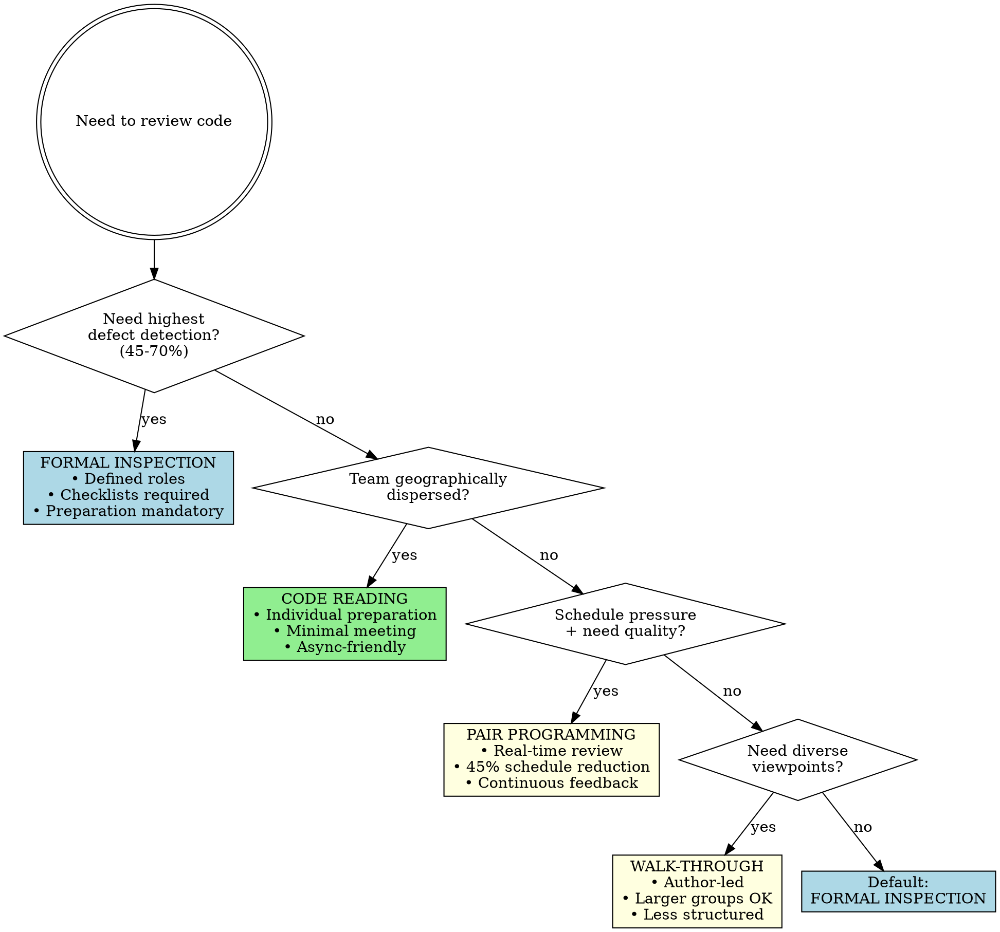
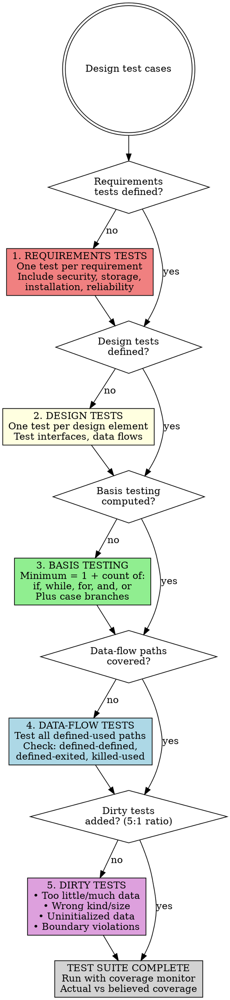
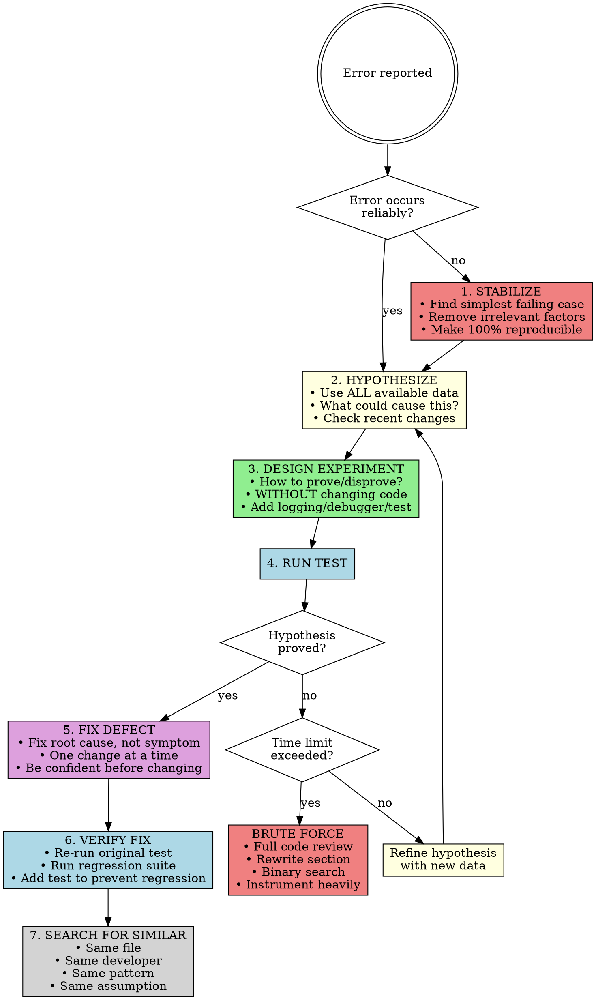

# Skill: cc-quality-practices

## STOP - The Quality Principle

**Improving quality reduces development costs.** No single defect-detection technique exceeds 75% effectiveness. Combining techniques nearly doubles detection rates.

**Critical ratio:** Mature organizations have 5 dirty tests for every 1 clean test.

**Debugging rule:** Do NOT skip to FIX without completing STABILIZE → HYPOTHESIZE → EXPERIMENT. ~50% of defect corrections are wrong the first time.

---

## Key Definitions

### External vs Internal Quality
- **External** (users care about): Correctness, usability, efficiency, reliability, integrity, robustness
- **Internal** (developers care about): Maintainability, flexibility, portability, reusability, readability, testability

Internal quality enables external quality. Poor maintainability → can't fix defects → poor reliability.

### Defect Detection Techniques
- **Formal Inspection**: Structured review with roles, checklists, preparation. 45-70% detection rate.
- **Walk-Through**: Author-led review, less structured. 20-40% detection rate.
- **Pair Programming**: Real-time collaborative development. 40-60% detection rate.
- **Code Reading**: Individual review emphasizing preparation. 20-35% detection rate.
- **Unit Testing**: Developer tests of individual components. 15-50% detection rate.

### Clean vs Dirty Tests
- **Clean tests**: Verify code works correctly (happy path)
- **Dirty tests**: Verify code handles failures gracefully (error paths, bad data, edge cases)

**Critical ratio:** Mature organizations have 5 dirty tests for every 1 clean test. Immature organizations have the inverse.

### Psychological Set
The tendency to see what you expect to see. Causes "debugging blindness" where programmers overlook defects because they expect code to work. Good formatting, naming, and comments help break psychological set by making anomalies stand out.

## Modes

### CHECKER
Purpose: Execute quality, review, and testing checklists against code/process
Triggers:
  - "review this code"
  - "check quality practices"
  - "are my test cases adequate"
Non-Triggers:
  - "how do I debug this" → APPLIER
  - "write tests for this" → APPLIER
Checklist: **See [checklists.md]($CLAUDE_PLUGIN_ROOT/skills/cc-quality-practices/checklists.md)**
Output Format:
  | Item | Status | Evidence | Location |
  |------|--------|----------|----------|
Severity:
  - VIOLATION: Fails checklist item
  - WARNING: Partial compliance
  - PASS: Meets requirement

### APPLIER
Purpose: Apply testing techniques, inspection procedures, and debugging method
Triggers:
  - "debug this issue"
  - "design test cases for"
  - "how should we review this"
Non-Triggers:
  - "check my test coverage" → CHECKER
  - "review my QA plan" → CHECKER
Produces: Test cases, debugging hypotheses, review procedures, quality plans

**Test Case Generation (output: test case list):**
1. Identify requirements → write test per requirement
2. Compute minimum tests: 1 + count(if/while/for/and/or)
3. Add data-flow tests: cover all defined-used paths
4. Add boundary tests: below, at, above each boundary
5. Add dirty tests (5:1 ratio): bad data, wrong size, uninitialized
6. Add nominal tests: middle-of-road expected values

**Debugging Method (Scientific) - output: hypothesis + fix:**
1. STABILIZE - Narrow to simplest failing test case
2. HYPOTHESIZE - Form theory from all available data
3. EXPERIMENT - Design test to prove/disprove hypothesis **WITHOUT changing production code**
4. PROVE/DISPROVE - Run test; refine hypothesis if disproved
5. FIX - Only after predicting defect occurrence correctly
6. VERIFY - Re-run original test + regression suite
7. SEARCH - Check same file, same developer, same pattern for similar defects

**Critical clarification on EXPERIMENT:** EXPERIMENT means a test that validates or invalidates your hypothesis WITHOUT changing production code. Examples: add logging/print statements, use a debugger to inspect state, write a failing unit test that exposes the suspected bug, inspect code to verify your theory. If you change production code, you've skipped to FIX—which has a >50% failure rate when done without understanding [Yourdon]. The experiment confirms your understanding; the fix applies it.

**Inspection Procedure (output: defect list) - see [Effective Inspections checklist]($CLAUDE_PLUGIN_ROOT/skills/cc-quality-practices/checklists.md#effective-inspections-p485-492):**
1. PLANNING - Moderator distributes materials with line numbers + checklist
2. PREPARATION - Each reviewer works alone using checklist (90% defects found here)
3. MEETING - Reader paraphrases code; scribe records defects (≤2 hours)
4. REPORT - Moderator lists each defect with type and severity
5. REWORK - Author fixes defects
6. FOLLOW-UP - Moderator verifies all fixes complete

## Decision Flowcharts

### Choosing a Review Method

**Key data:** Inspections find 45-70% of defects; walk-throughs find 20-40%. Preparation finds 90% of inspection defects; the meeting only finds 10% more [Votta 1991].

### Test Strategy Selection

**Basis testing formula:** Minimum test cases = `1 + count(if) + count(while) + count(for) + count(and) + count(or) + count(case branches)`. If no default case, add 1 more.

### Scientific Debugging Method

**Critical:** Do NOT skip to FIX without completing steps 1-4. ~50% of defect corrections are wrong the first time [Yourdon 1986b]. Understand the problem before fixing.

**Debugging blindness:** Programmers mentally "slice away" code they think is irrelevant. Sometimes the defect is in the sliced-away portion. If stuck, expand your search area.

---

## Chain

| After | Next |
|-------|------|
| Defect found | cc-refactoring-guidance |
| Design issues | cc-routine-and-class-design (CHECKER) |
| Fix verified | SEARCH for similar defects, then done |

---
> Converted and distributed by [TomeVault](https://tomevault.io/claim/ryanthedev) — claim your Tome and manage your conversions.
<!-- tomevault:4.0:skill_md:2026-04-11 -->
