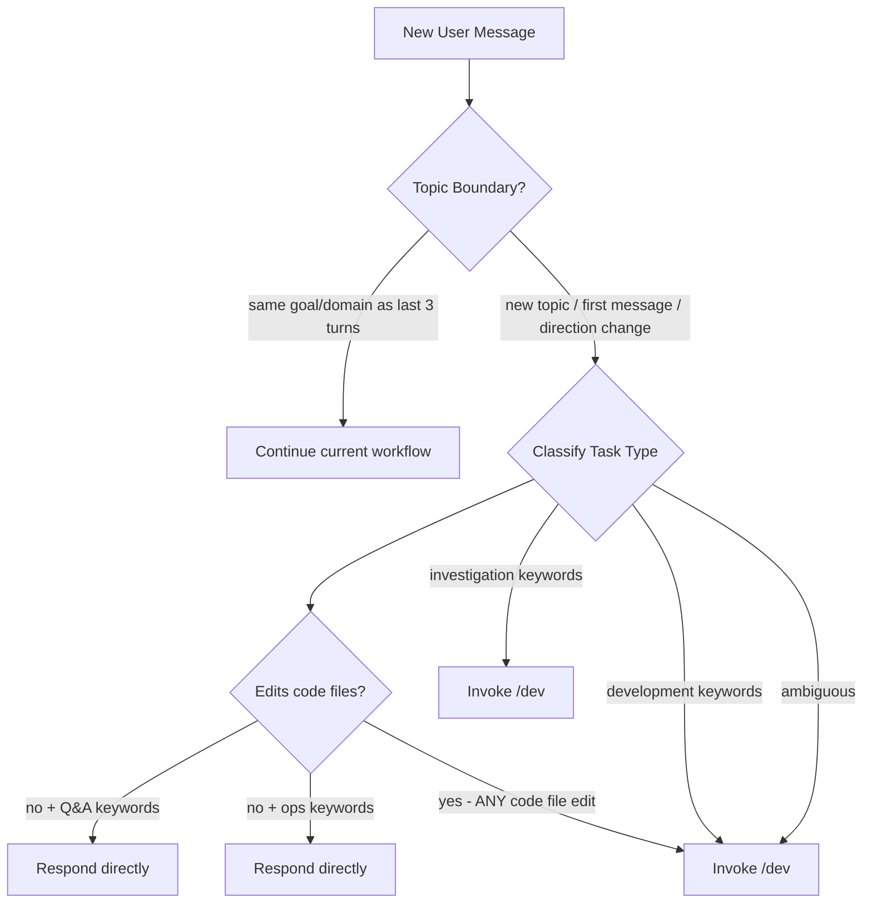

<!-- amplihack-version: 0.9.0 -->

# CLAUDE.md

<!-- AMPLIHACK_CONTEXT_START -->

## 🎯 USER PREFERENCES (MANDATORY - MUST FOLLOW)

# User Preferences

**MANDATORY**: These preferences MUST be followed by all agents. Priority #2 (only explicit user requirements override).

## Autonomy

Work autonomously. Follow workflows without asking permission between steps. Only ask when truly blocked on critical missing information.

## Core Preferences

| Setting             | Value                      |
| ------------------- | -------------------------- |
| Verbosity           | balanced                   |
| Communication Style | (not set)                  |
| Update Frequency    | regular                    |
| Priority Type       | balanced                   |
| Collaboration Style | autonomous and independent |
| Auto Update         | ask                        |
| Neo4j Auto-Shutdown | ask                        |
| Preferred Languages | (not set)                  |
| Coding Standards    | (not set)                  |

## Workflow Configuration

**Selected**: DEFAULT_WORKFLOW (`@~/.amplihack/.claude/workflows/DEFAULT_WORKFLOW.md`)
**Consensus Depth**: balanced

Use CONSENSUS_WORKFLOW for: ambiguous requirements, architectural changes, critical/security code, public APIs.

## Behavioral Rules

- **No sycophancy**: Be direct, challenge wrong ideas, point out flaws. Never use "Great idea!", "Excellent point!", etc. See `@~/.amplihack/.claude/context/TRUST.md`.
- **Quality over speed**: Always prefer complete, high-quality work over fast delivery.

## Learned Patterns

<!-- User feedback and learned behaviors are added here by /amplihack:customize learn -->

## Managing Preferences

Use `/amplihack:customize` to view or modify (`set`, `show`, `reset`, `learn`).

<!-- AMPLIHACK_CONTEXT_END -->

This file provides guidance to Claude Code when working with your codebase. It
configures the amplihack agentic coding framework - a development tool that uses
specialized AI agents to accelerate software development through intelligent
automation and collaborative problem-solving.

## Important Files to Import

When starting a session, import these files for context:

[@~/.amplihack/.claude/context/PHILOSOPHY.md](~/.amplihack/.claude/context/PHILOSOPHY.md)
[@~/.amplihack/.claude/context/PROJECT.md](~/.amplihack/.claude/context/PROJECT.md)
[@~/.amplihack/.claude/context/PATTERNS.md](~/.amplihack/.claude/context/PATTERNS.md)
[@~/.amplihack/.claude/context/TRUST.md](~/.amplihack/.claude/context/TRUST.md)
[@~/.amplihack/.claude/context/USER_PREFERENCES.md](~/.amplihack/.claude/context/USER_PREFERENCES.md)
[@~/.amplihack/.claude/context/USER_REQUIREMENT_PRIORITY.md](~/.amplihack/.claude/context/USER_REQUIREMENT_PRIORITY.md)

## MANDATORY: Workflow Classification at Topic Boundaries

**CRITICAL**: You MUST classify at topic boundaries (new conversation topics)
and follow the corresponding workflow BEFORE taking action. No exceptions.

### When to Classify

Classify when the user:

- **Starts a new topic** (different domain/goal from current work)
- **First message of the session** (no prior context)
- **Explicitly changes direction** ("Now let's...", "Next I want...", "Different
  question...")
- **Switches request type** (question → implementation, investigation → coding)

### When NOT to Re-Classify

Do NOT re-classify when the user:

- **Asks follow-ups** ("Also...", "What about...", "And...")
- **Provides clarifications** ("I meant...", "To clarify...")
- **Requests related additions** ("Add logout too", "Also update the tests")
- **Checks status** ("How's it going?", "What's the progress?")

**Detection rule**: If the request is about the same goal/domain as the last 3
turns, it's the same topic. Continue in the current workflow.

### Quick Classification (3 seconds max)

| Task Type         | Action                      | When to Use                                            |
| ----------------- | --------------------------- | ------------------------------------------------------ |
| **Q&A**           | Respond directly            | Simple questions, single-turn answers, no code changes |
| **Operations**    | Respond directly            | Admin tasks, commands, disk cleanup, repo management   |
| **Investigation** | smart-orchestrator (`/dev`) | Understanding code, exploring systems, research        |
| **Development**   | smart-orchestrator (`/dev`) | Code changes, features, bugs, refactoring              |

### Code File Edit Rule (MANDATORY)

**If the task requires editing ANY code files (`.py`, `.yaml`, `.ts`, `.js`,
`.rs`, `.go`, `.json`, `.toml`, etc.), it MUST be classified as Development —

<!-- Content truncated to meet Windsurf 6KB limit -->

---
> Source: [rysweet/amplihack](https://github.com/rysweet/amplihack) — distributed by [TomeVault](https://tomevault.io).
<!-- tomevault:4.0:windsurf_rules:2026-05-05 -->
