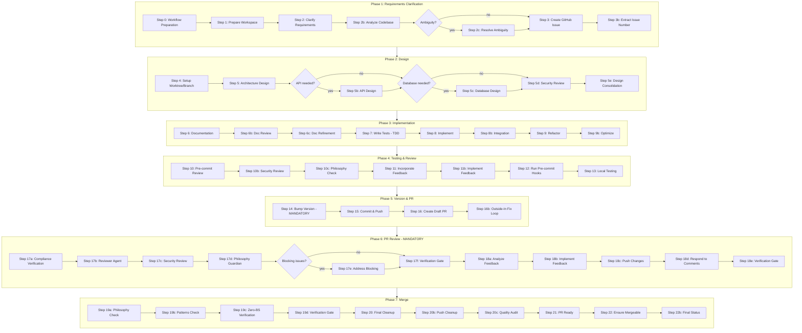

# Default Workflow Skill

## Workflow Graph



## Purpose

This skill provides the standard development workflow for all non-trivial code changes in amplihack. It auto-activates when detecting multi-file implementations, complex integrations, or significant refactoring work.

The workflow defines the canonical execution process: from requirements clarification through design, implementation, testing, review, and merge. It ensures consistent quality by orchestrating specialized agents at each step and enforcing philosophy compliance throughout.

This is a thin wrapper that references the complete workflow definition stored in a single canonical location, ensuring no duplication or drift between the skill interface and the workflow specification.

## Canonical Source

**This skill is a thin wrapper that references the canonical workflow:**

**Source**: `~/.amplihack/.claude/workflow/DEFAULT_WORKFLOW.md` (471+ lines)

The canonical workflow contains the complete development process with all details, agent specifications, and execution guidance.

## Execution Instructions

When this skill is activated, you MUST:

1. **Read the canonical workflow** immediately:

   ```
   Read(file_path="~/.amplihack/.claude/workflow/DEFAULT_WORKFLOW.md")
   ```

   Note: Path is relative to project root. Claude Code resolves this automatically.

2. **Follow all steps** exactly as specified in the canonical workflow

3. **Use TodoWrite** to track progress through workflow steps with format:
   - `Step N: [Step Name] - [Specific Action]`
   - Example: `Step 1: Rewrite and Clarify Requirements - Use prompt-writer agent`
   - This helps users track exactly which workflow step is active

4. **Invoke specialized agents** as specified in each workflow step:
   - Step 1: prompt-writer, analyzer, ambiguity agents
   - Step 4: architect, api-designer, database, tester, security agents
   - Step 5: builder, integration agents
   - Step 6: cleanup, optimizer agents
   - Step 7: pre-commit-diagnostic agent
   - Step 9-15: Review and merge agents

## Why This Pattern

**Benefits:**

- Single source of truth for workflow definition
- No content duplication or drift
- Changes to workflow made once in canonical location
- Clear delegation contract between skill and workflow
- Reduced token usage (skill is ~60 lines vs 471+ in canonical source)

## Auto-Activation Triggers

This skill auto-activates for:

- Features spanning multiple files (5+)
- Complex integrations across components
- Refactoring affecting 5+ files
- Any non-trivial code changes requiring structured workflow

## Known Failure Points & Resilience Guidance

Steps that commonly fail during workflow execution. Agents executing this workflow
MUST apply the documented resilience patterns when encountering these steps.

### Step 3 — Issue Creation (label missing)

**Failure**: `gh label create` fails silently when labels cannot be created (permission denied, API timeout).
**Resilience**: Label attachment is best-effort. If `gh issue create --label` fails, retry without `--label`. The issue itself is the critical artifact, not its labels.

### Step 4 — Worktree Setup (no remote / no origin/main)

**Failure**: `git fetch origin main` aborts when the repo has no remotes or `origin/main` does not exist.
**Resilience**: Topology detection runs first. If no remote exists, use `HEAD` as base ref and skip push/upstream setup. The `bootstrap` flag in worktree output signals downstream steps to skip remote operations.

### Step 4 — Initial Push (network transient)

**Failure**: `git push origin <branch>` fails on fresh branch creation due to network issues.
**Resilience**: Push failure at step 4 emits a visible WARNING and defers to step 15/16. Push is retried with bounded retry (3 attempts, 2s backoff) at commit-and-push time. Step 16 also retries push before PR creation.

### Step 5b — Agent Output Artifact Missing

**Failure**: Agent output file not written or corrupted, causing downstream steps to fail with empty input.
**Resilience**: If an agent step produces empty output, the recipe runner should surface the error visibly. Checkpoints after design (step 5e) and after implementation (step 8b) preserve partial work so the workflow can resume from the nearest safe point.

### Step 15 — Push to Remote (upstream tracking)

**Failure**: `git rev-list --count @{u}..HEAD` fails when upstream is not set (first push scenario).
**Resilience**: Detect missing upstream explicitly. If `@{u}` fails, push unconditionally instead of silently skipping. Retry push with backoff on transient network errors.

### Step 16 — PR Creation (already exists / no commits)

**Failure**: `gh pr create` fails with "No commits between main and branch" or duplicate PR.
**Resilience**: Idempotency guard checks for existing PRs by branch name before creating. If PR already exists, reuse it. If no commits ahead, surface the error visibly rather than creating an empty PR.

### Step 21 — PR Ready (large template variables)

**Failure**: Shell `&&`-chain breaks when `philosophy_check`, `patterns_check`, or `quality_audit_results` template variables contain shell metacharacters or exceed ARG_MAX.
**Resilience**: Large template variables are captured via heredoc and truncated to 1KB before use in shell commands. Step 21 avoids echoing raw template content in bash; agent steps handle large text natively.

## Checkpoint Strategy

The workflow creates automatic checkpoints at these points to prevent work loss:

| Checkpoint                         | After Step                | Preserves                                     |
| ---------------------------------- | ------------------------- | --------------------------------------------- |
| `checkpoint-after-design`          | 5e (Design Consolidation) | Architecture decisions, API design, DB schema |
| `checkpoint-after-implementation`  | 8b (Integration)          | Tests, implementation code, integration work  |
| `checkpoint-after-review-feedback` | 11b (Implement Feedback)  | Review-addressed changes                      |

If a step fails after a checkpoint, the worktree branch retains all committed work. Agents can resume from the latest checkpoint by re-running the workflow with the existing worktree.

## Related Files

- **Canonical Workflow**: `~/.amplihack/.claude/workflow/DEFAULT_WORKFLOW.md`
- **Command Interface**: `~/.amplihack/.claude/commands/amplihack/ultrathink.md`
- **Orchestrator Skill**: `~/.amplihack/.claude/skills/ultrathink-orchestrator/`
- **Investigation Workflow**: `~/.amplihack/.claude/skills/investigation-workflow/`

---
> Converted and distributed by [TomeVault](https://tomevault.io/claim/rysweet) — claim your Tome and manage your conversions.
<!-- tomevault:4.0:skill_md:2026-04-11 -->
