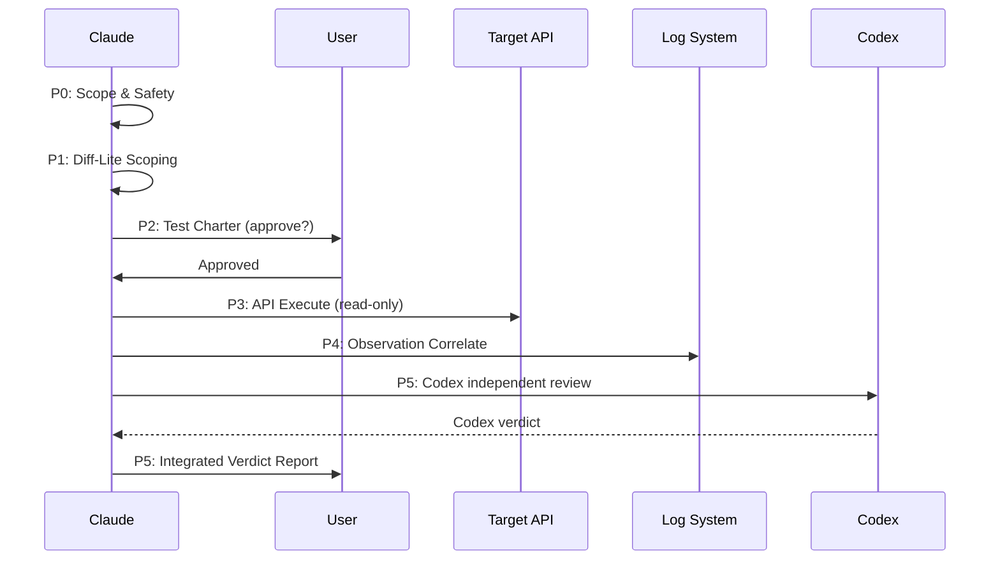

# Feature Verify — Runtime-First API Verification

## Trigger

- Keywords: verify, investigate, diagnose, check if working, post-deploy, smoke test, validate
- User wants to confirm deployed feature behavior
- User provides environment access (API URL, log system, credentials)

## When NOT to Use

| Need | Use Instead |
| ---- | ----------- |
| Modify data or state | `/feature-dev` |
| Code quality review | `/codex-review-fast` |
| Generate unit tests | `/codex-test-gen` |
| Security audit | `/codex-security` |
| Run local tests | `/verify` |
| Review test coverage | `/codex-test-review` |

## Core Principle

```
⚠️ ALL OPERATIONS MUST BE READ-ONLY ⚠️

Claude independent analysis → Codex third-perspective confirmation → Integrated verdict
```

> **Tool safety note**: `allowed-tools` includes `Bash` for curl/log queries. Read-only enforcement is behavioral — all commands MUST be reviewed against `references/safety-rules.md` before execution. Codex independently verifies compliance at P5.

## Degradation Matrix

Auto-detect from `references/environments.md` configuration:

| Level | Available Resources | P3 API | P4 Observation | Confidence Cap |
| ----- | ------------------- | ------ | -------------- | -------------- |
| **L4** | API + Log + Metrics | Full | Log + Metrics | High |
| **L3** | API + Log | Full | Log only | High |
| **L2-API** | API only | Full | Response-only | Medium |
| **L2-OBS** | Log only (API unreachable) | Skip | Time-window scan | Medium |
| **L1** | No runtime access | Skip P3/P4 | Code review only | Low |

**Auto-detection logic** (see `references/environments.md` § Degradation Detection):

| API Status | Log System | Metrics | Level |
|------------|------------|---------|-------|
| Reachable | Yes | Yes | L4 |
| Reachable | Yes | No | L3 |
| Reachable | No | — | L2-API |
| **Unreachable** | **Yes** | — | **L2-OBS** |
| Unreachable | No | — | L1 |

**Fail-closed**: If Endpoint Allowlist section is missing, skip P3 (cannot call unverified endpoints). At L1, skip P3 and P4. Provide code-review-based analysis only with Low confidence. At L2-OBS, skip P3 (API unreachable); execute P4 time-window scan and background service observation only.

## Workflow



## P0: Scope & Safety

Read [safety-rules.md](references/safety-rules.md) and [environments.md](references/environments.md).

| Check | Method | Fail Action |
| ----- | ------ | ----------- |
| Environment select | `--env` flag or ask user; load from `references/environments.md` | Default to test |
| API reachable | Deterministic health-check (3x, 2s timeout — see `references/environments.md`) | Unreachable + Log config → L2-OBS; Unreachable + no Log → L1 |
| Deployment aligned | Compare local HEAD with deployed version | Mismatch → warn, lower confidence |
| Read-only confirmed | Review `references/safety-rules.md`, confirm all planned operations are read-only | — |
| Degradation level | Check `references/environments.md` for log/metrics config | Set level (L1-L4) |

## P1: Diff-Lite Scoping

Read [blackbox-testing.md § P1](references/blackbox-testing.md#p1-diff-lite-scoping).

**Scope only — no code quality judgment.**

1. Get diff: `git diff main...HEAD --name-only` (or user-provided scope)
2. Map changed files → affected endpoints → dependency chains
3. Identify L1 regression endpoints, L2 trigger cases, L3 passive targets

**Fallback**: If no git diff available, ask user for feature description and build scope manually.

**`--level` override**: If user passes `--level L2-API`, skip log/metrics cases even if configured. `--level L2-OBS` forces observation-only mode. `--level L2` defaults to `L2-API` for backward compatibility.

## P2: Test Charter

Read [blackbox-testing.md § P2](references/blackbox-testing.md#p2-test-charter-design).

Generate test cases dynamically from P1 results:

| Type | Goal | When |
| ---- | ---- | ---- |
| **L1 Regression** | Affected API returns expected results | L2-API+ (N/A for L2-OBS) |
| **L2 Active Trigger** | New code path exercised, verify response | L2-API+ (N/A for L2-OBS) |
| **L3 Passive Observe** | Background service running, check logs | L3+ only |
| **M1 Metrics** | Metrics correctly emitted with right labels | L4 only |

**User approval gate**: Present charter table to user for confirmation before proceeding to P3. User may add/remove/modify cases.

## P3: API Execute

**Prerequisites**: P2 approved, degradation level is L2-API or higher (L2-API/L3/L4). **L2-OBS skips P3 entirely** (API unreachable).

For each test case:

1. Load headers from `references/environments.md` (generate unique request ID per call)
2. Send request — **only allowlisted endpoints** (`references/safety-rules.md`)
3. Record: HTTP status, response code, key response fields, request ID, latency
4. Single request at a time (no concurrent/load testing)
5. Use fixed test parameters from `references/environments.md` (no real user data)

```bash
# Example execution pattern
make_headers
REQ_ID=$(extract_request_id)
START=$(date +%s%3N)
RESP=$(curl -s -w "\n%{http_code}" -X {{ METHOD }} "$HOST/{{ ENDPOINT }}" \
  "${HEADERS[@]}" -d '{{ PAYLOAD }}')
HTTP_CODE=$(echo "$RESP" | tail -1)
BODY=$(echo "$RESP" | sed '$d')
END=$(date +%s%3N)
LATENCY=$((END - START))
```

## P4: Observation Correlate

Read [blackbox-testing.md § P4](references/blackbox-testing.md#p4-log-verification-flow).

**Prerequisites**: Degradation level L2-OBS or L3+.

> **L2-OBS mode**: Skip subsection A (no P3 requests to correlate). Execute B (time-window scan) and C (background service observation). Observation window: deploy_time → now (fallback: user-specified or last 30min).

### A. Per-Request Log Correlation (L1/L2 test case types, requires L3+)

For each P3 request, query logs by request ID with fallback strategy:

1. Primary: request ID exact match
2. Fallback: alternate field names
3. Fallback: endpoint + time window

Retry: 30s fast → 120s delayed → mark unreachable.

### B. Time-Window Scan (all cases)

Scan test period for anomalies (error + warn levels).

### C. L3 Background Service Observation (if applicable)

Query logs for schedule/cron tags with 120s delay.

### D. Metrics Observation (L4 only, if applicable)

Query metrics system for affected metrics, verify labels and values.

### E. Blind Spot Analysis

Record what **cannot** be observed through black-box testing. List in report for `/codex-test-review` follow-up.

## P5: Verdict

### Per-Endpoint Verdict

| Verdict | Condition |
| ------- | --------- |
| **Pass** | L1 passed + L2 has expected signal + L3 normal + M1 correct (N/A items don't block) |
| **Warn** | L1 passed but L2 signal missing, or L3/M1 has non-blocking anomaly |
| **Blocked** | L1 failed, or regression detected, or M1 shows incorrect labels |
| **Inconclusive** | API/log/metrics unreachable, insufficient evidence |

### Confidence Level

| Level | Condition |
| ----- | --------- |
| **High** | L3/L4 + Claude and Codex agree |
| **Medium** | L2-API (API-only) or L2-OBS (observation-only) or partial agreement |
| **Low** | L1 (no runtime) or Claude and Codex diverge |

### Dual Verification (Claude + Codex)

1. **Claude analysis**: Form independent conclusion from P3 + P4 evidence
2. **Codex review**: Use `/codex-brainstorm` with P1 scope + P3 results + P4 observations (see `references/blackbox-testing.md` § P5)
3. **Integrated verdict**: Synthesize both perspectives

Codex must independently verify (see `references/blackbox-testing.md` § P5 prompt):
- No write operations were performed during P3
- Each endpoint called was on the Endpoint Allowlist (`references/environments.md`)
- All HTTP methods match allowlist (GET or allowlisted POST)
- Verdict is justified by evidence

### Output

Generate report using [output-template.md](references/output-template.md).

**Verdict is independent**: Report may recommend follow-up skills (`/codex-review-fast`, `/verify`, `/codex-test-review`) but does NOT auto-invoke them.

## Production Guardrails

| Rule | Description |
| ---- | ----------- |
| Single request | One request at a time (no load testing) |
| Fixed parameters | Use test parameters from `references/environments.md` |
| Read-only only | Only allowlisted endpoints (`references/safety-rules.md`) |
| No PII | No real user credentials, keys, or sensitive data in payloads |
| Rate aware | Respect API rate limits |

## Verification Checklist

- [ ] P0: Environment selected, reachable, deployment aligned
- [ ] P0: Degradation level determined
- [ ] P1: Affected endpoints mapped from diff (or user input)
- [ ] P2: Test charter approved by user
- [ ] P3: All API calls are read-only and on allowlist (L2-API+)
- [ ] P3: L2-OBS correctly skips API execution
- [ ] P3: Each call recorded with HTTP status, request ID, latency
- [ ] P4: Log correlation attempted for each request (L3+)
- [ ] P4: Time-window scan completed (L2-OBS or L3+)
- [ ] P4: L2-OBS time-window scan uses correct observation window
- [ ] P4: Blind spots documented
- [ ] P5: Claude analysis formed independently
- [ ] P5: Codex review completed independently
- [ ] P5: Integrated verdict with confidence level
- [ ] Report follows `references/output-template.md` format

## References

| File | Content | Read At |
| ---- | ------- | ------- |
| [environments.md](references/environments.md) | API endpoints, auth headers, log/metrics config, test params | P0, P3 |
| [safety-rules.md](references/safety-rules.md) | Read-only rules, endpoint allowlist, forbidden ops | P0, P3 |
| [blackbox-testing.md](references/blackbox-testing.md) | Diff-lite scoping, test charter design, log verification, blind spots | P1, P2, P4, P5 |
| [output-template.md](references/output-template.md) | Verdict report format | P5 |

## Examples

```
Input: /feature-verify "User Auth API" --env test
Action: P0(reachable? → L3) → P1(diff → /api/auth/*) → P2(L1+L2 charter, user approves)
        → P3(curl read-only endpoints) → P4(log correlation) → P5(verdict: Pass, High)
```

```
Input: /feature-verify "Payment query" --env prod --level L2
Action: P0(prod, forced L2) → P1(diff → /api/payment/query) → P2(L1+L2, no L3)
        → P3(curl) → P4(response-only) → P5(verdict: Pass, Medium)
```

```
Input: /feature-verify "Background sync job" --env staging
Action: P0(staging, L3) → P1(diff → cron changes) → P2(L3 passive only)
        → P3(skip — no API endpoint) → P4(log observation for schedule tag) → P5(verdict)
```

```
Input: /feature-verify "Cache optimization" (no env configured)
Action: P0(no config → L1) → P1(diff → cache service) → P2(code review only)
        → P3(skip) → P4(skip) → P5(verdict: Inconclusive, Low — recommend configuring references/environments.md)
```

```
Input: /feature-verify "Order processing" --env prod
Action: P0(prod, API unreachable 3/3, Log config present → L2-OBS)
        → P1(diff → /api/order/*) → P2(L3 passive + time-window only, no L1/L2 active)
        → P3(skip — API unreachable) → P4(time-window scan: deploy→now, background observation)
        → P5(verdict: Pass/Warn/Inconclusive, Medium)
```

---
> Converted and distributed by [TomeVault](https://tomevault.io/claim/sd0xdev) — claim your Tome and manage your conversions.
<!-- tomevault:4.0:skill_md:2026-04-11 -->
