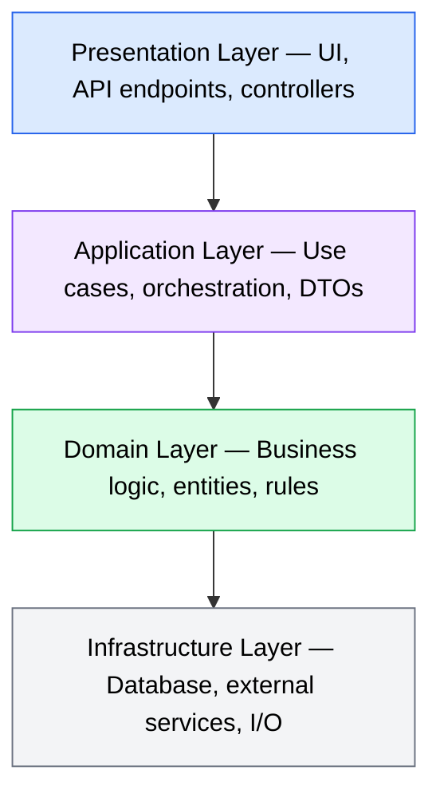
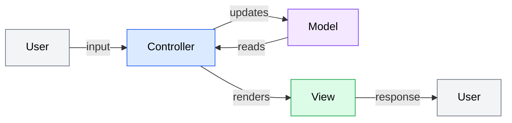
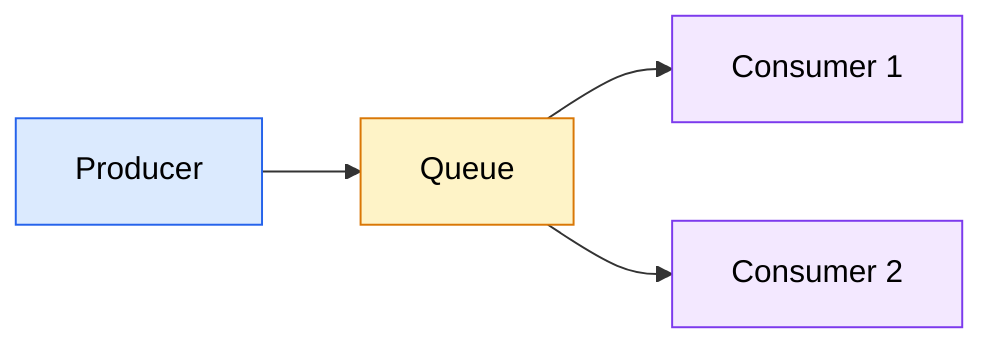
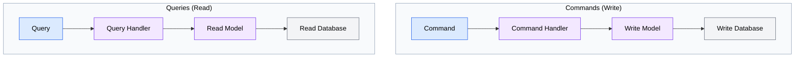
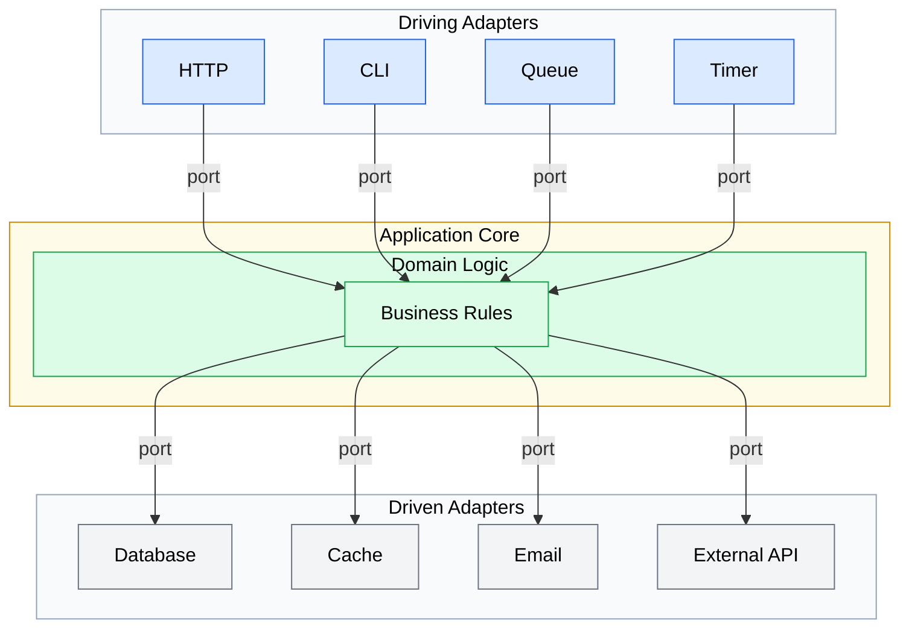
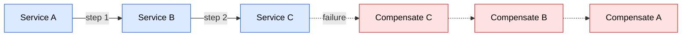

# Architecture Patterns

This skill provides knowledge about common architectural patterns to help design feature implementations. Apply these patterns based on the project's existing architecture and the feature's requirements.

## Diagram Convention

Architecture visualizations use Mermaid syntax with `classDef` styling (`color:#000` for text readability). When creating architecture visualizations based on these patterns, follow the technical-diagrams skill conventions.

## Pattern Selection Guide

Choose patterns based on:
1. **Existing architecture** - Match what's already in use
2. **Team familiarity** - Use patterns the team knows
3. **Feature requirements** - Some patterns fit better for certain features
4. **Scale requirements** - Consider current and future scale

---

## Layered Architecture (N-Tier)

**When to use:** Most web applications, CRUD operations, clear separation of concerns needed

**Layers:**


**Key rules:**
- Dependencies flow downward only
- Each layer only talks to the layer directly below
- Domain layer has no external dependencies

**Implementation tips:**
- Use interfaces at layer boundaries
- Keep domain logic in the domain layer, not controllers
- Use DTOs to transfer data between layers

---

## MVC (Model-View-Controller)

**When to use:** Web applications with server-rendered views, simple CRUD apps

**Components:**


**Model:** Data and business logic
**View:** Presentation/UI
**Controller:** Handles input, coordinates model and view

**Implementation tips:**
- Keep controllers thin - delegate to services
- Models should be framework-agnostic when possible
- Views should have minimal logic

---

## Repository Pattern

**When to use:** Data access abstraction, testability, multiple data sources

**Structure:**
```typescript
interface UserRepository {
  findById(id: string): Promise<User | null>;
  findByEmail(email: string): Promise<User | null>;
  save(user: User): Promise<User>;
  delete(id: string): Promise<void>;
}

class PostgresUserRepository implements UserRepository {
  // Implementation using PostgreSQL
}

class InMemoryUserRepository implements UserRepository {
  // Implementation for testing
}
```

**Benefits:**
- Abstracts data access details
- Easy to swap implementations
- Simplifies testing with in-memory implementations

---

## Service Layer Pattern

**When to use:** Complex business logic, multiple entry points (API, CLI, queue)

**Structure:**
```typescript
class UserService {
  constructor(
    private userRepo: UserRepository,
    private emailService: EmailService,
    private logger: Logger
  ) {}

  async registerUser(data: RegisterDTO): Promise<User> {
    // Validation
    // Business logic
    // Coordination of multiple repositories/services
    // Return result
  }
}
```

**Implementation tips:**
- Services contain business logic, not controllers
- One service per domain concept
- Services can call other services (but avoid cycles)

---

## Event-Driven Architecture

**When to use:** Decoupled components, async processing, audit trails, notifications

**Patterns:**

### Event Emitter (Simple)
```typescript
// Emit events for side effects
userService.on('userCreated', async (user) => {
  await emailService.sendWelcome(user);
  await analyticsService.trackSignup(user);
});
```

### Message Queue (Distributed)


**Event structure:**
```typescript
interface DomainEvent {
  type: string;
  timestamp: Date;
  payload: unknown;
  metadata: {
    correlationId: string;
    causationId: string;
  };
}
```

**Implementation tips:**
- Events should be immutable
- Include enough context to process without additional queries
- Handle idempotency for at-least-once delivery

---

## CQRS (Command Query Responsibility Segregation)

**When to use:** Complex domains, different read/write patterns, high-performance reads needed

**Structure:**


**Simplified CQRS:**
```typescript
// Commands modify state
class CreateUserCommand {
  execute(data: CreateUserDTO): Promise<void>
}

// Queries return data without modification
class GetUserQuery {
  execute(id: string): Promise<UserDTO>
}
```

**Implementation tips:**
- Start simple - same database, different models
- Use for complex domains where read/write models differ
- Consider eventual consistency implications

---

## Ports and Adapters (Hexagonal)

**When to use:** High testability needs, multiple I/O channels, long-lived applications

**Structure:**


**Key concept:** Business logic at center, all I/O through ports/adapters

**Implementation tips:**
- Define ports (interfaces) for all external interactions
- Adapters implement ports for specific technologies
- Domain code never imports adapter code

---

## Microservices Patterns

**When to use:** Large teams, independent deployability, different scaling needs

### API Gateway
Single entry point that routes to services

### Service Discovery
Services register themselves, clients look them up

### Circuit Breaker
Prevent cascade failures when services are down
```typescript
const breaker = new CircuitBreaker(remoteService.call, {
  timeout: 3000,
  errorThreshold: 50,
  resetTimeout: 30000
});
```

### Saga Pattern
Coordinate transactions across services


---

## Choosing the Right Pattern

| Scenario | Recommended Pattern |
|----------|---------------------|
| Simple CRUD app | MVC + Repository |
| Complex business logic | Layered + Service Layer |
| Need audit trail | Event-Driven |
| High read/write disparity | CQRS |
| Maximum testability | Hexagonal |
| Multiple teams/services | Microservices patterns |

## Anti-Patterns to Avoid

1. **Big Ball of Mud** - No clear structure
2. **God Object** - One class does everything
3. **Spaghetti Code** - Tangled dependencies
4. **Golden Hammer** - Using one pattern for everything
5. **Premature Optimization** - Complex patterns for simple needs

## Application Guidelines

1. **Match existing architecture** - Don't introduce new patterns unnecessarily
2. **Start simple** - Add complexity only when needed
3. **Document decisions** - Explain why a pattern was chosen
4. **Consider team skills** - A simpler pattern well-executed beats a complex one poorly understood

---
> Converted and distributed by [TomeVault](https://tomevault.io/claim/sequenzia) — claim your Tome and manage your conversions.
<!-- tomevault:4.0:skill_md:2026-04-11 -->
