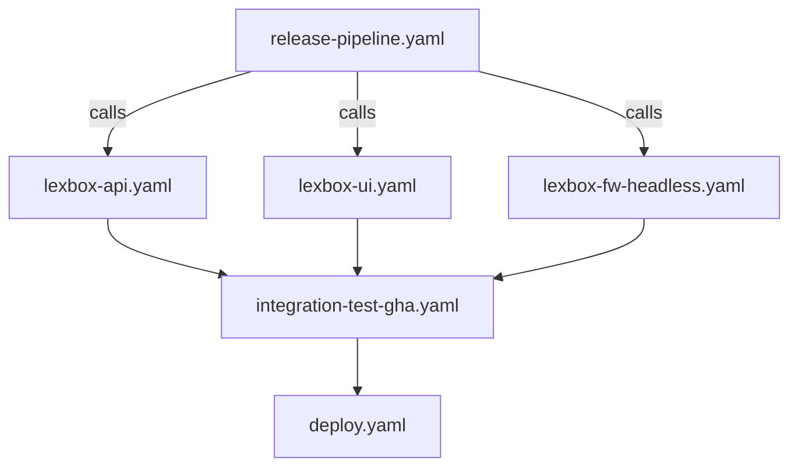

# CI/CD and Deployment

This document helps agents understand the GitHub Actions workflows and deployment infrastructure.

## ⚠️ WARNING: Complexity Ahead

The CI/CD setup is:
- **Complex** - Many interdependent workflows
- **Slow** - Full runs can take 30-60+ minutes
- **Fragile** - Flaky tests, timing issues, external dependencies
- **Expensive** - Windows runners, multiple platforms

**Before modifying workflows:**
1. Understand which workflows depend on each other
2. Test changes on a branch first
3. Consider if changes will increase build times
4. Check if the change needs to work across multiple OS/platforms

---

## Workflow Overview

### Build Workflows (Build + Test)

| Workflow | Triggers | What it does | Time |
|----------|----------|--------------|------|
| `fw-lite.yaml` | FwLite code changes | Build .NET, run tests, build viewer, publish apps | ~40 min |
| `lexbox-api.yaml` | Called by others | Build API, run unit tests, build Docker image | ~15 min |
| `lexbox-ui.yaml` | Called by others | Build SvelteKit UI, build Docker image | ~10 min |
| `lexbox-fw-headless.yaml` | Called by others | Build FwHeadless Docker image | ~10 min |
| `lexbox-hgweb.yaml` | Called by others | Build hgweb Docker image | ~5 min |

### Integration & Deploy Workflows

| Workflow | Triggers | What it does |
|----------|----------|--------------|
| `integration-test.yaml` | Called by others | Run integration tests against environment |
| `integration-test-gha.yaml` | API/UI changes | Spin up K8s in GHA, run integration tests |
| `deploy.yaml` | Called by others | Deploy to K8s environment via fleet repo |
| `deploy-branch.yaml` | Manual | Deploy feature branch to develop |
| `release-pipeline.yaml` | develop/main push | Orchestrate build → test → deploy |

### Development Workflows

| Workflow | Purpose |
|----------|---------|
| `develop-api.yaml` | Quick API build for PRs |
| `develop-ui.yaml` | Quick UI build for PRs |
| `develop-fw-headless.yaml` | Quick FwHeadless build for PRs |

---

## Known Flaky CI Failures (re-run before debugging)

The `GHA integration tests / dotnet` check (`integration-test-gha.yaml`) fails in two known ways that are NOT regressions. Re-run first (`gh run rerun <runId> --failed`) — especially on frontend-only or dependency-only PRs, which can't affect the lexbox-api / hg / fw-headless containers it exercises:

1. **cert-manager readiness timeout** — `setup-k8s` waits `--timeout=90s` for cert-manager pods; on a cold kind cluster they don't always make it → deploy aborts fast (~3 min) and the status step logs "No resources found in languagedepot namespace". Environmental — tends to hit all branches in the same window.
2. **MediaFileTests large-upload stream error** — `Testing.FwHeadless.MediaFileTests.UploadReplacementFile_TooLarge_ThrowsError` intermittently throws `HttpRequestException: Error while copying content to a stream` (transient connection drop streaming the large file) instead of the expected validation error. Shows as Failed: 1 / Passed: ~146 after the full ~14 min run.

Also expected, not a failure: on frontend-only PRs the backend image-publish workflows (`lexbox-fw-headless`, `lexbox-hgweb`) don't trigger (path filters), so `setup-k8s` gets `manifest unknown` pulling those images at the PR version and falls back to the `develop` tag via `continue-on-error`. Those log lines are noise.

Separately: a PR whose merge state is CONFLICTING silently *skips* the build/test checks rather than failing them — if expected checks are missing, reconcile with develop first.

---

## Workflow Dependencies

### FwLite is Separate

`fw-lite.yaml` is **independent** from the main LexBox workflows:
- Core .NET build/tests run on Linux (`FwLiteCore.slnf`); MAUI build/tests on Windows only
- Has its own test suite
- Publishes standalone apps, not Docker images
- Does NOT deploy to K8s

---

## Key Concepts

### Workflow Calls vs. Triggers

- `workflow_call` - Can be called by other workflows (reusable)
- `workflow_dispatch` - Manual trigger from GitHub UI
- `push` / `pull_request` - Automatic triggers

Most build workflows use `workflow_call` so they can be composed.

### Docker Images

All Docker images go to `ghcr.io/sillsdev/`:
- `lexbox-api`
- `lexbox-ui`
- `lexbox-fw-headless`
- `lexbox-hgweb`

Images are tagged with:
- Branch name (`develop`, `main`)
- PR number (`pr-123`)
- Commit SHA
- `latest` (for main branch)

### Environments

| Environment | Domain | When deployed |
|-------------|--------|---------------|
| `develop` | develop.lexbox.org | Every develop push |
| `staging` | staging.languagedepot.org | Manual |
| `production` | lexbox.org | Manual with approval |

---

## Deployment Architecture

### Fleet Repo Pattern

Deployments work via a **separate fleet repository**:

1. Workflow builds Docker image
2. Workflow runs `kubectl kustomize` to generate `resources.yaml`
3. Workflow clones fleet repo
4. Workflow copies `resources.yaml` and updates image tag

<!-- Content truncated to meet Windsurf 6KB limit -->

---
> Source: [sillsdev/languageforge-lexbox](https://github.com/sillsdev/languageforge-lexbox) — distributed by [TomeVault](https://tomevault.io).
<!-- tomevault:4.0:windsurf_rules:2026-07-22 -->
