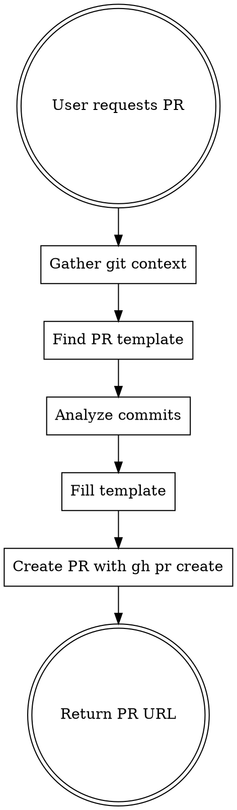

# Create PR from Commits

## Overview

Automate pull request creation by extracting information from git commits and filling the repository's PR template. This eliminates manual repetition while ensuring PRs contain complete, accurate information.

## When to Use

Use when:
- User asks to "create a PR"
- User says "make a pull request"
- User requests "submit this for review"
- You've created 2+ PRs in the session (proactively offer this workflow)

Don't use when:
- User wants to manually draft the PR description
- PR requires special context not in commits
- Repository has no PR template

## Core Workflow



## Implementation

### Step 1: Prompt for GUS ID (Internal Contributors Only)

**For internal Tableau contributors, ask for the GUS work item ID:**

```
What is the GUS work item ID for this PR? (Format: W-12345678)
If you're an external contributor, press Enter to skip.
```

**GUS ID format:**
- Starts with `@W-` 
- Followed by 8 digits
- Example: `@W-22802840`

If the user provides just the number (e.g., "22802840"), prepend `@W-`.
If they provide "W-12345678", prepend `@`.

**If no GUS ID provided:** Continue without it - external contributors don't need GUS IDs.

### Step 2: Gather Git Context (parallel)

Run these commands in parallel with Bash tool:

```bash
# Get all commits since main
git log main..HEAD --format="%h %s%n%b"

# Get full diff
git diff main...HEAD

# Get changed files
git diff main...HEAD --stat

# Check branch tracking
git branch -vv
```

### Step 3: Read PR Template

Read the PR template at `.github/pull_request_template.md` to identify required sections.

### Step 4: Analyze Commits

Extract information for PR title and template sections:

**PR Title:**
- Format: `@W-12345678: Short description` (internal contributors with GUS ID)
- Format: `Short description` (external contributors without GUS ID)
- Derive short description from main commit subject (50 chars max after GUS ID)
- Example with GUS: `@W-22802840: Remove sensitive data from error logs`
- Example without GUS: `Remove sensitive data from error logs`

**Description/Summary:**
- Combine commit subjects into bullet points
- Group related commits (e.g., "fix lint issues" with main feature)
- Lead with most important change

**Motivation/Context:**
- Look for "why" in commit messages
- Extract issue numbers (e.g., W-12345, #123, GUS-456)
- Infer purpose from code changes if not explicit

**Type of Change:**
- Scan for keywords: "fix" (bug fix), "add" (feature), "breaking" (breaking change), "docs" (documentation)
- Check multiple commits - may have multiple types

**Testing:**
- Look for test file changes in diff (`*.test.ts`, `*.spec.js`)
- Check commit messages mentioning "test"
- Note if all tests pass (check last commit message)

**Breaking Changes:**
- Scan for: renamed env vars, removed APIs, changed defaults
- Check commit bodies for "BREAKING" or "breaking change"

### Step 5: Fill Template

Create PR with GUS ID in title using HEREDOC format:

```bash
gh pr create --title "@W-12345678: Short description from commits" --body "$(cat <<'EOF'
## Description
- Bullet point 1 from commit
- Bullet point 2 from commit

## Motivation and Context
[Extracted from commit bodies or inferred from changes]

## Type of Change
- [x] Bug fix
- [ ] New feature
...

## How Has This Been Tested?
[List test files changed or mention manual testing]

## Related Issues
Closes #123, W-45678

## Checklist
- [x] Tests added
- [x] Tests pass
- [ ] Documentation updated
EOF
)"
```

**Template mapping patterns:**

| Template Section | Information Source |
|------------------|-------------------|
| Description/Summary | Commit subjects (bullets) |
| Motivation | Commit bodies + issue refs |
| Type of Change | Keywords in commits + diff analysis |
| Testing | Test file changes + commit messages |
| Breaking Changes | BREAKING in commits + env var changes |
| Checklist items | Verify against actual changes |

### Step 6: Create PR

```bash
# Push if needed
[[ $(git branch -vv | grep 'gone\]') ]] && git push -u origin HEAD

# Create PR with GUS ID in title
gh pr create --title "@W-12345678: Description" --body "..."
```

## Edge Cases

### No PR Template Found

If no template exists, create minimal but complete PR:

```bash
gh pr create --title "..." --body "$(cat <<'EOF'
## Summary
- [commit-based bullets]

## Changes
- [files changed summary]

## Testing
[test coverage or manual testing note]
EOF
)"
```

### Multiple Base Branch Options

Check project conventions:
- Most repos: `main`
- Some use: `master`, `develop`, `trunk`

Use `gh pr create --base <branch>` to specify.

### PR Already Exists

If `gh pr create` fails with "pull request already exists":
- Return the existing PR URL
- Offer to update the PR description with `gh pr edit <number>`

## Common Mistakes

### ❌ Skipping GUS ID Prompt for Internal Contributors

**ALWAYS ask for GUS ID** (but allow skipping for external contributors).

Don't say: "I'll create the PR now" without prompting for GUS ID first.

### ❌ Asking User for Information Already in Commits

Don't ask: "What should I put in the description?"

The commits contain this information. Extract it (except for GUS ID).

### ❌ Generic or Vague Descriptions

Don't write: "Various bug fixes and improvements"

Extract specifics: "Fix memory leak in auth flow, improve error logging for failed requests"

### ❌ Skipping Template Sections

Don't leave sections empty with "TODO".

If information is missing, infer from code changes or use reasonable defaults:
- No tests? Say "Manual testing performed"
- No breaking changes? Check the box as "No"

### ❌ Creating PR Before Checking Push Status

Always verify branch is pushed before creating PR:

```bash
git branch -vv  # Check tracking
```

### ❌ Not Handling HEREDOC Properly

Use single quotes in `<<'EOF'` to prevent variable expansion in PR body.

## Quick Reference

**Full workflow:**

```bash
# 1. Ask user for GUS ID (allow skip for external contributors)
# "What is the GUS work item ID? (Format: W-12345678, or press Enter to skip)"

# 2. Gather context (parallel)
git log main..HEAD --format="%h %s%n%b" &
git diff main...HEAD --stat &
wait

# 3. Find and read template
cat .github/pull_request_template.md

# 4. Create PR with GUS ID in title
gh pr create --title "@W-12345678: Short description" --body "$(cat <<'EOF'
[filled template here]
EOF
)"
```

**Title format examples:**
- ✅ `@W-22802840: Remove sensitive data from error logs` (internal)
- ✅ `@W-12345678: Add user management feature` (internal)
- ✅ `Remove sensitive data from error logs` (external contributor)
- ❌ `W-22802840: Fix bug` (missing @ symbol for internal contributor)

## Real-World Impact

**Before this skill:**
- 2-3 minutes per PR (manual git commands, template reading, copy-paste)
- Inconsistent PR descriptions
- Easy to skip template sections
- Repeated work for multiple PRs

**After this skill:**
- ~30 seconds per PR (automated extraction)
- Consistent, complete PR descriptions
- All template sections filled
- Scalable to many PRs

---
> Source: [tableau/tableau-mcp](https://github.com/tableau/tableau-mcp) — distributed by [TomeVault](https://tomevault.io).
<!-- tomevault:4.0:skill_md:2026-07-11 -->
