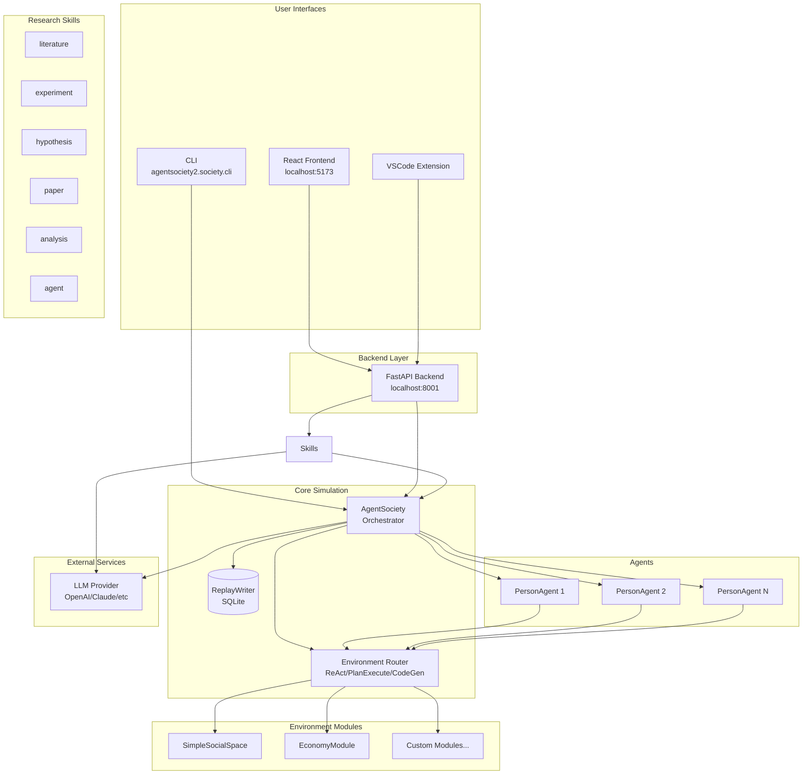
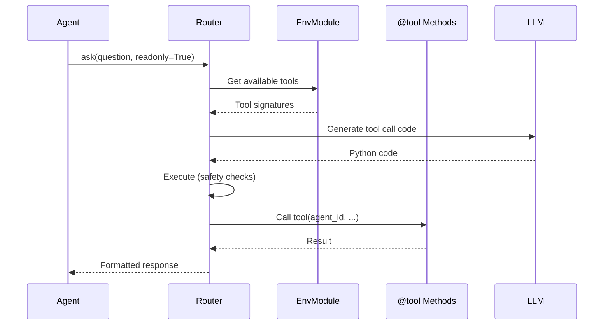
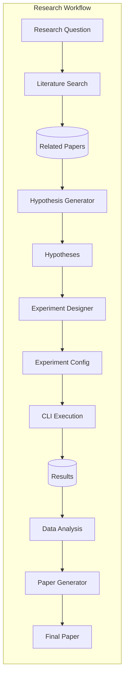
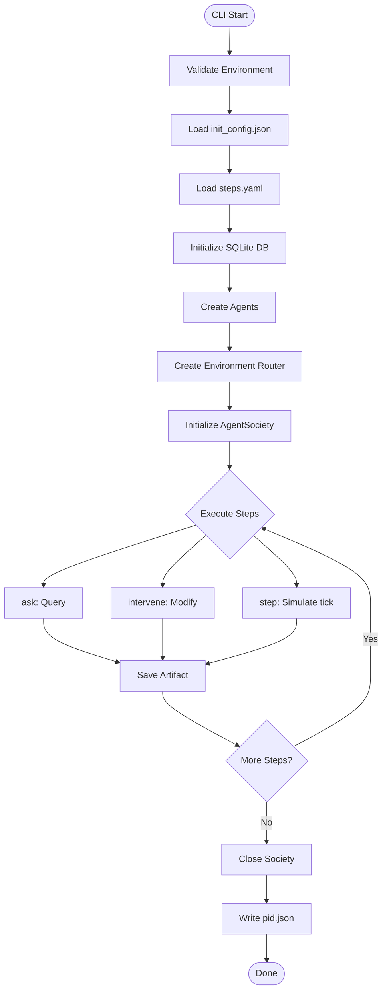
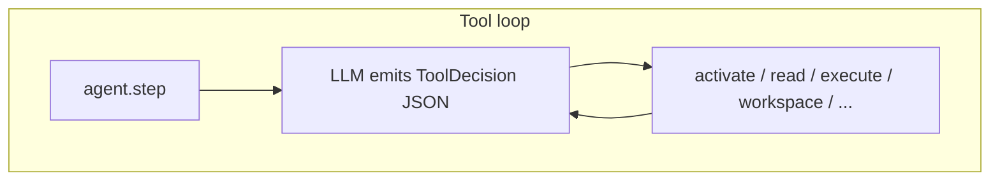

# CLAUDE.md

This file provides guidance to Claude Code (claude.ai/code) when working with code in this repository. For a shorter Cursor / agent entry point, see [AGENTS.md](./AGENTS.md).

## Project Overview

AgentSociety is a framework for building LLM-based agent simulations in urban environments and research workflows. The repository contains two main packages:

- **`packages/agentsociety`** (v1.x): City simulation framework with gRPC-based environment integration (legacy)
- **`packages/agentsociety2`** (v2.x): Modernized, LLM-native agent simulation platform with research skills (current focus)

## Workspace Structure

This is a uv workspace with Python packages in `packages/`:
- `packages/agentsociety2/` - Primary development package
- `packages/agentsociety/` - Legacy city simulation package
- `packages/agentsociety-community/` - Community contributions
- `packages/agentsociety-benchmark/` - Benchmarking utilities

The frontend is a separate React application in `frontend/`.
VSCode extension is in `extension/`.

## Development Commands

### Python Package (agentsociety2)

```bash
# Install dependencies (in workspace root)
uv sync

# Install with dev dependencies
cd packages/agentsociety2 && uv sync --extra dev

# Run tests
cd packages/agentsociety2 && uv run pytest

# Linting
uv run ruff check packages/agentsociety2/

# Format code
uv run ruff format packages/agentsociety2/

# Type checking
uv run mypy packages/agentsociety2/tests/ --follow-imports=skip
```

### Running Experiments (CLI)

```bash
# Get PYTHON_PATH from workspace .env
PYTHON_PATH=$(grep "^PYTHON_PATH=" .env | cut -d'=' -f2)
PYTHON_PATH=${PYTHON_PATH:-.venv/bin/python}

# Run an experiment (--log-file REQUIRED for background execution)
$PYTHON_PATH -m agentsociety2.society.cli \
    --config hypothesis_1/experiment_1/init/init_config.json \
    --steps hypothesis_1/experiment_1/init/steps.yaml \
    --run-dir hypothesis_1/experiment_1/run \
    --experiment-id "1_1" \
    --log-level INFO \
    --log-file hypothesis_1/experiment_1/run/output.log &

# Or run in foreground (logs to console)
$PYTHON_PATH -m agentsociety2.society.cli \
    --config init_config.json \
    --steps steps.yaml \
    --run-dir run
```

### Backend Service (FastAPI)

```bash
# Start backend (from packages/agentsociety2)
cd packages/agentsociety2
python -m agentsociety2.backend.run

# Backend runs on: http://localhost:8001
# API docs available at: http://localhost:8001/docs
# ReDoc available at: http://localhost:8001/redoc
```

### Frontend (React + Vite)

```bash
cd frontend
npm ci               # Install dependencies (lockfile-pinned)
npm run dev          # Start dev server (http://localhost:5173)
npm run build        # Production build
npm run lint         # ESLint
```

### Documentation (Sphinx)

```bash
# Build Chinese docs (default)
make html

# Build English docs
make html-en

# Build all languages
make html-all
```

## Architecture

### System Architecture Overview



### agentsociety2 Core Components

#### Agent System (`agentsociety2/agent/`)
- **AgentBase** (`agent/base/`): base class that directly owns workspace binding, skill runtime (`AgentSkillRuntime`), the ReAct tool loop, LLM calls, TODO state, trace, and `AGENT.json` persistence. No mixins / no multiple inheritance.
- **PersonAgent** (`agent/person.py`): a thin orchestrator on top of `AgentBase` implementing person-specific behavior. Agents are **workspace-bound stateless records** built via `create()` / `from_workspace()` / `restore()` / `to_workspace()`.
- Services (env / trace / replay plus LLM access) are injected via a single **`ServiceProxy`** (`agent/service_proxy.py`); agents are driven as **Ray Tasks** (`agent/runner.py`) so memory is decoupled from agent count N.
- Agents call the LLM through the per-process dispatcher in `config/llm_dispatcher.py`; it uses a local `LLMClient`, a local litellm `Router`, and local concurrency control for configurable models (default/coder/embedding).
- Each agent has: `id`, `profile`, `name`, `skill_runtime`; key methods `ask()`, `step()`, `restore()`, `to_workspace()`, `close()`.

#### Agent Skills Architecture (`agentsociety2/agent/skills/`)
PersonAgent follows a **metadata-first, selected-only** model. The skill *infrastructure* (registry / runtime / workspace_fs / hook_context) lives in `agent/base/`; `agent/skills/` only carries skill **content** directories.
- Skills are self-contained directories; each has `SKILL.md` (YAML frontmatter: `name`/`description`/optional `script`/`hooks` + behavior docs) and optional `scripts/<name>.py` and `references/`.
- The only **built-in skill is `daily-guidance`** (the old `observation`/`cognition`/`plan`/`memory` skills were removed).
- **Selection Stage**: LLM sees skill catalog (name/description only).
- **Execution Stage**: only LLM-selected skills are activated; skill scripts run **in-process via an `entrypoint(argv, ctx)` contract** (ms-level, concurrency-safe), with dynamic-wrapper and subprocess fallbacks.
- `pre_step`/`post_step` lifecycle hooks render into a dedicated `<skill_hooks>` block; `env:`-prefixed skills redirect to `ask_env`.
- Custom skills go in `<workspace>/custom/skills/` and are hot-loaded at runtime.

#### Environment Router (`agentsociety2/env/`)
- **RouterBase**: Abstract router for environment modules
- **EnvBase**: Base class for environment modules with `@tool` decorator
- **Router implementations**: CodeGenRouter (default), ReActRouter, PlanExecuteRouter, TwoTierReActRouter, TwoTierPlanExecuteRouter, SearchToolRouter
- In production the router runs in a dedicated **Ray actor** (`env_router_actor.py` + `env_router_proxy.py::EnvRouterProxy`)
- Environment modules register tools as observe/statistics/regular methods; routers mediate between agents and environment modules

#### CLI (`agentsociety2/society/cli.py`)
- **Main entry point**: `python -m agentsociety2.society.cli`
- **Arguments**: `--config`, `--steps`, `--run-dir`, `--experiment-id`, `--log-level`, `--log-file`
- **Features**: Progress tracking with pid.json, automatic database creation, artifact generation

#### Research Skills (`agentsociety2/skills/`)
- **literature**: Academic literature search and management
- **experiment**: Experiment configuration and execution
- **hypothesis**: Hypothesis generation and management
- **paper**: Academic paper generation (deprecated; replaced by the external `paper-toolkit` plugin, which provides a deterministic CLI for evidence DAG, typesetting, and checks, plus a companion Claude Code skill for writing and review)
- **analysis**: Data analysis harness (phase-gated CLI, EDA embed, experience memory via `draft-reflection` / `promote-reflection`, HTML report bundles)
- **agent**: Agent processing, selection, generation, and filtering

#### Backend API (`agentsociety2/backend/`)
- **FastAPI**-based REST API for external integrations
- **Routes**: `/api/v1/experiments`, `/api/v1/modules`, `/api/v1/replay`, `/api/v1/custom`
- **Separate from core simulation** - runs as independent service
- **API documentation**: Available at `/docs` when running

#### Storage (`agentsociety2/storage/`)
- **ReplayWriter**: SQLite-based storage for simulation replay
- **Models**: AgentProfile, AgentStatus, AgentDialog (SQLModel)
- **ColumnDef/TableSchema**: Dynamic table registration for custom environment data

#### Logger (`agentsociety2/logger/`)
- **ColoredFormatter**: Color-coded console output by log level
- **File logging**: `add_file_handler()` for writing to log files
- **LiteLLM integration**: Custom callback logger for LLM calls
- **Functions**: `get_logger()`, `set_logger_level()`, `add_file_handler()`

#### Society (`agentsociety2/society/`)
- **AgentSociety**: Main simulation orchestrator
- **AgentSocietyHelper**: Plan-and-Execute helper for external questions/interventions
- **Models**: InitConfig, StepsConfig, ExperimentConfig

#### Module Registry (`agentsociety2/registry/`)
- **ModuleRegistry**: Singleton registry for agent classes and environment modules
- Supports lazy loading - modules are only discovered when first accessed
- **Built-in modules**: Discovered from `agentsociety2.contrib/`
- **Custom modules**: Discovered from `custom/` directory
- Key functions: `get_registry()`, `list_all_modules()`, `get_env_module_class()`, `get_agent_module_class()`
- Custom modules are marked with `_is_custom = True` attribute

### Configuration

Environment variables (see `.env.example`):

**Required Configuration:**
- `AGENTSOCIETY_LLM_API_KEY` - Primary API key (required, validated at startup)
- `AGENTSOCIETY_LLM_API_BASE` - API base URL (required, validated at startup)
- `AGENTSOCIETY_LLM_MODEL` - Default model name

**Optional LLM Configuration** (falls back to default if not set):
- `AGENTSOCIETY_CODER_LLM_*` - Code generation LLM
- `AGENTSOCIETY_EMBEDDING_*` - Embedding model settings

**Other Settings:**
- `AGENTSOCIETY_HOME_DIR` - Data directory (default: ./agentsociety_data)
- `BACKEND_HOST`, `BACKEND_PORT` - Backend service configuration

LLM routing via `agentsociety2.config`:
- `get_llm_router(role)` - Get litellm Router for role (default/coder)
- `get_llm_router_and_model(role)` - Get both Router and model name
- `extract_json()` - Utility for JSON extraction from LLM responses

**Configuration validation**: The framework validates required configuration at module load time and will raise a ValueError if `AGENTSOCIETY_LLM_API_KEY` or `AGENTSOCIETY_LLM_API_BASE` are not set.

.. note::

   Current defaults (when the corresponding env vars are not set):

   - `AGENTSOCIETY_LLM_API_BASE`: `https://api.openai.com/v1`
   - `AGENTSOCIETY_LLM_MODEL`: `gpt-5.5`
   - `AGENTSOCIETY_EMBEDDING_MODEL`: `text-embedding-3-large` (dims: `1024`)

### Frontend Architecture

- React 18 with TypeScript
- Ant Design UI components (@ant-design/pro-components, @ant-design/x)
- MobX for state management
- React Router for navigation
- Monaco Editor for code editing
- Plotly.js for data visualization
- Mapbox GL + Deck.gl for geospatial visualization

### Module Organization

```mermaid
graph TD
    subgraph "agentsociety2/"
        A[agent/]
        E[env/]
        S[society/]
        SK[skills/]
        D[designer/]
        B[backend/]
        ST[storage/]
        L[logger/]
        C[config/]
        R[registry/]
        CN[contrib/]
        CU[custom/]
    end

    subgraph "agent/"
        A1[AgentBase]
        A2[PersonAgent]
        A3[skills/]
    end

    subgraph "agent/skills/  (content only; infra in agent/base/)"
        AS1[daily-guidance/]
        AS2[custom/]
    end

    subgraph "env/"
        E1[EnvBase]
        E2[RouterBase]
        E3[CodeGenRouter]
        E4[ReActRouter]
        E5[PlanExecuteRouter]
    end

    subgraph "society/"
        S1[AgentSociety]
        S2[AgentSocietyHelper]
        S3[cli.py]
        S4[models.py]
    end

    subgraph "skills/"
        SK1[literature/]
        SK2[experiment/]
        SK3[hypothesis/]
        SK4[paper/]
        SK5[analysis/]
        SK6[agent/]
    end

    subgraph "backend/"
        B1[routers/]
        B2[services/]
        B3[models/]
        B4[run.py]
    end

    A --> A1
    A --> A2
    A --> A3
    A3 --> AS1
    A3 --> AS2
    E --> E1
    E --> E2
    E --> E3
    E --> E4
    E --> E5
    S --> S1
    S --> S2
    S --> S3
    S --> S4
    SK --> SK1
    SK --> SK2
    SK --> SK3
    SK --> SK4
    SK --> SK5
    SK --> SK6
    B --> B1
    B --> B2
    B --> B3
    B --> B4
```



## Key Design Patterns

### Agent-Environment Interaction Flow



### Research Skills Workflow



### CLI Experiment Execution Flow



### Environment Modules
- Inherit from `EnvBase`
- Use `@tool(readonly=True/False, kind="observe"|"statistics"|None)` decorator
- Implement `observe()` method (returns state string for agents)
- Tools registered automatically via metaclass

### Agent Skills (tool loop)
Each `step()` runs a multi-round tool loop. The catalog exposes **name + description** per skill; the model uses `activate_skill` / `read_skill` / `execute_skill` as needed. Order is not a fixed priority pipeline. Skill state is managed by `AgentSkillRuntime` and workspace-backed skill files.



### Memory Architecture
PersonAgent maintains local workspace-backed memory:
- **Thread context**: Recent tool/LLM interactions, compacted when needed
- **AgentMemory**: Persistent runtime summary in `AGENT_MEMORY.md`
- **memory skill**: Optional event memory in `state/memory.jsonl`

### Agent-Environment Interaction
- Agents call `await env_router.ask(question, readonly=False)`
- Environment routes questions to appropriate module tools
- Supports both querying (readonly=True) and modification (readonly=False)

### Replay & Trace System
- Environment data is written by `ReplayWriter` to `run/replay/` as catalog-driven sharded JSONL datasets, with `ReplayReader` exposing a DuckDB-backed read side
- Replay metadata is stored in `_schema.json`; env modules register datasets/tables via `register_table(ColumnDef*, TableSchema)` / `register_dataset`
- Legacy framework tables (`agent_profile`, `agent_status`, `agent_dialog`) are kept **only for reading old databases** — new runs no longer write them
- Distributed tracing via `agentsociety2.trace` (sharded writer + background-thread `TraceActor`); spans emitted through `service_proxy.trace`
- Agent state lives in per-agent workspaces (`run/agents/agent_<id>/`: `config.json`, `AGENT.json`, `state/*`, `.runtime/logs/*`)

## Important Notes

- **agentsociety2 is a Python package**: ALWAYS access `agentsociety2` via `import agentsociety2`, NEVER search for it in the file system (e.g., `packages/agentsociety2`). The package is installed in the Python environment and available for import.
- **CLI --log-file is REQUIRED**: When running experiments in background, always specify `--log-file` to capture verbose logs.
- **HuggingFace connectivity**: The framework auto-switches to Chinese mirror (`hf-mirror.com`) if HuggingFace is unreachable.
- **Version compatibility**: Use Python >= 3.11
- **Dependencies**: Managed via uv workspace - run `uv sync` from root
- **Frontend build**: Use `npm run build` in `frontend/` directory
- **Testing**: pytest configuration in `packages/agentsociety2/`
- **Ray-based execution**: agentsociety2 uses **Ray**. Agents are workspace-bound stateless records driven by Ray Tasks (`step_agent_batch`); the env router, trace writer, and replay writer run as long-lived shared Ray actors, while LLM access is handled by each process through the local dispatcher and injected via `ServiceProxy`. (v1 also used Ray for city simulation; v2 simplified away the gRPC integration but kept Ray for scalability.)
- **Research skills**: The skills/ module provides LLM-native research workflows for literature search, hypothesis generation, experiment design, and paper writing.
- **Agent Skills**: PersonAgent uses a metadata-first skill selection model. Skills are activated on-demand (in-process `entrypoint`), not pre-loaded. The only built-in skill is `daily-guidance`; custom skills go in `custom/skills/`.
- **Module Registry**: Use `get_registry()` to access the singleton ModuleRegistry for discovering agents and environment modules.

---
> Source: [tsinghua-fib-lab/agentsociety](https://github.com/tsinghua-fib-lab/agentsociety) — distributed by [TomeVault](https://tomevault.io).
<!-- tomevault:4.0:agents_md:2026-07-23 -->
