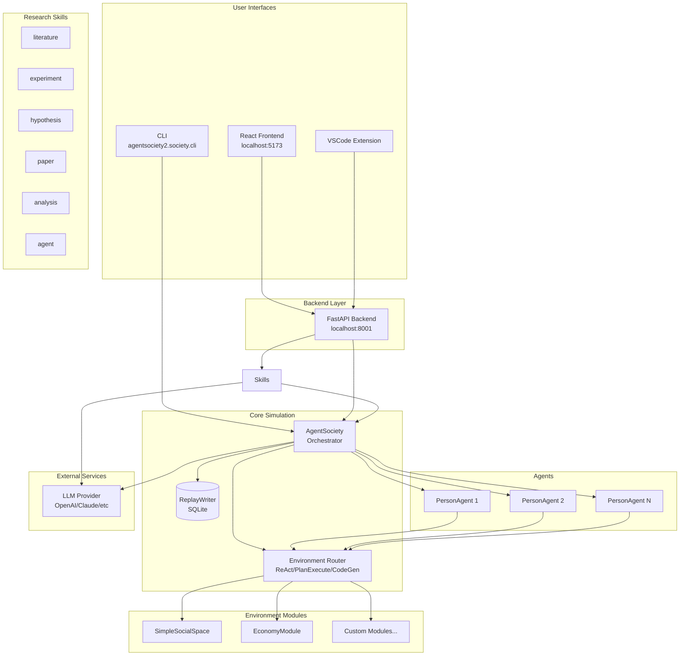

# CLAUDE.md

This file provides guidance to Claude Code (claude.ai/code) when working with code in this repository. For a shorter Cursor / agent entry point, see [AGENTS.md](./AGENTS.md).

## Project Overview

AgentSociety is a framework for building LLM-based agent simulations in urban environments and research workflows. The repository contains two main packages:

- **`packages/agentsociety`** (v1.x): City simulation framework with gRPC-based environment integration (legacy)
- **`packages/agentsociety2`** (v2.x): Modernized, LLM-native agent simulation platform with research skills (current focus)

## Workspace Structure

This is a uv workspace with Python packages in `packages/`:
- `packages/agentsociety2/` - Primary development package
- `packages/agentsociety/` - Legacy city simulation package
- `packages/agentsociety-community/` - Community contributions
- `packages/agentsociety-benchmark/` - Benchmarking utilities

The frontend is a separate React application in `frontend/`.
VSCode extension is in `extension/`.

## Development Commands

### Python Package (agentsociety2)

```bash
# Install dependencies (in workspace root)
uv sync

# Install with dev dependencies
cd packages/agentsociety2 && uv sync --extra dev

# Run tests
cd packages/agentsociety2 && uv run pytest

# Linting
uv run ruff check packages/agentsociety2/

# Format code
uv run ruff format packages/agentsociety2/

# Type checking
uv run mypy packages/agentsociety2/tests/ --follow-imports=skip
```

### Running Experiments (CLI)

```bash
# Get PYTHON_PATH from workspace .env
PYTHON_PATH=$(grep "^PYTHON_PATH=" .env | cut -d'=' -f2)
PYTHON_PATH=${PYTHON_PATH:-.venv/bin/python}

# Run an experiment (--log-file REQUIRED for background execution)
$PYTHON_PATH -m agentsociety2.society.cli \
    --config hypothesis_1/experiment_1/init/init_config.json \
    --steps hypothesis_1/experiment_1/init/steps.yaml \
    --run-dir hypothesis_1/experiment_1/run \
    --experiment-id "1_1" \
    --log-level INFO \
    --log-file hypothesis_1/experiment_1/run/output.log &

# Or run in foreground (logs to console)
$PYTHON_PATH -m agentsociety2.society.cli \
    --config init_config.json \
    --steps steps.yaml \
    --run-dir run
```

### Backend Service (FastAPI)

```bash
# Start backend (from packages/agentsociety2)
cd packages/agentsociety2
python -m agentsociety2.backend.run

# Backend runs on: http://localhost:8001
# API docs available at: http://localhost:8001/docs
# ReDoc available at: http://localhost:8001/redoc
```

### Frontend (React + Vite)

```bash
cd frontend
npm ci               # Install dependencies (lockfile-pinned)
npm run dev          # Start dev server (http://localhost:5173)
npm run build        # Production build
npm run lint         # ESLint
```

### Documentation (Sphinx)

```bash
# Build Chinese docs (default)
make html

# Build English docs
make html-en

# Build all languages
make html-all
```

## Architecture

### System Architecture Overview



### agentsociety2 Core Components

#### Agent System (`agentsociety2/agent/`)
- **AgentBase** (`agent/base/`): base class that directly owns workspace binding, skill runtime (`AgentSkillRuntime`), the ReAct tool loop, LLM calls, TODO state, trace, and `AGENT.json` persistence. No mixins / no multiple inheritance.
- **PersonAgent** (`agent/person.py`): a thin orchestrator on top of `AgentBase` implementing person-specific behavior. Agents are **workspace-bound stateless records** built via `create()` / `from_workspace()` / `restore()` / `to_workspace()`.
- Services (env / trace / replay plus LLM access) are injected via a single **`ServiceProxy`** (`agent/service_proxy.py`); agents are driven as **Ray Tasks** (`agent/runner.py`) so memory is decoupled from agent count N.

<!-- Content truncated to meet Windsurf 6KB limit -->

---
> Source: [tsinghua-fib-lab/agentsociety](https://github.com/tsinghua-fib-lab/agentsociety) — distributed by [TomeVault](https://tomevault.io).
<!-- tomevault:4.0:windsurf_rules:2026-07-23 -->
