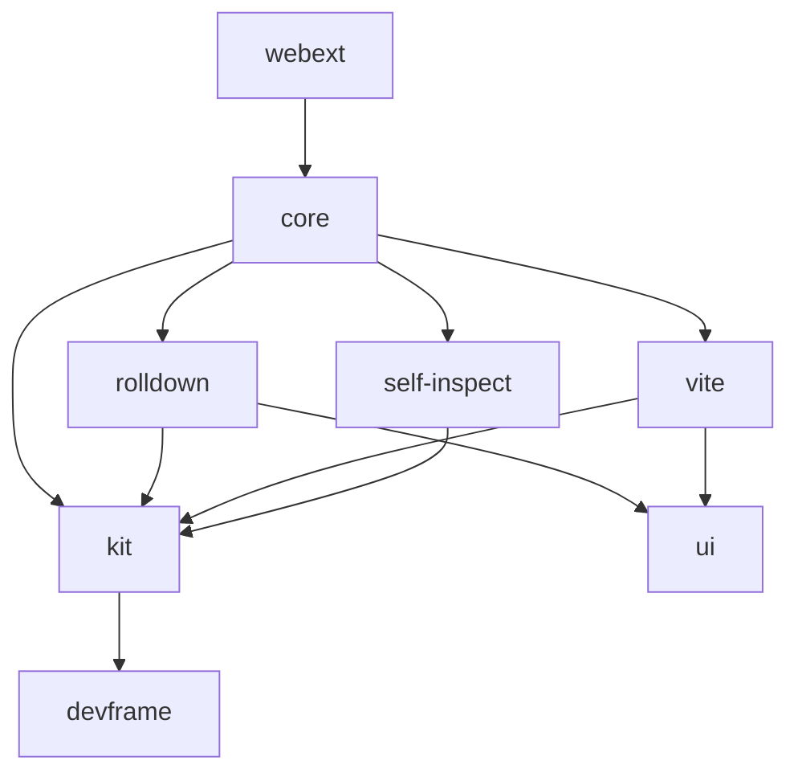

# AGENTS GUIDE

## Positioning

Two layers, one mental model:

- **`devframe`** — *the container for one devtool integration, portable across viewers.* External project; lives at [`github.com/devframes/devframe`](https://github.com/devframes/devframe), docs at [`devfra.me`](https://devfra.me). Consumed here as an npm dependency (`catalog:deps`). A checked-in submodule at `devframe/` mirrors the source at the pinned tag for browsing and upstream contributions.
- **`@vitejs/devtools-kit`** — *the hub that unites many devtools integrations.* Owns docking, the command palette, toasts, terminal sessions — anything that only makes sense when more than one tool shares a UI. Provides `createPluginFromDevframe(devframeApp)` so a portable devframe definition drops into Vite DevTools as a Vite plugin, with the dock entry auto-derived from the definition's metadata.

When deciding where something belongs: if a single-app standalone CLI would still need it, it belongs upstream in devframe; if it only matters once you have multiple integrations or a host UI, it lives in the kit.

## Stack & Structure

Monorepo (`pnpm` workspaces + `turbo`). ESM TypeScript; bundled with `tsdown`. Path aliases in `alias.ts` (propagated to `tsconfig.base.json` — do not edit manually).

### Packages

| Package | npm | Description |
|---------|-----|-------------|
| `packages/kit` | `@vitejs/devtools-kit` | The hub. `createKitContext` wraps devframe's context with `docks` / `terminals` / `messages` / `commands` host subsystems plus the Vite-augmented context type. `createPluginFromDevframe` bridges a portable devframe app into a `Plugin.devtools.setup` Vite plugin, auto-deriving its iframe dock entry from the definition. |
| `packages/core` | `@vitejs/devtools` | Vite plugin + CLI + standalone/webcomponents client for Vite DevTools itself. Calls kit's `createKitContext`, scans Vite plugins for `.devtools.setup`, and serves the dock UI. |
| `packages/ui` | `@vitejs/devtools-ui` | Shared UI components, composables, and UnoCSS preset (`presetDevToolsUI`). Private, not published. |
| `packages/rolldown` | `@vitejs/devtools-rolldown` | Nuxt UI for Rolldown build data. Hub-mounted via `Plugin.devtools.setup`. Serves at `/__devtools-rolldown/`. |
| `packages/vite` | `@vitejs/devtools-vite` | Nuxt UI for Vite DevTools (WIP). Hub-mounted via `Plugin.devtools.setup`. Serves at `/__devtools-vite/`. |
| `packages/self-inspect` | `@vitejs/devtools-self-inspect` | Meta-introspection — DevTools for the DevTools. Hub-mounted via `Plugin.devtools.setup`. Serves at `/__devtools-self-inspect/`. |
| `packages/webext` | — | Browser extension scaffolding (ancillary). |

Other top-level directories:
- `docs/` — VitePress docs; guides in `docs/guide/`
- `skills/` — Agent skill files generated from docs via [Agent Skills](https://agentskills.io/home). Structured references (RPC patterns, dock types, shared state, project structure) for AI agent context.
- `devframe/` — Git submodule pinned to the `devframe` version in `catalogs.deps`. Run `pnpm sync` to align with the catalog; `pnpm sync <version>` or `pnpm sync --latest` to bump.
- `scripts/sync.ts` — Submodule pin manager (see `pnpm sync --help`).

## Dep Boundary

`devframe` is an external package consumed via `catalog:deps` — contribute upstream at [github.com/devframes/devframe](https://github.com/devframes/devframe). `packages/kit` and above build on top of it. Features that require multi-integration awareness (docks, terminals, messages, commands) belong in kit.

`devframe/node/internal` is a marked-internal subpath exposing a small set of helpers (`getInternalContext`, `resolveBasePath`) for first-party adapters reaching into devframe's private machinery — kit's `DocksHost` uses it for remote-dock token allocation. End users should not import it.

## Architecture

- **Devframe context** (external — see [devfra.me](https://devfra.me)): `createHostContext` returns a `DevToolsNodeContext` carrying `rpc`, `views` (HTTP file-serving via `hostStatic`), `diagnostics`, `agent`, plus `cwd`/`workspaceRoot`/`mode`/`host`. No docks, no terminals, no json-render.
- **Kit context** (`packages/kit/src/node/context.ts`): `createKitContext` wraps `createHostContext` and attaches the four hub hosts — `docks`, `terminals`, `messages`, `commands` — plus the `createJsonRenderer` factory. Optionally surfaces `viteConfig`/`viteServer` when mounted inside Vite DevTools. Wires the `'devframe:docks'` / `'devframe:commands'` shared-state sync.
- **Bridge** (`packages/kit/src/node/create-plugin-from-devframe.ts`): `createPluginFromDevframe(d, opts?)` returns `PluginWithDevTools`; in its `setup`, mounts the SPA via `views.hostStatic`, auto-registers an iframe dock entry from `id`/`name`/`icon`/`basePath`, runs `d.setup(ctx)` for the devframe-level wiring, then runs `opts.setup?.(ctx)` for kit-only extensions.

<!-- Content truncated to meet Windsurf 6KB limit -->

---
> Source: [vitejs/devtools](https://github.com/vitejs/devtools) — distributed by [TomeVault](https://tomevault.io).
<!-- tomevault:4.0:windsurf_rules:2026-05-17 -->
