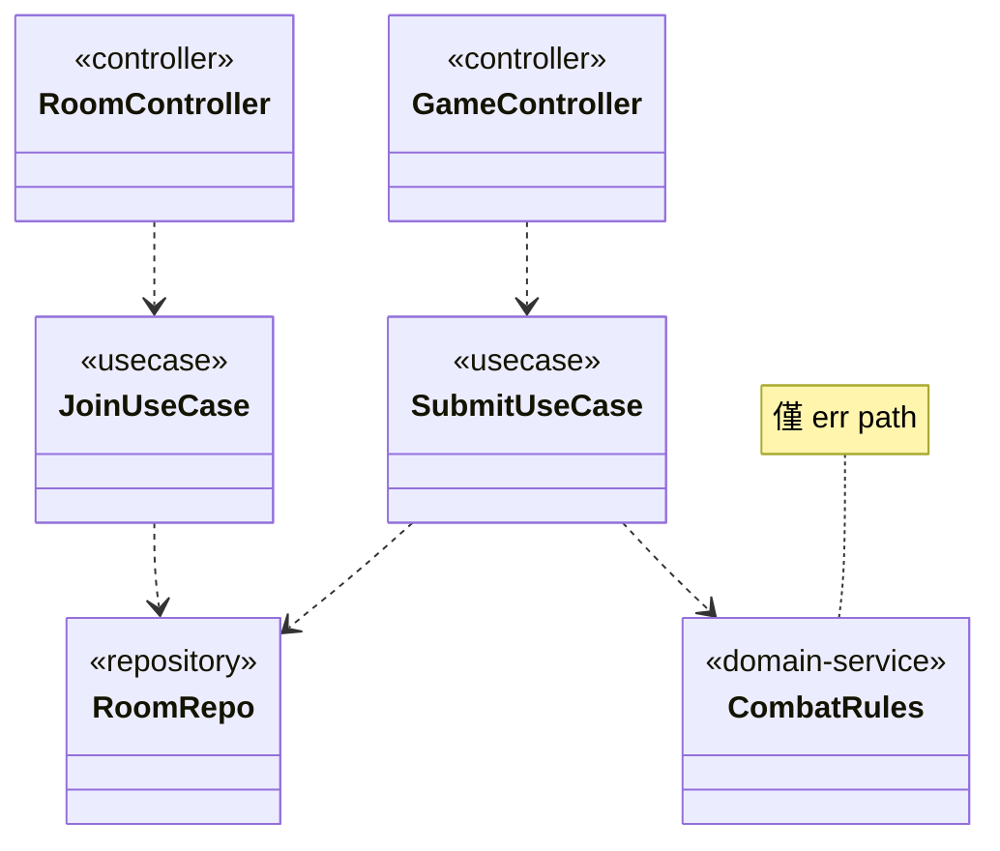

# aibdd-form-class-diagram

Formulation skill。把呼叫方已聯集好的協作者與關係翻成 `.class.mmd`，再用 `scripts/evaluate.py` 驗語法。

## §1 範例 — 產出檔長相

支援的行類別：

- 類別宣告：`class <名稱> { <<<分類>>> }`，分類可用 `controller`、`usecase`、`repository`、`domain-service`、`gateway`
- 關係：`<起點> <連線符號> <終點>`，連線符號對應 — 使用 `..>`、依賴 `-->`、繼承 `--|>`、實作 `..|>`
- 註記：`note for <類別名稱> "<說明>"`

不畫成員、方法、cssClass、style、namespace、泛型、多重度等其他 dialect。

## §2 SOP

### Phase 1 — 收件
1. 載入呼叫方傳入的內容。
2. 確認輸出路徑以 `.class.mmd` 結尾。
3. 不符 → 回傳「payload incomplete」並終止。

### Phase 2 — 渲染
依 §1 模板逐類別、關係、註記渲染。

### Phase 3 — 寫檔
1. 若輸出路徑已存在且呼叫方未指定覆寫 → 回傳「path conflict」。
2. 否則寫入該路徑。

### Phase 4 — 驗證
1. 對寫出的檔執行 `python3 scripts/evaluate.py <剛寫的檔>`。
2. 解析 stdout JSON。
3. 結果非通過 → 將驗證報告原樣回傳並終止。

### Phase 5 — 回報
回傳「狀態、輸出路徑、驗證報告」三項給呼叫方。

---
> Source: [Waterball-Software-Academy/aixbdd](https://github.com/Waterball-Software-Academy/aixbdd) — distributed by [TomeVault](https://tomevault.io).
<!-- tomevault:4.0:skill_md:2026-07-20 -->
