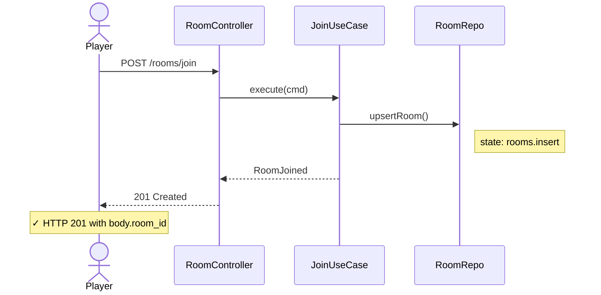

# aibdd-form-sequence-diagram

Formulation skill。把呼叫方傳來的推理包翻成 `.sequence.mmd`，再用 `scripts/evaluate.py` 驗語法。

## §1 範例 — 產出檔長相

支援的行類別（出現在上方範例中）：

- 觸發者：`actor <名稱>`
- 內部協作者：`participant <名稱>`
- 訊息：`<發送方> <箭頭> <接收方>: <說明>`，箭頭可用 `->`、`->>`、`-->`、`-->>`
- 狀態變更標註：`Note right of <擁有者>: state: <資料表>.<操作>`
- 驗收標註：`Note over <觸發者>: ✓ <驗收條件>`

僅支援上列五種行；不畫 `loop` / `alt` / `opt` / `activate` 等控制流區塊。

## §2 SOP

### Phase 1 — 收件
1. 載入呼叫方傳入的內容。
2. 確認輸出路徑以 `.sequence.mmd` 結尾。
3. 不符 → 回傳「payload incomplete」並終止。

### Phase 2 — 渲染
依 §1 五種行模板，把推理包逐項翻成 Mermaid 文字。

### Phase 3 — 寫檔
1. 若輸出路徑已存在且呼叫方未指定覆寫 → 回傳「path conflict」。
2. 否則寫入該路徑。

### Phase 4 — 驗證
1. 對寫出的檔執行 `python3 scripts/evaluate.py <剛寫的檔>`。
2. 解析 stdout JSON。
3. 結果非通過 → 將驗證報告原樣回傳（含行號與訊息）並終止。

### Phase 5 — 回報
回傳「狀態、輸出路徑、驗證報告」三項給呼叫方。

---
> Source: [Waterball-Software-Academy/aixbdd](https://github.com/Waterball-Software-Academy/aixbdd) — distributed by [TomeVault](https://tomevault.io).
<!-- tomevault:4.0:skill_md:2026-07-20 -->
