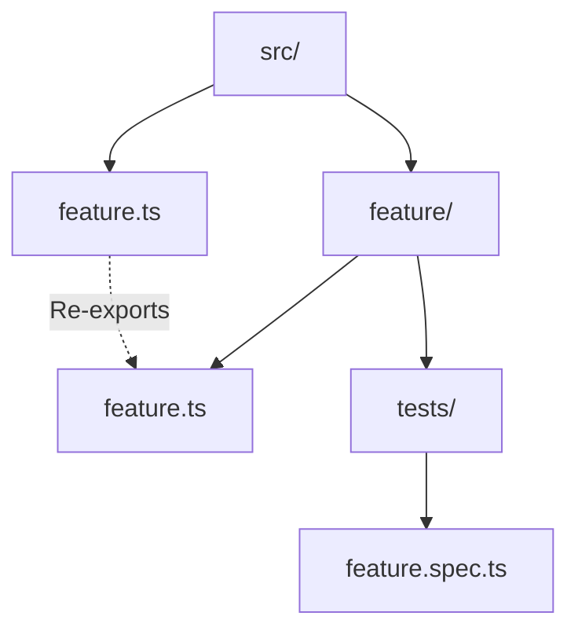

<!-- PLAITED-RULES-START -->

## Rules

# Bun APIs

**Prefer Bun over Node.js** when running in Bun environment.

**File system:**
- `Bun.file(path).exists()` not `fs.existsSync()`
- `Bun.file(path).text()` not `readFileSync()`
- `Bun.write(path, data)` not `writeFileSync()`
*Verify:* `grep 'from .node:fs' src/`  
*Fix:* Replace with Bun.file/Bun.write

**Shell commands:**
- `Bun.$\`cmd\`` not `child_process.spawn()`
*Verify:* `grep 'child_process' src/`  
*Fix:* Replace with Bun.$ template literal

**Path resolution:**
- `Bun.resolveSync()` for module resolution
- `import.meta.dir` for current directory
- Keep `node:path` for join/resolve/dirname
*Verify:* Check for `process.cwd()` misuse

**Executables:**
- `Bun.which(cmd)` to check if command exists
- `Bun.$\`bun add pkg\`` for package management

**When Node.js OK:** readline (interactive input), node:path utilities, APIs without Bun equivalents

**Docs:** https://bun.sh/docs


# Workflow

## Git Commits

**Conventional commits** - `feat:`, `fix:`, `refactor:`, `docs:`, `chore:`, `test:`  
**Multi-line messages** - Use for detailed context  
**Never --no-verify** - Fix the issue, don't bypass hooks  
*Verify:* Check git log format

## GitHub CLI

**Use `gh` over WebFetch** - Better data access, auth, private repos

**PR evaluation** - Fetch ALL sources:
```bash
# 1. Comments/reviews
gh pr view <n> --repo <owner>/<repo> --json title,body,comments,reviews,state

# 2. Security alerts
gh api repos/<owner>/<repo>/code-scanning/alerts

# 3. Inline comments
gh api repos/<owner>/<repo>/pulls/<n>/comments
```

**PR checklist:**
- [ ] Human reviewer comments
- [ ] AI code review comments  
- [ ] Security alerts (ReDoS, injection)
- [ ] Code quality comments
- [ ] Inline suggestions

**URL patterns:**
| URL | Command |
|-----|---------|
| `github.com/.../pull/<n>` | `gh pr view <n> --repo ...` |
| `github.com/.../issues/<n>` | `gh issue view <n> --repo ...` |
| `.../security/code-scanning/<id>` | `gh api .../code-scanning/alerts/<id>` |

**Review states:** `APPROVED`, `CHANGES_REQUESTED`, `COMMENTED`, `PENDING`


# Module Organization

**No index.ts** - Never use index files, they create implicit magic  
*Exception:* Plugin entry points under `plugins/` where the SDK requires `index.ts` as the entry file  
*Verify:* `find . -name 'index.ts' -not -path 'plugins/*/index.ts'`  
*Fix:* Rename to feature name: `feature/index.ts` → `feature.ts` at parent level

**Explicit .ts extensions** - `import { x } from './file.ts'` not `'./file'`  
*Verify:* `grep "from '\./.*[^s]'" src/` (imports without .ts)  
*Fix:* Add `.ts` extension

**Re-export at boundaries** - Parent `feature.ts` re-exports from `feature/feature.ts`



**File organization within modules:**
- `feature.types.ts` - Type definitions only
- `feature.schemas.ts` - Zod schemas + `z.infer<>` types
- `feature.constants.ts` - Constants, error codes
- `feature.ts` - Main implementation

**Direct imports** - Import from specific files, not through re-exports within module  
*Verify:* Check for circular imports  
*Fix:* Import directly: `from './feature.types.ts'` not `from './feature.ts'`


# Testing

**Use test not it** - `test('description', ...)` instead of `it('...')`  
*Verify:* `grep '\bit(' src/**/*.spec.ts`  
*Fix:* Replace `it(` with `test(`

**No conditional assertions** - Never `if (x) expect(x.value)`  
*Verify:* `grep 'if.*expect\|&&.*expect' src/**/*.spec.ts`  
*Fix:* Assert condition first: `expect(x).toBeDefined(); expect(x.value)...`

**Test both branches** - Try/catch, conditionals, fallbacks need both paths tested  
*Verify:* Review test coverage for error paths  
*Fix:* Add test for catch block, else branch, fallback case

**Use real dependencies** - Prefer installed packages over mocks when testing module resolution  
*Verify:* Review test imports for fake paths  
*Fix:* Use actual package like `typescript`

**Organize with describe** - Group related tests in `describe('feature', () => {...})`  
*Verify:* Check for flat test structure  
*Fix:* Add describe blocks by category (happy path, edge cases, errors)

**Coverage checklist** - Happy path, edge cases, error paths, real integrations  
*Verify:* Review test file completeness

**Docker tests** - `*.docker.ts` for external APIs, run via docker-compose  
*Verify:* Check if test needs API key or external service  
*Fix:* Rename to `.docker.ts`, update CI gating

**Run:** `bun test` before commit


# Accuracy

**95% confidence threshold** - Report uncertainty rather than guess

**Verification first** - Read files before stating implementation details
*Verify:* Did you read the file before commenting on it?

**When uncertain:**
- State the discrepancy clearly
- Explain why you can't confidently recommend a fix
- Present issue to user for resolution
- Never invent solutions

**TypeScript verification** - Use LSP tools for type-aware analysis:
- `lsp-find` - Search symbols across workspace
- `lsp-refs` - Find all usages before modifying
- `lsp-hover` - Verify type signatures
- `lsp-analyze` - Batch analysis of file structure

**Dynamic exploration:**
- Read tool for direct file verification

<!-- Content truncated to meet Windsurf 6KB limit -->

---
> Source: [youdotcom-oss/agent-skills](https://github.com/youdotcom-oss/agent-skills) — distributed by [TomeVault](https://tomevault.io).
<!-- tomevault:4.0:windsurf_rules:2026-05-02 -->
