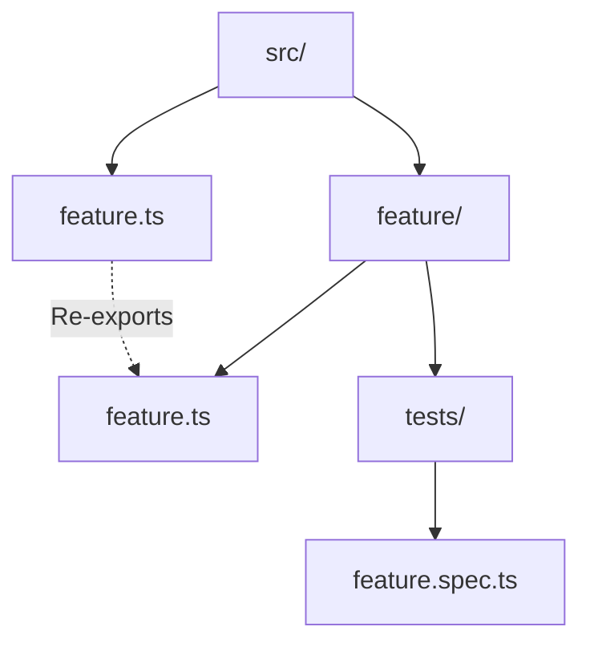

## dx-toolkit

> Development guidelines for You.com DX Toolkit using Bun workspaces.


# You.com DX Toolkit Development Guide

Open-source toolkit enabling developers to integrate You.com's AI capabilities into their workflows. Built as a Bun workspace containing packages for MCP servers, AI SDK plugins, and Teams.ai integrations.

> **For a user-focused quick start**, see the [root README.md](./README.md). This guide (AGENTS.md) is for internal maintainers and contributors who need comprehensive development details.

## Rules and Skills Organization

This monorepo uses both rules (`.agents/rules/`) and skills (`.claude/skills/`) for efficient knowledge organization:

**Rules** (`.agents/rules/`) - Universal patterns:
| File | Coverage |
|------|----------|
| core.md | Type conventions, arrow functions, object params, private fields |
| bun.md | Bun APIs (file system, shell, path resolution) |
| testing.md | Test patterns, assertions, coverage |
| modules.md | Module organization, import patterns, file structure |
| workflow.md | Git workflow, branching, commits, GitHub CLI |
| accuracy.md | Verification standards, uncertainty handling, LSP usage |
| documentation.md | TSDoc standards, template, public API docs |

**Skills** (`.claude/skills/`) - Package-specific patterns:
| Skill | Coverage |
|-------|----------|
| api-patterns | CLI tool, shared utilities, Zod schemas, foundation for MCP/AI SDK packages |
| create-package | Package scaffolding workflow (interactive Q&A, templates, validation) |
| documentation | README/AGENTS.md standards, TSDoc strategy, thin philosophy |
| mcp-patterns | Zod schemas, error handling, logging, response format |
| ai-sdk-patterns | Input schemas, API key handling, response format |
| teams-ai-patterns | Memory API, Anthropic SDK, MCP client setup |

**Benefits**:
- **Reduced overhead**: Rules use plain markdown without frontmatter metadata
- **Clear organization**: Rules for universal patterns, skills for package-specific patterns
- **Token efficiency**: Simpler structure, easier discovery
- **Single source of truth**: Update patterns once, referenced everywhere
- **Maintainability**: Consistent pattern across the monorepo

Throughout this guide, you'll see references like:
> **For universal code patterns**, see `.agents/rules/core.md`

These indicate that detailed information is available in the referenced rule file. Note that `.claude/rules/` is a symlink to `.agents/rules/` for compatibility with Claude Code.

---

## Monorepo Structure

```mermaid
graph TD
    Root[dx-toolkit/]
    
    Root --> Agents[.agents/]
    Root --> Claude[.claude/]
    Root --> Packages[packages/]
    Root --> GitHub[.github/]
    Root --> Scripts[scripts/]
    Root --> Docs[docs/]
    Root --> Config[package.json, bun.lock, AGENTS.md]

    Agents --> AgentsRules[rules/ - Universal patterns]
    Agents --> AgentsSkills[skills/ - Development skills]

    Claude --> ClaudeRules[rules → ../.agents/rules]
    Claude --> ClaudeSkills[skills/]
    ClaudeSkills --> DocSkill[documentation/]
    ClaudeSkills --> McpSkill[mcp-patterns/]
    ClaudeSkills --> AiSkill[ai-sdk-patterns/]
    ClaudeSkills --> TeamsSkill[teams-anthropic-patterns/]
    
    Packages --> Mcp[mcp/ - MCP Server]
    Packages --> Api[api/ - API Client]
    Packages --> AiSdk[ai-sdk-plugin/]
    Packages --> TeamsAnthropic[teams-anthropic/]
    
    Mcp --> McpSrc[src/, bin/, docs/, tests/]
    Mcp --> McpDocs[README.md, package.json]
    
    GitHub --> Workflows[workflows/]
    Workflows --> PubPkg[_publish-package.yml]
    Workflows --> CI[ci.yml]
    Workflows --> Review[code-review.yml]
    Workflows --> PubMcp[publish-mcp.yml]
    
    Scripts --> PerfMon[Performance monitoring]
    Docs --> PerfDoc[PERFORMANCE.md]
    
    style Root fill:#e1f5ff
    style Agents fill:#fff3cd
    style Claude fill:#fff3cd
    style Packages fill:#d4edda
    style GitHub fill:#f8d7da
```



**Key directories:**
- `.agents/rules/` - Universal patterns (code, git, testing, workflows)
- `.claude/skills/` - Package-specific patterns (documentation, mcp-patterns, ai-sdk-patterns, teams-anthropic-patterns)
- `packages/` - NPM packages (mcp, api, ai-sdk-plugin, teams-anthropic)
- `.github/workflows/` - CI/CD workflows (_publish-package.yml, ci.yml, code-review.yml)
- `scripts/` - Performance monitoring and CI scripts

### Package Naming Convention

All packages must follow this naming rule:

**Rule**: Package directory name MUST match the npm package name after `@youdotcom-oss/`

**Examples**:
- NPM: `@youdotcom-oss/mcp` → Directory: `packages/mcp` ✅
- NPM: `@youdotcom-oss/ai-sdk-plugin` → Directory: `packages/ai-sdk-plugin` ✅
- NPM: `@youdotcom-oss/eval` → Directory: `packages/eval` ✅

**Validation**: The publish workflow automatically derives the package directory from the npm package name. Mismatches will cause deployment failures.

**Current packages**:
- `@youdotcom-oss/mcp` in `packages/mcp/`

## Agent Skills

### Cross-Platform Integration Skills

**Cross-platform integration skills have moved to [youdotcom-oss/agent-skills](https://github.com/youdotcom-oss/agent-skills).**

The agent-skills repository provides guided workflows for integrating You.com packages with popular AI frameworks:

- **ai-sdk-integration** - Vercel AI SDK integration with You.com tools
- **claude-agent-sdk-integration** - Claude Agent SDK with You.com MCP server
- **openai-agent-sdk-integration** - OpenAI Agents SDK with You.com MCP server
- **teams-anthropic-integration** - Microsoft Teams.ai with Anthropic Claude models

**Installation:**
```bash
npx skills add youdotcom-oss/agent-skills
```

**Repository**: https://github.com/youdotcom-oss/agent-skills

### Project-Specific Development Skills

Package-specific development patterns and workflows are in `.claude/skills/`:

**Current skills**:
- **documentation** - Documentation standards (thin AGENTS.md philosophy, TSDoc strategy, README.md tone)
- **mcp-patterns** - MCP server patterns (Zod schemas, error handling, logging, response format)
- **ai-sdk-patterns** - Vercel AI SDK patterns (input schemas, API key handling, response format)
- **teams-anthropic-patterns** - Teams.ai patterns (Memory API, Anthropic SDK, MCP client setup)

**Purpose**:
- **Audience**: Developers contributing to dx-toolkit packages
- **Content**: Package-specific development patterns, framework-specific rules
- **Distribution**: Part of this repository, referenced throughout AGENTS.md
- **Usage**: AI coding assistants automatically load these when contributing to dx-toolkit

**Benefits**:
- ✅ Reduced overhead - Rules use plain markdown without frontmatter metadata
- ✅ Clear organization - Rules for universal patterns, skills for package-specific patterns
- ✅ Token efficiency - Simpler structure, easier discovery
- ✅ Single source of truth - Update patterns once, referenced everywhere
- ✅ Maintainability - Consistent pattern across the monorepo

## Tech Stack

- **Runtime**: Bun >= 1.2.21 (not Node.js)
- **Workspace Manager**: Bun workspaces
- **Code Quality**: Biome 2.3.8 (linter + formatter)
- **Type Checking**: TypeScript 5.9.3
- **Git Hooks**: lint-staged 16.2.7
- **Version Control**: Git
- **GitHub CLI**: `gh` for PR/issue management (recommended)

## Quick Start

### Setup Environment

```bash
# Clone repository
git clone git@github.com:youdotcom-oss/dx-toolkit.git
cd dx-toolkit

# Install dependencies (installs for all packages)
bun install

# Set up API key
cp .env.example .env
# Edit .env and add your YDC_API_KEY
source .env

# Build all packages
bun run build

# Run tests
bun test
```

**Troubleshooting API key errors:**
If you get API key errors when running tests:
1. Verify `.env` file exists with `YDC_API_KEY=your-key`
2. Run `source .env` to load environment variables into your shell
3. Try running tests again: `bun test`

**GitHub CLI**: Install `gh` CLI for working with PRs and issues:
- macOS: `brew install gh`
- Linux: [Installation guide](https://github.com/cli/cli/blob/trunk/docs/install_linux.md)
- Windows: [Installation guide](https://github.com/cli/cli#windows)
- Authenticate: `gh auth login`

### Monorepo Commands

```bash
# Build all packages
bun run build

# Test all packages
bun test

# Run all quality checks (biome + types + package format)
bun run check

# Auto-fix all issues across all packages
bun run check:write

# MCP server specific commands
bun run dev:mcp            # Start MCP server in STDIO mode
bun run start:mcp          # Start MCP server in HTTP mode
```

### Package-Specific Commands

**Always run from the repo root** using `bun --cwd` — never `cd` into a package directory to run commands.

```bash
# Root shortcuts (defined in root package.json)
bun run dev:mcp          # Start MCP server in STDIO mode
bun run start:mcp        # Start MCP server in HTTP mode
bun run test:mcp         # Test MCP server only

# Per-package commands via bun --cwd (preferred)
bun --cwd packages/mcp dev
bun --cwd packages/mcp start
bun --cwd packages/mcp test
bun --cwd packages/mcp check
bun --cwd packages/api test
bun --cwd packages/ai-sdk-plugin build
bun --cwd packages/teams-anthropic test
bun --cwd packages/teams-anthropic check
```

*Verify:* Never use `cd packages/<name>` before running commands
*Fix:* Replace `cd packages/foo && bun test` with `bun --cwd packages/foo test`

## Code Style

This monorepo uses [Biome](https://biomejs.dev/) for automated code formatting and linting across all packages.

### Monorepo-Specific Patterns

**Import Paths**: Use relative paths within packages, not workspace aliases

```ts
// ✅ Correct - relative path
import { foo } from '../utils.js';

// ❌ Avoid - workspace aliases not configured
import { foo } from '@youdotcom-oss/utils';
```

**Package References**: Use exact versions for published packages

```json
{
  "dependencies": {
    "@youdotcom-oss/mcp": "1.3.4"
  }
}
```

**IMPORTANT**: Do NOT use `workspace:*` for inter-package dependencies. These packages are published to npm and must use exact version numbers (no `^` or `~` prefixes). The publish workflow automatically updates dependent packages when a new version is released.

**Version Update Automation**: When you add a cross-package dependency:
1. Manually add it with the current version (e.g., `"@youdotcom-oss/mcp": "1.3.4"`)
2. The publish workflow will automatically update this version when the dependency is published
3. You do NOT need to manually update version numbers after the initial dependency is added
4. The workflow scans all workspace packages and updates any dependencies on the published package

**Dependency Structure**:

This monorepo uses two patterns for package dependencies based on publishing strategy:

**Pattern 1: Source-Published Packages** (e.g., `@youdotcom-oss/mcp`)

Packages that publish TypeScript source files directly. All dependencies in `dependencies`:

```json
{
  "main": "./src/main.ts",
  "exports": {
    ".": "./src/main.ts"
  },
  "files": ["./src/**", "!./src/**/tests/*"],
  "dependencies": {
    "zod": "^4.1.13",
    "@hono/mcp": "^0.2.0",
    "@modelcontextprotocol/sdk": "^1.24.3",
    "hono": "^4.10.7"
  }
}
```

**Why all in dependencies?**
- Library consumers need access to all type definitions
- Users importing from the package require the full dependency tree
- Pre-built binaries (if any) are compiled separately with dependencies bundled

**Pattern 2: Bundled Packages** (e.g., `@youdotcom-oss/ai-sdk-plugin`)

Packages that publish compiled bundles. Dependencies are bundled, externals in `dependencies` or `peerDependencies`:

```json
{
  "main": "./dist/main.js",
  "types": "./dist/main.d.ts",
  "exports": {
    ".": {
      "types": "./dist/main.d.ts",
      "default": "./dist/main.js"
    }
  },
  "files": ["dist"],
  "scripts": {
    "build": "bun run build:bundle && bun run build:types",
    "build:bundle": "bun build src/main.ts --outdir dist --target node --external ai",
    "build:types": "tsc --declaration --emitDeclarationOnly --noEmit false --outDir ./dist",
    "prepublishOnly": "bun run build"
  },
  "dependencies": {
    "@youdotcom-oss/mcp": "1.3.8"
  },
  "peerDependencies": {
    "ai": "^5.0.0"
  }
}
```

**Why bundle?**
- Single file distribution (easier consumption)
- Reduced installation time (fewer dependencies to fetch)
- External dependencies (`--external`) avoid duplication in user's node_modules
- Peer dependencies ensure compatibility with user's AI framework version

**When to use each pattern:**
- **Source-published**: MCP servers, CLI tools, packages with optional compiled binaries
- **Bundled**: SDK plugins, framework integrations, libraries with external peer dependencies

**Cross-package dependencies**: Always use exact versions for workspace packages

```json
{
  "dependencies": {
    "@youdotcom-oss/mcp": "1.3.8"
  }
}
```

Packages depending on other workspace packages should use the **bundled pattern** to avoid dependency conflicts.

**Lock Files**: Only root `bun.lock` is committed

- Root `.gitignore` allows root `bun.lock`
- Workspace manages all dependencies via root lock file

## Code Patterns

> **For universal code patterns**, see `.agents/rules/` (especially `core.md`, `bun.md`, `testing.md`, `modules.md`)

## Git Workflow

### Working with GitHub Issues and PRs

When given GitHub URLs for issues, PRs, or PR comments from this repository (`youdotcom-oss/dx-toolkit`), use the `gh` CLI to fetch information:

```bash
# View PR details
gh pr view 33

# View PR diff
gh pr diff 33

# Get PR comments (including review comments)
gh api /repos/youdotcom-oss/dx-toolkit/pulls/33/comments

# View issue details
gh issue view 123

# Comment on PR
gh pr comment 33 --body "Your comment here"
```

**Important**: The `GH_REPO` environment variable (set in `.env`) ensures `gh` commands target this repository by default, avoiding the need to specify `--repo` on every command.

### Branching Strategy

- `main` - Production branch
- `feature/*` - Feature branches
- `fix/*` - Bug fix branches

### Syncing Branches

When syncing your local branch with remote changes, use fast-forward merge:

```bash
# Sync with remote changes (fast-forward merge)
git pull --ff origin <branch-name>

# Example
git pull --ff origin fix/workflows
```

**Do NOT use `git pull --rebase`** - Use fast-forward merge (`--ff`) for cleaner history.

### Git Hooks

Git hooks are automatically configured after `bun install`:

- **Pre-commit**: Runs Biome check and format-package on staged files
- **Setup**: `bun run prepare` (runs automatically with install)
- Git hooks enforce code quality standards across all packages

### Commit Messages

Use [Conventional Commits](https://www.conventionalcommits.org/) format:

```bash
feat(mcp): add new search filter
fix(mcp): resolve timeout issue
docs: update monorepo setup guide
chore: update dependencies
```

**Scope Guidelines**:
- Use package name for package-specific changes: `(mcp)`, `(ai-sdk-plugin)`
- Omit scope for workspace-level changes: `chore: update root config`

### Version Format Convention

This monorepo follows standard Git tagging conventions with "v" prefix for releases:

- **Git tags**: `v{version}` (e.g., `v1.3.4`, `v1.4.0-next.1`)
- **GitHub releases**: `v{version}` (e.g., `Release v1.3.4`)
- **package.json**: `{version}` (no "v" prefix, e.g., `1.3.4`)
- **npm package**: `{version}` (no "v" prefix, e.g., `1.3.4`)

**When triggering the publish workflow:**
- Select a bump type (`patch`, `minor`, or `major`) from the dropdown
- The workflow reads the current version from `package.json` and computes the next version
- Optionally provide a prerelease number (e.g., `1` creates `x.y.z-next.1`)
- Non-main branches automatically produce prerelease versions

**Example:**
```bash
# Current package.json version: 1.3.4
# Workflow input: bump=minor

# Results in:
# - Git tag: mcp@v1.4.0
# - package.json: "version": "1.4.0"
# - npm package: @youdotcom-oss/mcp@1.4.0
```

This convention follows industry standards used by Node.js and most major projects.

## Monorepo Architecture

### Workflow Files

**`.github/workflows/publish-mcp.yml`** (MCP npm publish):
- Triggered: Manual via `workflow_dispatch`
- Publishes `@youdotcom-oss/mcp` STDIO bridge to npm
- Rarely needed — the bridge is frozen; server changes happen in `youdotcom-mcp-server`
- Uses `_publish-package.yml` reusable workflow
- Required Secret: `PUBLISH_TOKEN` (for git operations on protected branches)

**`.github/workflows/publish-registry.yml`** (Anthropic MCP Registry):
- Triggered: Manual via `workflow_dispatch` (no inputs required)
- Decoupled from npm publish — run when the server's public surface changes (tools, auth, URL)
- Auto-increments `server.json` version via patch bump
- Installs `mcp-publisher`, authenticates via GitHub OIDC, publishes to registry
- Commits updated `server.json` back to main
- Required Secret: `PUBLISH_TOKEN` (for pushing to protected main branch)

**`.github/workflows/_publish-package.yml`** (Reusable workflow for all packages):
- Reusable workflow for publishing packages to npm
- Called by package-specific publish workflows (e.g., `publish-mcp.yml`)
- Handles version updates, npm publishing, and GitHub releases
- Uses NPM Trusted Publishing (OIDC) for authentication
- Requires `PUBLISH_TOKEN` secret for git operations on protected branches

**`.github/workflows/ci.yml`**:
- Runs lint and test checks to validate all packages
- Triggers on pull requests and pushes to main

**`.github/workflows/code-review.yml`**:
- Automated code review for internal contributors
- Provides AI-powered code analysis and suggestions

**`.github/workflows/external-code-review.yml`**:
- Manually triggered agentic review for external contributors
- Same analysis as internal review with additional security checks

## Development Workflow

### Adding a New Package

**IMPORTANT**: For complete package creation instructions, see [`.claude/commands/create-package.md`](./.claude/commands/create-package.md).

The create-package command provides:
- Interactive question flow for package configuration
- Validation of package names and npm availability
- Automated file creation (package.json, tsconfig.json, biome.json, source files, documentation)
- Automatic workflow generation for publishing
- Rollback on errors

**Quick usage:**

**For Claude Code users:**
```bash
/create-package
```

**For other AI coding agents:**
Read and follow the instructions in `.claude/commands/create-package.md`

**After package creation**, the command will:
1. Generate complete package structure with all required files
2. Create publish workflow at `.github/workflows/publish-{package}.yml`
3. Run `bun install` to register the package in the workspace
4. Display next steps with references to this file

### Post-Creation Workflow

> **For complete post-creation workflow**, see `.agents/rules/workflow.md`

### Working on Packages

Edit files in `packages/<name>/src/` using the Read/Edit/Write tools, then run commands from the repo root:

```bash
# Always run from repo root — never cd into a package
bun --cwd packages/mcp test
bun --cwd packages/mcp check

# Or run across all packages at once
bun test
bun run check
```

### Code Quality Commands

```bash
# Workspace-level (from repo root)
bun run check                              # All checks (biome + types + package)
bun run check:write                        # Auto-fix all issues
bun run build                              # Build all packages
bun test                                   # Test all packages

# Package-level (from repo root via --cwd)
bun --cwd packages/mcp check
bun --cwd packages/mcp check:write
bun --cwd packages/mcp build
bun --cwd packages/mcp test
```

## Package-Specific Documentation

### api

Core You.com API client with bundled CLI for bash-based AI agents.

**Purpose**: Provides lightweight API client and CLI tools for web search, AI answers, and content extraction. Optimized for bash-based AI agents with livecrawl, instant content extraction, and citation-backed answers.

**Usage**:
- Programmatic: `import { fetchSearchResults } from '@youdotcom-oss/api'`
- CLI: `bunx @youdotcom-oss/api search "query" --client ClaudeCode`

**Key Features**:
- Livecrawl: Search AND extract content in one API call
- JSON/text output for bash pipelines (jq, grep, awk)
- Client tracking via --client flag or YDC_CLIENT env
- Exit codes for error handling (0=success, 1=API error, 2=invalid args)

**For bash agent integration**: See [youdotcom-cli skill](https://github.com/youdotcom-oss/agent-skills/tree/main/skills/youdotcom-cli)

**Development patterns**: No dedicated patterns file - simple API package following core.md rules

---

See `.claude/skills/` for other package-specific development patterns:
- **mcp-patterns** - MCP server (Zod schemas, error handling, logging, response format, testing)
- **teams-ai-patterns** - Teams.ai integration (Memory API, function calling, streaming, message transformation)
- **documentation** - README/AGENTS.md standards (tone, structure, TSDoc strategy, validation)

## Performance Testing & Monitoring

> **For performance testing details**, see [docs/PERFORMANCE.md](./docs/PERFORMANCE.md)

## Troubleshooting

### Workspace Issues

**Symptom**: `bun install` fails or packages not found

**Solution**:
```bash
# Clear node_modules and reinstall
rm -rf node_modules packages/*/node_modules
bun install

# Verify workspace configuration
cat package.json | grep -A 3 "workspaces"
```

**Symptom**: TypeScript can't find package imports

**Solution**:
```bash
# Use relative paths, not workspace aliases
# ✅ import { foo } from '../utils.js'
# ❌ import { foo } from '@youdotcom-oss/utils'
```

### Build Issues

**Symptom**: Build fails in CI but works locally

**Solution**:
```bash
# Ensure you're building from correct directory
cd packages/mcp
bun run build

# Verify build output
ls -la bin/
```

## Contributing

### For Internal Contributors

1. Create feature branch: `git checkout -b feature/my-feature`
2. Make changes in appropriate package: `cd packages/mcp`
3. Test changes: `bun test` and `bun run check`
4. Commit with conventional commits: `git commit -m "feat(mcp): ..."`
5. Push and create PR to `main`
6. Wait for code review and CI checks to pass
7. Merge to main after approval

### For External Contributors

1. Fork this repository (`youdotcom-oss/dx-toolkit`)
2. Create feature branch and make changes
3. Sign CLA when prompted by bot
4. Open pull request with your changes
5. Address feedback from maintainers
6. After approval, maintainers will merge and include in next release

See [CONTRIBUTING.md](./CONTRIBUTING.md) for detailed guidelines.

## Bun Runtime

This monorepo uses Bun (>= 1.2.21) instead of Node.js:

```bash
bun <file>       # Run TypeScript directly
bun install      # Install dependencies for all packages
bun test         # Run tests for all packages
bun run build    # Build all packages
```

**Workspace Commands**:
- `bun run --filter '*' <script>` - Run script in all packages
- `bun --cwd packages/mcp <script>` - Run script in specific package

**Import Extensions** (enforced by Biome):
- Local files: `.ts` extension
- NPM packages: `.js` extension
- JSON files: `.json` with import assertion

## Publishing

### Package Publishing Process

All packages in this monorepo are published to npm via GitHub Actions workflows.

**Standard Workflow** (most packages):
1. Computes next version from bump type (patch/minor/major) and current `package.json`
2. Updates version in `packages/{package}/package.json`
3. Scans all workspace packages for dependencies on the published package
4. Updates dependent packages with exact version (e.g., "1.4.0", no `^` or `~`)
5. Commits all version updates together
6. Creates GitHub release with tag `{package}@v{version}`
7. Publishes to npm using NPM Trusted Publishing (OIDC)
8. No manual npm tokens required

**Package-Specific Workflows**:
- Each package has its own workflow: `.github/workflows/publish-{package}.yml`

**MCP Registry Publishing** (decoupled from npm):
- Workflow: `.github/workflows/publish-registry.yml` (manual trigger, no inputs)
- Run when the remote server's public surface changes (tools, auth, URL) — not on npm publish
- Auto-increments `server.json` version, authenticates via GitHub OIDC, publishes to Anthropic MCP Registry

**Version Format**:
- Git tags: `v{version}` (e.g., `v1.3.4`)
- package.json: `{version}` (no "v" prefix, e.g., `1.3.4`)
- npm: `{version}` (e.g., `@youdotcom-oss/mcp@1.3.4`)

**Triggering a Release**:
1. Go to: Actions → Publish {package} Release → Run workflow
2. Select bump type: `patch`, `minor`, or `major`
3. Optional: Enter `prerelease` number (e.g., `1` creates `x.y.z-next.1`)
4. The workflow reads the current version from `package.json` and computes the next version

**Cross-Package Dependencies**:
- Always use exact versions (no `^` or `~` prefixes)
- The publish workflow automatically updates dependent packages
- Example: Publishing `@youdotcom-oss/mcp@1.4.0` updates all packages that depend on it

**Authentication**:
- Uses [npm Trusted Publishers](https://docs.npmjs.com/trusted-publishers) (OIDC)
- No npm tokens required - GitHub Actions authenticates automatically
- Automatic provenance generation for supply chain security
- Only `PUBLISH_TOKEN` secret needed (for git operations on protected branches)

For package-specific publishing details (deployment steps, registry updates), see the package's AGENTS.md file.

## Learnings

- 2026-02-23: Never `cd` into a package directory to run commands — always use `bun --cwd packages/<name> <command>` from the repo root. Using `source .env` before running tests is required when integration tests need `ANTHROPIC_API_KEY` or `YDC_API_KEY`.

## Support

- **Package Issues**: See package-specific AGENTS.md for troubleshooting, then create issue in [GitHub Issues](https://github.com/youdotcom-oss/dx-toolkit/issues)
- **Performance Issues**: See [docs/PERFORMANCE.md](./docs/PERFORMANCE.md)
- **API Keys**: [you.com/platform/api-keys](https://you.com/platform/api-keys)
- **Contributions**: See [CONTRIBUTING.md](./CONTRIBUTING.md) for guidelines
- **Email**: support@you.com

<!-- PLAITED-RULES-START -->

## Rules

# Bun APIs

**Prefer Bun over Node.js** when running in Bun environment.

**File system:**
- `Bun.file(path).exists()` not `fs.existsSync()`
- `Bun.file(path).text()` not `readFileSync()`
- `Bun.write(path, data)` not `writeFileSync()`
*Verify:* `grep 'from .node:fs' src/`  
*Fix:* Replace with Bun.file/Bun.write

**Shell commands:**
- `Bun.$\`cmd\`` not `child_process.spawn()`
*Verify:* `grep 'child_process' src/`  
*Fix:* Replace with Bun.$ template literal

**Path resolution:**
- `Bun.resolveSync()` for module resolution
- `import.meta.dir` for current directory
- Keep `node:path` for join/resolve/dirname
*Verify:* Check for `process.cwd()` misuse

**Executables:**
- `Bun.which(cmd)` to check if command exists
- `Bun.$\`bun add pkg\`` for package management

**When Node.js OK:** readline (interactive input), node:path utilities, APIs without Bun equivalents

**Docs:** https://bun.sh/docs


# Workflow

## Git Commits

**Conventional commits** - `feat:`, `fix:`, `refactor:`, `docs:`, `chore:`, `test:`  
**Multi-line messages** - Use for detailed context  
**Never --no-verify** - Fix the issue, don't bypass hooks  
*Verify:* Check git log format

## GitHub CLI

**Use `gh` over WebFetch** - Better data access, auth, private repos

**PR evaluation** - Fetch ALL sources:
```bash
# 1. Comments/reviews
gh pr view <n> --repo <owner>/<repo> --json title,body,comments,reviews,state

# 2. Security alerts
gh api repos/<owner>/<repo>/code-scanning/alerts

# 3. Inline comments
gh api repos/<owner>/<repo>/pulls/<n>/comments
```

**PR checklist:**
- [ ] Human reviewer comments
- [ ] AI code review comments  
- [ ] Security alerts (ReDoS, injection)
- [ ] Code quality comments
- [ ] Inline suggestions

**URL patterns:**
| URL | Command |
|-----|---------|
| `github.com/.../pull/<n>` | `gh pr view <n> --repo ...` |
| `github.com/.../issues/<n>` | `gh issue view <n> --repo ...` |
| `.../security/code-scanning/<id>` | `gh api .../code-scanning/alerts/<id>` |

**Review states:** `APPROVED`, `CHANGES_REQUESTED`, `COMMENTED`, `PENDING`


# Module Organization

**No index.ts** - Never use index files, they create implicit magic  
*Verify:* `find . -name 'index.ts'`  
*Fix:* Rename to feature name: `feature/index.ts` → `feature.ts` at parent level

**Explicit .ts extensions** - `import { x } from './file.ts'` not `'./file'`  
*Verify:* `grep "from '\./.*[^s]'" src/` (imports without .ts)  
*Fix:* Add `.ts` extension

**Re-export at boundaries** - Parent `feature.ts` re-exports from `feature/feature.ts`



**File organization within modules:**
- `feature.types.ts` - Type definitions only
- `feature.schemas.ts` - Zod schemas + `z.infer<>` types
- `feature.constants.ts` - Constants, error codes
- `feature.ts` - Main implementation

**Zod namespace import** - `import * as z from 'zod'` not `import { z } from 'zod'`
*Verify:* `grep "import { z }" src/`
*Fix:* Replace with `import * as z from 'zod'`

**Direct imports** - Import from specific files, not through re-exports within module
*Verify:* Check for circular imports
*Fix:* Import directly: `from './feature.types.ts'` not `from './feature.ts'`


# Testing

**Use test not it** - `test('description', ...)` instead of `it('...')`  
*Verify:* `grep '\bit(' src/**/*.spec.ts`  
*Fix:* Replace `it(` with `test(`

**No conditional assertions** - Never `if (x) expect(x.value)`  
*Verify:* `grep 'if.*expect\|&&.*expect' src/**/*.spec.ts`  
*Fix:* Assert condition first: `expect(x).toBeDefined(); expect(x.value)...`

**Test both branches** - Try/catch, conditionals, fallbacks need both paths tested  
*Verify:* Review test coverage for error paths  
*Fix:* Add test for catch block, else branch, fallback case

**Use real dependencies** - Prefer installed packages over mocks when testing module resolution  
*Verify:* Review test imports for fake paths  
*Fix:* Use actual package like `typescript`

**Organize with describe** - Group related tests in `describe('feature', () => {...})`  
*Verify:* Check for flat test structure  
*Fix:* Add describe blocks by category (happy path, edge cases, errors)

**Coverage checklist** - Happy path, edge cases, error paths, real integrations  
*Verify:* Review test file completeness

**Run:** `bun test` before commit


# Accuracy

**95% confidence threshold** - Report uncertainty rather than guess

**Verification first** - Read files before stating implementation details
*Verify:* Did you read the file before commenting on it?

**When uncertain:**
- State the discrepancy clearly
- Explain why you can't confidently recommend a fix
- Present issue to user for resolution
- Never invent solutions

**TypeScript verification** - Use LSP tools for type-aware analysis:
- `lsp-find` - Search symbols across workspace
- `lsp-refs` - Find all usages before modifying
- `lsp-hover` - Verify type signatures
- `lsp-analyze` - Batch analysis of file structure

**Dynamic exploration:**
- Read tool for direct file verification
- Grep/Glob for content and pattern searches
- Prioritize live code over cached knowledge

**Agent-specific applications:**
- Documentation: Only update TSDoc if types match current code
- Architecture: Verify patterns exist in codebase
- Code review: Read files before commenting
- Patterns: Confirm examples reflect actual usage

See rules/testing.md for verification in test contexts.


# Skill Activation

**Evaluate on every prompt** - Before any response, tool call, or action, check available skills for relevance

**Activation sequence:**

1. **Evaluate** - For each skill in `<available_skills>`, assess: `[skill-name] - YES/NO - [reason]`
2. **Activate** - Call `Skill(skill-name)` for each relevant skill before proceeding
3. **Respond** - Begin response only after activation is complete

**Applies to all tasks** - Research, explanation, code changes, debugging, review — no exceptions

**Decision-point re-evaluation** - Re-evaluate skills at each planning or delegation step:
- Before entering plan mode
- Before launching subagents (Task tool)
- Before starting each task in a task list
- When the domain shifts mid-task (e.g., from code to evaluation, from schema to grading)

*Verify:* Every Task tool call and plan mode entry was preceded by skill evaluation
*Fix:* Pause, evaluate skills, activate relevant ones, then continue

**Example:**
```
- code-patterns: NO - not writing code
- git-workflow: YES - need commit conventions
- documentation: YES - writing README

> Skill(git-workflow)
> Skill(documentation)
```

**Activation before action** - Evaluating skills without calling `Skill()` provides no benefit
*Verify:* Check that `Skill()` was called for each YES evaluation
*Fix:* Call `Skill(skill-name)` for skipped activations


# Documentation

**TSDoc required** for public APIs

**Template:**
```typescript
/**
 * Brief description
 *
 * @remarks
 * Additional context
 *
 * @param options - Description
 * @returns Description
 *
 * @public
 */
```

**No @example** - Tests are living examples  
**Use @internal** - Mark non-public APIs  
**Mermaid only** - No ASCII box-drawing diagrams  
*Verify:* `grep '[┌│└─]' *.md`


# Core Conventions

**Type over interface** - `type User = {` instead of `interface User {`
*Verify:* `lsp-find interface` or `grep 'interface [A-Z]' src/`
*Fix:* Replace `interface X {` with `type X = {`

**No any types** - Use `unknown` with type guards
*Verify:* `grep ': any' src/`
*Fix:* Replace `any` with `unknown`, add type guard

**PascalCase types** - `type UserConfig`, schemas get `Schema` suffix: `UserConfigSchema`
*Verify:* `lsp-find` for lowercase type names
*Fix:* Rename to PascalCase

**Arrow functions** - Prefer `const fn = () =>` over `function fn()`
*Verify:* `grep 'function \w' src/`
*Fix:* Convert to arrow function

**Object params >2 args** - `fn({ a, b, c }: { ... })` not `fn(a, b, c)`
*Exception:* CLI entry points take `args: string[]`
*Verify:* Review function signatures with `lsp-hover`

**Private fields** - Use `#field` (ES2022) not `private field` (TypeScript)
*Verify:* `grep 'private \w' src/`
*Fix:* Replace `private x` with `#x`

**JSON imports** - `import x from 'file.json' with { type: 'json' }`
*Verify:* `grep "from.*\.json['\"]" src/` (check for missing `with`)
*Fix:* Add `with { type: 'json' }`

**@ts-ignore needs description** - `// @ts-ignore - reason here`
*Verify:* `grep '@ts-ignore' src/` (check for missing comment)

**Short-circuit/ternary OK** - `condition && doSomething()` is acceptable

**Empty interface extending single** - `interface Custom extends Base {}` is OK for branded types

**Mermaid diagrams only** - No ASCII box-drawing in markdown
*Verify:* `grep '[┌│└─]' *.md`

**No @example in TSDoc** - Tests are living examples

**AgentSkills validation** - `bunx @plaited/development-skills validate-skill <path>`


<!-- PLAITED-RULES-END -->

---
> Source: [youdotcom-oss/dx-toolkit](https://github.com/youdotcom-oss/dx-toolkit) — distributed by [TomeVault](https://tomevault.io).
<!-- tomevault:4.0:copilot_instructions:2026-05-07 -->
