# You.com DX Toolkit Development Guide

Open-source toolkit enabling developers to integrate You.com's AI capabilities into their workflows. Built as a Bun workspace containing packages for MCP servers, AI SDK plugins, and Teams.ai integrations.

> **For a user-focused quick start**, see the [root README.md](./README.md). This guide (AGENTS.md) is for internal maintainers and contributors who need comprehensive development details.

## Rules and Skills Organization

This monorepo uses both rules (`.agents/rules/`) and skills (`.claude/skills/`) for efficient knowledge organization:

**Rules** (`.agents/rules/`) - Universal patterns:
| File | Coverage |
|------|----------|
| core.md | Type conventions, arrow functions, object params, private fields |
| bun.md | Bun APIs (file system, shell, path resolution) |
| testing.md | Test patterns, assertions, coverage |
| modules.md | Module organization, import patterns, file structure |
| workflow.md | Git workflow, branching, commits, GitHub CLI |
| accuracy.md | Verification standards, uncertainty handling, LSP usage |
| documentation.md | TSDoc standards, template, public API docs |

**Skills** (`.claude/skills/`) - Package-specific patterns:
| Skill | Coverage |
|-------|----------|
| api-patterns | CLI tool, shared utilities, Zod schemas, foundation for MCP/AI SDK packages |
| create-package | Package scaffolding workflow (interactive Q&A, templates, validation) |
| documentation | README/AGENTS.md standards, TSDoc strategy, thin philosophy |
| mcp-patterns | Zod schemas, error handling, logging, response format |
| ai-sdk-patterns | Input schemas, API key handling, response format |
| teams-ai-patterns | Memory API, Anthropic SDK, MCP client setup |

**Benefits**:
- **Reduced overhead**: Rules use plain markdown without frontmatter metadata
- **Clear organization**: Rules for universal patterns, skills for package-specific patterns
- **Token efficiency**: Simpler structure, easier discovery
- **Single source of truth**: Update patterns once, referenced everywhere
- **Maintainability**: Consistent pattern across the monorepo

Throughout this guide, you'll see references like:
> **For universal code patterns**, see `.agents/rules/core.md`

These indicate that detailed information is available in the referenced rule file. Note that `.claude/rules/` is a symlink to `.agents/rules/` for compatibility with Claude Code.

---

## Monorepo Structure

```mermaid
graph TD
    Root[dx-toolkit/]
    
    Root --> Agents[.agents/]
    Root --> Claude[.claude/]
    Root --> Packages[packages/]
    Root --> GitHub[.github/]
    Root --> Scripts[scripts/]
    Root --> Docs[docs/]
    Root --> Config[package.json, bun.lock, AGENTS.md]

    Agents --> AgentsRules[rules/ - Universal patterns]
    Agents --> AgentsSkills[skills/ - Development skills]

    Claude --> ClaudeRules[rules → ../.agents/rules]
    Claude --> ClaudeSkills[skills/]
    ClaudeSkills --> DocSkill[documentation/]
    ClaudeSkills --> McpSkill[mcp-patterns/]
    ClaudeSkills --> AiSkill[ai-sdk-patterns/]
    ClaudeSkills --> TeamsSkill[teams-anthropic-patterns/]
    
    Packages --> Mcp[mcp/ - MCP Server]
    Packages --> Api[api/ - API Client]
    Packages --> AiSdk[ai-sdk-plugin/]
    Packages --> TeamsAnthropic[teams-anthropic/]
    
    Mcp --> McpSrc[src/, bin/, docs/, tests/]
    Mcp --> McpDocs[README.md, package.json]
    
    GitHub --> Workflows[workflows/]
    Workflows --> PubPkg[_publish-package.yml]
    Workflows --> CI[ci.yml]
    Workflows --> Review[code-review.yml]
    Workflows --> PubMcp[publish-mcp.yml]
    
    Scripts --> PerfMon[Performance monitoring]
    Docs --> PerfDoc[PERFORMANCE.md]
    
    style Root fill:#e1f5ff
    style Agents fill:#fff3cd
    style Claude fill:#fff3cd
    style Packages fill:#d4edda
    style GitHub fill:#f8d7da
```

**Key directories:**
- `.agents/rules/` - Universal patterns (code, git, testing, workflows)
- `.claude/skills/` - Package-specific patterns (documentation, mcp-patterns, ai-sdk-patterns, teams-anthropic-patterns)
- `packages/` - NPM packages (mcp, api, ai-sdk-plugin, teams-anthropic)
- `.github/workflows/` - CI/CD workflows (_publish-package.yml, ci.yml, code-review.yml)
- `scripts/` - Performance monitoring and CI scripts

### Package Naming Convention

All packages must follow this naming rule:

**Rule**: Package directory name MUST match the npm package name after `@youdotcom-oss/`

**Examples**:
- NPM: `@youdotcom-oss/mcp` → Directory: `packages/mcp` ✅
- NPM: `@youdotcom-oss/ai-sdk-plugin` → Directory: `packages/ai-sdk-plugin` ✅
- NPM: `@youdotcom-oss/eval` → Directory: `packages/eval` ✅

**Validation**: The publish workflow automatically derives the package directory from the npm package name. Mismatches will cause deployment failures.

**Current packages**:
- `@youdotcom-oss/mcp` in `packages/mcp/`

## Agent Skills

### Cross-Platform Integration Skills

**Cross-platform integration skills have moved to [youdotcom-oss/agent-skills](https://github.com/youdotcom-oss/agent-skills).**

The agent-skills repository provides guided workflows for integrating You.com packages with popular AI frameworks:

- **ai-sdk-integration** - Vercel AI SDK integration with You.com tools

<!-- Content truncated to meet Windsurf 6KB limit -->

---
> Source: [youdotcom-oss/dx-toolkit](https://github.com/youdotcom-oss/dx-toolkit) — distributed by [TomeVault](https://tomevault.io).
<!-- tomevault:4.0:windsurf_rules:2026-05-07 -->
