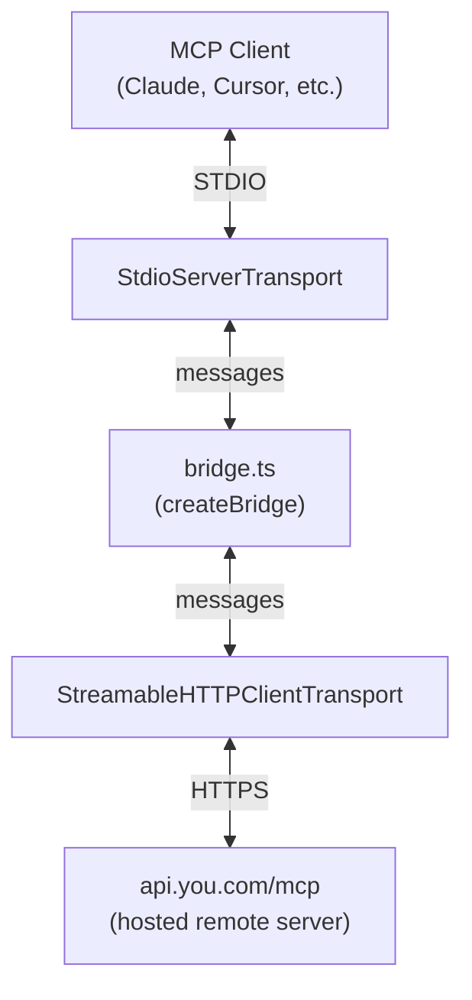

# MCP Bridge Patterns

Maintenance patterns for the `@youdotcom-oss/mcp` STDIO bridge package.

> **Package scope**: This package is a **transport bridge only**. The MCP tools (search, research, contents) live on the remote server at `api.you.com/mcp`. Contributing here means improving bridge reliability — shutdown handling, error recovery, env setup — not tool behavior.

> **For end users**: See [packages/mcp/README.md](../../packages/mcp/README.md)
> **For universal patterns**: See [`.agents/rules/core.md`](../../.agents/rules/core.md)

## When to Use

- Contributing to `@youdotcom-oss/mcp` package
- Debugging bridge shutdown or connection issues
- Understanding transport lifecycle

## Architecture



## Tech Stack

- **MCP SDK**: @modelcontextprotocol/sdk ^1.24.3 (only dependency)
- **Testing**: Bun test (unit tests with mock transports)

## Quick Start

```bash
bun --cwd packages/mcp test
bun --cwd packages/mcp check
bun --cwd packages/mcp dev      # STDIO mode
```

## Bridge Maintenance Patterns

### Closing Guard — Prevent Double-Close Cycles

**The `closing` flag prevents re-entrant shutdown when both transports fire close events:**

```typescript
// ✅ Guard every shutdown path
let closing = false

const shutdown = (): void => {
  if (closing) return  // ← guard
  closing = true
  void Promise.allSettled([stdio.close(), http.close()]).then(() => process.exit(0))
}

const terminate =
  (label: string) =>
  (err: unknown): void => {
    if (closing) return  // ← guard suppresses spurious logs during teardown
    process.stderr.write(`${label} error: ${err}\n`)
    closing = true
    void Promise.allSettled([stdio.close(), http.close()]).then(() => process.exit(1))
  }
```

*Why*: When HTTP closes, `onclose` → `shutdown()` → `stdio.close()` → `stdio.onclose` → `shutdown()` again. Without the guard you get double `process.exit()`. The `closing` check in `terminate()` also suppresses error logs that fire after clean shutdown has already started.

*Verify*: `closing` must be set to `true` before any async work begins in both `shutdown` and `terminate`.

### Void + `.catch()` on `send()`

**Never await `send()` directly in an event handler — use void + `.catch()` to capture rejections:**

```typescript
// ✅ Correct — rejection routed to terminate
stdio.onmessage = (message) => {
  void http.send(message).catch(terminate('HTTP send'))
}

// ❌ Wrong — rejection becomes unhandled
stdio.onmessage = async (message) => {
  await http.send(message)
}
```

*Why*: `onmessage` is a synchronous callback. An async rejection inside it becomes unhandled unless explicitly caught. `.catch(terminate(...))` routes it to the clean shutdown path.

### `process.env` Spread When Spawning

**Always spread `process.env` when creating a `StdioClientTransport` — required for `npx` to resolve:**

```typescript
// ✅ Preserves PATH and other env vars
const transport = new StdioClientTransport({
  command: 'npx',
  args: ['@youdotcom-oss/mcp'],
  env: { ...process.env, YDC_API_KEY },
})

// ❌ Strips PATH — npx not found
env: { YDC_API_KEY }
```

*Verify*: `grep 'env:' src/tests/` — check for `...process.env` spread

## Testing

Tests are pure unit tests using mock transports — no live HTTP calls, no `YDC_API_KEY` required.

```typescript
const makeTransport = (): Transport => ({
  send: mock((_msg: JSONRPCMessage) => Promise.resolve()),
  start: mock(() => Promise.resolve()),
  close: mock(() => Promise.resolve()),
  onmessage: undefined,
  onerror: undefined,
  onclose: undefined,
})
```

**Flush microtasks** before asserting async effects from `Promise.allSettled`:

```typescript
const flushAsync = () => new Promise<void>((resolve) => setTimeout(resolve, 0))

test('closes both transports when http closes', async () => {
  const stdio = makeTransport()
  const http = makeTransport()
  createBridge(stdio, http)

  http.onclose!()
  await flushAsync()  // ← wait for Promise.allSettled chain to resolve

  expect(stdio.close).toHaveBeenCalledTimes(1)
})
```

**Mock `process.exit` and `process.stderr.write`** to prevent test process termination:

```typescript
beforeEach(() => {
  exitSpy = spyOn(process, 'exit').mockImplementation((() => {}) as () => never)
  stderrSpy = spyOn(process.stderr, 'write').mockImplementation(() => true)
})

afterEach(() => {
  exitSpy.mockRestore()
  stderrSpy.mockRestore()
})
```

## File Organization

```
src/
├── bridge.ts              # createBridge() — testable core logic
├── stdio-bridge.ts        # entry point — thin wrapper
└── tests/
    └── stdio-bridge.spec.ts
```

## Troubleshooting

**STDIO bridge won't connect:**
```bash
echo $YDC_API_KEY        # Verify API key set
echo $MCP_SERVER_URL     # Optional: check custom remote endpoint override
```

**Test failures — process.exit called unexpectedly:**
Ensure `exitSpy` is restored in `afterEach`. Without restore, the mock leaks into subsequent tests.

**Spurious error logs in teardown:**
The `closing` guard in `terminate()` suppresses logs that fire after shutdown starts. If you see repeated logs, check that `if (closing) return` runs before `process.stderr.write`.

## Publishing

See [root AGENTS.md](../../AGENTS.md#publishing)

Two separate workflows:

- **npm publish** (`.github/workflows/publish-mcp.yml`) — For STDIO bridge changes only. Rarely needed since the bridge is frozen; server changes happen in `youdotcom-mcp-server`.
- **Registry publish** (`.github/workflows/publish-registry.yml`) — For Anthropic MCP Registry updates. Run manually when the remote server's public surface changes (tools, auth, URL). Auto-increments `server.json` version.

## Related Skills

- [`.agents/rules/core.md`](../../.agents/rules/core.md) - Code patterns
- [`.agents/rules/testing.md`](../../.agents/rules/testing.md) - Test patterns

## Contributing

Package scope: `mcp` in commits

```bash
feat(mcp): improve shutdown reliability
fix(mcp): resolve double-close cycle
```

---
> Converted and distributed by [TomeVault](https://tomevault.io/claim/youdotcom-oss) — claim your Tome and manage your conversions.
<!-- tomevault:4.0:skill_md:2026-04-11 -->
