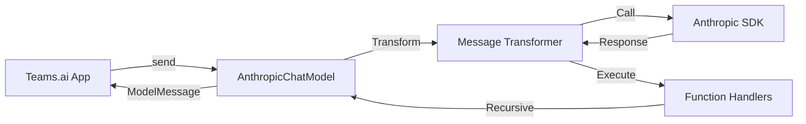

# Teams.ai + Anthropic Patterns

Teams.ai framework patterns with Anthropic SDK integration.

> **For end users**: See [packages/teams-anthropic/README.md](../../packages/teams-anthropic/README.md)  
> **For universal patterns**: See [`.agents/rules/core.md`](../../.agents/rules/core.md)

## When to Use

- Contributing to `@youdotcom-oss/teams-anthropic` package
- Implementing Teams.ai with Anthropic
- Debugging Teams.ai + Anthropic integration

## Tech Stack

- **Framework**: Microsoft Teams.ai ^2.0.5
- **SDK**: Anthropic SDK ^0.38.0
- **Testing**: Bun test

## Quick Start

```bash
cd packages/teams-anthropic
bun test
bun run check
```

## Teams.ai-Specific Patterns

### Memory API

**Use `push()` and `values()`, NEVER `addMessage()`:**

```typescript
// ✅ Correct
await memory.push(message);
const messages = await memory.values();

// ❌ Wrong - doesn't exist
await memory.addMessage(message);
const messages = await memory.getMessages();
```

*Verify:* `grep 'addMessage\|getMessages' src/` returns nothing  
*Fix:* Use `push()` and `values()`

### FunctionMessage Structure

**ALWAYS include `function_id`:**

```typescript
// ✅ Required field
const fnResult: Message = {
  role: 'function',
  function_id: fnCall.id || fnCall.name,
  content: result,
};

// ❌ Missing function_id
const fnResult: Message = {
  role: 'function',
  content: result,
};
```

*Verify:* All FunctionMessage have `function_id`  
*Fix:* Add `function_id` property

### Function Handler Access

**Access `handler` property from function definition:**

```typescript
// ✅ Correct
const fnDef = options.functions[fnCall.name];
if (fnDef && typeof fnDef === 'object' && 'handler' in fnDef) {
  const handler = (fnDef as { handler: (args: unknown) => Promise<unknown> }).handler;
  const result = await handler(fnCall.arguments);
}

// ❌ Direct call doesn't work
const fn = options.functions[fnCall.name];
const result = await fn(fnCall.arguments);
```

*Verify:* Functions accessed via `handler` property  
*Fix:* Use object structure with handler property

### Anthropic Streaming

**Use `messages.stream()` not `create()` with stream flag:**

```typescript
// ✅ Correct
const stream = this._anthropic.messages.stream({
  ...requestParams,
  stream: true,
});

// ❌ Wrong - type error
requestParams.stream = true;
const stream = await this._anthropic.messages.create(requestParams);
```

*Verify:* All streaming uses `.stream()` method  
*Fix:* Replace `create()` with `stream()`

### System Message Extraction

**Anthropic requires system as separate parameter:**

```typescript
// ✅ Extract system message
const systemMessage = extractSystemMessage(conversationMessages);

const response = await this._anthropic.messages.create({
  system: systemMessage,  // Separate parameter
  messages: conversationMessages,  // Without system message
  // ...
});

// ❌ System in messages array
const response = await this._anthropic.messages.create({
  messages: [...systemMessage, ...conversationMessages],  // Wrong
});
```

*Verify:* System messages extracted before API call  
*Fix:* Use `extractSystemMessage()` utility

### Content Block Type Assertions

**Use explicit type checks:**

```typescript
// ✅ Explicit type assertion
for (const block of message.content) {
  if (block.type === 'text') {
    const textBlock = block as Anthropic.TextBlock;
    textContent += textBlock.text;
  } else if (block.type === 'tool_use') {
    const toolBlock = block as Anthropic.ToolUseBlock;
    functionCalls.push({
      id: toolBlock.id,
      name: toolBlock.name,
      arguments: toolBlock.input,
    });
  }
}

// ❌ No type assertion - TS error
textContent += block.text;
```

*Verify:* Content blocks use type assertions  
*Fix:* Add `as Anthropic.TextBlock` or `as Anthropic.ToolUseBlock`

## Architecture



**Message Flow:**
1. App → `model.send(message, options)`
2. Memory → `memory.push()` and `memory.values()`
3. Transform → Teams.ai → Anthropic format
4. API Call → Anthropic (streaming or non-streaming)
5. Transform → Anthropic → Teams.ai format
6. Auto-execute functions if present
7. Return → `ModelMessage` to app

## Testing

```bash
bun test                              # All tests
bun test src/tests/integration.spec.ts  # Integration tests
```

**Prerequisites**: `ANTHROPIC_API_KEY` in `.env`

### Teams.ai-Specific Testing

**Skip tests when API key missing:**

```typescript
const ANTHROPIC_API_KEY = process.env.ANTHROPIC_API_KEY;
const describeWithApiKey = ANTHROPIC_API_KEY ? describe : describe.skip;

describeWithApiKey('Integration Tests', () => {
  // Only run if key is set
});
```

**Use LocalMemory for context:**

```typescript
const { LocalMemory } = await import('@microsoft/teams.ai');
const memory = new LocalMemory();

await model.send({ role: 'user', content: 'My name is Alice.' }, { messages: memory });
await model.send({ role: 'user', content: 'What is my name?' }, { messages: memory });
```

## Troubleshooting

**Memory API errors:** Use `push()` and `values()`, not `addMessage()`

**Missing function_id:** Always include in FunctionMessage

**Handler type error:** Access via `handler` property from function definition

**Streaming type error:** Use `messages.stream()` method

**Authentication error:** Set `ANTHROPIC_API_KEY` in `.env`

## Publishing

See [root AGENTS.md](../../AGENTS.md#publishing)

**Pattern**: Bundled package with external dependencies

Workflow: `.github/workflows/publish-teams-anthropic.yml`

## Related Skills

- [`.agents/rules/core.md`](../../.agents/rules/core.md) - Code patterns
- [`.agents/rules/testing.md`](../../.agents/rules/testing.md) - Test patterns
- [`.claude/skills/documentation`](../documentation/SKILL.md) - Docs standards

## Contributing

Package scope: `teams-anthropic` in commits

```bash
feat(teams-anthropic): add memory adapter
fix(teams-anthropic): resolve streaming issue
```

---
> Converted and distributed by [TomeVault](https://tomevault.io/claim/youdotcom-oss) — claim your Tome and manage your conversions.
<!-- tomevault:4.0:skill_md:2026-04-11 -->
