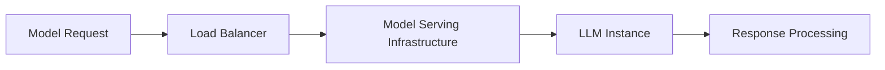

# agentops-notes

> When working with Obsidian notes in the LLMOps and AgentOps domain, apply these intelligent linking and organization strategies to build a comprehensive knowledge graph that references concepts from [content/index.md](mdc:content/index.md).

## Usage

Add this to your project's CLAUDE.md to activate this skill:

```
Read and follow the instructions in .claude/skills/agentops-notes/SKILL.md
```

Or copy the instructions below directly into your CLAUDE.md:

# Obsidian LLMOps/AgentOps Knowledge Management Optimization

When working with Obsidian notes in the LLMOps and AgentOps domain, apply these intelligent linking and organization strategies to build a comprehensive knowledge graph that references concepts from [content/index.md](mdc:content/index.md).

## 🔗 Smart Linking Strategy

### CONTENT DIRECTORY LINKING
**Always use Obsidian `[[links]]` for any pages under the `/content` directory:**
- Reference glossary terms: `[[LLMOps]]`, `[[AgentOps]]`, `[[MLOps]]`
- Link to concept pages: `[[Model Distillation]]`, `[[Quantization]]`, `[[LoRA]]`
- Connect related topics: `[[Multi-Agent Coordination]]`, `[[Prompt Engineering]]`
- Use in headers when appropriate: `## What is [[LLMOps]]?`

### CRITERIA FOR IDENTIFYING LINKABLE CONCEPTS
Dynamically identify and link concepts that meet these criteria:

**Domain-Specific Technical Terms:**
- Specialized methodologies unique to LLMOps/AgentOps (e.g., fine-tuning techniques, agent coordination patterns)
- Technical processes with specific implementations (e.g., model serving approaches, inference optimization)
- Architectural components in AI operations (e.g., orchestration systems, monitoring frameworks)
- Safety and governance mechanisms specific to AI systems

**Named Tools and Frameworks:**
- Specific software libraries, platforms, or services used in LLMOps/AgentOps
- Proprietary or open-source tools with distinct functionality
- Cloud services with AI/ML-specific capabilities
- Development and deployment frameworks

**Methodological Concepts:**
- Established techniques with defined procedures or algorithms
- Research-backed approaches with measurable outcomes
- Industry-standard practices with specific implementation patterns
- Emerging paradigms that represent significant shifts in approach

**Business Applications:**
- Specific use cases that demonstrate LLMOps/AgentOps value
- Industry-specific implementations with unique characteristics
- Process automation scenarios with clear AI component integration

### 🚫 AVOID LINKING GENERIC TERMS
Don't create links for:
- Generic technology words: "software", "system", "process", "data", "model" (unless referring to a specific named model)
- Common action verbs: "improve", "optimize", "deploy", "manage", "monitor", "analyze"
- Broad performance terms: "performance", "accuracy", "efficiency", "scalability", "reliability"
- Basic concepts: "machine learning", "artificial intelligence" (unless defining them as specific concepts)
- Common adjectives: "advanced", "modern", "effective", "powerful", "robust"
- General business terms: "cost", "value", "strategy", "implementation"

## 📝 Note Structure Guidelines

### Header Guidelines
- **Use Obsidian `[[links]]` in headers when referencing content under `/content`** - this creates clear knowledge connections
- Examples: `## What is [[LLMOps]]?` or `## The Evolution: [[MLOps]] → [[LLMOps]] → [[AgentOps]]`
- Headers can establish both content structure and knowledge relationships
- Link to concepts that have dedicated pages in the `/content` directory

### Front Matter Template
```yaml
---
title: "Concept Name"
tags: [#llmops, #agentops, #infrastructure, #security]
type: [concept, tool, case-study, best-practice]
status: [draft, complete, needs-review]
related: ["[[Related Concept 1]]", "[[Related Concept 2]]"]
created: YYYY-MM-DD
updated: YYYY-MM-DD
---
```

### Content Organization Principles
- **Start with clear definition** and context
- **Use Mermaid diagrams** for architecture and flow visualization (like in [content/index.md](mdc:content/index.md))
- **Include practical examples** with code blocks
- **Add "See Also" sections** with relevant cross-references
- **Use callouts** for important notes, warnings, and tips

### Tag Hierarchy Strategy
- `#llmops` → `#llmops/deployment`, `#llmops/monitoring`, `#llmops/optimization`
- `#agentops` → `#agentops/coordination`, `#agentops/safety`, `#agentops/planning`
- `#tools` → `#tools/frameworks`, `#tools/monitoring`, `#tools/deployment`
- `#security` → `#security/ai-safety`, `#security/compliance`, `#security/privacy`

## 🔄 Cross-Reference Patterns

### Bidirectional Linking Strategy
When creating links, ensure concepts are bidirectionally connected:
- Link from specific to general: `[[Fine-tuning]]` → `[[LLMOps]]`
- Link between related concepts: `[[Model Distillation]]` ↔ `[[Quantization]]`
- Link applications to techniques: `[[Customer Support Automation]]` → `[[LLMOps]]`
- Connect evolution: `[[MLOps]]` → `[[LLMOps]]` → `[[AgentOps]]`

### Index Notes Creation
Create comprehensive index notes for major topics:
- `[[LLMOps Index]]` - Overview with links to all LLMOps subtopics
- `[[AgentOps Index]]` - Comprehensive agent operations guide
- `[[Tools Index]]` - Categorized tool references
- `[[Architecture Index]]` - System design patterns

## 📊 Knowledge Graph Optimization

### Hub Notes Strategy
Identify and strengthen hub notes that connect multiple concepts:
- **Core hubs**: `[[LLMOps]]`, `[[AgentOps]]`, `[[AI Safety]]`
- **Tool hubs**: `[[MLflow]]`, `[[LangChain]]`, `[[Kubernetes]]`
- **Application hubs**: `[[Customer Support]]`, `[[Content Generation]]`
- **Architecture hubs**: `[[Multi-Agent Systems]]`, `[[Decision Engine]]`

### Temporal and Hierarchical Connections
Link notes based on relationships:
- **Evolution**: `[[MLOps]]` → `[[LLMOps]]` → `[[AgentOps]]`
- **Workflow stages**: `[[Data Preparation]]` → `[[Model Training]]` → `[[Deployment]]`
- **Learning progression**: `[[Fundamentals]]` → `[[Advanced Techniques]]` → `[[Research]]`
- **Component hierarchy**: `[[AgentOps Platform]]` → `[[Agent Orchestrator]]` → `[[Decision Engine]]`

## ✅ Valid Example
```markdown
# Model Serving in LLMOps

[[Model Serving]] is a critical component of [[LLMOps]] that focuses on deploying large language models in production environments. This connects to the broader architecture described in our knowledge base.

## Key Approaches

- **Batch inference** using [[TensorFlow Serving]] or [[Triton Inference Server]]
- **Real-time serving** with [[vLLM]] or specialized inference engines
- **Serverless deployment** via cloud functions with [[Model Quantization]]

## Integration with AgentOps

When model serving supports autonomous agents, it becomes part of the [[AgentOps]] ecosystem, enabling [[Real-time Adaptation]] and intelligent decision-making.



See also: [[Inference Optimization]], [[Model Monitoring]], [[A/B Testing]]

#llmops/deployment #infrastructure #production
```

## ❌ Invalid Example
```markdown
# Model Serving in LLMOps  <!-- ❌ Missing links to content under /content -->

Model serving is a critical component of LLMOps that focuses on deploying large language models in production environments. Common approaches include:

- Batch inference using TensorFlow Serving  <!-- ❌ Missing appropriate links -->
- Real-time serving with vLLM or Text Generation Inference
- Serverless deployment via AWS Lambda with model optimization

The goal is to improve performance and optimize efficiency. This system provides scalable infrastructure for modern AI applications.  <!-- ❌ Generic terms without specific links -->
```

## 🎯 Dynamic Linking Decision Framework

Before creating a link, evaluate the concept against these criteria:

1. **Domain Specificity Test**: Is this term specifically related to LLMOps/AgentOps operations rather than general technology?
2. **Technical Depth Test**: Does this concept have sufficient technical complexity to warrant its own detailed explanation?
3. **Interconnection Value Test**: Would linking this term create meaningful connections to other concepts in our knowledge base?
4. **Content Substance Test**: Is this likely to be a concept that deserves its own dedicated note with substantial content?
5. **Knowledge Discovery Test**: Would this link help readers discover related concepts they might not otherwise find?

**Link Creation Guidelines:**
- **Create link** if the concept meets 3+ criteria above
- **Consider linking** if it meets 2 criteria and is referenced in [content/index.md](mdc:content/index.md)
- **Avoid linking** if it meets fewer than 2 criteria or is a generic term

**Special Cases:**
- **Named tools/frameworks**: Generally link if they're specifically used in LLMOps/AgentOps
- **Compound concepts**: Link the specific methodology (e.g., "Retrieval Augmented Generation") but not the individual words
- **Context-dependent terms**: Consider the surrounding context - "model" in "GPT-4 model" might be linkable, "model" in "business model" should not be

This rule ensures your Obsidian vault becomes a powerful, interconnected knowledge base for LLMOps and AgentOps concepts while maintaining readability and avoiding link overload.

---
> Converted and distributed by [TomeVault](https://tomevault.io/claim/yu-iskw) — claim your Tome and manage your conversions.
<!-- tomevault:4.0:claude_md:2026-04-10 -->
